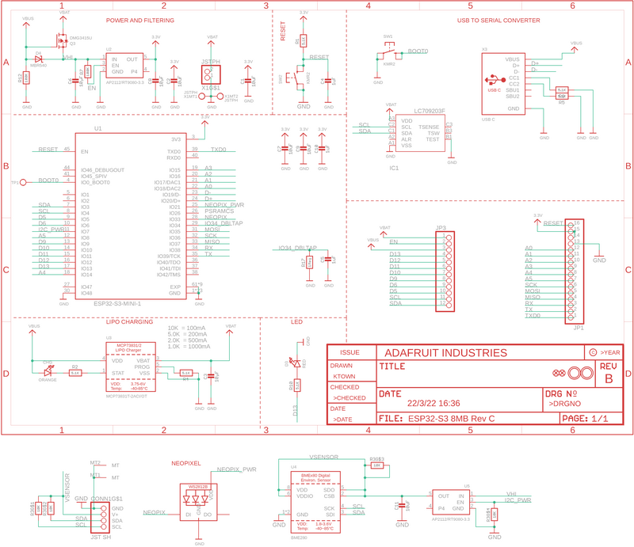
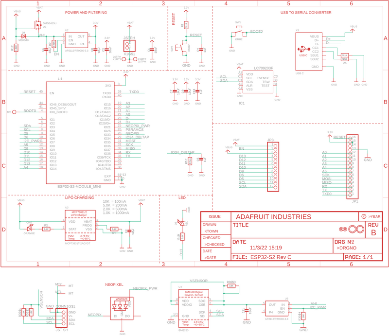
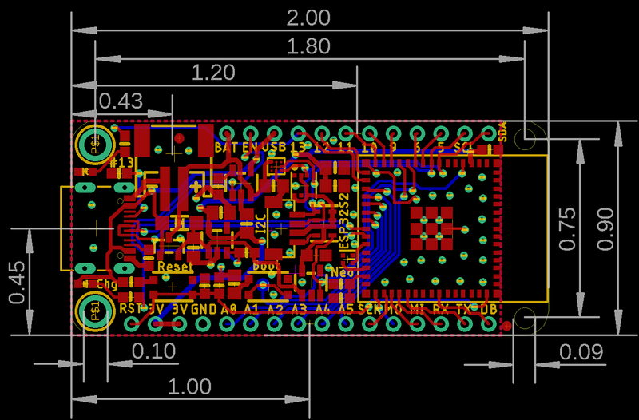
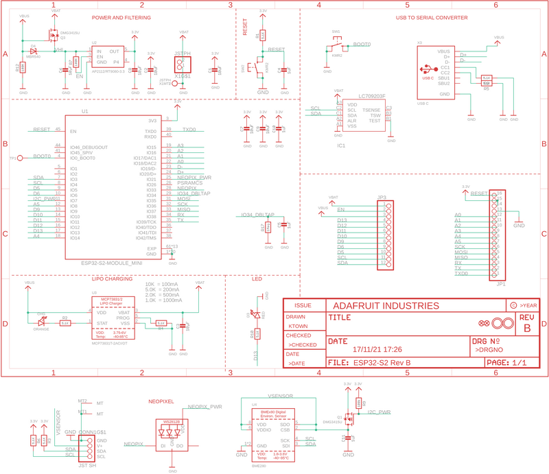
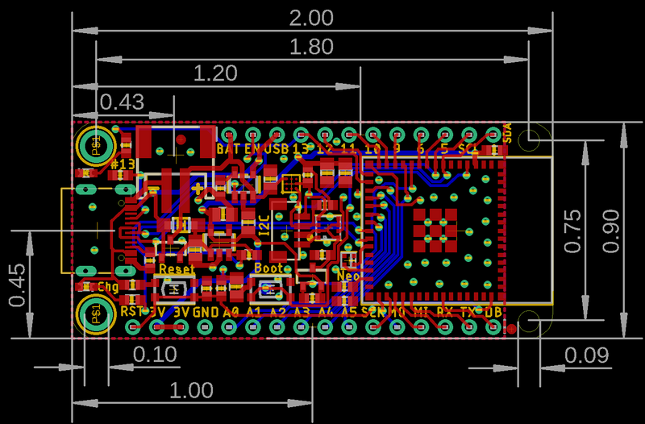

<!-- source: https://learn.adafruit.com/adafruit-esp32-s3-feather/downloads | fetched: 2026-09-22 -->
# Downloads | Adafruit ESP32-S3 Feather | Adafruit Learning System

86

Beginner

Product guide

## Downloads

Text emphasized with a blue exclamation: 
The Feather ESP32-S2 and the Feather ESP32-S3 are nearly identical boards, in terms of layout and features. As such, they are both documented on this page, and this page is included in both guides.

## Files

- [ESP32-S2 product page with resources](https://www.espressif.com/en/products/socs/esp32-s2)
- [ESP32-S2 datasheet](https://cdn-learn.adafruit.com/assets/assets/000/096/705/original/esp32-s2_datasheet_en.pdf?1604350607)
- [ESP32-S2 Technical Reference](https://cdn-learn.adafruit.com/assets/assets/000/096/707/original/esp32-s2-wrover_esp32-s2-wrover-i_datasheet_en.pdf?1604350618)
- [ESP32-S2 EagleCAD PCB files on GitHub](https://github.com/adafruit/Adafruit-Feather-ESP32-S2-PCB) (PIDs 5000, 5303 and 6282)
- [ESP32-S2 Fritzing object in the Adafruit Fritzing Library](https://github.com/adafruit/Fritzing-Library/blob/master/parts/Adafruit%20Feather%20ESP32-S2.fzpz)
- [ESP32-S2 PrettyPins pinout diagram PDF on GitHub](https://github.com/adafruit/Adafruit-Feather-ESP32-S2-PCB/blob/main/Adafruit%20Feather%20ESP32-S2%20Pinout.pdf)
- [ESP32-S2 PrettyPins SVG](https://cdn-learn.adafruit.com/assets/assets/000/110/678/original/Adafruit_Feather_ESP32-S2_Pinout.svg?1649709395)

- [ESP32-S3 product page with resources](https://www.espressif.com/en/products/socs/esp32-s3)
- [ESP32-S3 datasheet](https://cdn-learn.adafruit.com/assets/assets/000/110/711/original/esp32-s3_datasheet_en.pdf?1649790878)
- [ESP32-S3 Technical Reference](https://cdn-learn.adafruit.com/assets/assets/000/110/710/original/esp32-s3_technical_reference_manual_en.pdf?1649790877)
- [ESP32-S3 EagleCAD PCB files on GitHub](https://github.com/adafruit/Adafruit-Feather-ESP32-S3-PCB) (PIDs 5323, 5477, 5885)
- [ESP32-S3 Fritzing object in the Adafruit Fritzing Library](https://github.com/adafruit/Fritzing-Library/blob/master/parts/Adafruit%20ESP32-S3%20Feather.fzpz)
- [ESP32-S3 PrettyPins pinout diagram PDF on GitHub](https://github.com/adafruit/Adafruit-Feather-ESP32-S3-PCB/blob/main/Adafruit%20Feather%20ESP32-S3%20Pinout.pdf)
- [ESP32-S3 PrettyPins SVG](https://cdn-learn.adafruit.com/assets/assets/000/139/612/original/Adafruit_Feather_ESP32-S3_Pinout.svg?1757533084)

## Schematic and Fab Print for ESP32-S3

Text emphasized with a blue exclamation: 
This schematic applies to variants of the Feather ESP32-S3 with PIDs 5323, 5477, and 5885.

 

 

Dimensions are in inches.

## Schematic and Fab Print ESP32-S2 Revision C

Text emphasized with a blue exclamation: 
This schematic applies to variants of the Feather ESP32-S2 with PIDs 5000, 5303 and 6282.

 

 

Dimensions are in inches.

## Schematic and Fab Print ESP32-S2 Revision B

Text emphasized with a blue exclamation: 
This schematic applies to variants of the Feather ESP32-S2 with PIDs 5000 and 5303.

 

 

Dimensions are in inches.

Page last edited March 08, 2024

Text editor powered by [tinymce](https://www.tiny.cloud/).

[Factory Reset](https://learn.adafruit.com/adafruit-esp32-s3-feather/factory-reset)
