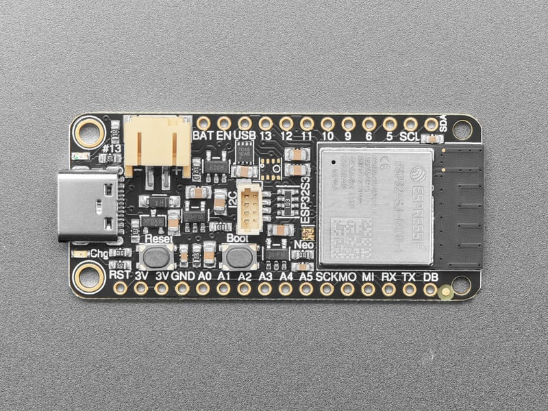
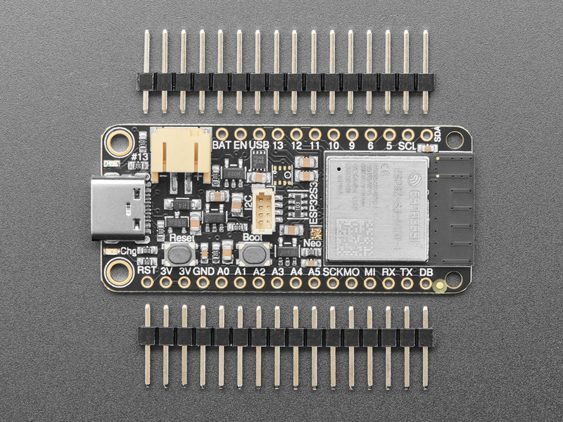
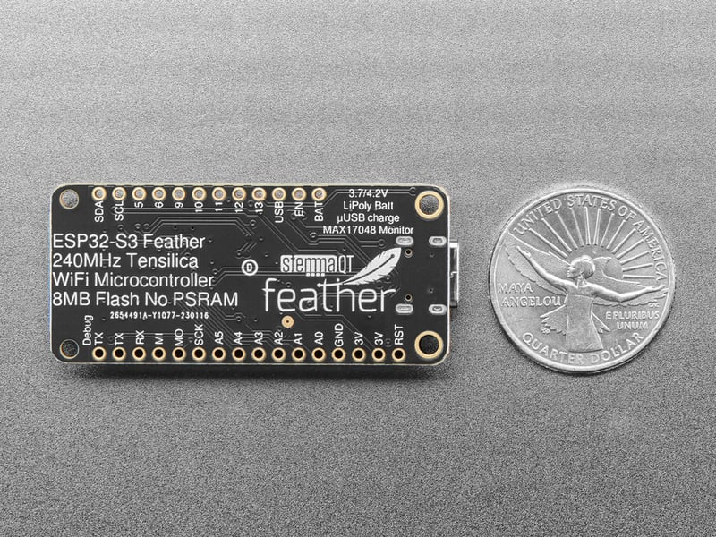
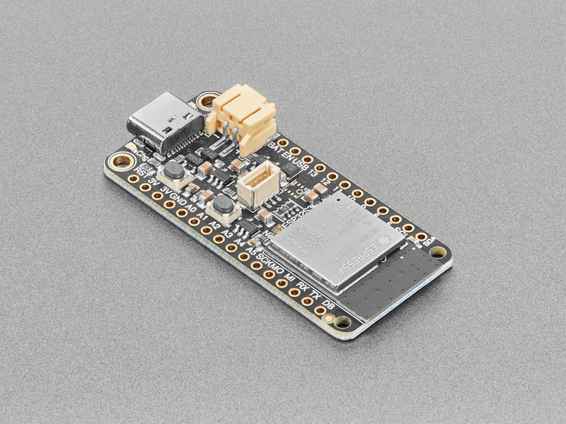

<!-- source: https://learn.adafruit.com/adafruit-esp32-s3-feather/overview | fetched: 2026-09-23 -->
# Overview | Adafruit ESP32-S3 Feather | Adafruit Learning System

86

Beginner

Product guide

## Overview

 

The ESP32-S3 has arrived in Feather format - and what a great way to get started with this powerful new chip from Espressif! With dual 240 MHz cores, WiFi and BLE support, and native USB, this Feather is great for powering your IoT projects.

That's right - it's the new **Adafruit ESP32-*S3* Feather**! With native USB and 8 MB flash, this board will let you upgrade your existing ESP32 projects. Native USB means it can act like a keyboard or a disk drive, and no external USB-to-Serial converter required. WiFi and BLE mean it's awesome for IoT projects. And Feather means it works with the large community of Feather Wings for expandability.

 

The ESP32-S3 is a highly-integrated, low-power, 2.4 GHz Wi-Fi/BLE System-on-Chip (SoC) solution that has built-in native USB as well as some other interesting new technologies like Time of Flight distance measurements and AI acceleration. With its state-of-the-art power and RF performance, this SoC is an ideal choice for a wide variety of application scenarios relating to the [Internet of Things (IoT)](https://www.adafruit.com/category/342), [wearable electronics](https://www.adafruit.com/category/65), and smart homes.

Text emphasized with a yellow exclamation: 
To load CircuitPython 10 on the 4MB Flash version of this Feather, you will need to update the UF2 bootloader to at least version 0.31.0. See the [Update TinyUF2 Bootloader for CircuitPython 10](https://learn.adafruit.com/adafruit-esp32-s3-feather/update-tinyuf2-bootloader-for-circuitpython-10-4mb-boards-only) page in this Guide for instructions.

 

The Feather ESP32-S3 has a dual-core 240 MHz chip, so it is comparable to ESP32's dual-core. However, there is no Bluetooth **Classic** support, only Bluetooth LE. This chip is a great step up from the earlier ESP32-S2!

The ESP32-S3 mini-module used on the [Feather ESP32-S3 No PSRAM](https://www.adafruit.com/product/5323) and [Feather ESP32-S3  8MB with w.FL Antenna](https://www.adafruit.com/product/5885) versions of this Feather come with 8MB flash and no PSRAM, but do have 512KB of SRAM so they're fine for use with CircuitPython support as long as massive buffers are not needed. They're also great for use in ESP-IDF or with Arduino support.

The [Feather ESP32-S3 4MB Flash 2MB PSRAM](https://www.adafruit.com/product/5477) version has less flash, but comes with PSRAM, so the caveats above don't apply.

 

**Features:**

- **ESP32-S3 Dual Core 240MHz Tensilica processor**- the next generation of ESP32-Sx, with native USB so it can act like a keyboard/mouse, MIDI device, disk drive, etc!
- **Mini module** has FCC/CE certification and comes with *either* 8 MByte of Flash, no PSRAM *or* 4MByte of Flash, and 2MB PSRAM (depending on the Feather you purchased)
- **Power options** - USB type C **or** Lipoly battery
- **Built-in battery charging** when powered over USB-C
- **LiPoly battery monitor** - MAX17048 chip actively monitors your battery for voltage and state of charge / percentage reporting over I2C
- **Reset and DFU** (BOOT0) buttons to get into the ROM bootloader (which is a USB serial port so you don't need a separate cable!)
- **Serial debug output pin** (optional, for checking the hardware serial debug console)
- **STEMMA QT** connector for I2C devices, with switchable power, so you can go into low power mode.
- **On/Charge/User** LEDs + status **NeoPixel** with pin-controlled power for low power usage
- **Low Power friendly**! In deep sleep mode we can get down to ~100uA of current draw from the Lipoly connection. Quiescent current is from the power regulator, ESP32-S3 chip, and Lipoly monitor. Turn off the NeoPixel and external I2C power for the lowest quiescent current draw.
- **Works with ESP-IDF, Arduino**, **or CircuitPython** (the lack of PSRAM on the 8MB version will constrain some projects with higher memory requirements).

Page last edited November 07, 2025

Text editor powered by [tinymce](https://www.tiny.cloud/).

[Pinouts](https://learn.adafruit.com/adafruit-esp32-s3-feather/pinouts)
