<!-- source: https://learn.adafruit.com/adafruit-esp32-s3-feather/pinouts | fetched: 2026-09-22 -->
# Pinouts | Adafruit ESP32-S3 Feather | Adafruit Learning System

86

Beginner

Product guide

## Pinouts

[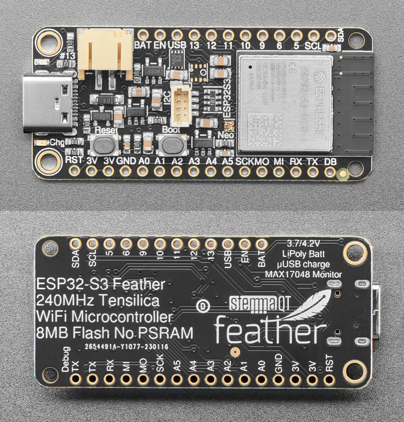](https://learn.adafruit.com/assets/118387) 

ESP32-S3 Feather with MAX17048 battery monitor.

[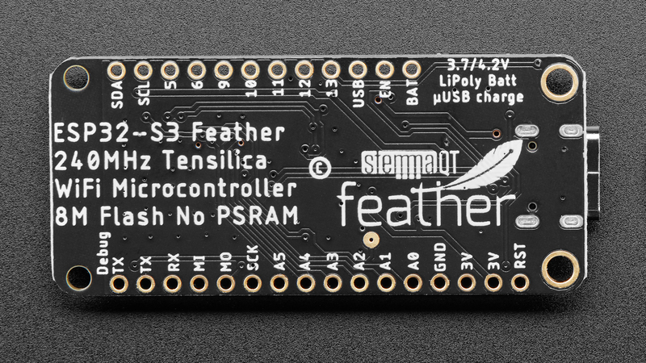](https://learn.adafruit.com/assets/118389) 

ESP32-S3 Feather with LC709203 battery monitor. The silk on the back does NOT say MAX17048.

[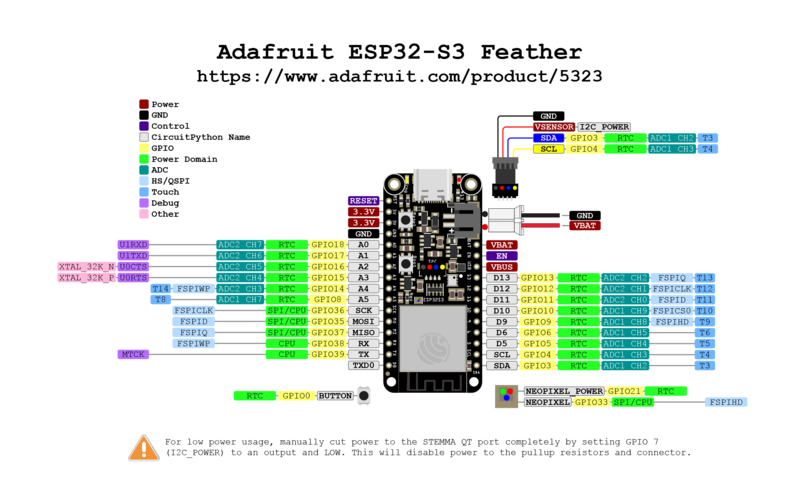](https://learn.adafruit.com/assets/139614) 

Link to PrettyPins PDF [on GitHub](https://github.com/adafruit/Adafruit-Feather-ESP32-S3-PCB/blob/main/Adafruit%20Feather%20ESP32-S3%20Pinout.pdf).

## Power

[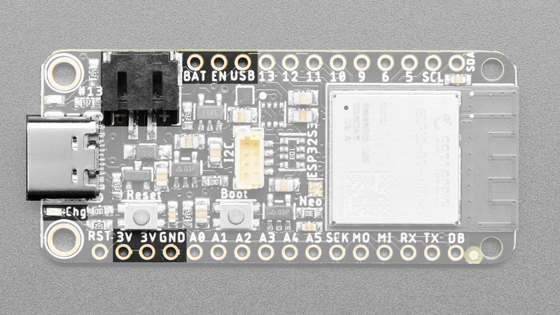](https://learn.adafruit.com/assets/110801) 

There are two ways you can power the Feather ESP32-S3, as well as other related pins.

- **USB-C port** - This is used for both powering and programming the board. You can power it with any USB C cable. When USB is plugged in it will charge the Lipoly battery.
- **LiPoly connector/charger** - You can plug in any 250mAh or larger 3.7/4.2V Lipoly battery into this **JST 2-PH port** to both power your Feather and charge the battery. The battery will charge from the USB power when USB is plugged in. If the battery is plugged in *and USB is plugged in*, the Feather will power itself from USB *and* it will charge the battery up.
- **CHG LED** - When the battery is charging, the yellow CHG LED will be lit. When charging is complete, the LED will turn off. If there's no battery plugged in, the CHD LED may blink rapidly - this is expected!
- **GND** - This is the common ground for all power and logic.
- **BAT** - This is the positive voltage to/from the 2-pin JST jack for the optional Lipoly battery.
- **USB** - This is the positive voltage to/from the USB C jack, if USB is connected.
- **EN** - This is the 3.3V regulator's enable pin. It's pulled up, so connect to ground to disable the 3.3V regulator.
- **3.3V** - These pins are the output from the 3.3V regulator, they can supply 500mA peak.

## ESP32-S3 WiFi Module

[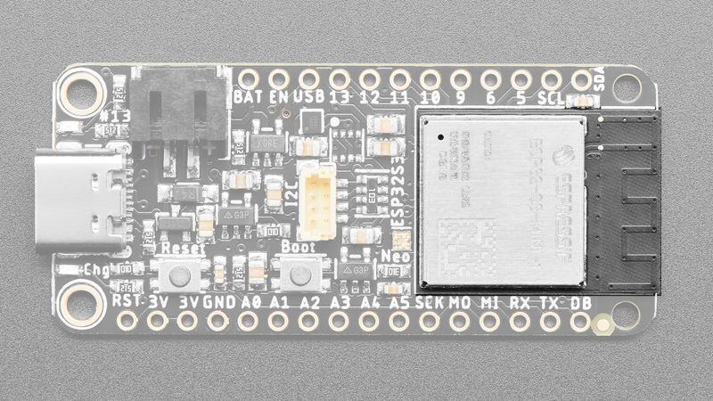](https://learn.adafruit.com/assets/110800) 

This is the **ESP32-S3 module**.

The ESP32-S3 is a highly-integrated, low-power, 2.4 GHz Wi-Fi System-on-Chip (SoC) solution that now has **built-in native USB** as well as some other interesting new technologies like Time of Flight distance measurements. With its state-of-the-art power and RF performance, this SoC is an ideal choice for a wide variety of application scenarios relating to the [Internet of Things (IoT)](https://www.adafruit.com/category/342), [wearable electronics](https://www.adafruit.com/category/65), and smart homes.

The Feather ESP32-S3 has a dual-core 240 MHz chip, so it is comparable to  
ESP32's dual-core. However, there is no Bluetooth Classic support, only  
Bluetooth LE. We are super excited about the ESP32-S3's native USB which unlocks a lot of capabilities for advanced interfacing! **This module comes with 8 MB flash and no PSRAM.**

The 8 MB of flash is inside the module and is used for **both** program firmware and filesystem storage. For example, in CircuitPython, we have 4 MB set aside for program firmware (this includes two OTA option spots as well) and an approximately 3.8MB section for CircuitPython scripts and files.

## MAX17048 Battery Monitor

Text emphasized with a blue exclamation: 
Any Feather ESP32-S3 purchased after February 8, 2023 has the MAX17048 battery monitor chip. Unsure which one you have? Check the silk on the back of the board. The new revision has "MAX17048 Monitor" in the upper left corner.

[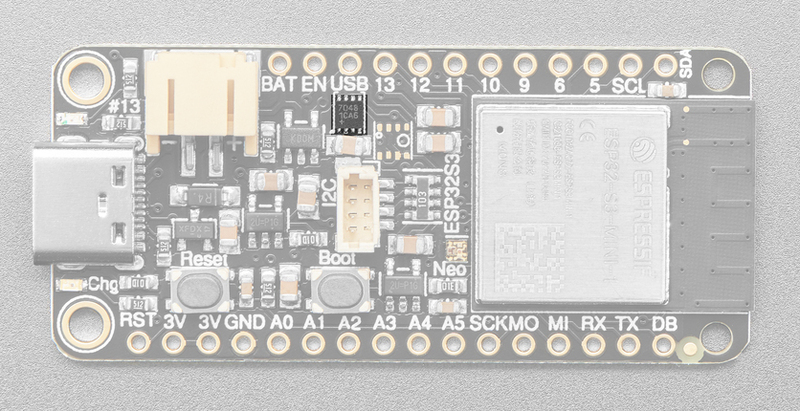](https://learn.adafruit.com/assets/118379) 

The **Adafruit MAX17048 LiPoly / LiIon Fuel Gauge and Battery Monitor** reports the voltage and charge percent over I2C. Connect it to your [Lipoly or LiIon battery](https://www.adafruit.com/category/916) and it will let you know the voltage of the cell, and it does the annoying math of decoding the non-linear voltage to get you a valid percentage as well!

The battery monitor is available over I2C on address **0x36**.

Our [Arduino](https://github.com/adafruit/Adafruit_MAX1704x) or [CircuitPython/Python](https://github.com/adafruit/Adafruit_CircuitPython_MAX1704x) library code allows you to read the voltage and percentage whenever you like. There is no pin on the Feather ESP32-S3 that returns battery voltage, but this I2C monitor makes it super simple to get that data!

## LC709203 Battery Monitor

Text emphasized with a yellow exclamation: 
As of February 8, 2023, the now-discontinued LC709203 battery monitor chip has been replaced with the MAX17048. Unsure which one you have? Check the silk on the back of the board. If your Feather does NOT have "MAX17048 Monitor" in the upper left corner, then you have the LC709203 version.

[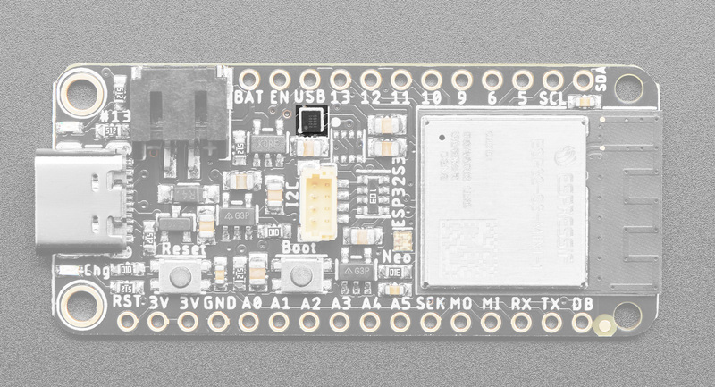](https://learn.adafruit.com/assets/113105) 

The **Adafruit LC709203F LiPoly / LiIon Fuel Gauge and Battery Monitor**reports the voltage and charge percent over I2C. Connect it to your [Lipoly or LiIon battery](https://www.adafruit.com/category/916) and it will let you know the voltage of the cell, and it does the annoying math of decoding the non-linear voltage to get you a valid percentage as well!

The battery monitor is available over I2C on address **0x0B**. Our [Arduino](https://github.com/adafruit/Adafruit_LC709203F) or [CircuitPython/Python](https://github.com/adafruit/Adafruit_CircuitPython_LC709203F) library code allows you to to set the pack size (mAh of the battery, this helps tune the calculation) and read the voltage and percentage whenever you like. There is no pin on the Feather ESP32-S3 that returns battery voltage, but this I2C monitor makes it super simple to get that data!

## BME280 Temperature, Humidity and Pressure Sensor

Text emphasized with a yellow exclamation: 
The Feather ESP32-S3 currently comes with only a FOOTPRINT for the BME280 sensor. It does NOT come with the actual sensor on the board.

[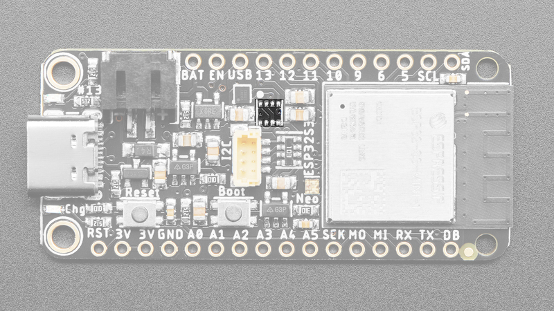](https://learn.adafruit.com/assets/110799) 

The highlighted space is the footprint where a BME280 would go.

The Feather ESP32-S3 comes with the *footprint* for a **BME280 Temperature, Humidity and Barometric Pressure Sensor**. When populated, it is connected over I2C (at address **0x77**), and provides immediate ambient weather sensing. It is rated for measuring humidity with ±3% accuracy, barometric pressure with ±1 hPa absolute accuraccy, and temperature with ±1.0°C accuracy. Because pressure changes with altitude, and the pressure measurements are so good, you can also use it as an altimeter with  ±1 meter or better accuracy!

Text emphasized with a blue exclamation: 
The BME280 sensor's physical proximity to the ESP32-S3 module can cause the sensor's temperature to increase when powered on for extended periods of time.

## Logic Pins

[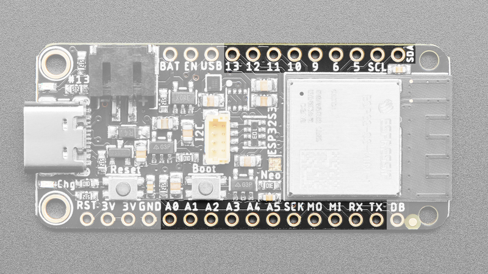](https://learn.adafruit.com/assets/110798) 

These are the logic pins that can be used to connect FeatherWings, sensors, servos, LEDs and more!

No pins are shared, and no pins are 'special' bootstrapping pins, so you can use any of them for input, or output, will pullups or pulldowns, without worry.

ESP32 chips allow for 'multiplexing' of almost all signals. You can connect any of the available PWM channels, I2S channels, UART, I2C or SPI ports to *any* pin. There are some exceptions....

There are six analog pins.

- **A0 thru A5** can also be analog inputs. A0 thru A4 are on ADC2, and A5 is on ADC1.

Text emphasized with a blue exclamation: 
The Feather ESP32-S3 does not have a DAC, so you cannot do true analog out.

The SPI pins are on the ESP32-S3 high-speed peripheral. You can set any pins to be the low-speed peripheral but you won't get the speedy interface!

- **SCK** - This is the SPI clock pin.
- **MOSI** - This is the SPI **M**icrocontroller **O**ut / **S**ensor **I**n pin.
- **MISO** - This is the SPI **M**icrocontroller **I**n / **S**ensor **O**ut pin.

The UART interface.

- **RX** - This is the UART receive pin. Connect to TX (transmit) pin on your sensor or breakout.
- **TX** - This is the UART transmit pin. Connect to RX (receive) pin on your sensor or breakout.

The I2C interface. This is shared by the STEMMA QT connector.

- **SCL** - This is the I2C clock pin. There is a 5k pullup on this pin.
- **SDA** - This is the I2C data pin. There is a 5k pullup on this pin.
- In CircuitPython, you can use the STEMMA connector with `board.SCL` and `board.SDA`, or `board.STEMMA_I2C()`.
- There is an I2C power pin that needs to be pulled high for the STEMMA QT connector and the BME280 sensor (if present) to work properly. **CircuitPython and Arduino do this automatically.** It is available in CircuitPython as `I2C_POWER` and in Arduino as `PIN_I2C_POWER`.

The digital pins.

- **D5-D6, D9-D13** - These are digital pins. D5, D6, D9 and D10 are on ADC1. D11-D13 are on ADC2.

*Check the ESP32-S3 datasheet or the PrettyPins diagram above for the ADC channel names for each pin if you need em!*

Text emphasized with a yellow exclamation: 
If you run into I2C or TFT power issues on Arduino, ensure you are using the latest Espressif board support package. If you are still having issues, you may need to manually pull the pin HIGH in your code.

## NeoPixel and Red LED

[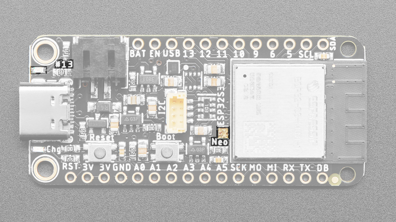](https://learn.adafruit.com/assets/110797) 

There are two LEDs you can control in code.

- **NeoPixel LED** - This addressable RGB NeoPixel LED, labeled **Neo** on the board, works both as a status LED (in CircuitPython and the bootloader), and can be controlled with code. It is available in CircuitPython as `board.NEOPIXEL`, and in Arduino as `PIN_NEOPIXEL`.
- There is a NeoPixel power pin that needs to be pulled high for the NeoPixel to work. **This is done automatically by CircuitPython and Arduino.** It is available in CircuitPython and Arduino as `NEOPIXEL_POWER`.

Text emphasized with a yellow exclamation: 
If you run into NeoPixel power issues on Arduino, ensure you are using the latest Espressif board support package. If you are still having issues, you may need to manually pull the pin high in your code.

- **Red LED** - This little red LED, labeled **#13** on the board, is on or blinks during certain operations (such as pulsing when in the bootloader), and is controllable in code. It is available in CircuitPython as `board.LED`, and in Arduino as `LED_BUILTIN` or `13`.

## STEMMA QT

[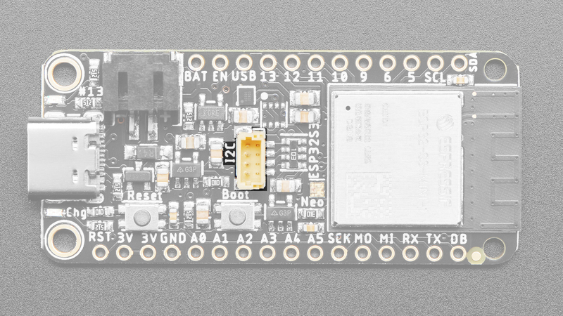](https://learn.adafruit.com/assets/110796) 

This **JST SH 4-pin [STEMMA QT](https://learn.adafruit.com/introducing-adafruit-stemma-qt) connector** breaks out I2C (SCL, SDA, 3.3V, GND). It allows you to connect to [various breakouts and sensors with **STEMMA QT** connectors](https://www.adafruit.com/category/1018) or to other things using [assorted associated accessories](https://www.adafruit.com/?q=JST%20SH%204). It works great with any STEMMA QT or Qwiic sensor/device. You can also use it with Grove I2C devices thanks to [this handy cable](https://www.adafruit.com/product/4528).

There is a power pin that must be pulled high for the STEMMA QT connector to work. **This is done automatically in CircuitPython and Arduino.**The pin is available in CircuitPython as `I2C_POWER` and in Arduino as `TFT_I2C_POWER`. You can manually cut power to the QT port completely by setting GPIO 7 to an output and LOW. This will disable power to the pullup resistors and connector, for low power usage.

Text emphasized with a yellow exclamation: 
If you run into I2C or TFT power issues on Arduino, ensure you are using the latest Espressif board support package. If you are still having issues, you may need to manually pull the pin high in your code.

## Buttons

[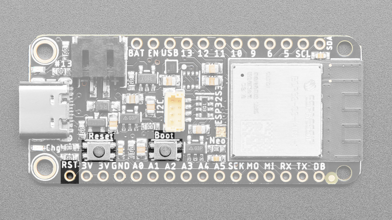](https://learn.adafruit.com/assets/110795) 

There are two buttons on the Feather ESP32-S3.

- **Reset button** - This button restarts the board and helps enter the bootloader. You can click it once to reset the board without unplugging the USB cable or battery. Tap once, and then tap again while the NeoPixel status LED is purple to enter the UF2 bootloader (needed to load CircuitPython).
- The **RST pin** is can be used to reset the board. Tie to ground manually to reset the board.
- **Boot button** - This button can be read as an input in code. It is available as `board.BUTTON` in CircuitPython, and pin `0` in Arduino. Simply set it to be an input with a pullup. This button can also be used to put the board into *ROM bootloader mode*. To enter ROM bootloader mode, hold down DFU button while clicking reset button mentioned above.When in the ROM bootloader, you can upload code and query the chip using `esptool`.

## Debug

[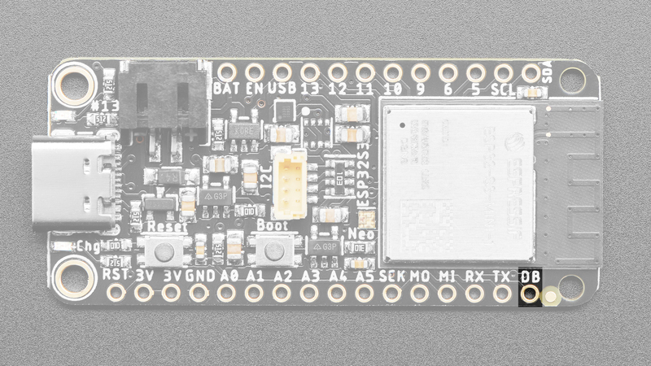](https://learn.adafruit.com/assets/110794) 

This is the **Debug TX (DB)** pin. This is the hardware UART debug pin. [You can connect this to a USB console cable in order to read the debug output from the ESP32 IDF](https://www.adafruit.com/product/954). This is useful if you are writing software and need to see the low level debug output.

This is *not* where default `Serial.print()` or CircuitPython `print()` outputs go, because those will go through the USB port instead!

## uFL Antenna Port

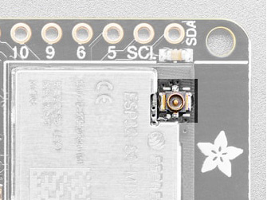

The [Adafruit ESP32-S3 Feather 8MB with w.FL Antenna](https://www.adafruit.com/product/5885) comes with, you guessed it, a uFL antenna port! **This is the only version that has the port!**

**It does NOT come with an antenna, you must purchase one separately.** Consider the **[2.4GHz Mini Flexible WiFi Antenna](https://www.adafruit.com/products/2308)** or **[a uFL to RP-SMA adapter](https://www.adafruit.com/product/852).**

Page last edited May 04, 2026

Text editor powered by [tinymce](https://www.tiny.cloud/).

[Overview](https://learn.adafruit.com/adafruit-esp32-s3-feather/overview) [Power Management](https://learn.adafruit.com/adafruit-esp32-s3-feather/power-management)
