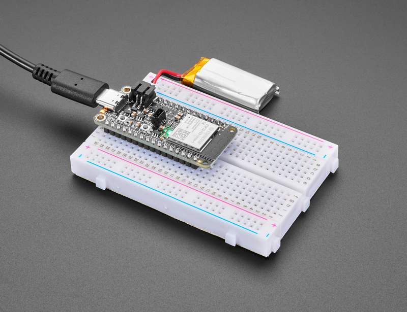
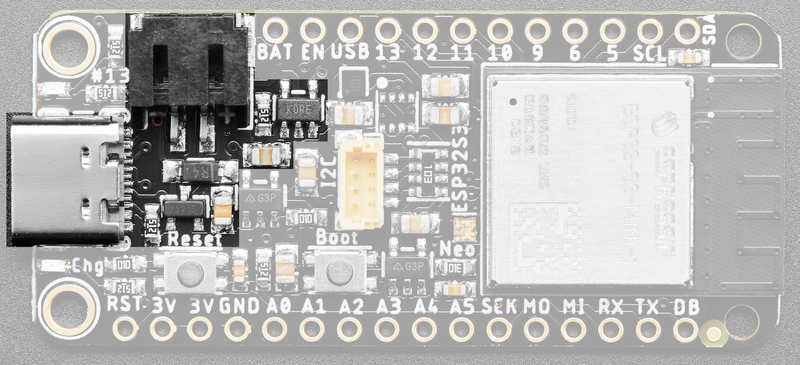
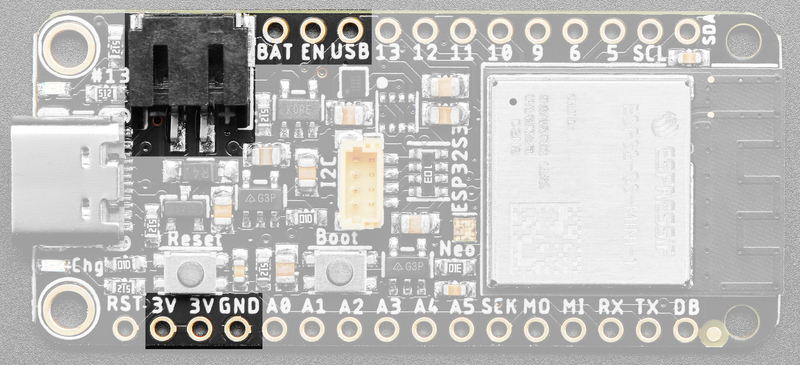
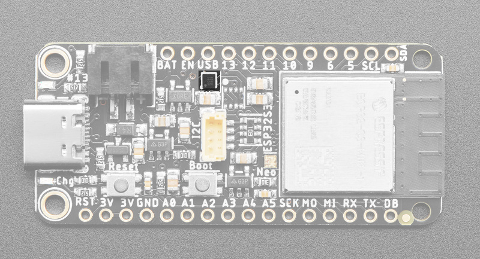
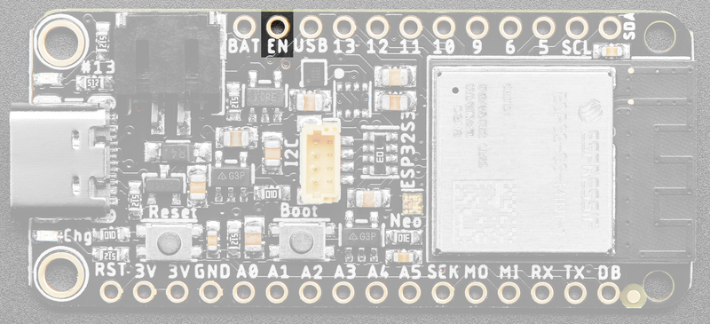
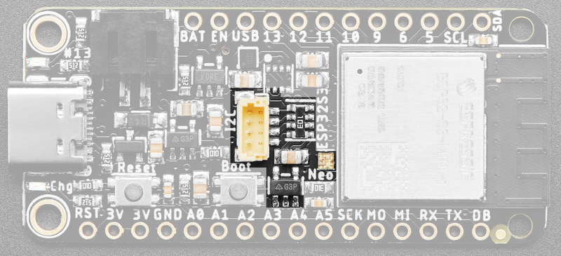

<!-- source: https://learn.adafruit.com/adafruit-esp32-s3-feather/power-management | fetched: 2026-09-23 -->
# Power Management | Adafruit ESP32-S3 Feather | Adafruit Learning System

86

Beginner

Product guide

## Power Management

[](https://learn.adafruit.com/assets/114162) 

# Battery + USB Power

We wanted to make our Feather boards easy to power both when connected to a computer as well as via battery.

There's **two ways to power** a Feather:

1. You can connect with a USB cable (just plug into the jack) and the Feather will regulate the 5V USB down to 3.3V.
2. You can also connect a 4.2/3.7V Lithium Polymer (LiPo/LiPoly) or Lithium Ion (LiIon) battery to the JST jack. This will let the Feather run on a rechargeable battery.

**When the USB power is powered, it will automatically switch over to USB for power, as well as start charging the battery (if attached).** This happens 'hot-swap' style so you can always keep the LiPoly connected as a 'backup' power that will only get used when USB power is lost.

Text emphasized with a red exclamation: 
The JST connector polarity is matched to Adafruit LiPoly batteries. Using wrong polarity batteries can destroy your Feather. Many customers try to save money by purchasing Lipoly batteries from Amazon only to find that they plug them in and the Feather is destroyed!

[](https://learn.adafruit.com/assets/113825) 

The above shows the USB-C jack (left), LiPoly JST jack (top left), as well as the changeover diode (just to the right of the JST jack) and the LiPoly charging circuitry (to the right of the JST jack).

There's also a **CHG** LED next to the USB jack, which will light up while the battery is charging. This LED might also flicker if the battery is not connected, it's normal.

Text emphasized with a blue exclamation: 
The charge LED is automatically driven by the LiPoly charger circuit. It will try to detect a battery and is expecting one to be attached. If there isn't one it may flicker once in a while when you use power because it's trying to charge a (non-existent) battery. It's not harmful, and it's totally normal!

# Power Supplies

You have a lot of power supply options here! We bring out the **BAT** pin, which is tied to the LiPoly JST connector, as well as **USB** which is the +5V from USB if connected. We also have the **3V** pin which has the output from the 3.3V regulator. We use a 500mA peak regulator. While you can get 500mA from it, you can't do it continuously from 5V as it will overheat the regulator.

It's fine for, say, powering an ESP8266 WiFi chip or XBee radio though, since the current draw is 'spikey' & sporadic.

[](https://learn.adafruit.com/assets/113826) 

# Measuring Battery

If you're running off of a battery, chances are you wanna know what the voltage is at! That way you can tell when the battery needs recharging. LiPoly batteries are 'maxed out' at 4.2V and stick around 3.7V for much of the battery life, then slowly sink down to 3.2V or so before the protection circuitry cuts it off. By measuring the voltage you can quickly tell when you're heading below 3.7V.

This board includes an **MAX17048 Battery Monitor** OR an **LC709203F Battery Monitor** that reports the voltage and charge percent over I2C. (You will not have both.)

The MAX17048 battery monitor is available over I2C on address **0x36**.

The LC709203 battery monitor is available over I2C on address **0x0B**.

Our [Arduino MAX1704x](https://github.com/adafruit/Adafruit_MAX1704x) or [CircuitPython/Python MAX1704x](https://github.com/adafruit/Adafruit_CircuitPython_MAX1704x) library code allows you to read the voltage and percentage whenever you like.

Our [Arduino LC709203F](https://github.com/adafruit/Adafruit_LC709203F) or [CircuitPython/Python LC709203F](https://github.com/adafruit/Adafruit_CircuitPython_LC709203F) library code allows you to set the pack size (mAh of the battery which helps tune the calculation), and read the voltage and percentage whenever you like.

There is no pin on this board that returns battery voltage, but this I2C monitor makes it super simple to get that data!

[](https://learn.adafruit.com/assets/113827) 

Text emphasized with a blue exclamation: 
The following examples work regardless of which battery monitoring chip you have on your board! They check to see which chip is available, and use it to provide measurements.

In Arduino, you can measure the battery voltage using the following script.

[Download File](https://learn.adafruit.com/elements/3122966/download)

[Copy Code](https://learn.adafruit.com/adafruit-esp32-s3-feather/power-management)

```
// SPDX-FileCopyrightText: 2023 Liz Clark for Adafruit Industries
//
// SPDX-License-Identifier: MIT
//
// Adafruit Battery Monitor Demo
// Checks for MAX17048 or LC709203F

#include <Wire.h>
#include "Adafruit_MAX1704X.h"
#include "Adafruit_LC709203F.h"

Adafruit_MAX17048 maxlipo;
Adafruit_LC709203F lc;

// MAX17048 i2c address
bool addr0x36 = true;

void setup() {
  Serial.begin(115200);
  while (!Serial) delay(10);    // wait until serial monitor opens
  Serial.println(F("\nAdafruit Battery Monitor simple demo"));
  // if no max17048..
  if (!maxlipo.begin()) {
    Serial.println(F("Couldnt find Adafruit MAX17048, looking for LC709203F.."));
    // if no lc709203f..
    if (!lc.begin()) {
      Serial.println(F("Couldnt find Adafruit MAX17048 or LC709203F."));
      while (1) delay(10);
    }
    // found lc709203f!
    else {
      addr0x36 = false;
      Serial.println(F("Found LC709203F"));
      Serial.print("Version: 0x"); Serial.println(lc.getICversion(), HEX);
      lc.setThermistorB(3950);
      Serial.print("Thermistor B = "); Serial.println(lc.getThermistorB());
      lc.setPackSize(LC709203F_APA_500MAH);
      lc.setAlarmVoltage(3.8);
    }
  // found max17048!
  }
  else {
    addr0x36 = true;
    Serial.print(F("Found MAX17048"));
    Serial.print(F(" with Chip ID: 0x")); 
    Serial.println(maxlipo.getChipID(), HEX);
  }
}

void loop() {
  // if you have the max17048..
  if (addr0x36 == true) {
    max17048();
  }
  // if you have the lc709203f..
  else {
    lc709203f();
  }

  delay(2000);  // dont query too often!

}

void lc709203f() {
  Serial.print("Batt_Voltage:");
  Serial.print(lc.cellVoltage(), 3);
  Serial.print("\t");
  Serial.print("Batt_Percent:");
  Serial.print(lc.cellPercent(), 1);
  Serial.print("\t");
  Serial.print("Batt_Temp:");
  Serial.println(lc.getCellTemperature(), 1);
}

void max17048() {
  Serial.print(F("Batt Voltage: ")); Serial.print(maxlipo.cellVoltage(), 3); Serial.println(" V");
  Serial.print(F("Batt Percent: ")); Serial.print(maxlipo.cellPercent(), 1); Serial.println(" %");
  Serial.println();
}
```

```
1
2
3
4
5
6
7
8
9
10
11
12
13
14
15
16
17
18
19
20
21
22
23
24
25
26
27
28
29
30
31
32
33
34
35
36
37
38
39
40
41
42
43
44
45
46
47
48
49
50
51
52
53
54
55
56
57
58
59
60
61
62
63
64
65
66
67
68
69
70
71
72
73
74
75
76
77
78
79
```

```cpp
// SPDX-FileCopyrightText: 2023 Liz Clark for Adafruit Industries
//
// SPDX-License-Identifier: MIT
//
// Adafruit Battery Monitor Demo
// Checks for MAX17048 or LC709203F

#include <Wire.h>
#include "Adafruit_MAX1704X.h"
#include "Adafruit_LC709203F.h"

Adafruit_MAX17048 maxlipo;
Adafruit_LC709203F lc;

// MAX17048 i2c address
bool addr0x36 = true;

void setup() {
  Serial.begin(115200);
  while (!Serial) delay(10);    // wait until serial monitor opens
  Serial.println(F("\nAdafruit Battery Monitor simple demo"));
  // if no max17048..
  if (!maxlipo.begin()) {
    Serial.println(F("Couldnt find Adafruit MAX17048, looking for LC709203F.."));
    // if no lc709203f..
    if (!lc.begin()) {
      Serial.println(F("Couldnt find Adafruit MAX17048 or LC709203F."));
      while (1) delay(10);
    }
    // found lc709203f!
    else {
      addr0x36 = false;
      Serial.println(F("Found LC709203F"));
      Serial.print("Version: 0x"); Serial.println(lc.getICversion(), HEX);
      lc.setThermistorB(3950);
      Serial.print("Thermistor B = "); Serial.println(lc.getThermistorB());
      lc.setPackSize(LC709203F_APA_500MAH);
      lc.setAlarmVoltage(3.8);
    }
  // found max17048!
  }
  else {
    addr0x36 = true;
    Serial.print(F("Found MAX17048"));
    Serial.print(F(" with Chip ID: 0x")); 
    Serial.println(maxlipo.getChipID(), HEX);
  }
}

void loop() {
  // if you have the max17048..
  if (addr0x36 == true) {
    max17048();
  }
  // if you have the lc709203f..
  else {
    lc709203f();
  }

  delay(2000);  // dont query too often!

}

void lc709203f() {
  Serial.print("Batt_Voltage:");
  Serial.print(lc.cellVoltage(), 3);
  Serial.print("\t");
  Serial.print("Batt_Percent:");
  Serial.print(lc.cellPercent(), 1);
  Serial.print("\t");
  Serial.print("Batt_Temp:");
  Serial.println(lc.getCellTemperature(), 1);
}

void max17048() {
  Serial.print(F("Batt Voltage: ")); Serial.print(maxlipo.cellVoltage(), 3); Serial.println(" V");
  Serial.print(F("Batt Percent: ")); Serial.print(maxlipo.cellPercent(), 1); Serial.println(" %");
  Serial.println();
}
```

Show all 79 lines
[View on GitHub](https://github.com/adafruit/Adafruit_Learning_System_Guides/blob/main/MAX17048_and_LC709203F_Battery_Monitor_Test/MAX17048_and_LC709203F_Battery_Monitor_Test.ino)

For CircuitPython, you can measure it like this.

[Download Project Bundle](https://learn.adafruit.com/elements/3122968/download?type=zip)

[Copy Code](https://learn.adafruit.com/adafruit-esp32-s3-feather/power-management)

```
# SPDX-FileCopyrightText: Copyright (c) 2023 Kattni Rembor for Adafruit Industries
#
# SPDX-License-Identifier: Unlicense

import time
import board
from adafruit_max1704x import MAX17048
from adafruit_lc709203f import LC709203F, PackSize

#
i2c = board.I2C()
while not i2c.try_lock():
    pass
i2c_address_list = i2c.scan()
i2c.unlock()

device = None

if 0x0b in i2c_address_list:
    lc709203 = LC709203F(board.I2C())
    # Update to match the mAh of your battery for more accurate readings.
    # Can be MAH100, MAH200, MAH400, MAH500, MAH1000, MAH2000, MAH3000.
    # Choose the closest match. Include "PackSize." before it, as shown.
    lc709203.pack_size = PackSize.MAH400

    device = lc709203
    print("Battery monitor: LC709203")

elif 0x36 in i2c_address_list:
    max17048 = MAX17048(board.I2C())

    device = max17048
    print("Battery monitor: MAX17048")

else:
    raise Exception("Battery monitor not found.")

while device:
    print(f"Battery voltage: {device.cell_voltage:.2f} Volts")
    print(f"Battery percentage: {device.cell_percent:.1f} %")
    print("")
    time.sleep(1)
```

```
1
2
3
4
5
6
7
8
9
10
11
12
13
14
15
16
17
18
19
20
21
22
23
24
25
26
27
28
29
30
31
32
33
34
35
36
37
38
39
40
41
42
```

```python
# SPDX-FileCopyrightText: Copyright (c) 2023 Kattni Rembor for Adafruit Industries
#
# SPDX-License-Identifier: Unlicense

import time
import board
from adafruit_max1704x import MAX17048
from adafruit_lc709203f import LC709203F, PackSize

#
i2c = board.I2C()
while not i2c.try_lock():
    pass
i2c_address_list = i2c.scan()
i2c.unlock()

device = None

if 0x0b in i2c_address_list:
    lc709203 = LC709203F(board.I2C())
    # Update to match the mAh of your battery for more accurate readings.
    # Can be MAH100, MAH200, MAH400, MAH500, MAH1000, MAH2000, MAH3000.
    # Choose the closest match. Include "PackSize." before it, as shown.
    lc709203.pack_size = PackSize.MAH400

    device = lc709203
    print("Battery monitor: LC709203")

elif 0x36 in i2c_address_list:
    max17048 = MAX17048(board.I2C())

    device = max17048
    print("Battery monitor: MAX17048")

else:
    raise Exception("Battery monitor not found.")

while device:
    print(f"Battery voltage: {device.cell_voltage:.2f} Volts")
    print(f"Battery percentage: {device.cell_percent:.1f} %")
    print("")
    time.sleep(1)
```

Show all 42 lines
[View on GitHub](https://github.com/adafruit/Adafruit_Learning_System_Guides/blob/main/CircuitPython_Templates/power_management_measuring_battery/code.py)

# ENable pin

If you'd like to turn off the 3.3V regulator, you can do that with the **EN**(able) pin. Simply tie this pin to **Ground** and it will disable the 3V regulator. The **BAT** and **USB** pins will still be powered.

[](https://learn.adafruit.com/assets/113828) 

# STEMMA QT and NeoPixel Power

This Feather is equipped with a STEMMA QT port and NeoPixel which are both connected to their own regulators. Unlike the one controlled by the ENable pin, these two are controlled by GPIO. They are enabled by default in CircuitPython and Arduino. You can disable it manually for low power usage.

For the Feather ESP32-S3, the STEMMA pin is available in CircuitPython and Arduino as `I2C_POWER`.

For the Feather ESP32-S2/3 Reverse TFT Feather, the STEMMA pin is available in CircuitPython and Arduino as `TFT_I2C_POWER`.

The NeoPixel pin is available in CircuitPython and Arduino as `NEOPIXEL_POWER`.

Text emphasized with a yellow exclamation: 
If you run into I2C or NeoPixel power issues on Arduino, ensure you are using the latest Espressif board support package. If you are still having issues, you may need to manually pull the pin high in your code.

[](https://learn.adafruit.com/assets/113835) 

# Alternative Power Options

The two primary ways for powering a feather are a 3.7/4.2V LiPo battery plugged into the JST port *or* a USB power cable.

If you need other ways to power the Feather, here's what we recommend:

- For permanent installations, a [5V 1A USB wall adapter](https://www.adafruit.com/product/501) will let you plug in a USB cable for reliable power
- For mobile use, where you don't want a LiPoly, [use a USB battery pack!](https://www.adafruit.com/product/1959)
- If you have a higher voltage power supply, [use a 5V buck converter](https://www.adafruit.com/?q=5V%20buck) and wire it to a [USB cable's 5V and GND input](https://www.adafruit.com/product/3972)

Here's what you cannot do:

- **Do not use alkaline or NiMH batteries** and connect to the battery port - this will destroy the LiPoly charger
- **Do not use 7.4V RC batteries on the battery port** - this will destroy the board

The Feather *is not designed for external power supplies* - this is a design decision to make the board compact and low cost. It is not recommended, but technically possible:

- **Connect an external 3.3V power supply to the 3V and GND pins.** Not recommended, this may cause unexpected behavior and the **EN** pin will no longer work. Also this doesn't provide power on **BAT** or **USB** and some Feathers/Wings use those pins for high current usages. You may end up damaging your Feather.
- **Connect an external 5V power supply to the USB and GND pins.** Not recommended, this may cause unexpected behavior when plugging in the USB port because you will be back-powering the USB port, which *could* confuse or damage your computer.

Page last edited January 22, 2025

Text editor powered by [tinymce](https://www.tiny.cloud/).

[Pinouts](https://learn.adafruit.com/adafruit-esp32-s3-feather/pinouts) [Update TinyUF2 Bootloader for CircuitPython 10 and Later](https://learn.adafruit.com/adafruit-esp32-s3-feather/update-tinyuf2-bootloader-for-circuitpython-10-and-later)
