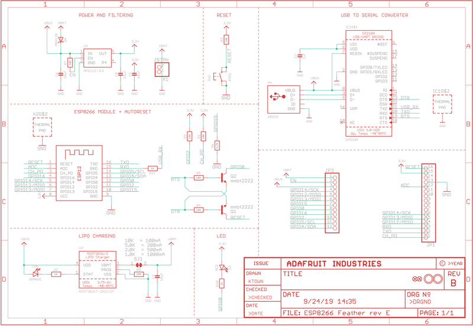
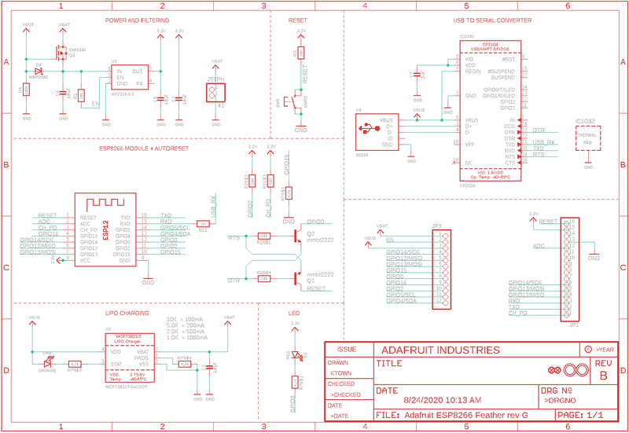
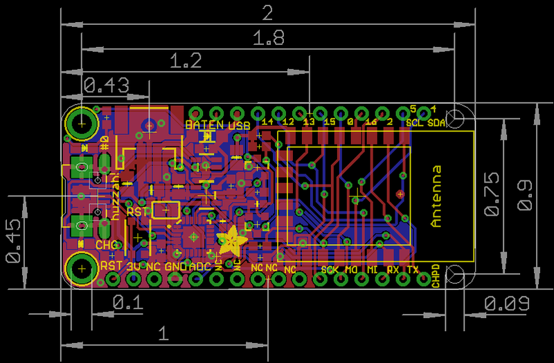

<!-- source: https://learn.adafruit.com/adafruit-feather-huzzah-esp8266/downloads | fetched: 2026-09-22 -->
# Downloads | Adafruit Feather HUZZAH ESP8266 | Adafruit Learning System

301

Intermediate

Product guide

## Downloads

# Datasheets & Files

- [AP2112K-3.3V regulator onboard](http://www.diodes.com/_files/datasheets/AP2112.pdf)
- [CP2104 USB-to-Serial converter](http://www.adafruit.com/datasheets/cp2104.pdf)
- [EagleCAD PCB Files on GitHub](https://github.com/adafruit/Adafruit-Feather-ESP8266-HUZZAH-PCB)
- [Fritzing object in Adafruit Fritzing Library](https://github.com/adafruit/Fritzing-Library/)
- [3D Models on GitHub](https://github.com/adafruit/Adafruit_CAD_Parts/tree/master/2821%20Feather%20HUZZAH%20ESP8266)

 

[Feather HUZZAH ESP8266 Pinout Diagram](https://cdn-learn.adafruit.com/assets/assets/000/046/211/original/Huzzah_ESP8266_Pinout_v1.2.pdf?1504807178)

# More info about the ESP8266

- [ESP8266 specification sheet](http://www.adafruit.com/datasheets/ESP8266_Specifications_English.pdf)
- [FCC test report](http://www.adafruit.com/datasheets/ESP12FCCtestreport.pdf) for the module used on this breakout
- [CE test report for the module used on this breakout](http://www.adafruit.com/datasheets/ESP12CE.jpg)
- Huuuuge amount of information on <http://www.esp8266.com/> community forum!
- [NodeMCU (Lua for ESP8266) webpage](http://nodemcu.com/index_en.html) with examples and documentation on the Lua framework
- [Arduino IDE support for ESP8266](https://github.com/esp8266/Arduino)
- [NodeMCU PyFlasher - a cross platform ESP flashing tool](https://github.com/marcelstoer/nodemcu-pyflasher/releases)

*[Don't forget to visit esp8266.com for the latest and greatest in ESP8266 news, software and gossip!](http://www.esp8266.com/)*

# Schematic

Click to enlarge

 

# Rev G Schematic

 

# Fabrication Print

Dimensions in inches

Page last edited March 08, 2024

Text editor powered by [tinymce](https://www.tiny.cloud/).

[I2C Sensor](https://learn.adafruit.com/adafruit-feather-huzzah-esp8266/i2c-sensor) [ESP8266 F.A.Q.](https://learn.adafruit.com/adafruit-feather-huzzah-esp8266/faq)
