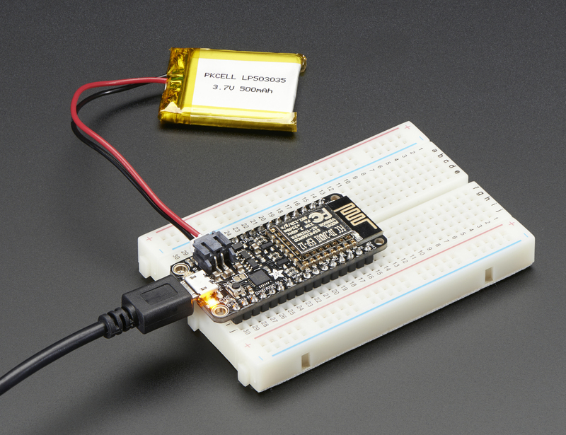
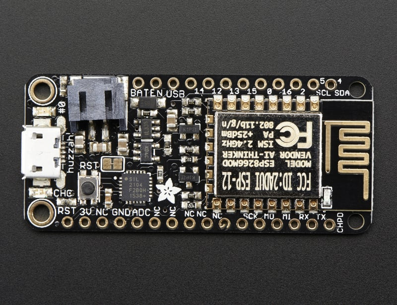
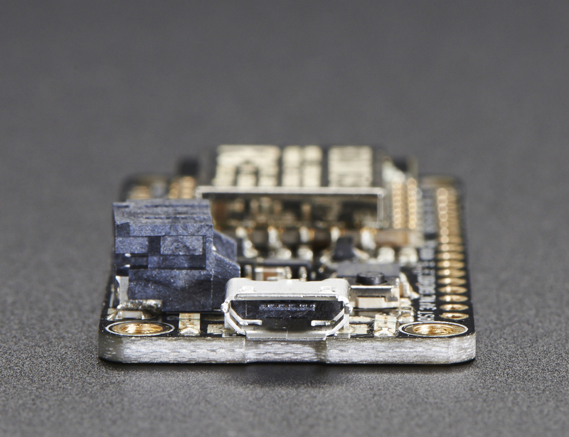
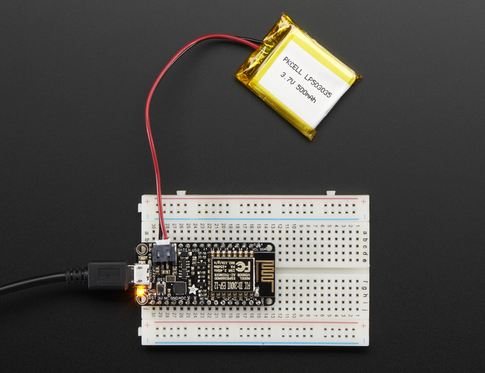
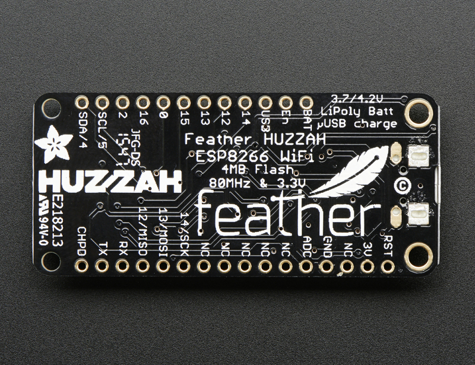

<!-- source: https://learn.adafruit.com/adafruit-feather-huzzah-esp8266/overview | fetched: 2026-09-22 -->
# Overview | Adafruit Feather HUZZAH ESP8266 | Adafruit Learning System

301

Intermediate

Product guide

## Overview

 

Feather is the new development board from Adafruit, and like it's namesake it is thin, light, and lets you fly! We designed Feather to be a new standard for portable microcontroller cores.

This is the **Adafruit Feather HUZZAH ESP8266** - our take on an 'all-in-one' ESP8266 WiFi development board with built in USB and battery charging. Its an  ESP8266 WiFi module with all the extras you need, ready to rock! [We have other boards in the Feather family, check'em out here](https://www.adafruit.com/categories/777).

 

At the Feather HUZZAH's heart is an ESP8266 WiFi microcontroller clocked at 80 MHz and at 3.3V logic. This microcontroller contains a Tensilica chip core as well as a full WiFi stack. You can progam the microcontroller using the Arduino IDE for an easy-to-run Internet of Things core. We wired up a USB-Serial chip that can upload code at a blistering 921600 baud for fast development time. It also has auto-reset so no noodling with pins and reset button pressings.

 

To make it easy to use for portable projects, we added a connector for any of our 3.7V Lithium polymer batteries and built in battery charging. You don't need a battery, it will run just fine straight from the micro USB connector. But, if you do have a battery, you can take it on the go, then plug in the USB to recharge. The Feather will automatically switch over to USB power when its available.

 

**Here's some handy specs!**

- Measures 2.0" x 0.9" x 0.28" (51mm x 23mm x 8mm) without headers soldered in
- Light as a (large?) feather - 6 grams
- ESP8266 @ 80MHz or 160 MHz with 3.3V logic/power
- 4MB of FLASH (32 MBit)
- 3.3V regulator with 500mA peak current output
- CP2104 USB-Serial converter onboard with 921600 max baudrate for uploading
- Auto-reset support for getting into bootload mode before firmware upload
- 9 GPIO pins - can also be used as I2C and SPI
- 1 x analog inputs 1.0V max
- Built in 100mA lipoly charger with charging status indicator LED
- Pin #0 red LED for general purpose blinking. Pin #2 blue LED for bootloading debug & general purpose blinking
- Power/enable pin
- 4 mounting holes
- Reset button

 

Comes fully assembled and tested, with a USB interface that lets you quickly use it with the Arduino IDE or NodeMCU Lua. (It comes preprogrammed with the Lua interpretter) We also toss in some header so you can solder it in and plug into a solderless breadboard. **Lipoly battery and USB cable not included** (but we do have lots of options in the shop if you'd like!)

Page last edited March 08, 2024

Text editor powered by [tinymce](https://www.tiny.cloud/).

[Pinouts](https://learn.adafruit.com/adafruit-feather-huzzah-esp8266/pinouts)
