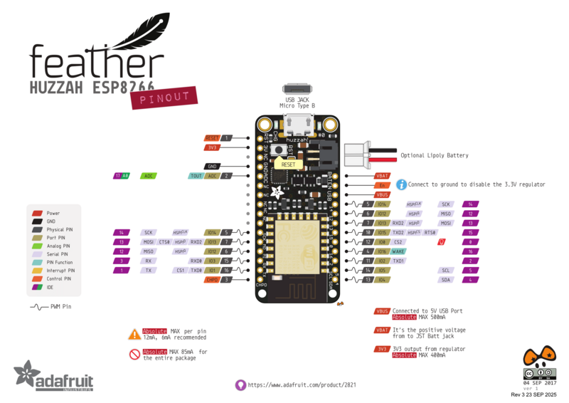
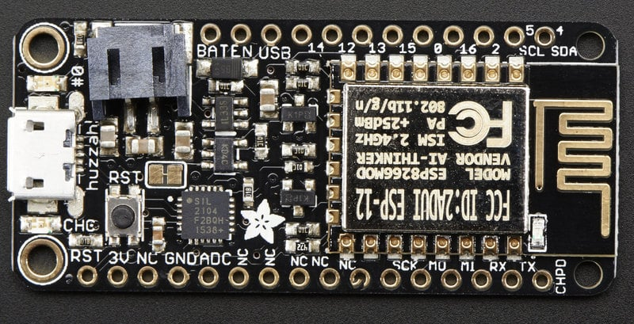
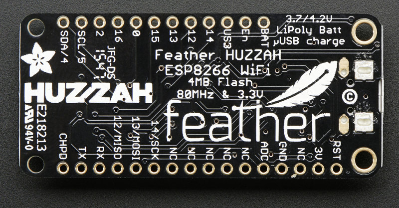
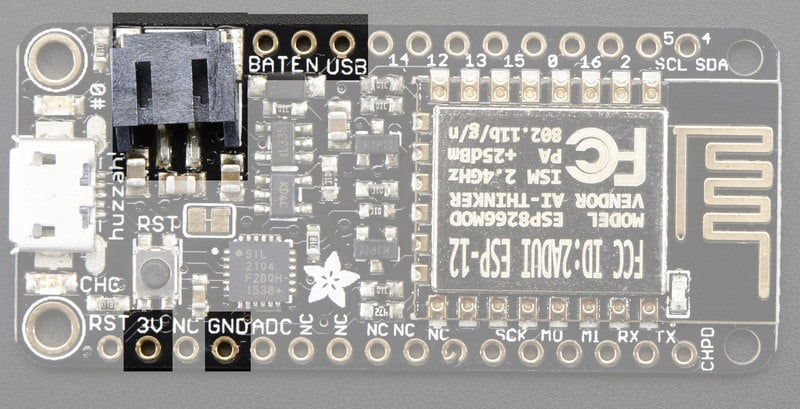
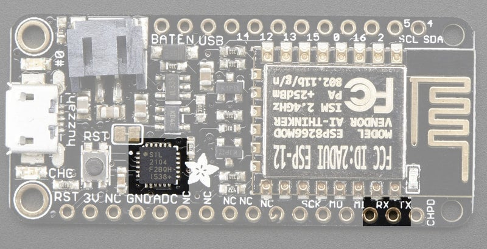
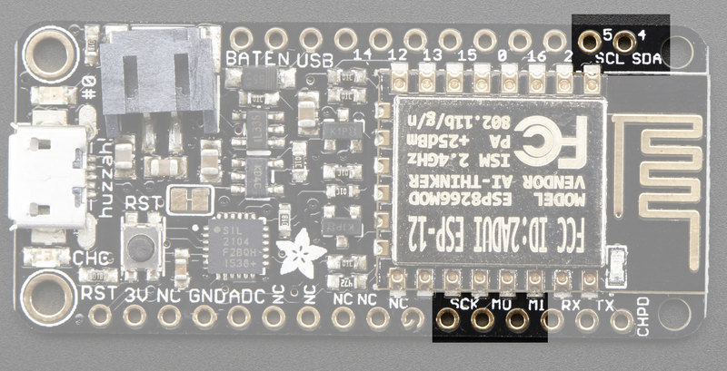
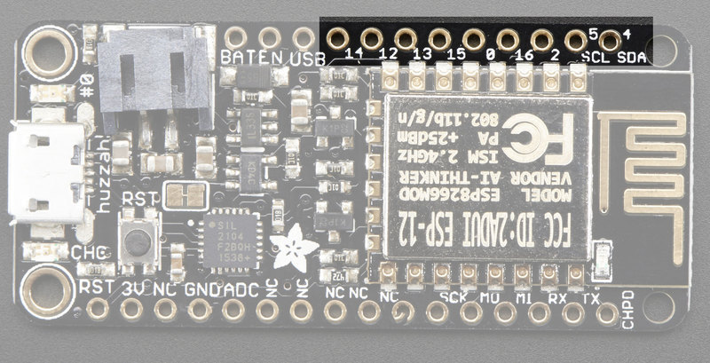
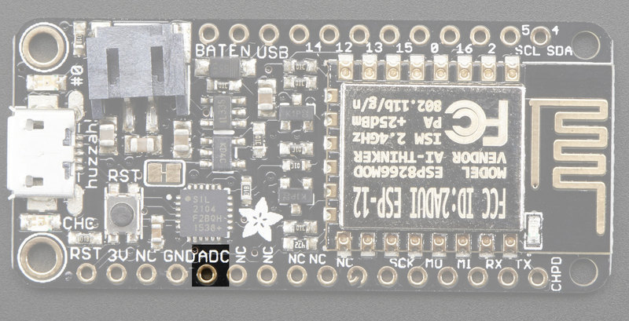
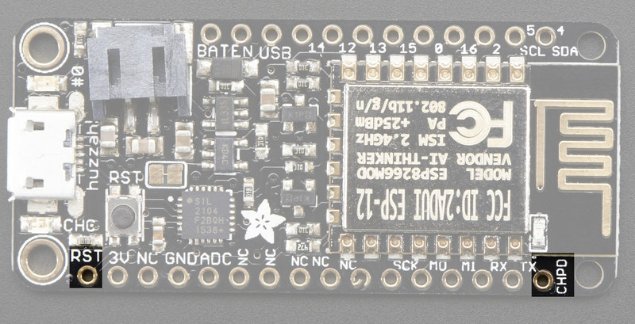

<!-- source: https://learn.adafruit.com/adafruit-feather-huzzah-esp8266/pinouts | fetched: 2026-09-22 -->
# Pinouts | Adafruit Feather HUZZAH ESP8266 | Adafruit Learning System

301

Intermediate

Product guide

## Pinouts

 

 

 

# Power Pins

 

- **GND** - this is the common ground for all power and logic
- **BAT** - this is the positive voltage to/from the JST jack for the optional Lipoly battery
- **USB** - this is the positive voltage to/from the micro USB jack if connected
- **EN** - this is the 3.3V regulator's enable pin. It's pulled up, so connect to ground to disable the 3.3V regulator
- **3V** - this is the output from the 3.3V regulator, it can supply 500mA peak (try to keep your current draw under 250mA so you have plenty for the ESP8266's power requirements!)

# Logic pins

This is the general purpose I/O pin set for the microcontroller. All logic is 3.3V

Text emphasized with a yellow exclamation: 
The ESP8266 runs on 3.3V power and logic, and unless otherwise specified, GPIO pins are not 5V safe! The analog pin is also 1.0V max!

# Serial pins

**RX** and **TX** are the serial control and bootloading pins, and are how you will spend most of your time communicating with the ESP module

 

The **TX** pin is the output *from* the module and is 3.3V logic.

The **RX** pin is the input *into* the module and is 5V compliant (there is a level shifter on this pin)

These are connected through to the CP2104 USB-to-Serial converter so they should *not* be connected to or used unless you're super sure you want to because you will also be getting the USB traffic on these!

# I2C & SPI pins

You can use the ESP8266 to control I2C and SPI devices, sensors, outputs, etc. While this is done by 'bitbanging', it works quite well and the ESP8266 is fast enough to match 'Arduino level' speeds.

 

In theory you can use *any* pins for I2C and SPI but to make it easier for people using existing Arduino code, libraries, sketches we set up the following:

- **I2C SDA** = **GPIO #4** (default)
- **I2C SCL** = **GPIO #5** (default)

If you want, you can connect to I2C devices using other 2 pins in the Arduino IDE, by calling `Wire.pins(sda, scl)` before any other Wire code is called (so, do this at the begining of `setup()` for example

Likewise, you can use SPI on any pins but if you end up using 'hardware SPI' you will want to use the following:

- **SPI SCK = GPIO #14** (default)
- **SPI MOSI = GPIO #13** (default)
- **SPI MISO = GPIO #12** (default)

# GPIO pins

 

This breakout has 9 GPIO: **#0, #2, #4, #5, #12, #13, #14, #15, #16** arranged at the top edge of the Feather PCB

All GPIO are 3.3V logic level in and out, and are **not 5V compatible.**Read the [full spec sheet](http://www.adafruit.com/datasheets/ESP8266_Specifications_English.pdf) to learn more about the GPIO pin limits, but be aware the maximum current drawn per pin is **12mA**.

These pins are general purpose and can be used for any sort of input or output. Most also have the ability to turn on an internal pullup. Many have *special* functionality:

**GPIO #0,** which does not have an internal pullup, and is also connected a red LED. This pin is used by the ESP8266 to determine when to boot into the bootloader. If the pin is held low during power-up it will start bootloading! That said, you can always use it as an output, and blink the red LED - note the LED is reverse wired so setting the pin LOW will turn the LED on.

**GPIO #2**, is also used to detect boot-mode. It also is connected to the blue LED that is near the WiFi antenna. It has a pullup resistor connected to it, and you can use it as any output (like #0) and blink the blue LED.

**GPIO #15**, is also used to detect boot-mode. It has a pulldown resistor connected to it, make sure this pin isn't pulled high on startup. You can always just use it as an output

**GPIO #16** can be used to wake up out of deep-sleep mode, you'll need to connect it to the RESET pin

Also note that GPIO #**12/13/14** are the same as the **SCK/MOSI/MISO** 'SPI' pins!

# Analog Pins

There is also a single analog input pin called **A**. This pin has a ~1.0V maximum voltage, so if you have an analog voltage you want to read that is higher, it will have to be divided down to 0 - 1.0V range

 

# Other control pins

We have a few other pins for controlling the ESP8266

- **RST** - this is the reset pin for the ESP8266, pulled high by default. When pulled down to ground momentarily it will reset the ESP8266 system. This pin is 3.3V logic only
- **EN (CH\_PD)** - This is the enable pin for the ESP8266, pulled high by default. When pulled down to ground momentarily it will reset the ESP8266 system. This pin is 3.3V logic only

 

# NC Pins

The rest of the pins are labeled **NC** which means **Not Connected** - they are not connected to anything and are there as placeholders only, to maintain physical compatibility with the other boards in the Feather line!

Page last edited September 23, 2025

Text editor powered by [tinymce](https://www.tiny.cloud/).

[Overview](https://learn.adafruit.com/adafruit-feather-huzzah-esp8266/overview) [Assembly](https://learn.adafruit.com/adafruit-feather-huzzah-esp8266/assembly)
