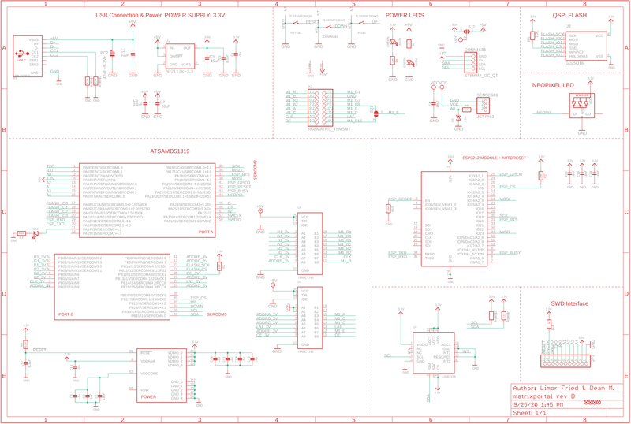
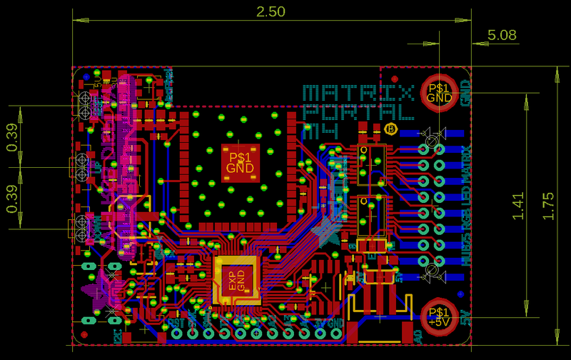

<!-- source: https://learn.adafruit.com/adafruit-matrixportal-m4/downloads | fetched: 2026-09-21 -->
# Downloads | Adafruit MatrixPortal M4 | Adafruit Learning System

205

Beginner

Product guide

## Downloads

## Files

- [ATSAMD51J19 datasheet](http://ww1.microchip.com/downloads/en/DeviceDoc/SAM_D5xE5x_Family_Data_Sheet_DS60001507F.pdf)
- [EagleCAD PCB files on GitHub](https://github.com/adafruit/Adafruit-MatrixPortal-M4-PCB)
- [Fritzing object in Adafruit Fritzing Library](https://github.com/adafruit/Fritzing-Library/blob/master/parts/Adafruit%20PyPortal%20-%20CircuitPython%20Powered%20Internet%20Display.fzpz)
- [PDF for MatrixPortal M4 Board Diagram on GitHub](https://github.com/adafruit/Adafruit-MatrixPortal-M4-PCB/blob/main/Adafruit%20MatrixPortal%20M4%20Pinout.pdf)

[SVG for MatrixPortal M4 Board Diagram](https://cdn-learn.adafruit.com/assets/assets/000/111/882/original/Adafruit_MatrixPortal_M4_Pinout.svg?1653078637)

[Simpletest UF2 for MatrixPortal M4 + 64x32 Matrix](https://cdn-learn.adafruit.com/assets/assets/000/123/404/original/matrixportal_m4_simpletest.UF2?1691705208)

[Simpletest UF2 for MatrixPortal M4 + 64x64 Matrix](https://cdn-learn.adafruit.com/assets/assets/000/123/405/original/matrixportal_m4_simpletest_64x64.UF2?1691705232)

## Schematic

 

## Fab Print

Page last edited April 09, 2024

Text editor powered by [tinymce](https://www.tiny.cloud/).

[USB Power](https://learn.adafruit.com/adafruit-matrixportal-m4/usb-power)
