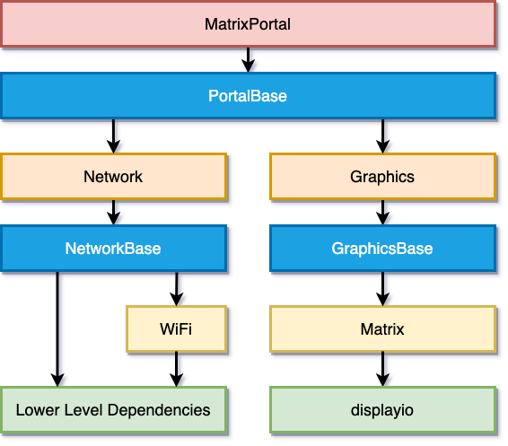

<!-- source: https://learn.adafruit.com/adafruit-matrixportal-m4/matrixportal-library | fetched: 2026-09-21 -->
# MatrixPortal Library Overview | Adafruit MatrixPortal M4 | Adafruit Learning System

205

Beginner

Product guide

## MatrixPortal Library Overview

The MatrixPortal library was inspired by the PyPortal library, but a slightly different approach was taken. Rather than having everything in a single module, it was divided into layers. The reason for having different layers is you can use lower layers if you want more control and better memory usage.

The main library now piggyback's on top of the base library. The base library was named PortalBase which is split up into 3 components. The main base, the GraphicsBase, and the NetworkBase. In the diagram, you can see these components represented in blue.

[We also have a library for lower-level control of just the RGB Matrix](https://learn.adafruit.com/rgb-led-matrices-matrix-panels-with-circuitpython), but it doesn't have integrated WiFi access so we recommend using the MatrixPortal library.

Here is the way it is logically laid out with dependencies. The MatrixPortal library is comprised of the top layer, the Network and Graphics layers, and the WiFi and Matrix layers in the diagram.

 

There are two main branches of dependencies related to Network Functionality and Graphics functionality. The **MatrixPortal** library ties them both together and allows easier coding, but at the cost of more memory usage and less control. We'll go through each of the classes starting from the bottom and working our way up the diagram starting with the Network branch.

## Network Branch

The network branch contains all of the functionality related to connecting to the internet and retrieving data. You will want to use this branch if your project need to retrieve any data that is not stored on the device itself.

### WiFi Module

The WiFi module is responsible for initializing the hardware libraries, controlling the status NeoPixel colors, and initializing the WiFi manager. You would want to use this library if you only wanted to handle the automatic initialization of hardware and connection to WiFi and didn't need any other functionality.

### Network Module

The network module has many convenience functions for making network calls. It handles a lot of things from automatically establishing the connection to getting the time from the internet, to getting data at certain URLs. This is one of the largest of the modules as there is a lot of functionality packed into this.

## Graphics Branch

This branch is a lot lighter than the Network Branch because so much of the functionality is built into CircuitPython and displayio.

### Matrix Module

The matrix module is responsible for detecting and initializing the matrix through the CircuitPython rgbmatrix and framebufferio modules. It currently supports the MatrixPortal M4 and Metro M4 with RGB Matrix Shield. If you just wanted to initialize the matrix, you could use this module. If you would like to go lower level than this and use the rgbmatrix and framebufferio libraries directly, be sure to check out the guide [RGB LED Matrices with CircuitPython](https://learn.adafruit.com/rgb-led-matrices-matrix-panels-with-circuitpython).

### Graphics Module

This module will initialize the Matrix through the matrix module. The main purpose of this module was to add any graphics convenience functions in such as displaying a background easily.

## MatrixPortal Module

The MatrixPortal module is top level module and will handle initializing everything below it. Using this module is very similar to using the PyPortal library. The main differences are:

- Text labels are added after the module is initialized.
- Text labels can either be scrolling or static.
- There are more Adafruit IO functions

## Library Demos

The MatrixPortal library has been used in a number of projects. Here are a few of them with guides available.

- [RGB Matrix Automatic YouTube ON AIR Sign](https://learn.adafruit.com/rgb-matrix-automatic-youtube-on-air-sign)
- [Network Connected RGB Matrix Clock](https://learn.adafruit.com/network-connected-metro-rgb-matrix-clock)
- [Weather Display Matrix](https://learn.adafruit.com/weather-display-matrix)
- [Custom Scrolling Quote Board Matrix Display](https://learn.adafruit.com/aio-quote-board-matrix-display)
- [Halloween Countdown Display Matrix](https://learn.adafruit.com/halloween-countdown-display-matrix)
- [Moon Phase Clock for Adafruit Matrix Portal](https://learn.adafruit.com/moon-phase-clock-for-adafruit-matrixportal)

Page last edited April 09, 2024

Text editor powered by [tinymce](https://www.tiny.cloud/).

[Internet Connect!](https://learn.adafruit.com/adafruit-matrixportal-m4/internet-connect) [CircuitPython Pins and Modules](https://learn.adafruit.com/adafruit-matrixportal-m4/circuitpython-pins-and-modules)
