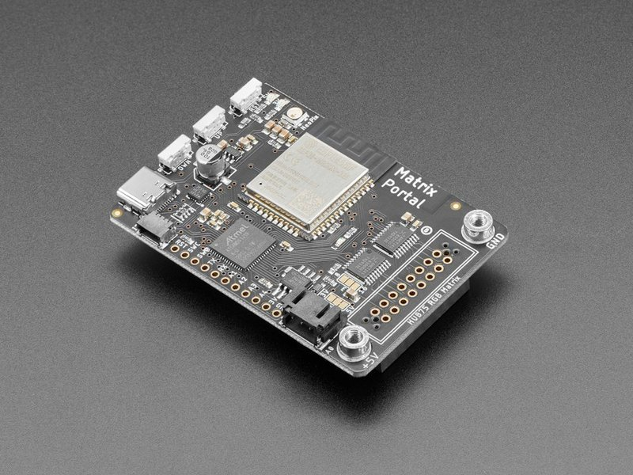
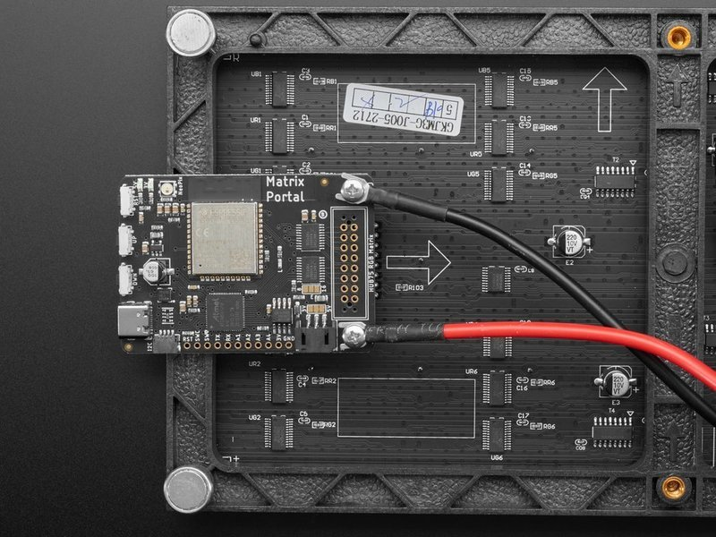
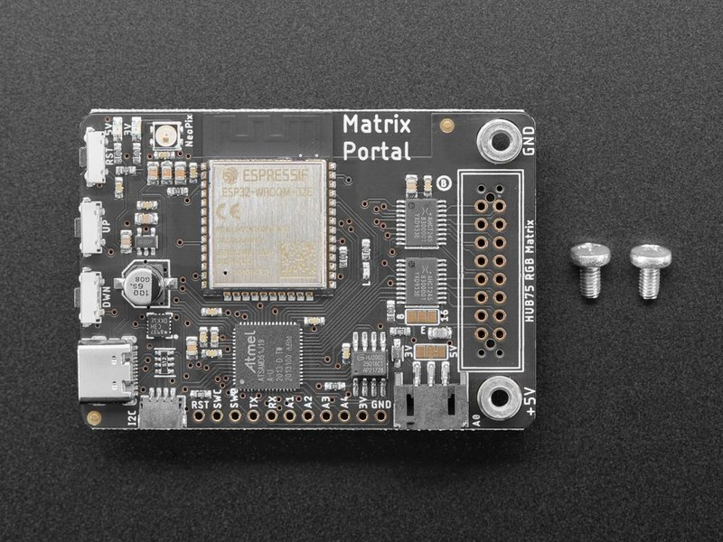
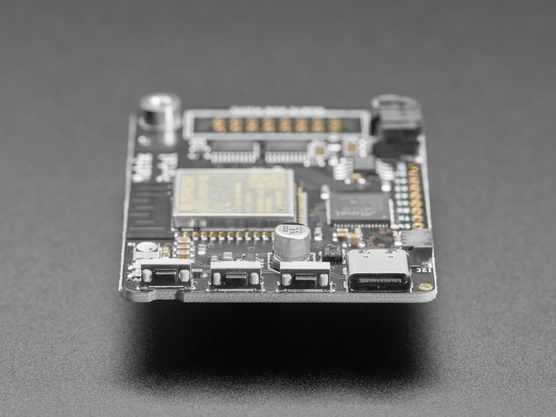
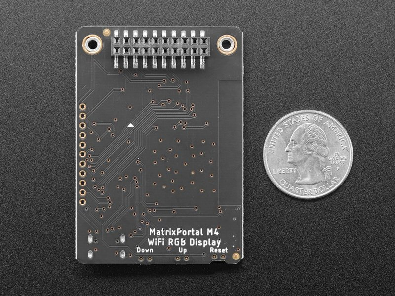

<!-- source: https://learn.adafruit.com/adafruit-matrixportal-m4/overview | fetched: 2026-09-21 -->
# Overview | Adafruit MatrixPortal M4 | Adafruit Learning System

205

Beginner

Product guide

## Overview

 

Folks love Adafruit's [wide selection of RGB matrices](https://www.adafruit.com/category/327) and accessories for making custom colorful LED displays... and Adafruit RGB Matrix Shields and FeatherWings can be quickly soldered together to make the wiring much easier.

But what if we made it *even easier* than that? **Like, no solder, no wiring, just instant plug-and-play?**Dream no more - with the **Adafruit Matrix Portal add-on for RGB Matrices**, there has never been an easier way to create powerful internet-connected LED displays.

 

Plug The Matrix Portal directly into the back of [any HUB-75 compatible display (all the ones we stock will work) from 16x32 up to 64x64](https://www.adafruit.com/category/327)! Use the included screws to attach the power cable to the power plugs with a common screwdriver, then power it with any USB C power supply. (For larger projects, power the matrices with a separate 5V power adapter)

 

Then code up your project in [CircuitPython](https://learn.adafruit.com/rgb-led-matrices-matrix-panels-with-circuitpython) or [Arduino](https://learn.adafruit.com/adafruit-protomatter-rgb-matrix-library), the Adafruit Protomatter matrix library works great on the SAMD51 chipset, knowing that you've got the wiring and level shifting all handled. Here's what you get:

- **ATSAMD51J19 Cortex M4 processor**, 512KB flash, 192K of SRAM, with full Arduino or CircuitPython support
- **ESP32 WiFi co-processor** with TLS support and SPI interface to the M4, with full Arduino or CircuitPython support
- **USB Type C** connector for data and power connectivity
- [**I2C STEMMA QT connector**for plug-n-play use of any of our STEMMA QT devices or sensors](https://www.adafruit.com/category/620) can also be used with [any Grove I2C devices using this adapter cable](https://www.adafruit.com/product/4528)
- **JST 3-pin connector** that also has analog input/output, [say for adding audio playback to projects](https://www.adafruit.com/product/3885)
- **LIS3DH accelerometer** for digital sand projects or detecting taps/orientation.
- **GPIO breakouts** including 4 analog outputs with PWM and SPI support for adding other hardware.
- **Address E line jumper** for use with 64x64 matrices (check your matrix to see which pin is used for address E!
- **Two user interface buttons** + one reset button
- **Indicator NeoPixel** and red LED
- **Green power indicator LEDs** for both 3V and 5V power
- **2x10 socket connector** fits snugly into 2x8 HUB75 ports without worrying about 'off by one' errors.

 

The Matrix Portal uses an ATMEL (Microchip) ATSAMD51J19, and an Espressif ESP32 Wi-Fi coprocessor with TLS/SSL support built-in. The M4 and ESP32 are a great couple - and each bring their own strengths to this board. The SAMD51 M4 has native USB, so it can show up like a disk drive, act as a MIDI or HID keyboard/mouse, and of course bootload and debug over a serial port. It also has DACs, ADC, PWM, and tons of GPIO, so it can handle the high speed updating of the RGB matrix.

 

Meanwhile, the ESP32 has secure WiFi capabilities, and plenty of Flash and RAM to buffer sockets. By letting the ESP32 focus on the complex TLS/SSL computation and socket buffering, it frees up the SAMD51 to act as the user interface. You get a great programming experience thanks to the native USB with files available for drag-n-drop, and you don't have to spend a ton of processor time and memory to do SSL encryption/decryption and certificate management. It's the best of both worlds!

Page last edited March 08, 2024

Text editor powered by [tinymce](https://www.tiny.cloud/).

[Pinouts](https://learn.adafruit.com/adafruit-matrixportal-m4/pinouts)
