<!-- source: https://learn.adafruit.com/adafruit-matrixportal-m4/pinouts | fetched: 2026-09-21 -->
# Pinouts | Adafruit MatrixPortal M4 | Adafruit Learning System

205

Beginner

Product guide

## Pinouts

[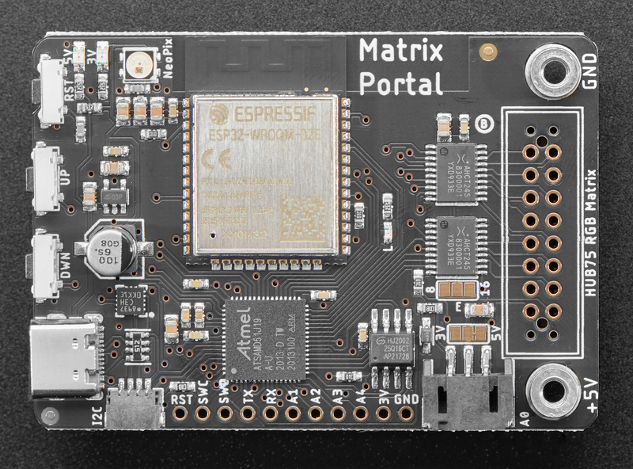](https://learn.adafruit.com/assets/95052) 

[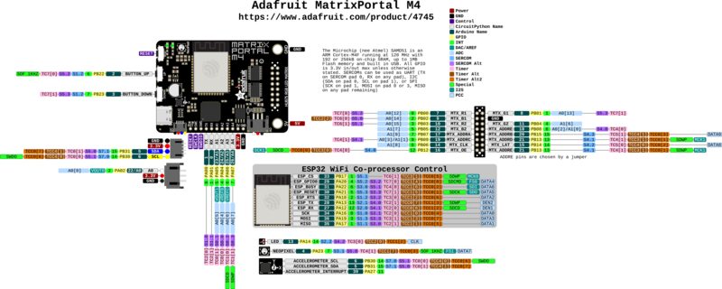](https://learn.adafruit.com/assets/133096) 

[Click here to view a PDF version of the pinout diagram](https://github.com/adafruit/Adafruit-MatrixPortal-M4-PCB/blob/main/Adafruit%20MatrixPortal%20M4%20Pinout.pdf)

There are so many great features on the Adafruit MatrixPortal M4. Let's take a look at what's available!

## Microcontroller and Flash

[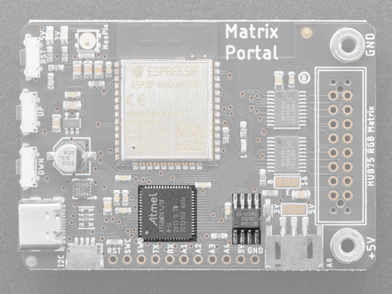](https://learn.adafruit.com/assets/95053)

The main processor chip is the **ATSAMD51J19 Cortex M4** running at 120MHz with 3.3v logic/power. It has 512KB of Flash and 192KB of RAM.

We also include **2 MB of QSPI Flash** for storing images, sounds, animations, whatever!

## WiFi

[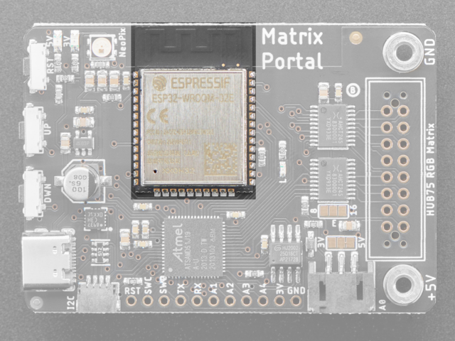](https://learn.adafruit.com/assets/95054)

The WiFi capability uses an **Espressif ESP32 Wi-Fi coprocessor** with TLS/SSL support built-in.

The ESP32 uses the SPI port for data, and also uses a CS pin (`board.ESP_CS` or Arduino `33`), Ready/Busy pin (`board.ESP_BUSY` or Arduino `31`), and reset pin (`board.ESP_RESET` or Arduino `30`)

## HUB75 Connector

[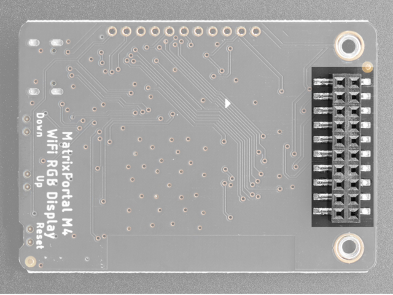](https://learn.adafruit.com/assets/95059)

[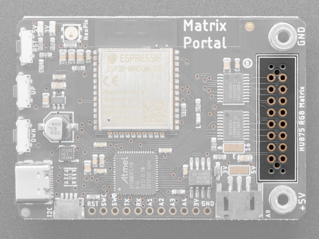](https://learn.adafruit.com/assets/95060)

There is a **2x8 pin HUB75** connector on the reverse side that plugs directly into the HUB75 port on your RGB Matrix.

The socket itself is 2x10 so that it fits snug and lined up in a 2x8 IDC socket. Otherwise its easy to get it 'off by one'

## RGB Matrix Power

[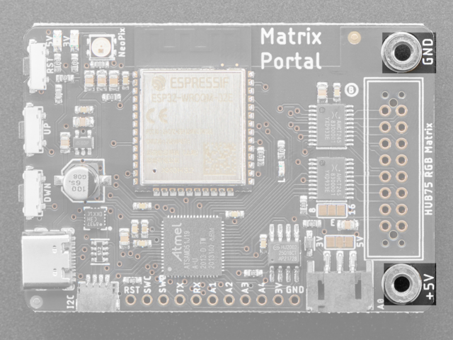](https://learn.adafruit.com/assets/95064)

There are **+5V** and **Ground** M3-threaded screw terminals on either side of the HUB75 connector. These provide power to the RGB Matrix.

If you would like to power the RGB Matrix with external power, we recommend disconnecting it from here and providing power directly to the matrix.

These terminals were designed as outputs ONLY - power from the USB port connects directly to these pads, so you should power from USB and then connect the matrix power inputs to these terminals.

While it's *technically* possible to power the MatrixPortal through here, we strongly discourage that because **plugging anything into the USB port at the same time could result in damage.**

## Sensors

[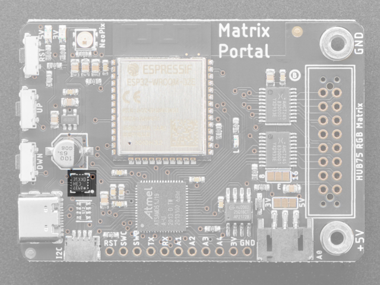](https://learn.adafruit.com/assets/95055)

The MatrixPortal M4 includes a **LIS3DH Triple-Axis Accelerometer**. The accelerometer is connected via the I2C bus.

**Please note the address of the accelerometer is 0x19 not 0x18 which is the default in our libraries.**

## Stemma QT Connector

[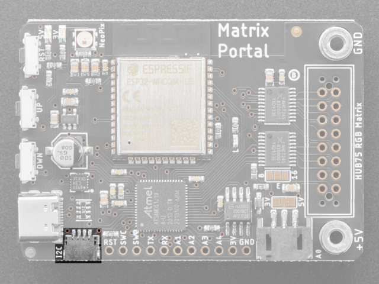](https://learn.adafruit.com/assets/95056)

There is a 4-pin **Stemma QT connector** on the left. The I2C has pullups to 3.3V power and is connected to the LIS3DH already.

In CircuitPython, you can use the STEMMA connector with `board.SCL` and `board.SDA`, or `board.STEMMA_I2C()`.

## Reset Pin

[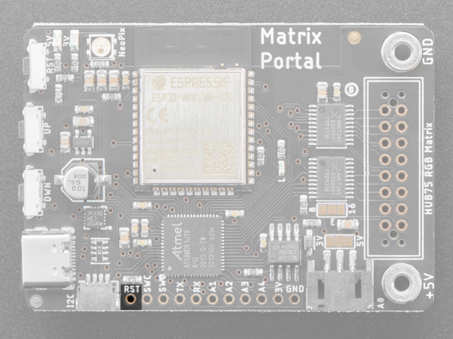](https://learn.adafruit.com/assets/95096)

**RST** is the Reset pin. Tie to ground to manually reset the ATSAMD51, as well as launch the bootloader manually.

## Debugging Interface

[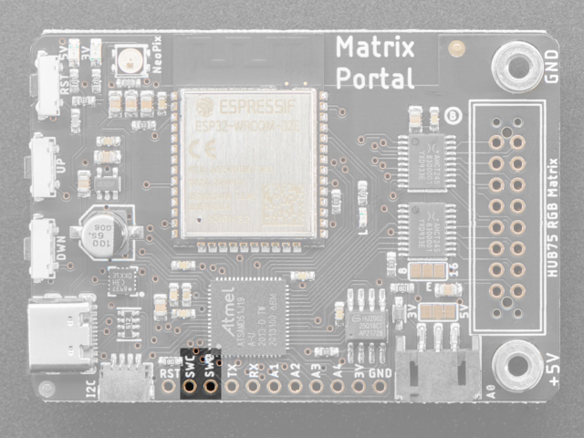](https://learn.adafruit.com/assets/95097)

If you'd like to do more advanced development, trace-debugging, or not use the bootloader, we have the SWD interface exposed.

## Serial UART Pins

[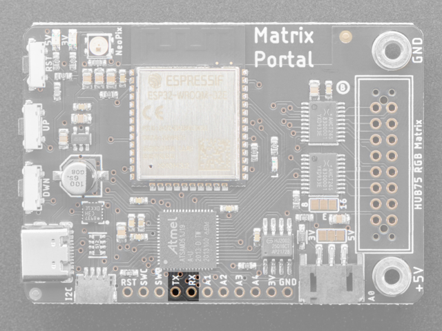](https://learn.adafruit.com/assets/95066)

The **TX pin** and **RX pin** are for serial communication with the SAMD51 microcontroller and can be used to connect various peripherals such as a GPS.

The RX pin is attached to `board.RX` and Arduino `0` and the TX pin is attached to `board.TX` and Arduino `1`.

## Analog Connector/Pins

[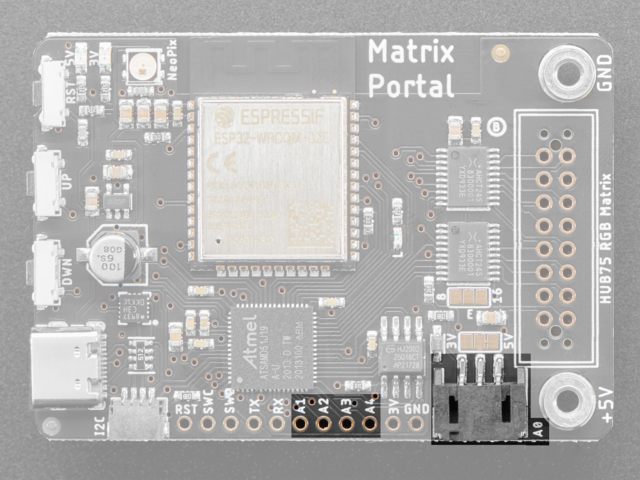](https://learn.adafruit.com/assets/95061)

On the bottom side towards the right, there is a connector labeled **A0**. This is a **3-pin JST analog connector** for sensors or NeoPixels, analog output or input

Along the bottom there are also pins labeled `A1` through `A4`.

All of these pins can be used for analog inputs or digital I/O.

## Power Pins

[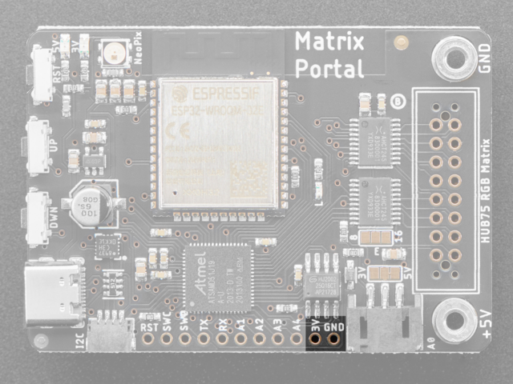](https://learn.adafruit.com/assets/95098)

**3V** is the output from the 3.3V regulator, it can supply 500mA peak.

**GND** is the common ground for all power and logic.

## Status LED and NeoPixel

[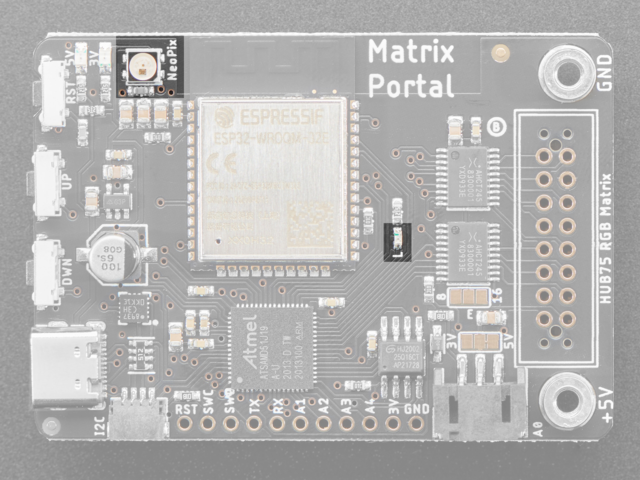](https://learn.adafruit.com/assets/95062)

There are two LEDs on the board.

There is the RGB **status NeoPixel** labeled "STATUS". It is connected to `board.NEOPIXEL` or Arduino `4`

As well, there is the **D13 LED**. This is attached to `board.LED` and Arduino `13`

## USB-C Connector

[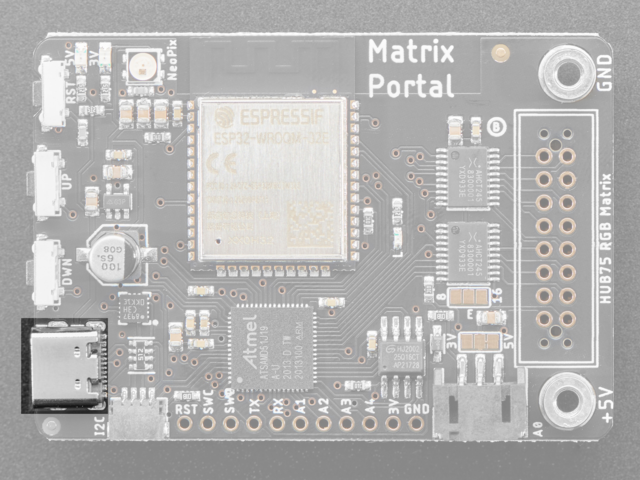](https://learn.adafruit.com/assets/95063)

There is one USB port on the board.

On the left side, towards the bottom, is a **USB Type C**port, which is used for powering and programming both the board and RGB Matrix.

## Buttons

[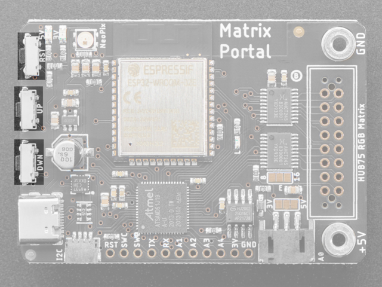](https://learn.adafruit.com/assets/95065)

There are three buttons along the left side of the MatrixPortal M4.

The **reset button**is located in the top position. Click it once to re-start your firmware. Click twice to enter bootloader mode.

The **up button** is located in the middle and is attached to `board.BUTTON_UP` and Arduino `2`.

The **down button** is located on the bottom and is attached to `board.BUTTON_DOWN` and Arduino `3`.

The up and down buttons do not have any pull-up resistors connected to them and pressing either of them pulls the input low.

## Address E Line Jumper

[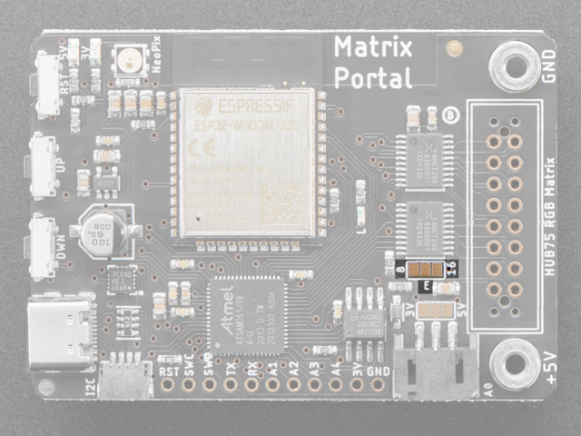](https://learn.adafruit.com/assets/95067)

This jumper is used for use with **64x64 matrices** and is either connected to pin 8 or pin 16 of the HUB75 connector. Check your matrix to see which pin is used for address E.

You can close the jumper by using your soldering iron to melt a blob of solder on the bottom solder jumper so the middle pad is 'shorted' to 8. *(This is compatible with 64x64 matrices in the Adafruit store. For 64x64 matrices from other sources, you might need to use 16 instead, check the datasheet of your display.)*

Page last edited October 10, 2024

Text editor powered by [tinymce](https://www.tiny.cloud/).

[Overview](https://learn.adafruit.com/adafruit-matrixportal-m4/overview) [Prep the MatrixPortal](https://learn.adafruit.com/adafruit-matrixportal-m4/prep-the-matrixportal)
