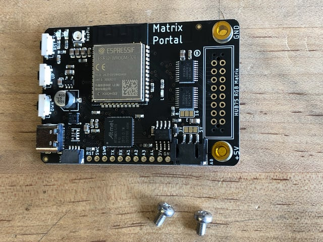
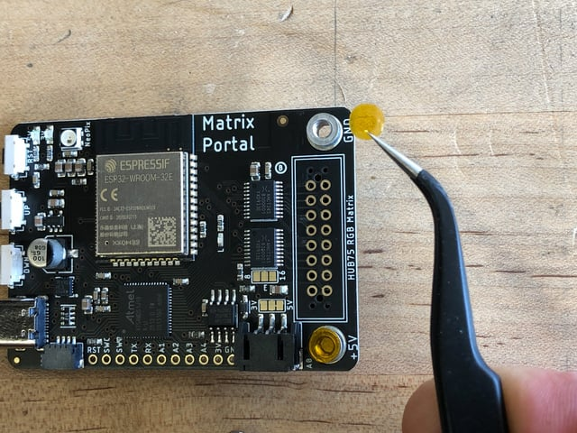
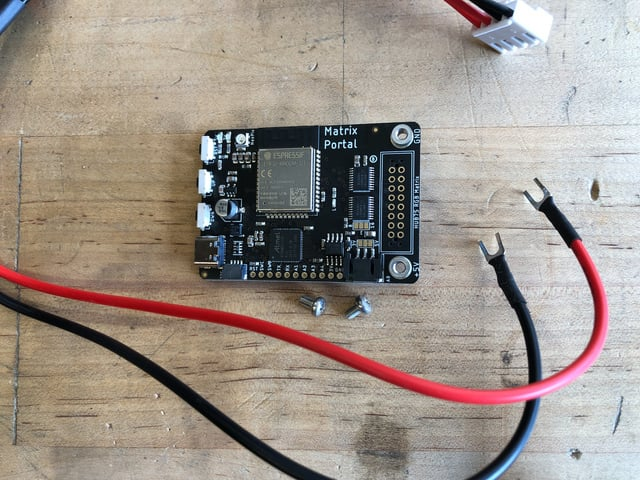
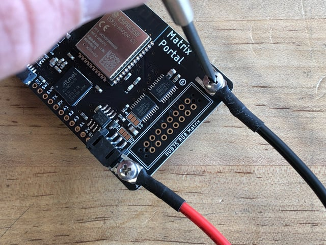
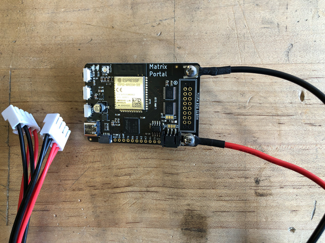
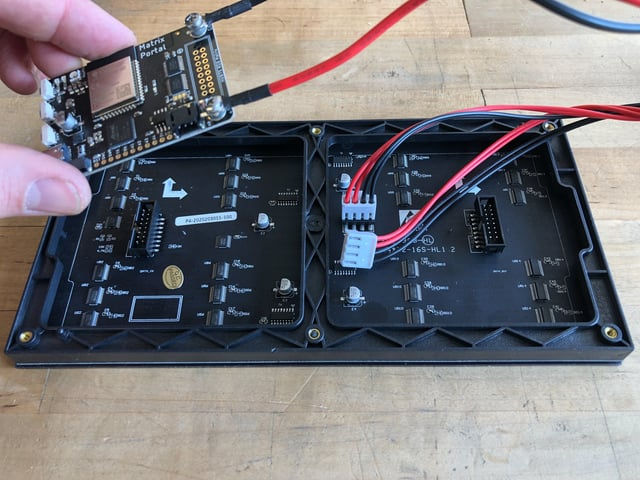
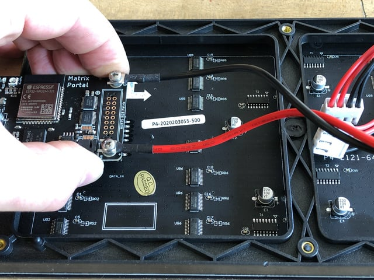
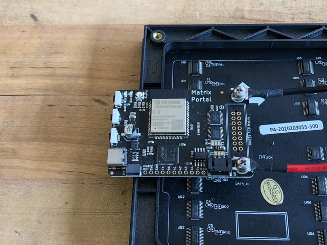
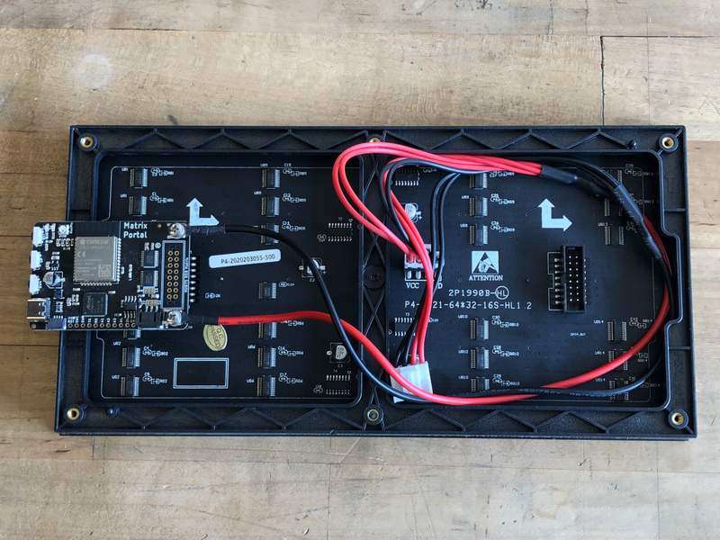
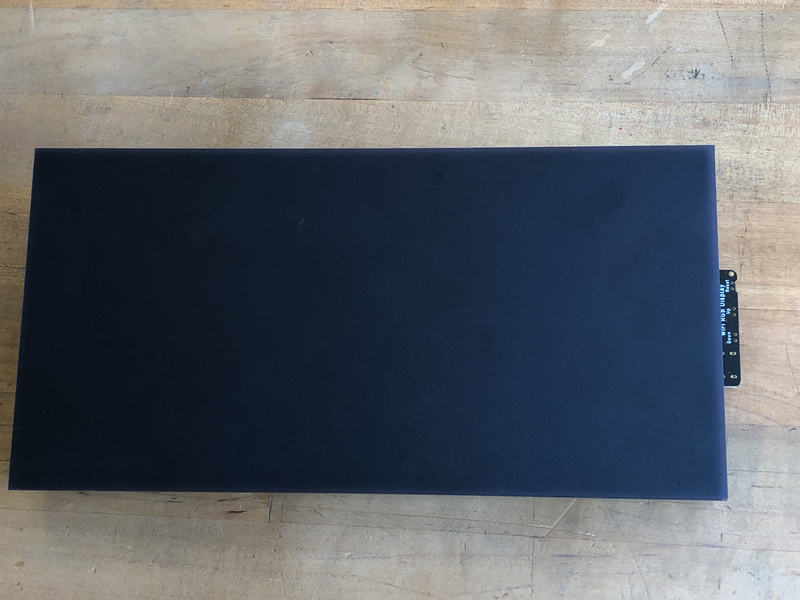

<!-- source: https://learn.adafruit.com/adafruit-matrixportal-m4/prep-the-matrixportal | fetched: 2026-09-21 -->
# Prep the MatrixPortal | Adafruit MatrixPortal M4 | Adafruit Learning System

205

Beginner

Product guide

## Prep the MatrixPortal

## Power Prep

The MatrixPortal supplies power to the matrix display panel via two standoffs. These come with protective tape applied (part of our manufacturing process) which MUST BE REMOVED!

Use some tweezers or a fingernail to remove the two amber circles.

## Power Terminals

Next, screw in the spade connectors to the corresponding standoff.

- **red** wire goes to **+5V**
- **black** wire goes to **GND**

## Panel Power

Plug either one of the four-conductor power plugs into the power connector pins on the panel. The plug can only go in one way, and that way is marked on the board's silkscreen.

## Dual Matrix Setup

If you're planning to use a 64x64 matrix, [follow these instructions on soldering the Address E Line jumper](https://learn.adafruit.com/adafruit-matrixportal-m4/pinouts).

## Board Connection

Now, plug the board into the left side shrouded 8x2 connector as shown. The orientation matters, so take a moment to confirm that the **white indicator arrow on the matrix panel is oriented pointing up and right** as seen here and the MatrixPortal overhangs the edge of the panel when connected. This allows you to use the edge buttons from the front side.

Check nothing is impeding the board from plugging in firmly. If there's a plastic nub on the matrix that's keeping the Portal from sitting flat, cut it off with diagonal cutters

 

 

Text emphasized with a blue exclamation: 
For info on adding LED diffusion acrylic, see the page LED Matrix Diffuser.

Page last edited March 08, 2024

Text editor powered by [tinymce](https://www.tiny.cloud/).

[Pinouts](https://learn.adafruit.com/adafruit-matrixportal-m4/pinouts) [LED Matrix Diffuser](https://learn.adafruit.com/adafruit-matrixportal-m4/led-matrix-diffuser)
