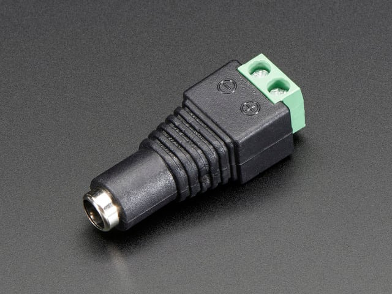
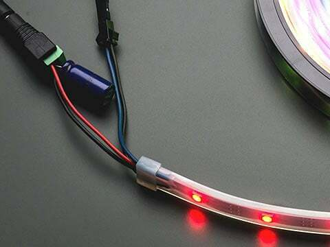

<!-- source: https://learn.adafruit.com/adafruit-matrixportal-m4/usb-power | fetched: 2026-09-21 -->
# USB Power | Adafruit MatrixPortal M4 | Adafruit Learning System

205

Beginner

Product guide

## USB Power

If powering a MatrixPortal and associated LED matrix solely through the USB port, you might encounter a situation where the image appears stable when only a few pixels are lit, but brighter images with more pixels lit may exhibit “ghosting” or “sparkling” artifacts.

This is **not a software bug**. Please do not report it as a software bug.

This is a **USB power issue**. It does not affect everyone because there are *so many* different USB power sources and permutations. What follows is an explanation and some workarounds.

## The Source of Gremlins

Not all USB ports are created equal. The ports on many computers are designed to provide 5 Volts at a maximum of 1 Ampere (1A)…or sometimes as little as 500 mA (0.5A). Likewise with USB wall chargers: small ones might deliver 1A or less, and even beefier models seldom exceed 2–2.5A.

LED matrices can be power hungry. And the more pixels in use, the hungrier they are. When a matrix demands more power than is available through the USB port, this can result in a momentary *brown-out* condition, and the sort of visual glitches described above. This can be exacerbated by cheap, thin USB cables that have a lot of resistance.

Complicating issues, the *voltage and current from a USB port are not rock steady.* This is especially true of USB battery banks. The buck/boost converter circuit in these devices creates a sort of “buzz” in the output; on *average* it might be 5V 2A, but the *instantaneous* voltage and current will oscillate around this. This is no problem for a typical steady use like charging a phone, but LED matrices are weird…it’s not just that they’re hungry, but like the supply voltage, the LED current draw *also* oscillates they’re actually flashed on and off hundreds of times a second to produce an image.

## Some Solutions to Try

If you encounter the aforementioned phenomenon, here are some things to try, starting from the very simple and working our way up…

- Try **swapping the USB cable** if the one you have seems thin. That free cable included for charging a mouse or Bluetooth speaker might be unsuitable for the amount of current we need. Look for something beefy, like a tablet or laptop charging cable. Those luxury braided cables are also sometimes a sign of “substance.”
- If powering from a **computer’s USB port**: try using a sizable (2A or better) **USB wall charger** instead.
- If powering from a **USB wall charger** or **USB battery bank**: Try **swapping out** for any others you might have on hand. More current (higher amperage) is always nice, but that’s not the whole story. As explained above, the output filtering (or lack of) can affect the steadiness of the output voltage and current.

Those are the easy “switch something out” fixes. If none of those address the issue, now things get progressively more complex…

- Try **powering the MatrixPortal and LED matrix separately**: USB for the MatrixPortal, and a 5V DC “wall wart” supply (2A or preferably more) for the matrix, using one of these screw terminal power adapters (i.e. don’t use the screw terminals on the MatrixPortal, use this instead):

Featured
[Female DC Power adapter - 2.1mm jack to screw terminal block](https://www.adafruit.com/product/368)

If you need to connect a DC power wall wart to a board that doesn't have a DC jack - this adapter will come in very...

$2.00 each

In Stock

[Add to Cart](https://www.adafruit.com/product/368)

- If the project *must* be powered from a **USB battery bank** and you’ve already tested some others: try powering the LED matrix and the MatrixPortal **separately**. This might involve two power banks, or one with multiple ports might suffice (most enforce per-port current limits), you’ll need to experiment. Cables exist to convert USB type A or C to a DC plug that’s compatible with the screw terminal adapter above — one would power the LED matrix through this, and the MatrixPortal through a normal USB cable. Just make sure the cable provides 5V output; some are “booster” cables to higher voltages that could *destroy* the matrix.

- If nothing else seems to work, the last line of defense is **better filtering** on the power supply output. This involves adding one or more **capacitors** across the + and – terminals until the image stabilizes. Unfortunately there is no one-size-fits-all solution here…it requires **experimentation** with an assortment of caps on hand. One might start with a 1000 µF cap, and work up or down from there. If something seems promising but imperfect, two or more with different values might be needed in parallel (e.g. 100 µF + 1000 µF).

This photo shows NeoPixels, but the principle is *exactly* the same: capacitance helps smooth out fluctuations in the power supply. Look for something at least 10V rated (higher is OK) and values from 50 µF to 2000 µF. Folks who’ve been doing electronics for a while usually end up with a little parts drawer of random caps, so maybe you (or someone you know, or a local maker space) already have something suitable.

Page last edited April 09, 2024

Text editor powered by [tinymce](https://www.tiny.cloud/).

[Updating ESP32 Firmware](https://learn.adafruit.com/adafruit-matrixportal-m4/updating-esp32-firmware) [Downloads](https://learn.adafruit.com/adafruit-matrixportal-m4/downloads)
