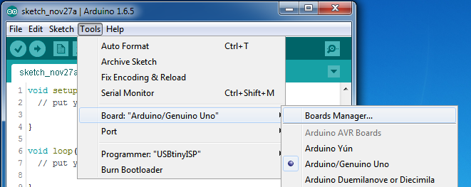
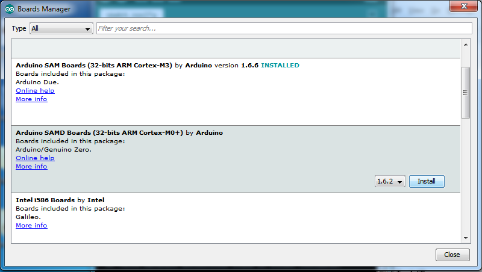
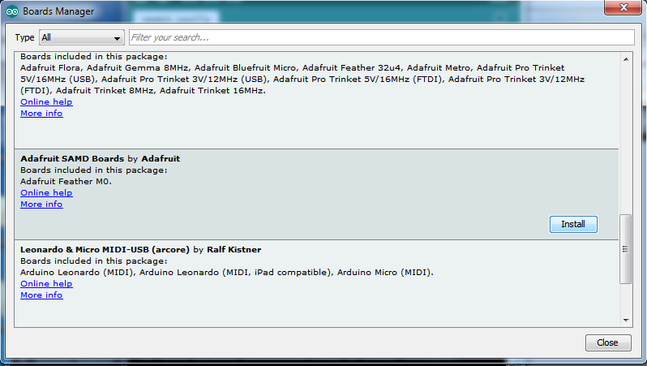
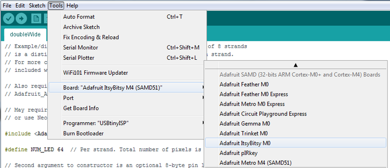
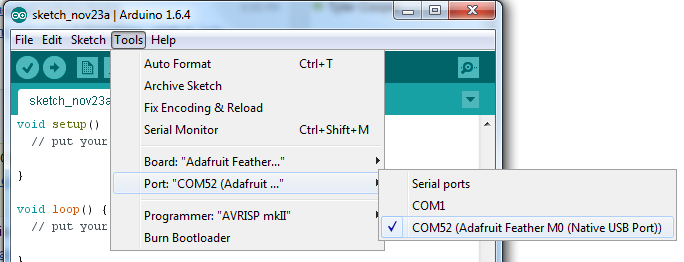
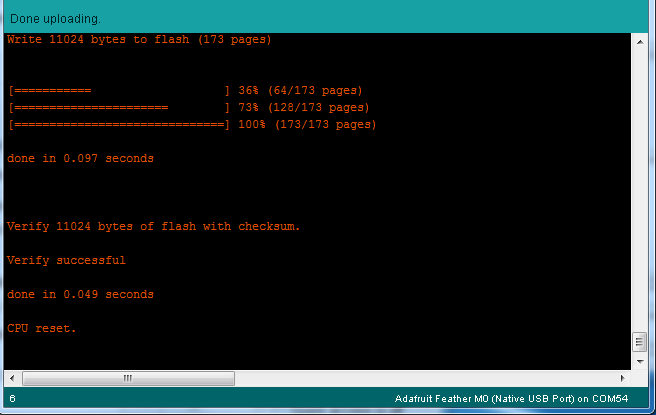
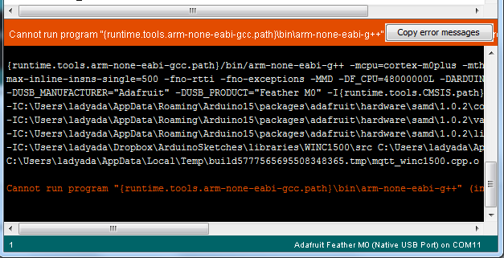
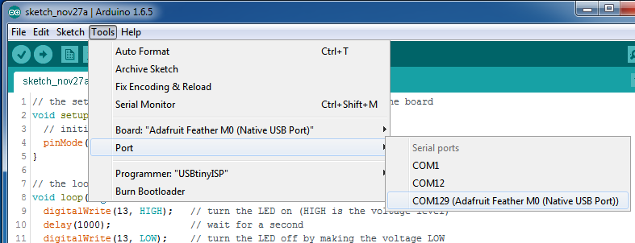

<!-- source: https://learn.adafruit.com/adafruit-matrixportal-m4/using-with-arduino-ide | fetched: 2026-09-21 -->
# Using with Arduino IDE | Adafruit MatrixPortal M4 | Adafruit Learning System

205

Beginner

Product guide

## Using with Arduino IDE

Adafruit boards that use ATSAMD21 ("M0") or ATSAMD51 ("M4") chips are easy to get working with the Arduino IDE. Most libraries (including the popular ones like NeoPixels and display) will work with those boards, especially devices & sensors that use I2C or SPI.

Now that you have added the appropriate URLs to the Arduino IDE preferences in the previous page, you can open the **Boards Manager** by navigating to the **Tools->Board** menu.

[](https://learn.adafruit.com/assets/28791) 

Once the Board Manager opens, click on the category drop down menu on the top left hand side of the window and select **All**. You will then be able to select and install the boards supplied by the URLs added to the preferences.

Text emphasized with a yellow exclamation: 
Remember you need SETUP the Arduino IDE to support our board packages - see the previous page on how to add adafruit's URL to the preferences

# Install SAMD Support

First up, install the latest **Arduino SAMD Boards (**version **1.6.11**or later)

You can type **Arduino SAMD** in the top search bar, then when you see the entry, click **Install**

[](https://learn.adafruit.com/assets/28792) 

# Install Adafruit SAMD

Next you can install the Adafruit SAMD package to add the board file definitions

Make sure you have **Type All** selected to the left of the *Filter your search...* box

You can type **Adafruit SAMD** in the top search bar, then when you see the entry, click **Install**

[](https://learn.adafruit.com/assets/28794) 

**Quit and reopen the Arduino IDE** to ensure that all of the boards are properly installed. You should now be able to select and upload to the new boards listed in the **Tools->Board** menu.

Select the matching board, the current options are:

- **Feather M0** (for use with any Feather M0 other than the Express)
- **Feather M0 Express**
- **Metro M0 Express**
- **Circuit Playground Express**
- **Gemma M0**
- **Trinket M0**
- **QT Py M0**
- **ItsyBitsy M0**
- **Hallowing M0**
- **Crickit M0** (this is for direct programming of the Crickit, which is probably not what you want! For advanced hacking only)
- **Metro M4 Express**
- **Grand Central M4 Express**
- **ItsyBitsy M4 Express**
- **Feather M4 Express**
- **Trellis M4 Express**
- **PyPortal M4**
- **PyPortal M4 Titano**
- **PyBadge M4 Express**
- **Metro M4 Airlift Lite**
- **PyGamer M4 Express**
- **MONSTER M4SK**
- **Hallowing M4**
- **MatrixPortal M4**
- **BLM Badge**

[](https://learn.adafruit.com/assets/53074) 

## Windows 7 and 8.1

Text emphasized with a yellow exclamation: 
**Windows 7 and Windows 8.1** have reached end-of-life and are no longer supported. They required driver installation. A [limited set of drivers is available for older boards](https://github.com/adafruit/Adafruit_Windows_Drivers/releases), but drivers for most newer boards are not available.

# Blink

Now you can upload your first blink sketch!

Plug in the SAMD21 M0 or SAMD51 M4 board, and wait for it to be recognized by the OS (just takes a few seconds). It will create a serial/COM port, you can now select it from the drop-down, it'll even be 'indicated' as Trinket/Gemma/Metro/Feather/ItsyBitsy/QT Py/Trellis or whatever the board is named!

Text emphasized with a blue exclamation: 
A few boards, such as the QT Py SAMD21, Trellis M4 Express, and certain Trinkey boards, do not have an onboard pin 13 LED. You can follow this section to practice uploading but you won't see an LED blink!

[](https://learn.adafruit.com/assets/28796) 

Now load up the Blink example

[Download File](https://learn.adafruit.com/elements/2854177/download)

[Copy Code](https://learn.adafruit.com/adafruit-matrixportal-m4/using-with-arduino-ide)

```
// the setup function runs once when you press reset or power the board
void setup() {
  // initialize digital pin 13 as an output.
  pinMode(13, OUTPUT);
}

// the loop function runs over and over again forever
void loop() {
  digitalWrite(13, HIGH);   // turn the LED on (HIGH is the voltage level)
  delay(1000);              // wait for a second
  digitalWrite(13, LOW);    // turn the LED off by making the voltage LOW
  delay(1000);              // wait for a second
}
```

```
1
2
3
4
5
6
7
8
9
10
11
12
13
```

```
// the setup function runs once when you press reset or power the board
void setup() {
  // initialize digital pin 13 as an output.
  pinMode(13, OUTPUT);
}

// the loop function runs over and over again forever
void loop() {
  digitalWrite(13, HIGH);   // turn the LED on (HIGH is the voltage level)
  delay(1000);              // wait for a second
  digitalWrite(13, LOW);    // turn the LED off by making the voltage LOW
  delay(1000);              // wait for a second
}
```

And click upload! That's it, you will be able to see the LED blink rate change as you adapt the **delay()** calls.

Text emphasized with a blue exclamation: 
If you are having issues, make sure you selected the matching Board in the menu that matches the hardware you have in your hand.

# Successful Upload

If you have a successful upload, you'll get a bunch of red text that tells you that the device was found and it was programmed, verified & reset

[](https://learn.adafruit.com/assets/28797) 

After uploading, you may see a message saying "Disk Not Ejected Properly" about the ...BOOT drive. You can ignore that message: it's an artifact of how the bootloader and uploading work.

# Compilation Issues

If you get an alert that looks like

**Cannot run program "{runtime.tools.arm-none-eabi-gcc.path}\bin\arm-non-eabi-g++"**

Make sure you have installed the **Arduino SAMD** boards package, you need *both* Arduino & Adafruit SAMD board packages

[](https://learn.adafruit.com/assets/28798) 

# Manually bootloading

If you ever get in a 'weird' spot with the bootloader, or you have uploaded code that crashes and doesn't auto-reboot into the bootloader, click the **RST** button **twice** (like a double-click) to get back into the bootloader.

**The red LED will pulse and/or RGB LED will be green, so you know that its in bootloader mode.**

Once it is in bootloader mode, you can select the newly created COM/Serial port and re-try uploading.

[](https://learn.adafruit.com/assets/28799) 

You may need to go back and reselect the 'normal' USB serial port next time you want to use the normal upload.

# Ubuntu & Linux Issue Fix

[Follow the steps for installing Adafruit's udev rules on this page.](https://learn.adafruit.com/adafruit-arduino-ide-setup/linux-setup)

Page last edited March 30, 2024

Text editor powered by [tinymce](https://www.tiny.cloud/).

[Arduino IDE Setup](https://learn.adafruit.com/adafruit-matrixportal-m4/arduino-ide-setup) [Arduino Libraries](https://learn.adafruit.com/adafruit-matrixportal-m4/arduino-libraries)
