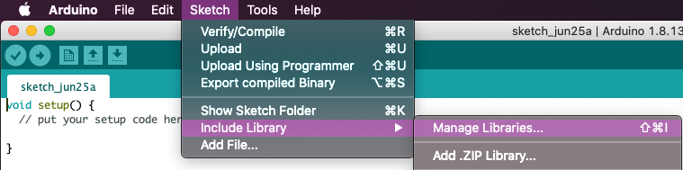
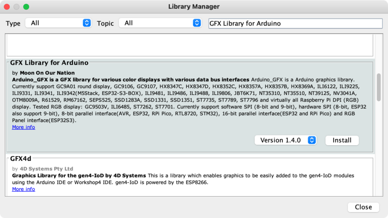

<!-- source: https://learn.adafruit.com/adafruit-qualia-esp32-s3-for-rgb666-displays/arduino-library-installation | fetched: 2026-09-23 -->
# Library Installation | Adafruit Qualia ESP32-S3 for RGB-666 Displays | Adafruit Learning System

33

Intermediate

Product guide

## Library Installation

The examples for the Qualia ESP32-S3 require the **GFX Library for Arduino**. You can install that library for Arduino using the Library Manager in the Arduino IDE.

 

Click the **Manage Libraries...** menu item, search for **GFX Library for Arduino**, scroll down, and select the **GFX Library for Arduino** by user **Moon On Our Nation**:

Page last edited March 08, 2024

Text editor powered by [tinymce](https://www.tiny.cloud/).

[Using with Arduino IDE](https://learn.adafruit.com/adafruit-qualia-esp32-s3-for-rgb666-displays/using-with-arduino-ide) [WiFi Test](https://learn.adafruit.com/adafruit-qualia-esp32-s3-for-rgb666-displays/wifi-test)
