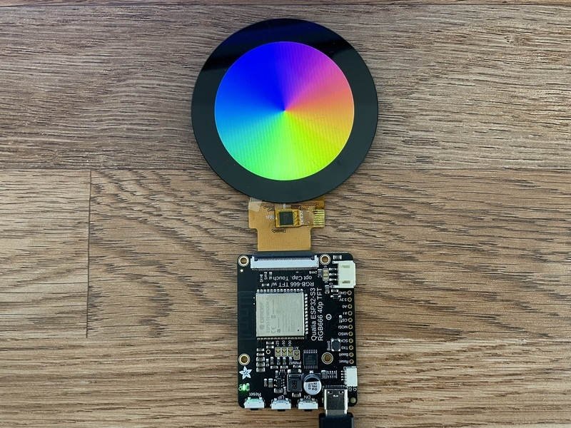

<!-- source: https://learn.adafruit.com/adafruit-qualia-esp32-s3-for-rgb666-displays/arduino-rainbow-demo | fetched: 2026-09-23 -->
# Arduino Rainbow Demo | Adafruit Qualia ESP32-S3 for RGB-666 Displays | Adafruit Learning System

33

Intermediate

Product guide

## Arduino Rainbow Demo

We have a Circular Rainbow demo available for the Qualia ESP32-S3 that runs in Arduino. Below is the code to run it.

[Download File](https://learn.adafruit.com/elements/3155961/download)

[Copy Code](https://learn.adafruit.com/adafruit-qualia-esp32-s3-for-rgb666-displays/arduino-rainbow-demo)

```
// SPDX-FileCopyrightText: 2023 Limor Fried for Adafruit Industries
//
// SPDX-License-Identifier: MIT

#include <Arduino_GFX_Library.h>
#include <Adafruit_FT6206.h>
#include <Adafruit_CST8XX.h>

Arduino_XCA9554SWSPI *expander = new Arduino_XCA9554SWSPI(
    PCA_TFT_RESET, PCA_TFT_CS, PCA_TFT_SCK, PCA_TFT_MOSI,
    &Wire, 0x3F);

Arduino_ESP32RGBPanel *rgbpanel = new Arduino_ESP32RGBPanel(
    TFT_DE, TFT_VSYNC, TFT_HSYNC, TFT_PCLK,
    TFT_R1, TFT_R2, TFT_R3, TFT_R4, TFT_R5,
    TFT_G0, TFT_G1, TFT_G2, TFT_G3, TFT_G4, TFT_G5,
    TFT_B1, TFT_B2, TFT_B3, TFT_B4, TFT_B5,
    1 /* hsync_polarity */, 50 /* hsync_front_porch */, 2 /* hsync_pulse_width */, 44 /* hsync_back_porch */,
    1 /* vsync_polarity */, 16 /* vsync_front_porch */, 2 /* vsync_pulse_width */, 18 /* vsync_back_porch */
//    ,1, 30000000
    );

Arduino_RGB_Display *gfx = new Arduino_RGB_Display(
// 2.1" 480x480 round display
    480 /* width */, 480 /* height */, rgbpanel, 0 /* rotation */, true /* auto_flush */,
    expander, GFX_NOT_DEFINED /* RST */, TL021WVC02_init_operations, sizeof(TL021WVC02_init_operations));

// 2.8" 480x480 round display
//    480 /* width */, 480 /* height */, rgbpanel, 0 /* rotation */, true /* auto_flush */,
//    expander, GFX_NOT_DEFINED /* RST */, TL028WVC01_init_operations, sizeof(TL028WVC01_init_operations));

// 3.4" 480x480 square display
//    480 /* width */, 480 /* height */, rgbpanel, 0 /* rotation */, true /* auto_flush */,
//    expander, GFX_NOT_DEFINED /* RST */, tl034wvs05_b1477a_init_operations, sizeof(tl034wvs05_b1477a_init_operations));

/* 4.0" 480x480 square */
//    480 /* width */, 480 /* height */, rgbpanel, 0 /* rotation */, true /* auto_flush */,
//    expander, GFX_NOT_DEFINED /* RST */, tl040wvs03_init_operations, sizeof(tl040wvs03_init_operations));

// 3.2" 320x820 rectangle bar display
//    320 /* width */, 820 /* height */, rgbpanel, 0 /* rotation */, true /* auto_flush */,
//    expander, GFX_NOT_DEFINED /* RST */, tl032fwv01_init_operations, sizeof(tl032fwv01_init_operations));

// 3.7" 240x960 rectangle bar display
//    240 /* width */, 960 /* height */, rgbpanel, 0 /* rotation */, true /* auto_flush */,
//    expander, GFX_NOT_DEFINED /* RST */, HD371001C40_init_operations, sizeof(HD371001C40_init_operations), 120 /* col_offset1 */);

// 4.0" 720x720 square display
//    720 /* width */, 720 /* height */, rgbpanel, 0 /* rotation */, true /* auto_flush */,
//    expander, GFX_NOT_DEFINED /* RST */, NULL, 0);

// 4.0" 720x720 round display
//    720 /* width */, 720 /* height */, rgbpanel, 0 /* rotation */, true /* auto_flush */,
//    expander, GFX_NOT_DEFINED /* RST */, hd40015c40_init_operations, sizeof(hd40015c40_init_operations));
// needs also the rgbpanel to have these pulse/sync values:
//    1 /* hync_polarity */, 46 /* hsync_front_porch */, 2 /* hsync_pulse_width */, 44 /* hsync_back_porch */,
//    1 /* vsync_polarity */, 50 /* vsync_front_porch */, 16 /* vsync_pulse_width */, 16 /* vsync_back_porch */

// 4.58" 320x960 rectangle bar display
//    320 /* width */, 960 /* height */, rgbpanel, 0 /* rotation */, true /* auto_flush */,
//    expander, GFX_NOT_DEFINED /* RST */, HD458002C40_init_operations, sizeof(HD458002C40_init_operations), 80 /* col_offset1 */);
// needs also the rgbpanel to have these pulse/sync values:
//    1 /* hsync_polarity */, 30 /* hsync_front_porch */, 10 /* hsync_pulse_width */, 50 /* hsync_back_porch */,
//    1 /* vsync_polarity */, 15 /* vsync_front_porch */,  2 /* vsync_pulse_width */, 17 /* vsync_back_porch */

uint16_t *colorWheel;

// The Capacitive touchscreen overlays uses hardware I2C (SCL/SDA)

// Most touchscreens use FocalTouch with I2C Address often but not always 0x48!
#define I2C_TOUCH_ADDR 0x48

// 2.1" 480x480 round display use CST826 touchscreen with I2C Address at 0x15
//#define I2C_TOUCH_ADDR 0x15  // often but not always 0x48!

Adafruit_FT6206 focal_ctp = Adafruit_FT6206();  // this library also supports FT5336U!
Adafruit_CST8XX cst_ctp = Adafruit_CST8XX();
bool touchOK = false;        // we will check if the touchscreen exists
bool isFocalTouch = false;

void setup(void)
{
  Serial.begin(115200);
  //while (!Serial) delay(100);

#ifdef GFX_EXTRA_PRE_INIT
  GFX_EXTRA_PRE_INIT();
#endif

  Serial.println("Beginning");
  // Init Display

  Wire.setClock(1000000); // speed up I2C
  if (!gfx->begin()) {
    Serial.println("gfx->begin() failed!");
  }

  Serial.println("Initialized!");

  gfx->fillScreen(RGB565_BLACK);

  expander->pinMode(PCA_TFT_BACKLIGHT, OUTPUT);
  expander->digitalWrite(PCA_TFT_BACKLIGHT, HIGH);

  colorWheel = (uint16_t *) ps_malloc(gfx->width() * gfx->height() * sizeof(uint16_t));
  if (colorWheel) {
    generateColorWheel(colorWheel);
    gfx->draw16bitRGBBitmap(0, 0, colorWheel, gfx->width(), gfx->height());
  }

  if (!focal_ctp.begin(0, &Wire, I2C_TOUCH_ADDR)) {
    // Try the CST826 Touch Screen
    if (!cst_ctp.begin(&Wire, I2C_TOUCH_ADDR)) {
      Serial.print("No Touchscreen found at address 0x");
      Serial.println(I2C_TOUCH_ADDR, HEX);
      touchOK = false;
    } else {
      Serial.println("CST826 Touchscreen found");
      touchOK = true;
      isFocalTouch = false;
    }
  } else {
    Serial.println("Focal Touchscreen found");
    touchOK = true;
    isFocalTouch = true;
  }
}

void loop()
{
  if (touchOK) {
    if (isFocalTouch && focal_ctp.touched()) {
      TS_Point p = focal_ctp.getPoint(0);
      Serial.printf("(%d, %d)\n", p.x, p.y);
      gfx->fillRect(p.x, p.y, 5, 5, RGB565_WHITE);
    } else if (!isFocalTouch && cst_ctp.touched()) {
      CST_TS_Point p = cst_ctp.getPoint(0);
      Serial.printf("(%d, %d)\n", p.x, p.y);
      gfx->fillRect(p.x, p.y, 5, 5, RGB565_WHITE);
    }
  }

  // use the buttons to turn off
  if (! expander->digitalRead(PCA_BUTTON_DOWN)) {
    expander->digitalWrite(PCA_TFT_BACKLIGHT, LOW);
  }
  // and on the backlight
  if (! expander->digitalRead(PCA_BUTTON_UP)) {
    expander->digitalWrite(PCA_TFT_BACKLIGHT, HIGH);
  }
}

// https://chat.openai.com/share/8edee522-7875-444f-9fea-ae93a8dfa4ec
void generateColorWheel(uint16_t *colorWheel) {
  int width = gfx->width();
  int height = gfx->height();
  int half_width = width / 2;
  int half_height = height / 2;
  float angle;
  uint8_t r, g, b;
  int index, scaled_index;

  for(int y = 0; y < half_height; y++) {
    for(int x = 0; x < half_width; x++) {
      index = y * half_width + x;
      angle = atan2(y - half_height / 2, x - half_width / 2);
      r = uint8_t(127.5 * (cos(angle) + 1));
      g = uint8_t(127.5 * (sin(angle) + 1));
      b = uint8_t(255 - (r + g) / 2);
      uint16_t color = RGB565(r, g, b);

      // Scale this pixel into 4 pixels in the full buffer
      for(int dy = 0; dy < 2; dy++) {
        for(int dx = 0; dx < 2; dx++) {
          scaled_index = (y * 2 + dy) * width + (x * 2 + dx);
          colorWheel[scaled_index] = color;
        }
      }
    }
  }
}
```

```
1
2
3
4
5
6
7
8
9
10
11
12
13
14
15
16
17
18
19
20
21
22
23
24
25
26
27
28
29
30
31
32
33
34
35
36
37
38
39
40
41
42
43
44
45
46
47
48
49
50
51
52
53
54
55
56
57
58
59
60
61
62
63
64
65
66
67
68
69
70
71
72
73
74
75
76
77
78
79
80
81
82
83
84
85
86
87
88
89
90
91
92
93
94
95
96
97
98
99
100
101
102
103
104
105
106
107
108
109
110
111
112
113
114
115
116
117
118
119
120
121
122
123
124
125
126
127
128
129
130
131
132
133
134
135
136
137
138
139
140
141
142
143
144
145
146
147
148
149
150
151
152
153
154
155
156
157
158
159
160
161
162
163
164
165
166
167
168
169
170
171
172
173
174
175
176
177
178
179
180
181
```

```cpp
// SPDX-FileCopyrightText: 2023 Limor Fried for Adafruit Industries
//
// SPDX-License-Identifier: MIT

#include <Arduino_GFX_Library.h>
#include <Adafruit_FT6206.h>
#include <Adafruit_CST8XX.h>

Arduino_XCA9554SWSPI *expander = new Arduino_XCA9554SWSPI(
    PCA_TFT_RESET, PCA_TFT_CS, PCA_TFT_SCK, PCA_TFT_MOSI,
    &Wire, 0x3F);

Arduino_ESP32RGBPanel *rgbpanel = new Arduino_ESP32RGBPanel(
    TFT_DE, TFT_VSYNC, TFT_HSYNC, TFT_PCLK,
    TFT_R1, TFT_R2, TFT_R3, TFT_R4, TFT_R5,
    TFT_G0, TFT_G1, TFT_G2, TFT_G3, TFT_G4, TFT_G5,
    TFT_B1, TFT_B2, TFT_B3, TFT_B4, TFT_B5,
    1 /* hsync_polarity */, 50 /* hsync_front_porch */, 2 /* hsync_pulse_width */, 44 /* hsync_back_porch */,
    1 /* vsync_polarity */, 16 /* vsync_front_porch */, 2 /* vsync_pulse_width */, 18 /* vsync_back_porch */
//    ,1, 30000000
    );

Arduino_RGB_Display *gfx = new Arduino_RGB_Display(
// 2.1" 480x480 round display
    480 /* width */, 480 /* height */, rgbpanel, 0 /* rotation */, true /* auto_flush */,
    expander, GFX_NOT_DEFINED /* RST */, TL021WVC02_init_operations, sizeof(TL021WVC02_init_operations));

// 2.8" 480x480 round display
//    480 /* width */, 480 /* height */, rgbpanel, 0 /* rotation */, true /* auto_flush */,
//    expander, GFX_NOT_DEFINED /* RST */, TL028WVC01_init_operations, sizeof(TL028WVC01_init_operations));

// 3.4" 480x480 square display
//    480 /* width */, 480 /* height */, rgbpanel, 0 /* rotation */, true /* auto_flush */,
//    expander, GFX_NOT_DEFINED /* RST */, tl034wvs05_b1477a_init_operations, sizeof(tl034wvs05_b1477a_init_operations));

/* 4.0" 480x480 square */
//    480 /* width */, 480 /* height */, rgbpanel, 0 /* rotation */, true /* auto_flush */,
//    expander, GFX_NOT_DEFINED /* RST */, tl040wvs03_init_operations, sizeof(tl040wvs03_init_operations));

// 3.2" 320x820 rectangle bar display
//    320 /* width */, 820 /* height */, rgbpanel, 0 /* rotation */, true /* auto_flush */,
//    expander, GFX_NOT_DEFINED /* RST */, tl032fwv01_init_operations, sizeof(tl032fwv01_init_operations));

// 3.7" 240x960 rectangle bar display
//    240 /* width */, 960 /* height */, rgbpanel, 0 /* rotation */, true /* auto_flush */,
//    expander, GFX_NOT_DEFINED /* RST */, HD371001C40_init_operations, sizeof(HD371001C40_init_operations), 120 /* col_offset1 */);

// 4.0" 720x720 square display
//    720 /* width */, 720 /* height */, rgbpanel, 0 /* rotation */, true /* auto_flush */,
//    expander, GFX_NOT_DEFINED /* RST */, NULL, 0);

// 4.0" 720x720 round display
//    720 /* width */, 720 /* height */, rgbpanel, 0 /* rotation */, true /* auto_flush */,
//    expander, GFX_NOT_DEFINED /* RST */, hd40015c40_init_operations, sizeof(hd40015c40_init_operations));
// needs also the rgbpanel to have these pulse/sync values:
//    1 /* hync_polarity */, 46 /* hsync_front_porch */, 2 /* hsync_pulse_width */, 44 /* hsync_back_porch */,
//    1 /* vsync_polarity */, 50 /* vsync_front_porch */, 16 /* vsync_pulse_width */, 16 /* vsync_back_porch */

// 4.58" 320x960 rectangle bar display
//    320 /* width */, 960 /* height */, rgbpanel, 0 /* rotation */, true /* auto_flush */,
//    expander, GFX_NOT_DEFINED /* RST */, HD458002C40_init_operations, sizeof(HD458002C40_init_operations), 80 /* col_offset1 */);
// needs also the rgbpanel to have these pulse/sync values:
//    1 /* hsync_polarity */, 30 /* hsync_front_porch */, 10 /* hsync_pulse_width */, 50 /* hsync_back_porch */,
//    1 /* vsync_polarity */, 15 /* vsync_front_porch */,  2 /* vsync_pulse_width */, 17 /* vsync_back_porch */

uint16_t *colorWheel;

// The Capacitive touchscreen overlays uses hardware I2C (SCL/SDA)

// Most touchscreens use FocalTouch with I2C Address often but not always 0x48!
#define I2C_TOUCH_ADDR 0x48

// 2.1" 480x480 round display use CST826 touchscreen with I2C Address at 0x15
//#define I2C_TOUCH_ADDR 0x15  // often but not always 0x48!

Adafruit_FT6206 focal_ctp = Adafruit_FT6206();  // this library also supports FT5336U!
Adafruit_CST8XX cst_ctp = Adafruit_CST8XX();
bool touchOK = false;        // we will check if the touchscreen exists
bool isFocalTouch = false;

void setup(void)
{
  Serial.begin(115200);
  //while (!Serial) delay(100);

#ifdef GFX_EXTRA_PRE_INIT
  GFX_EXTRA_PRE_INIT();
#endif

  Serial.println("Beginning");
  // Init Display

  Wire.setClock(1000000); // speed up I2C
  if (!gfx->begin()) {
    Serial.println("gfx->begin() failed!");
  }

  Serial.println("Initialized!");

  gfx->fillScreen(RGB565_BLACK);

  expander->pinMode(PCA_TFT_BACKLIGHT, OUTPUT);
  expander->digitalWrite(PCA_TFT_BACKLIGHT, HIGH);

  colorWheel = (uint16_t *) ps_malloc(gfx->width() * gfx->height() * sizeof(uint16_t));
  if (colorWheel) {
    generateColorWheel(colorWheel);
    gfx->draw16bitRGBBitmap(0, 0, colorWheel, gfx->width(), gfx->height());
  }

  if (!focal_ctp.begin(0, &Wire, I2C_TOUCH_ADDR)) {
    // Try the CST826 Touch Screen
    if (!cst_ctp.begin(&Wire, I2C_TOUCH_ADDR)) {
      Serial.print("No Touchscreen found at address 0x");
      Serial.println(I2C_TOUCH_ADDR, HEX);
      touchOK = false;
    } else {
      Serial.println("CST826 Touchscreen found");
      touchOK = true;
      isFocalTouch = false;
    }
  } else {
    Serial.println("Focal Touchscreen found");
    touchOK = true;
    isFocalTouch = true;
  }
}

void loop()
{
  if (touchOK) {
    if (isFocalTouch && focal_ctp.touched()) {
      TS_Point p = focal_ctp.getPoint(0);
      Serial.printf("(%d, %d)\n", p.x, p.y);
      gfx->fillRect(p.x, p.y, 5, 5, RGB565_WHITE);
    } else if (!isFocalTouch && cst_ctp.touched()) {
      CST_TS_Point p = cst_ctp.getPoint(0);
      Serial.printf("(%d, %d)\n", p.x, p.y);
      gfx->fillRect(p.x, p.y, 5, 5, RGB565_WHITE);
    }
  }

  // use the buttons to turn off
  if (! expander->digitalRead(PCA_BUTTON_DOWN)) {
    expander->digitalWrite(PCA_TFT_BACKLIGHT, LOW);
  }
  // and on the backlight
  if (! expander->digitalRead(PCA_BUTTON_UP)) {
    expander->digitalWrite(PCA_TFT_BACKLIGHT, HIGH);
  }
}

// https://chat.openai.com/share/8edee522-7875-444f-9fea-ae93a8dfa4ec
void generateColorWheel(uint16_t *colorWheel) {
  int width = gfx->width();
  int height = gfx->height();
  int half_width = width / 2;
  int half_height = height / 2;
  float angle;
  uint8_t r, g, b;
  int index, scaled_index;

  for(int y = 0; y < half_height; y++) {
    for(int x = 0; x < half_width; x++) {
      index = y * half_width + x;
      angle = atan2(y - half_height / 2, x - half_width / 2);
      r = uint8_t(127.5 * (cos(angle) + 1));
      g = uint8_t(127.5 * (sin(angle) + 1));
      b = uint8_t(255 - (r + g) / 2);
      uint16_t color = RGB565(r, g, b);

      // Scale this pixel into 4 pixels in the full buffer
      for(int dy = 0; dy < 2; dy++) {
        for(int dx = 0; dx < 2; dx++) {
          scaled_index = (y * 2 + dy) * width + (x * 2 + dx);
          colorWheel[scaled_index] = color;
        }
      }
    }
  }
}
```

Show all 181 lines
[View on GitHub](https://github.com/adafruit/Adafruit_Learning_System_Guides/blob/main/Factory_Tests/Qualia_ESP32S3_RGB666_FactoryTest/Qualia_ESP32S3_RGB666_FactoryTest.ino)

This sketch was written for either of the **2.1" Round 480x480 RGB-666** displays.

Now upload the sketch to your Qualia ESP32-S3 and make sure a round display is connected. You may need to press the Reset button to reset the microcontroller. You should now see a circular rainbow appear on the display!

[](https://learn.adafruit.com/assets/124943) 

Here are some pre-compiled UF2s for various displays so you can instantly test them!

[2.1" Round 480x480 TL021WVC02ColorTest.UF2](https://cdn-learn.adafruit.com/assets/assets/000/125/816/original/TL021WVC02ColorTest.UF2?1698949722)

[2.8" Round 480x480 TL028WVC01ColorTest.UF2](https://cdn-learn.adafruit.com/assets/assets/000/124/973/original/TL028WVC01ColorTest.UF2?1696711432)

[3.2" Bar 820x320 TL032FWV01ColorTest.UF2](https://cdn-learn.adafruit.com/assets/assets/000/125/074/original/TL032FWV01ColorTest.UF2?1697045732)

[3.4" Square 480x480 TL034WVS05ColorTest.UF2](https://cdn-learn.adafruit.com/assets/assets/000/126/481/original/3.4_Square_480x480_TL034WVS05ColorTest.UF2?1701482529)

[3.7" Bar 240x960 HD371001C40ColorTest.UF2](https://cdn-learn.adafruit.com/assets/assets/000/126/614/original/3.7%22_Bar_240x960_HD371001C40ColorTest.UF2?1702499861)

[4.58" Bar 320x960 HD458002C40ColorTest.UF2](https://cdn-learn.adafruit.com/assets/assets/000/126/615/original/4.58%22_Bar_320x960_HD458002C40ColorTest.UF2?1702500443)

[4.0" Bar 480x480 TL040WVS03ColorTest.UF2](https://cdn-learn.adafruit.com/assets/assets/000/126/632/original/4.0%22_Bar_480x480_TL040WVS03ColorTest.UF2?1702575349)

720x720 test codes may be flickery as its compiled with IDF 4:

[4" Round 720x720 HD40015C40ColorTest.UF2](https://cdn-learn.adafruit.com/assets/assets/000/124/978/original/HD40015C40ColorTest.UF2?1696713589)

[4" Square 720x720 TL040HDS20ColorTest.UF2](https://cdn-learn.adafruit.com/assets/assets/000/125/077/original/TL040HDS20ColorTest.UF2?1697048038)

Page last edited March 10, 2026

Text editor powered by [tinymce](https://www.tiny.cloud/).

[Usage with Adafruit IO](https://learn.adafruit.com/adafruit-qualia-esp32-s3-for-rgb666-displays/usage-with-adafruit-io) [Arduino Product Demo](https://learn.adafruit.com/adafruit-qualia-esp32-s3-for-rgb666-displays/arduino-product-demo)
