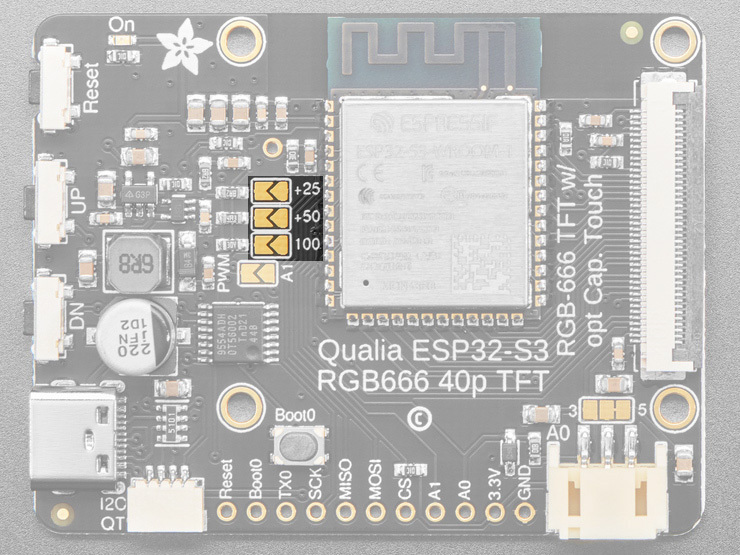
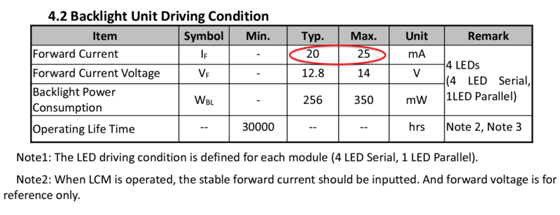
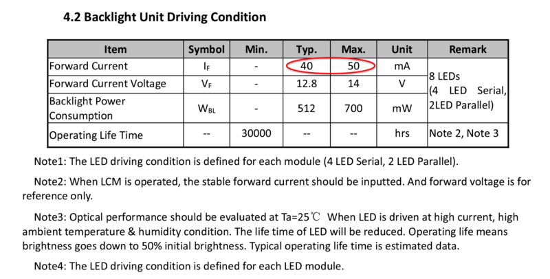
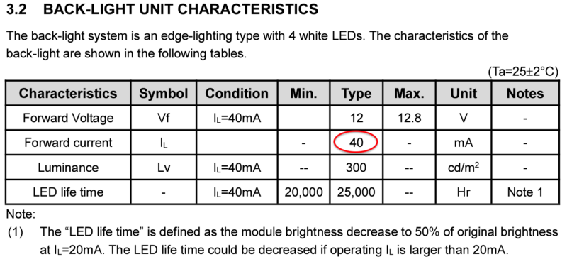

<!-- source: https://learn.adafruit.com/adafruit-qualia-esp32-s3-for-rgb666-displays/backlight-settings | fetched: 2026-09-23 -->
# Backlight Settings | Adafruit Qualia ESP32-S3 for RGB-666 Displays | Adafruit Learning System

33

Intermediate

Product guide

## Backlight Settings

The default backlight setting for the Qualia ESP32-S3 is set to 25mA, which is a safe value and won't overload the display.

If you would like to make it brighter for your project, this can be increased by bridging the solderable jumpers on the front of the board. There are 3 jumpers, which are additive, labeled +25, +50, and +100. Added to the base 25mA, this means it can be set to a maximum of 200mA.

 

Keep in mind that it is possible to overload the display, so you will want to refer to the display spec sheet for the display you are using, which can be found on the corresponding display's product page near the bottom. Here's are a few spec sheet examples. You'll want to look for a table similar to the following:

 

In this case, you will notice that the typical forward current is 20mA, but has a maximum current of 25mA. You will want to leave the display at the default 25mA in this case.

 

For the above display, you will notice that the typical is **40mA**, but has a maximum of **50mA**. You could increase the backlight current to 50mA by bridging the +25 jumper to add 25mA to the 25mA base current.

 

In this spec sheet, you'll notice that it is expecting 40mA, but there is no maximum set. Extrapolating off the previous example, you could also go up to 50mA for that display.

## Display Settings

Here are the maximum backlight settings for the [displays carried in the Adafruit shop](https://www.adafruit.com/search?q=RGB+TTL+Display).

### Round Displays

[2.1" 480x480 Round Display (Touchscreen)](https://www.adafruit.com/product/5792) - **25mA**

[2.1" 480x480 Round Display (No Touchscreen)](https://www.adafruit.com/product/5806) - **25mA**

**[2.8" 480x480 Round Display](https://www.adafruit.com/product/5852)**- **100mA**

[4.0" 720x720 Round Display](https://www.adafruit.com/product/5793) - **50mA**

### Square Displays

[3.4" 480x480 Square Display (Touchscreen)](https://www.adafruit.com/product/5808) - **50mA**

[3.4" 480x480 Square Display (No touchscreen)](https://www.adafruit.com/product/5825) - **50mA**

**[4.0" 480x480 Square Display](https://www.adafruit.com/product/5827)**- **25mA**

[4.0" 720x720 Square Display (Touchscreen)](https://www.adafruit.com/product/5794) - **50mA**

[4.0" 720x720 Square Display (No touchscreen)](https://www.adafruit.com/product/5795) - **50mA**

### Bar Displays

[3.2" 320x820 Bar Display (Touchscreen)](https://www.adafruit.com/product/5797) - **25mA**

[3.2" 320x820 Bar Display (No touchscreen)](https://www.adafruit.com/product/5828) - **25mA**

[3.7" 240x960 Bar Display](https://www.adafruit.com/product/5799) - **25mA**

[4.58" 320x960 Bar Display](https://www.adafruit.com/product/5805)  - **50mA**

Page last edited March 08, 2024

Text editor powered by [tinymce](https://www.tiny.cloud/).

[Determining Timings](https://learn.adafruit.com/adafruit-qualia-esp32-s3-for-rgb666-displays/determining-timings) [Deep Sleep](https://learn.adafruit.com/adafruit-qualia-esp32-s3-for-rgb666-displays/deep-sleep)
