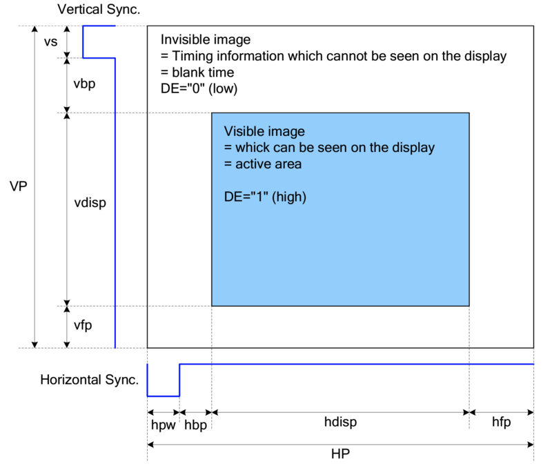
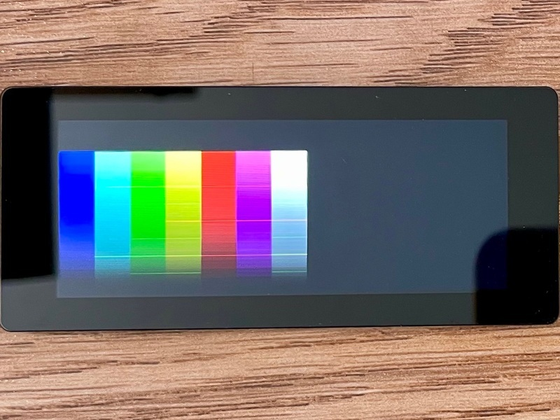
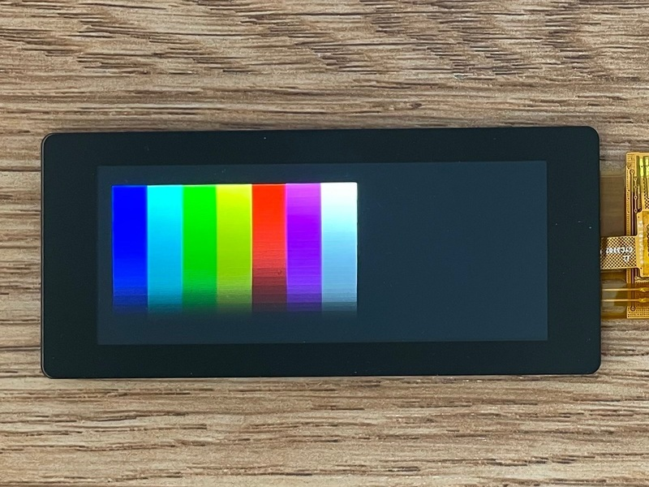

<!-- source: https://learn.adafruit.com/adafruit-qualia-esp32-s3-for-rgb666-displays/determining-timings | fetched: 2026-09-23 -->
# Determining Timings | Adafruit Qualia ESP32-S3 for RGB-666 Displays | Adafruit Learning System

33

Intermediate

Product guide

## Determining Timings

If you have your own RGB-666 display, you may wish to use it with the Qualia ESP32-S3. The main pieces of information that you will need to find are:

- Display Width
- Display Height
- Horizontal and Vertical:
  - Sync Pulse Width in milliseconds
  - Front Porch in milliseconds
  - Back Porch in milliseconds

Pieces of Information that are helpful, but can be determined by trial and error include:

- Frequency of the Display Clock
- Signal Polarities for the following:
  - Horizontal Idle
  - Vertical Idle
  - Data Enable Idle
  - Pixel Clock Active
  - Pixel Clock Idle

Text emphasized with a yellow exclamation: 
Some displays ignore many of the timing settings and use ones set through the init codes.

## Using a Data Sheet

The one of the best places to start looking for this information is the data sheet for the display. Data sheets may contain a diagram that will give you most of those values:

[](https://learn.adafruit.com/assets/125347) 

For the display width and height, these are in pixels and should be easy to find.

In the above diagram, you can see for instance the HP (or **Horizontal Period**) split up into `hpw` (or **Horizontal Sync Pulse Width**), `hbp` (or **Horizontal Back Porch**), `hdisp` (or **Horizontal Display**, which is the visible area), and `hfp` (or **Horizontal Front Porch**). For the vertical, this is the same except `vs` is used for the **Vertical Sync Pulse Width**.

When a display is drawn, the horizontal and vertical periods are split up into these sections. The Sync Pulse Widths are used by the display to keep everything in sync and the Front and Back Porch are blanking periods and are carried over from VGA when CRTs (or Cathode Ray Tubes) were used to give a little extra time for signals to synchronize or allow the electron beam to move to a different place.

While many data sheets will explicitly give you these values, occasionally you may be given values such as the total period time, one of the porch values and the timing of the display data, which you can use to calculate any missing values, which is why it's important to understand how the timings are used.

You can also use the diagram to figure out the Horizontal and Vertical Idle Polarity by looking at the lines underneath and to the left. In the case of the above diagram, both of the signals have a high idle state, which is the part of the signal where it is out of the sync pulse phase.

## Fill in the Settings

For the timings in CircuitPython, a dictionary is used. You can use the following code as a template and you will want to replace anywhere you see `[Number]` with the actual numerical value and anywhere you see `[True/False]` with a boolean value.

[Download File](https://learn.adafruit.com/elements/3157085/download)

[Copy Code](https://learn.adafruit.com/adafruit-qualia-esp32-s3-for-rgb666-displays/determining-timings)

```
tft_timings = {
    "frequency": [Number],
    "width": [Number],
    "height": [Number],

    "hsync_pulse_width": [Number],
    "hsync_back_porch": [Number],
    "hsync_front_porch": [Number],
    "hsync_idle_low": [True/False],

    "vsync_pulse_width": [Number],
    "vsync_back_porch": [Number],
    "vsync_front_porch": [Number],
    "vsync_idle_low": [True/False],

    "pclk_active_high": [True/False],
    "pclk_idle_high": [True/False],
    "de_idle_high": [True/False],
}
```

```
1
2
3
4
5
6
7
8
9
10
11
12
13
14
15
16
17
18
19
```

```python
tft_timings = {
    "frequency": [Number],
    "width": [Number],
    "height": [Number],

    "hsync_pulse_width": [Number],
    "hsync_back_porch": [Number],
    "hsync_front_porch": [Number],
    "hsync_idle_low": [True/False],

    "vsync_pulse_width": [Number],
    "vsync_back_porch": [Number],
    "vsync_front_porch": [Number],
    "vsync_idle_low": [True/False],

    "pclk_active_high": [True/False],
    "pclk_idle_high": [True/False],
    "de_idle_high": [True/False],
}
```

## Experimenting with Settings

To get the remainder of the settings, you may need to experiment a bit. You can take a look at some of the other displays that are similar to get a good starting point. From there, start making adjustments until you get an image that looks correct. If you notice that any changes you are making seem to have little effect, then it is likely using settings from the init codes. In this case, you may need to consult the data sheet for the controller and figure out which code is causing issues. You also may try getting the init codes from different sources and see which ones work the best.

## Testing your Settings with CircuitPython

So you are at a point where everything seems correct, it's time to test that it all looks good. If the settings are off just a bit, you may notice certain colors look a bit glitchy and you will need to continue experimenting with the settings to fix it. You can fill in your timing settings and run this script to test that everything looks good:

[Download File](https://learn.adafruit.com/elements/3157079/download)

[Copy Code](https://learn.adafruit.com/adafruit-qualia-esp32-s3-for-rgb666-displays/determining-timings)

```
from displayio import release_displays
release_displays()

import random
import displayio
import time
import busio
import board
import dotclockframebuffer
from framebufferio import FramebufferDisplay

init_code = bytes((...))

board.I2C().deinit()
i2c = busio.I2C(board.SCL, board.SDA) #, frequency=400_000)
tft_io_expander = dict(board.TFT_IO_EXPANDER)
dotclockframebuffer.ioexpander_send_init_sequence(i2c, init_code, **tft_io_expander)
i2c.deinit()

tft_pins = dict(board.TFT_PINS)

tft_timings = {...}

bitmap = displayio.Bitmap(256, 7*64, 65535)
fb = dotclockframebuffer.DotClockFramebuffer(**tft_pins, **tft_timings)
display = FramebufferDisplay(fb, auto_refresh=False)

# Create a TileGrid to hold the bitmap
tile_grid = displayio.TileGrid(bitmap, pixel_shader=displayio.ColorConverter(input_colorspace=displayio.Colorspace.RGB565))

# Create a Group to hold the TileGrid
group = displayio.Group()

# Add the TileGrid to the Group
group.append(tile_grid)

# Add the Group to the Display
display.root_group = group

display.auto_refresh = True

for i in range(256):
    b = i >> 3
    g = (i >> 2) << 5
    r = b << 11
    for j in range(64):
        bitmap[i, j] = b
        bitmap[i, j+64] = b|g
        bitmap[i, j+128] = g
        bitmap[i, j+192] = g|r
        bitmap[i, j+256] = r
        bitmap[i, j+320] = r|b
        bitmap[i, j+384] = r|g|b

# Loop forever so you can enjoy your image
while True:
    time.sleep(1)
    display.auto_refresh = False
    group.x = random.randint(0, 32)
    group.y = random.randint(0, 32)
    display.auto_refresh = True
    pass
```

```
1
2
3
4
5
6
7
8
9
10
11
12
13
14
15
16
17
18
19
20
21
22
23
24
25
26
27
28
29
30
31
32
33
34
35
36
37
38
39
40
41
42
43
44
45
46
47
48
49
50
51
52
53
54
55
56
57
58
59
60
61
62
```

```python
from displayio import release_displays
release_displays()

import random
import displayio
import time
import busio
import board
import dotclockframebuffer
from framebufferio import FramebufferDisplay

init_code = bytes((...))

board.I2C().deinit()
i2c = busio.I2C(board.SCL, board.SDA) #, frequency=400_000)
tft_io_expander = dict(board.TFT_IO_EXPANDER)
dotclockframebuffer.ioexpander_send_init_sequence(i2c, init_code, **tft_io_expander)
i2c.deinit()

tft_pins = dict(board.TFT_PINS)

tft_timings = {...}

bitmap = displayio.Bitmap(256, 7*64, 65535)
fb = dotclockframebuffer.DotClockFramebuffer(**tft_pins, **tft_timings)
display = FramebufferDisplay(fb, auto_refresh=False)

# Create a TileGrid to hold the bitmap
tile_grid = displayio.TileGrid(bitmap, pixel_shader=displayio.ColorConverter(input_colorspace=displayio.Colorspace.RGB565))

# Create a Group to hold the TileGrid
group = displayio.Group()

# Add the TileGrid to the Group
group.append(tile_grid)

# Add the Group to the Display
display.root_group = group

display.auto_refresh = True

for i in range(256):
    b = i >> 3
    g = (i >> 2) << 5
    r = b << 11
    for j in range(64):
        bitmap[i, j] = b
        bitmap[i, j+64] = b|g
        bitmap[i, j+128] = g
        bitmap[i, j+192] = g|r
        bitmap[i, j+256] = r
        bitmap[i, j+320] = r|b
        bitmap[i, j+384] = r|g|b

# Loop forever so you can enjoy your image
while True:
    time.sleep(1)
    display.auto_refresh = False
    group.x = random.randint(0, 32)
    group.y = random.randint(0, 32)
    display.auto_refresh = True
    pass
```

Show all 62 lines

If your settings are slightly off, it may look like the following:

[](https://learn.adafruit.com/assets/125454) 

Once everything is set correctly, the above image should look like this:

[](https://learn.adafruit.com/assets/125455)

Page last edited March 08, 2024

Text editor powered by [tinymce](https://www.tiny.cloud/).

[Converting Arduino\_GFX init strings to CircuitPython](https://learn.adafruit.com/adafruit-qualia-esp32-s3-for-rgb666-displays/convert-arduino-gfx-init-strings-to-circuitpython) [Backlight Settings](https://learn.adafruit.com/adafruit-qualia-esp32-s3-for-rgb666-displays/backlight-settings)
