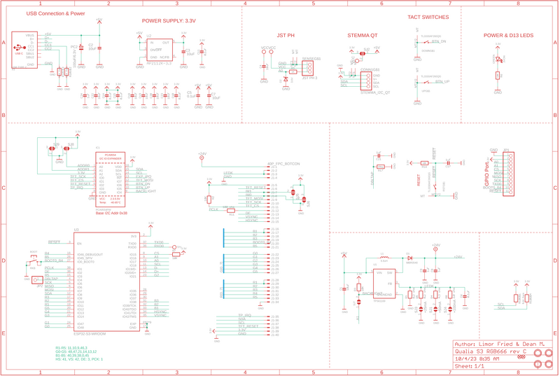
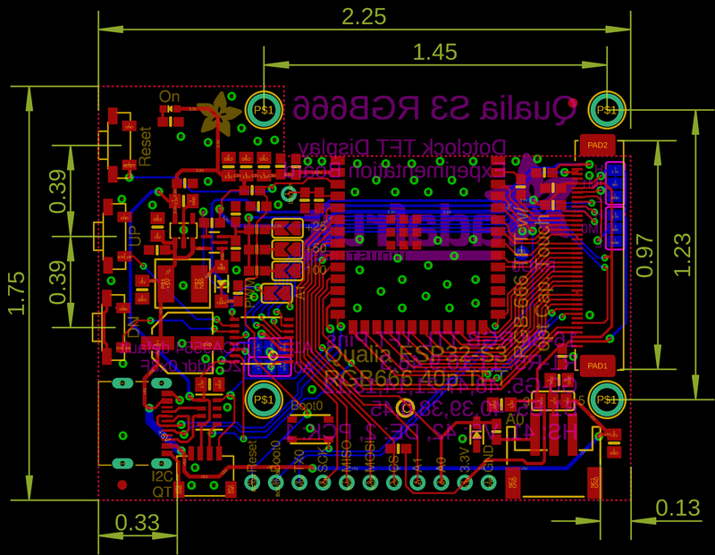

<!-- source: https://learn.adafruit.com/adafruit-qualia-esp32-s3-for-rgb666-displays/downloads | fetched: 2026-09-22 -->
# Downloads | Adafruit Qualia ESP32-S3 for RGB-666 Displays | Adafruit Learning System

33

Intermediate

Product guide

## Downloads

- [ESP32-S3 product page with resources](https://www.espressif.com/en/products/socs/esp32-s3)
- [ESP32-S3 datasheet](https://cdn-learn.adafruit.com/assets/assets/000/110/711/original/esp32-s3_datasheet_en.pdf?1649790878)
- [ESP32-S3 Technical Reference](https://cdn-learn.adafruit.com/assets/assets/000/110/710/original/esp32-s3_technical_reference_manual_en.pdf?1649790877)
- [ST7701 datasheet](https://cdn-shop.adafruit.com/product-files/5795/ST7701+Datasheet.pdf)
- [NV3052C datasheet](https://cdn-shop.adafruit.com/product-files/5793/NV3052C-Datasheet-V0.2.pdf)
- [3D models on GitHub](https://github.com/adafruit/Adafruit_CAD_Parts/tree/main/5800%20Qualia%20ESP32-S3)
- [Qualia ESP32-S3 RGB-666 EagleCAD PCB files on GitHub](https://github.com/adafruit/Adafruit-Qualia-S3-RGB666-PCB)
- [Qualia ESP32-S3 RGB-666 Fritzing object in the Adafruit Fritzing Library](https://github.com/adafruit/Fritzing-Library/raw/master/parts/Adafruit%20Qualia%20S3%20RGB666.fzpz)

## Schematic

 

## Fab Print

Page last edited March 08, 2024

Text editor powered by [tinymce](https://www.tiny.cloud/).

[Factory Reset](https://learn.adafruit.com/adafruit-qualia-esp32-s3-for-rgb666-displays/factory-reset)
