<!-- source: https://learn.adafruit.com/adafruit-qualia-esp32-s3-for-rgb666-displays/pinouts | fetched: 2026-09-23 -->
# Pinouts | Adafruit Qualia ESP32-S3 for RGB-666 Displays | Adafruit Learning System

33

Intermediate

Product guide

## Pinouts

[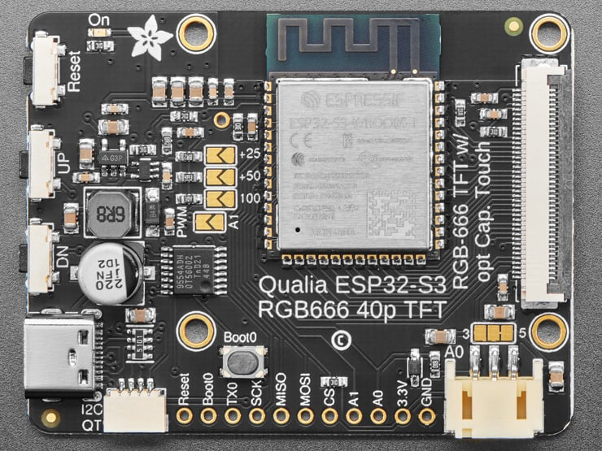](https://learn.adafruit.com/assets/124795) 

## Microcontroller and WiFi

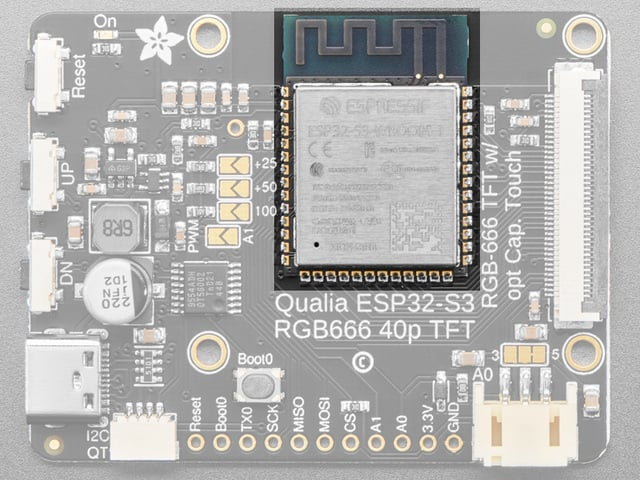

The main processor chip is the **Espressif****ESP32-S3** with 3.3v logic/power. It has **16MB** of Flash and **8MB** of RAM.

The ESP32-S3 comes with WiFi and Bluetooth LE baked right in, though CircuitPython only supports WiFi at this time, not BLE on the S3 chip

## 40-Pin Display Connector

Text emphasized with a red exclamation: 
Not all 40-pin displays have the power pins in the same place. Hooking up a non RGB666 display with the Qualia S3 risks damaging the display.

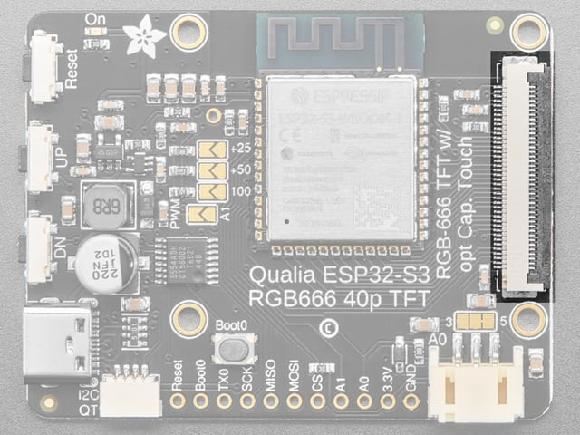

There is a 40-pin display connector to connect your display. Displays should be connected with the metal pins of the cable facing towards the board. Pin 1 should be furthest from the JST connector.

## IO Expander

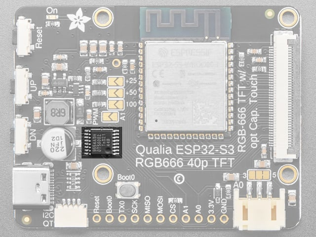

The Qualia S3 includes a **PCA9554A IO Expander**. The IO Expander is connected via the I2C bus. The main purpose of the expander is to add additional pins to communicate with the display.

The default address of the IO expander is **0x3F**, but it can be changed by soldering jumpers on the reverse side in case it interferes with another I2C device.

## Stemma QT Connector

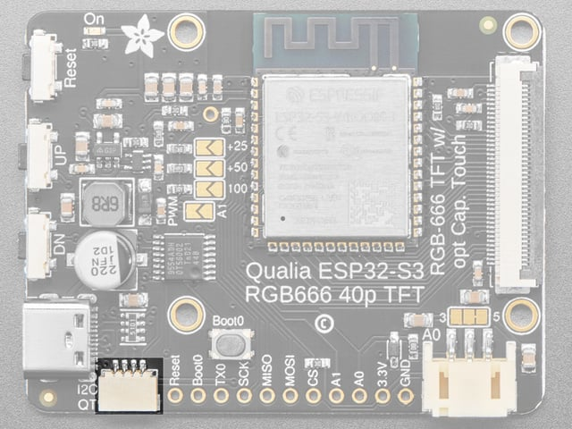

There is a 4-pin **Stemma QT connector** on the left. The I2C has pullups to 3.3V power.

In CircuitPython, you can use the STEMMA connector with `board.SCL` and `board.SDA`, or `board.STEMMA_I2C()`.

## Reset and Boot0 Pins

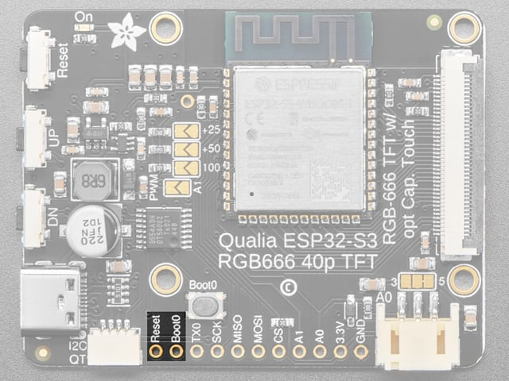

**Reset** is the Reset pin. Tie to ground to manually reset the ESP32-S3.

Tying **Boot0** to ground while resetting will place the ESP32-S3 in ROM bootloader mode.

## Debug Pin

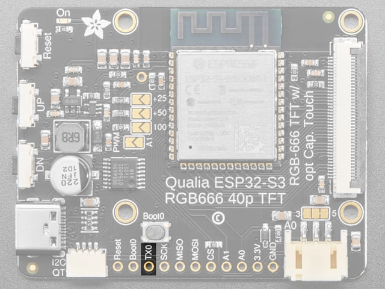

If you'd like to do lower level debugging, we have the ESP32-S3's TXD0 debug pin exposed as **TX0** to view messages.

To read, you would connect a Serial UART cable Receive connection here and the cable ground connection to the GND pin.

## SPI Pins

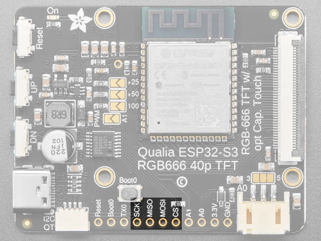

The SPI pins of the ESP32-S3 are exposed for communication with other SPI hardware.

Each of these pins can alternatively be used for digital I/O:

- **SCK** is connected to `board.SCK` or Arduino `5`.
- **MISO** is connected to `board.MISO` or Arduino `6`.
- **MOSI** is connected to `board.MOSI` or Arduino `7`.
- **CS** is connected to `board.CS` or Arduino `15` and includes a 10K Pull-up resistor.

## Analog Connector/Pins

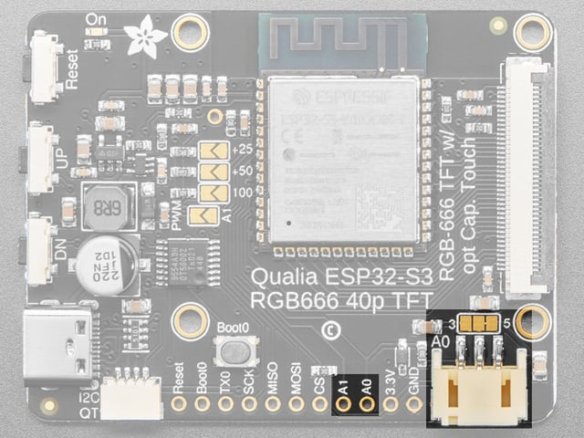

On the bottom side towards the right, there is a connector labeled **A0**. This is a **3-pin JST analog connector** for sensors, NeoPixels, or analog input or digital I/O.

For the JST connected, there is a jumper above that can be cut and soldered to use **3V** instead of **5V**.

Along the bottom there are also pins labeled `A0` and `A1`.

Each of these pins can be used for analog inputs or digital I/O.

## Buttons

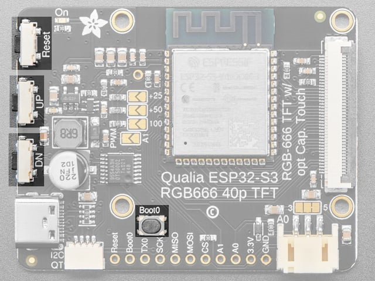

There are three buttons along the left side of the Qualia S3.

The **R****eset button**is located in the top position. Click it once to re-start your firmware. Click it again after about a half second to enter bootloader mode.

The **UP button** is located in the middle and is connected to the IO expander

The **DN button,** or Down button, is located on the bottom and is connected to the IO expander.

The expander implements a light pullup for each of the buttons and pressing either of them pulls the input low.

The **Boot0 button** is located between the up button and the Microcontroller. Hold it while pressing reset to enter ROM Bootloader mode.

## Backlight Jumpers

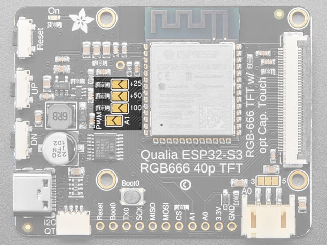

Soldering the bottom PWM jumper allows using Pin `A1` to control the backlight of the display.

By default, **25mA** is provided to the backlight, but additional amperage can be set by soldering the top jumpers to provide up to **200mA** if needed.

## IO Expander Address Jumpers

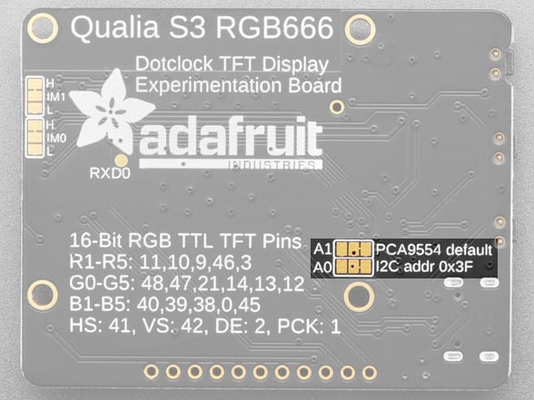

On the reverse, are a couple of solderable jumpers to change the I2C address of the IO Expander. By default, both jumpers are set to high, providing a default address of **0x3F**. However, it can be set between **0x3B**-**0x3F**.

## Parallel Interface Jumpers

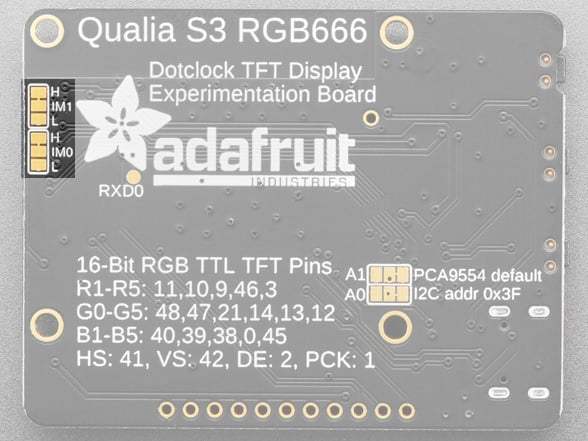

The IM0 and IM1 jumpers are for selecting the mode of the parallel interface for the display. The default selection should work for most displays.

Page last edited June 04, 2025

Text editor powered by [tinymce](https://www.tiny.cloud/).

[Overview](https://learn.adafruit.com/adafruit-qualia-esp32-s3-for-rgb666-displays/overview) [CircuitPython](https://learn.adafruit.com/adafruit-qualia-esp32-s3-for-rgb666-displays/circuitpython-5)
