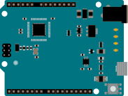

<!-- source: https://docs.arduino.cc/hardware/leonardo/ | fetched: 2026-09-22 -->
# https://docs.arduino.cc/hardware/leonardo/

[Go Back](https://docs.arduino.cc/hardware/)

Leonardo

##### VENTUNO

##### MKR Family

##### UNO Family

##### Nano Family

##### Portenta Family

##### Pro Solutions and Kits

##### Nicla Family

##### Opta

##### Education

##### Kits

##### Mega

##### Modulino

##### Classic

###### Boards

[Leonardo](https://docs.arduino.cc/hardware/leonardo)[Micro](https://docs.arduino.cc/hardware/micro)[Yún Rev2](https://docs.arduino.cc/hardware/yun-rev2)[Zero](https://docs.arduino.cc/hardware/zero)

##### Accessories

# Leonardo

The Leonardo differs from all preceding boards in that the ATmega32u4 has built-in USB communication, eliminating the need for a secondary processor. This allows the Leonardo to appear to a connected computer as a mouse and keyboard, in addition to a virtual (CDC) serial / COM port.

[Get Started](https://docs.arduino.cc/software/ide-v2/tutorials/ide-v2-board-manager)

Interactive Viewer

Pinout

[Buy now](https://store.arduino.cc/arduino-leonardo-with-headers)

## Downloadable resources

[Pinout (PDF)](https://docs.arduino.cc/resources/pinouts/A000057-full-pinout.pdf)[Schematics](https://docs.arduino.cc/resources/schematics/A000057-schematics.pdf)[CAD Files](https://docs.arduino.cc/static/fd50e8f3be44a3217bbfd5d123295bdf/A000057-cad-files.zip)

Features

Tech Specs

Compatibility

Suggested Libraries

The Arduino Leonardo is a microcontroller board based on the ATmega32u4. It has 20 digital input/output pins (of which 7 can be used as PWM outputs and 12 as analog inputs), a 16 MHz crystal oscillator, a micro USB connection, a power jack, an ICSP header, and a reset button. It contains everything needed to support the microcontroller; simply connect it to a computer with a USB cable or power it with a AC-to-DC adapter or battery to get started.

USB communication

The Arduino Leonardo has built-in USB communication that allows the Micro to appear as a mouse/keyboard on your machine.

[Keyboard Library](https://www.arduino.cc/reference/en/language/functions/usb/keyboard/)

[Mouse Library](https://www.arduino.cc/reference/en/language/functions/usb/mouse/)

Battery Connector

The Arduino Leonardo features a barrel plug connector, that works great with a standard 9V battery to give extra power to your projects.

#### Certifications

UKCA (with or without headers)CE (with or without headers)

#### Connect and Contribute

[Project Hub](https://projecthub.arduino.cc/?value=Leonardo)[GitHub Repository](https://github.com/arduino/docs-content)[Forum](https://forum.arduino.cc/c/hardware/12)

[Product Compliance](https://docs.arduino.cc/certifications/)[Help Center](https://support.arduino.cc/hc/en-us/articles/9264736457500-Hardware-Support)[Trademarks & Licensing](https://www.arduino.cc/en/trademark/)

#### Was this article helpful?
