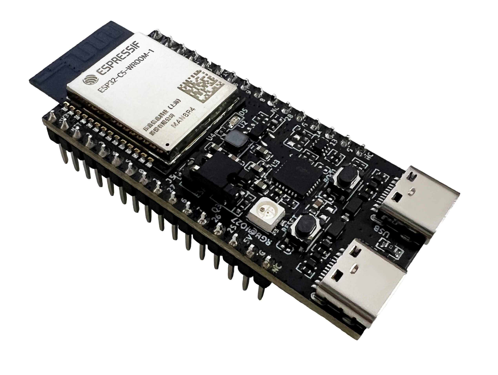
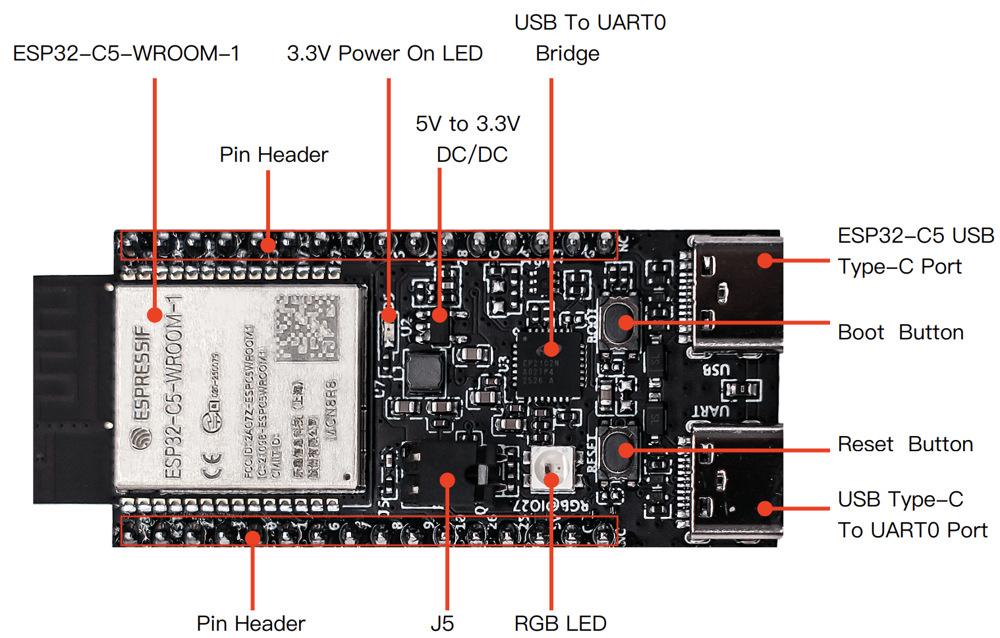
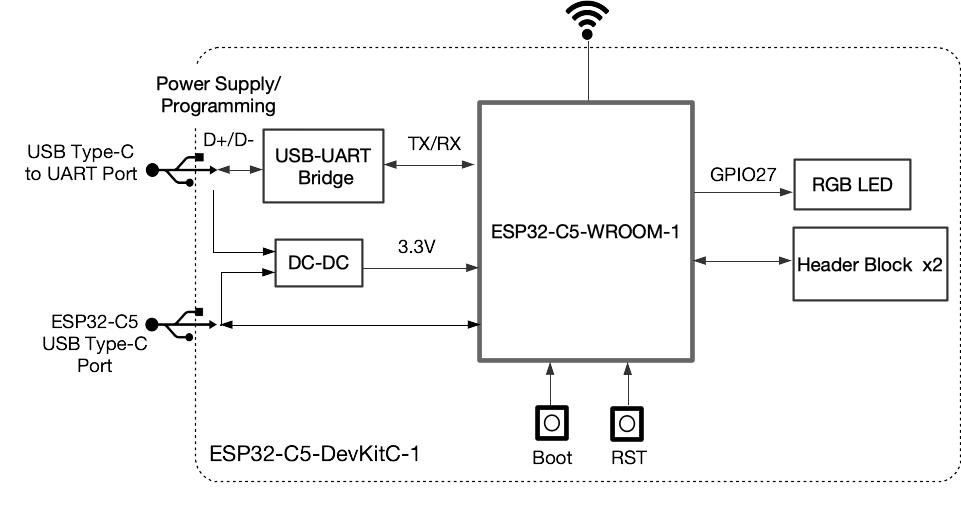
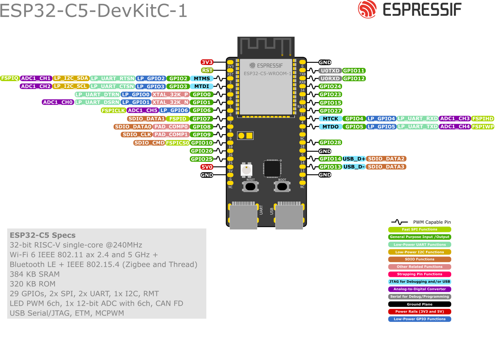

<!-- source: https://docs.espressif.com/projects/esp-dev-kits/en/latest/esp32c5/esp32-c5-devkitc-1/user_guide.html | fetched: 2026-09-22 -->
# ESP32-C5-DevKitC-1 v1.2 - ESP32-C5 -  — esp-dev-kits latest documentation

# ESP32-C5-DevKitC-1 v1.2

[[中文]](https://docs.espressif.com/projects/esp-dev-kits/zh_CN/latest/esp32c5/esp32-c5-devkitc-1/user_guide.html)

Older version: [ESP32-C5-DevKitC-1 v1.1](https://docs.espressif.com/projects/esp-dev-kits/en/latest/esp32c5/esp32-c5-devkitc-1/user_guide_v1.1.html)

This user guide will help you get started with ESP32-C5-DevKitC-1 and will also provide more in-depth information.

The ESP32-C5-DevKitC-1 is an entry-level development board based on the general-purpose module [ESP32-C5-WROOM-1(U)](https://www.espressif.com/sites/default/files/documentation/esp32-c5-wroom-1_wroom-1u_datasheet_en.pdf). This board integrates complete Wi-Fi, Bluetooth (LE), Zigbee, and Thread functions.

Most of the I/O pins are broken out to the pin headers on both sides for easy interfacing. Developers can either connect peripherals with jumper wires or mount ESP32-C5-DevKitC-1 on a breadboard.

ESP32-C5-DevKitC-1

The document consists of the following major sections:

- [Getting Started](https://docs.espressif.com/projects/esp-dev-kits/en/latest/esp32c5/esp32-c5-devkitc-1/user_guide.html): Overview of ESP32-C5-DevKitC-1 and hardware/software setup instructions to get started.
- [Hardware Reference](https://docs.espressif.com/projects/esp-dev-kits/en/latest/esp32c5/esp32-c5-devkitc-1/user_guide.html): More detailed information about the ESP32-C5-DevKitC-1’s hardware.
- [Hardware Revision Details](https://docs.espressif.com/projects/esp-dev-kits/en/latest/esp32c5/esp32-c5-devkitc-1/user_guide.html): Information about revision history, known issues, and links to user guides for previous versions (if any).
- [Related Documents](https://docs.espressif.com/projects/esp-dev-kits/en/latest/esp32c5/esp32-c5-devkitc-1/user_guide.html): Links to related documentation.
- [Disclaimer and Copyright Notice](https://docs.espressif.com/projects/esp-dev-kits/en/latest/esp32c5/esp32-c5-devkitc-1/user_guide.html): Link to the disclaimer and copyright notice.

## Getting Started

This section provides a brief introduction to ESP32-C5-DevKitC-1, introducing how to perform the initial hardware setup and how to flash firmware onto the board.

### Description of Components

ESP32-C5-DevKitC-1 - front

The following list psrovides a description of the key components on the board in a clockwise direction.

| Key Component | Description |
| --- | --- |
| ESP32-C5-WROOM-1(U) | ESP32-C5-WROOM-1(U) is a general-purpose module supporting Wi-Fi 6 in 2.4 & 5 GHz dual-band (802.11ax), Bluetooth® 5 (LE), Zigbee, and Thread (802.15.4) with on-board PCB antenna. |
| Pin Header | All available GPIO pins (except for the SPI bus for flash) are broken out to the pin headers on the board. |
| 5 V to 3.3 V DC/DC | Power regulator that converts a 5 V supply into a 3.3 V output. |
| 3.3 V Power On LED | Turns on when the the board is connected to USB power. |
| USB-to-UART Bridge | Single-chip USB-to-UART bridge offering transfer rate up to 3 Mbps. |
| ESP32-C5 USB Type-C Port | The USB Type-C port on the ESP32-C5 chip supports USB 2.0 full speed, with a data transfer rate of up to 12 Mbps. Note that this port does not support the 480 Mbps high-speed transfer mode. This port is used for power supply to the board, flashing applications to the chip, and communication with the chip via USB protocols, as well as for JTAG debugging. |
| Boot Button | Download button. Holding down **Boot** and then pressing **Reset** initiates Firmware Download mode for downloading firmware through the serial port. |
| Reset Button | Press this button to restart the system. |
| USB Type-C to UART Port | Used for power supply to the board, flashing applications to the chip, as well as communication with chip ESP32-C5 via the on-board USB-to-UART bridge. |
| RGB LED | Addressable RGB LED, driven by GPIO27. |
| J5 | Used for current measurement. See details in Section [Current Measurement](https://docs.espressif.com/projects/esp-dev-kits/en/latest/esp32c5/esp32-c5-devkitc-1/user_guide.html). |

### Start Application Development

Before powering up your ESP32-C5-DevKitC-1, please make sure that it is in good condition with no obvious sign of damage.

#### Required Hardware

- ESP32-C5-DevKitC-1
- USB-A to USB-C cable
- Computer running Windows, Linux, or macOS

Note

Be sure to use a good quality USB cable. Some cables are for charging only and do not provide the needed data lines nor work for programming the boards.

#### Software Setup

Please proceed to [ESP-IDF Get Started](https://docs.espressif.com/projects/esp-idf/en/latest/esp32c5/get-started/index.html), which will help you set up the development environment quickly and then flash an application example onto your board.

### Contents and Packaging

#### Retail orders

If you order a few samples, each ESP32-C5-DevKitC-1 comes in an individual package in either an antistatic bag or any other packaging depending on your retailer.

For retail orders, please go to <https://www.espressif.com/en/company/contact/buy-a-sample>.

#### Wholesale Orders

If you order in bulk, the boards come in large cardboard boxes.

For wholesale orders, please go to <https://www.espressif.com/en/contact-us/sales-questions>.

## Hardware Reference

### Block Diagram

The block diagram below shows the components of ESP32-5-DevKitC-1 and their interconnections.

ESP32-C5-DevKitC-1 (click to enlarge)

### Power Supply Options

There are three mutually exclusive ways to provide power to the board:

- USB Type-C to UART port and ESP32-C5 USB Type-C port (either one or both), default power supply (recommended)
- 5V and GND pin headers
- 3V3 and GND pin headers

### Current Measurement

The J5 headers on ESP32-C5-DevKitC-1 (see J5 in Figure [ESP32-C5-DevKitC-1 - front](https://docs.espressif.com/projects/esp-dev-kits/en/latest/esp32c5/esp32-c5-devkitc-1/user_guide.html)) can be used for measuring the current drawn by the ESP32-C5-WROOM-1(U) module:

- Remove the jumper: Power supply between the module and peripherals on the board is cut off. To measure the module’s current, connect the board with an ammeter via J5 headers.
- Apply the jumper (factory default): Restore the board’s normal functionality.

Note

When using 3V3 and GND pin headers to power the board, please remove the J5 jumper, and connect an ammeter in series between the external power supply and the 3V3 pin header to measure the module’s current. This is because the 3V3 pin header supplies power directly to the module, bypassing the J5 headers. Removing the J5 jumper disconnects unnecessary circuits, allowing for a more accurate measurement of the module’s current.

### Header Block

The two tables below provide the **Name** and **Function** of the pin headers on both sides of the board (J1 and J3). The pin header names are shown in Figure [ESP32-C5-DevKitC-1 - front](https://docs.espressif.com/projects/esp-dev-kits/en/latest/esp32c5/esp32-c5-devkitc-1/user_guide.html). The numbering is the same as in the [ESP32-C5-DevKitC-1 Schematic v1.2](https://dl.espressif.com/dl/schematics/SCH_ESP32-C5-DevkitC-1_V1.2_20250211.pdf) (PDF).

#### J1

| No. | Name | Type [[1]](https://docs.espressif.com/projects/esp-dev-kits/en/latest/esp32c5/esp32-c5-devkitc-1/user_guide.html) | Function |
| --- | --- | --- | --- |
| 1 | 3V3 | P | 3.3 V power supply |
| 2 | RST | I | High: enables the chip; Low: disables the chip. |
| 3 | 2 | I/O/T | MTMS [[3]](https://docs.espressif.com/projects/esp-dev-kits/en/latest/esp32c5/esp32-c5-devkitc-1/user_guide.html), GPIO2, LP\_GPIO2, LP\_UART\_RTSN, LP\_I2C\_SDA, ADC1\_CH1, FSPIQ |
| 4 | 3 | I/O/T | MTDI [[3]](https://docs.espressif.com/projects/esp-dev-kits/en/latest/esp32c5/esp32-c5-devkitc-1/user_guide.html), GPIO3, LP\_GPIO3, LP\_UART\_CTSN, LP\_I2C\_SCL, ADC1\_CH2 |
| 5 | 0 | I/O/T | GPIO0, XTAL\_32K\_P, LP\_GPIO0, LP\_UART\_DTRN |
| 6 | 1 | I/O/T | GPIO1, XTAL\_32K\_N, LP\_GPIO1, LP\_UART\_DSRN, ADC1\_CH0 |
| 7 | 6 | I/O/T | GPIO6, LP\_GPIO6, ADC1\_CH5, FSPICLK |
| 8 | 7 | I/O/T | GPIO7 [[3]](https://docs.espressif.com/projects/esp-dev-kits/en/latest/esp32c5/esp32-c5-devkitc-1/user_guide.html), FSPID, SDIO\_DATA1 |
| 9 | 8 | I/O/T | GPIO8, PAD\_COMP0, SDIO\_DATA0 |
| 10 | 9 | I/O/T | GPIO9, PAD\_COMP1, SDIO\_CLK |
| 11 | 10 | I/O/T | GPIO10, FSPICS0, SDIO\_CMD |
| 12 | 26 | I/O/T | GPIO26 [[3]](https://docs.espressif.com/projects/esp-dev-kits/en/latest/esp32c5/esp32-c5-devkitc-1/user_guide.html), |
| 13 | 25 | I/O/T | GPIO25 [[3]](https://docs.espressif.com/projects/esp-dev-kits/en/latest/esp32c5/esp32-c5-devkitc-1/user_guide.html), |
| 14 | 5V | P | 5 V power supply |
| 15 | G | G | Ground |
| 16 | NC | – | No connection |

#### J3

| No. | Name | Type | Function |
| --- | --- | --- | --- |
| 1 | G | G | Ground |
| 2 | TX | I/O/T | U0TXD, GPIO11 |
| 3 | RX | I/O/T | U0RXD, GPIO12 |
| 4 | 24 | I/O/T | GPIO24 |
| 5 | 23 | I/O/T | GPIO23 |
| 6 | NC/15 | I/O/T | No connection/GPIO15 [[4]](https://docs.espressif.com/projects/esp-dev-kits/en/latest/esp32c5/esp32-c5-devkitc-1/user_guide.html) |
| 7 | 27 | I/O/T | GPIO27 [[2]](https://docs.espressif.com/projects/esp-dev-kits/en/latest/esp32c5/esp32-c5-devkitc-1/user_guide.html) [[3]](https://docs.espressif.com/projects/esp-dev-kits/en/latest/esp32c5/esp32-c5-devkitc-1/user_guide.html) |
| 8 | 4 | I/O/T | MTCK, GPIO4, LP\_GPIO4, LP\_UART\_RXD, ADC1\_CH3, FSPIHD |
| 9 | 5 | I/O/T | MTDO, GPIO5, LP\_GPIO5, LP\_UART\_TXD, ADC1\_CH4, FSPIWP |
| 10 | NC | – | No connection |
| 11 | 28 | I/O/T | GPIO28 [[3]](https://docs.espressif.com/projects/esp-dev-kits/en/latest/esp32c5/esp32-c5-devkitc-1/user_guide.html) |
| 12 | G | G | Ground |
| 13 | 14 | I/O/T | GPIO14, USB\_D+, SDIO\_DATA2 |
| 14 | 13 | I/O/T | GPIO13, USB\_D-, SDIO\_DATA3 |
| 15 | G | G | Ground |
| 16 | NC | – | No connection |

#### Pin Layout

ESP32-C5-DevKitC-1 Pin Layout (click to enlarge)

## Hardware Revision Details

### ESP32-C5-DevKitC-1 v1.2

For boards with the PW number of and after PW-2025-04-0446, J1 and J3 functions are updated. See details in Section [Header Block](https://docs.espressif.com/projects/esp-dev-kits/en/latest/esp32c5/esp32-c5-devkitc-1/user_guide.html).

Note

The PW number can be found in the product label on the large cardboard boxes for wholesale orders.

### ESP32-C5-DevKitC-1 v1.1

[Initial release](https://docs.espressif.com/projects/esp-dev-kits/en/latest/esp32c5/esp32-c5-devkitc-1/user_guide_v1.1.html)

## Related Documents

- [ESP32-C5 Datasheet](https://www.espressif.com/sites/default/files/documentation/esp32-c5_datasheet_en.pdf) (PDF)
- [ESP32-C5-WROOM-1 & ESP32-C5-WROOM-1U Datasheet](https://www.espressif.com/sites/default/files/documentation/esp32-c5-wroom-1_wroom-1u_datasheet_en.pdf) (PDF)
- [ESP32-C5-DevKitC-1 Schematic v1.2](https://dl.espressif.com/dl/schematics/SCH_ESP32-C5-DevkitC-1_V1.2_20250211.pdf) (PDF)
- [ESP32-C5-DevKitC-1 PCB Layout v1.2](https://dl.espressif.com/dl/schematics/PCB_ESP32-C5-DevKitC-1_V1.2_20250211.pdf) (PDF)
- [ESP32-C5-DevKitC-1 Dimensions v1.2](https://dl.espressif.com/dl/schematics/Dimension_esp32-c5-devkitc-1_v1.2_20250509.pdf) (PDF)
- [ESP32-C5-DevKitC-1 Dimensions v1.2 source file](https://dl.espressif.com/dl/schematics/Dimension_esp32-c5-devkitc-1_v1.2_20250509.dxf) (DXF) - You can view it with [Autodesk Viewer](https://viewer.autodesk.com/) online

For further design documentation for the board, please contact us at [sales@espressif.com](mailto:sales%40espressif.com).

## Disclaimer and Copyright Notice

See [Disclaimer and Copyright Notice](https://docs.espressif.com/projects/esp-dev-kits/en/latest/esp32c5/disclaimer-and-copyright.html).
