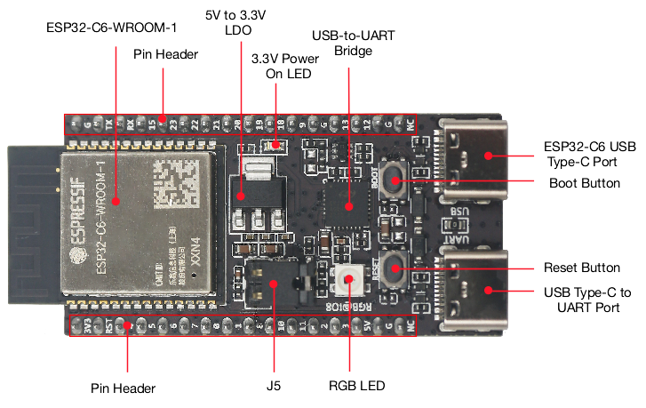
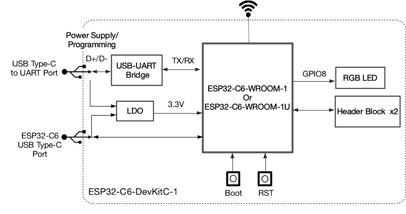
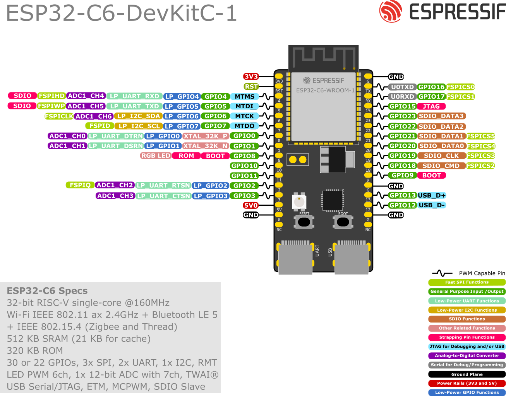

<!-- source: https://docs.espressif.com/projects/esp-dev-kits/en/latest/esp32c6/esp32-c6-devkitc-1/user_guide.html | fetched: 2026-09-23 -->
# ESP32-C6-DevKitC-1 v1.2 - ESP32-C6 -  — esp-dev-kits latest documentation

# ESP32-C6-DevKitC-1 v1.2

[[中文]](https://docs.espressif.com/projects/esp-dev-kits/zh_CN/latest/esp32c6/esp32-c6-devkitc-1/user_guide.html)

The older version: [ESP32-C6-DevKitC-1 v1.1](https://docs.espressif.com/projects/esp-dev-kits/en/latest/esp32c6/esp32-c6-devkitc-1/user_guide_v1.1.html)

This user guide will help you get started with ESP32-C6-DevKitC-1 and will also provide more in-depth information.

ESP32-C6-DevKitC-1 is an entry-level development board based on [ESP32-C6-WROOM-1(U)](https://www.espressif.com/sites/default/files/documentation/esp32-c6-wroom-1_wroom-1u_datasheet_en.pdf), a general-purpose module with a 8 MB SPI flash. This board integrates complete Wi-Fi, Bluetooth LE, Zigbee, and Thread functions.

Most of the I/O pins are broken out to the pin headers on both sides for easy interfacing. Developers can either connect peripherals with jumper wires or mount ESP32-C6-DevKitC-1 on a breadboard.

ESP32-C6-DevKitC-1

The document consists of the following major sections:

- [Getting Started](https://docs.espressif.com/projects/esp-dev-kits/en/latest/esp32c6/esp32-c6-devkitc-1/user_guide.html): Overview of ESP32-C6-DevKitC-1 and hardware/software setup instructions to get started.
- [Hardware Reference](https://docs.espressif.com/projects/esp-dev-kits/en/latest/esp32c6/esp32-c6-devkitc-1/user_guide.html): More detailed information about the ESP32-C6-DevKitC-1’s hardware.
- [Hardware Revision Details](https://docs.espressif.com/projects/esp-dev-kits/en/latest/esp32c6/esp32-c6-devkitc-1/user_guide.html): Revision history, known issues, and links to user guides for previous versions (if any) of ESP32-C6-DevKitC-1.
- [Related Documents](https://docs.espressif.com/projects/esp-dev-kits/en/latest/esp32c6/esp32-c6-devkitc-1/user_guide.html): Links to related documentation.
- [Disclaimer and Copyright Notice](https://docs.espressif.com/projects/esp-dev-kits/en/latest/esp32c6/esp32-c6-devkitc-1/user_guide.html): Link to the disclaimer and copyright notice.

## Getting Started

This section provides a brief introduction of ESP32-C6-DevKitC-1, instructions on how to do the initial hardware setup and how to flash firmware onto it.

### Description of Components

ESP32-C6-DevKitC-1 - front

The key components of the board are described in a clockwise direction.

| Key Component | Description |
| --- | --- |
| ESP32-C6-WROOM-1 or ESP32-C6-WROOM-1U | ESP32-C6-WROOM-1 and ESP32-C6-WROOM-1U are general-purpose modules supporting Wi-Fi 6 in 2.4 GHz band, Bluetooth 5, and IEEE 802.15.4 (Zigbee 3.0 and Thread 1.3). They are built around the ESP32-C6 chip, and comes with a 8 MB SPI flash. ESP32-C6-WROOM-1 uses on-board PCB antenna, whereas ESP32-C6-WROOM-1U uses external antenna connector. For more information, see [ESP32-C6-WROOM-1 Datasheet](https://www.espressif.com/sites/default/files/documentation/esp32-c6-wroom-1_wroom-1u_datasheet_en.pdf). |
| Pin Header | All available GPIO pins (except for the SPI bus for flash) are broken out to the pin headers on the board. |
| 5 V to 3.3 V LDO | Power regulator that converts a 5 V supply into a 3.3 V output. |
| 3.3 V Power On LED | Turns on when the USB power is connected to the board. |
| USB-to-UART Bridge | Single USB-to-UART bridge chip provides transfer rates up to 3 Mbps. |
| ESP32-C6 USB Type-C Port | The USB Type-C port on the ESP32-C6 chip compliant with USB 2.0 full speed. It is capable of up to 12 Mbps transfer speed (Note that this port does not support the faster 480 Mbps high-speed transfer mode). This port is used for power supply to the board, for flashing applications to the chip, for communication with the chip using USB protocols, as well as for JTAG debugging. |
| Boot Button | Download button. Holding down **Boot** and then pressing **Reset** initiates Firmware Download mode for downloading firmware through the serial port. |
| Reset Button | Press this button to restart the system. |
| USB Type-C to UART Port | Used for power supply to the board, for flashing applications to the chip, as well as the communication with the ESP32-C6 chip via the on-board USB-to-UART bridge. |
| RGB LED | Addressable RGB LED, driven by GPIO8. |
| J5 | Used for current measurement. See details in Section [Current Measurement](https://docs.espressif.com/projects/esp-dev-kits/en/latest/esp32c6/esp32-c6-devkitc-1/user_guide.html). |

### Start Application Development

Before powering up your ESP32-C6-DevKitC-1, please make sure that it is in good condition with no obvious signs of damage.

#### Required Hardware

- ESP32-C6-DevKitC-1
- USB-A to USB-C cable
- Computer running Windows, Linux, or macOS

Note

Be sure to use a good quality USB cable. Some cables are for charging only and do not provide the needed data lines nor work for programming the boards.

#### Software Setup

Please proceed to [ESP-IDF Get Started](https://docs.espressif.com/projects/esp-idf/en/latest/esp32c6/get-started/index.html), which will quickly help you set up the development environment then flash an application example onto your board.

### Contents and Packaging

#### Retail orders

If you order a few samples, each ESP32-C6-DevKitC-1 comes in an individual package in either antistatic bag or any packaging depending on your retailer.

For retail orders, please go to <https://www.espressif.com/en/company/contact/buy-a-sample>.

#### Wholesale Orders

If you order in bulk, the boards come in large cardboard boxes.

For wholesale orders, please check [Espressif Product Ordering Information](https://www.espressif.com/sites/default/files/documentation/espressif_products_ordering_information_en.pdf) (PDF)

## Hardware Reference

### Block Diagram

The block diagram below shows the components of ESP32-C6-DevKitC-1 and their interconnections.

ESP32-C6-DevKitC-1 (click to enlarge)

### Power Supply Options

There are three mutually exclusive ways to provide power to the board:

- USB Type-C to UART Port and ESP32-C6 USB Type-C Port (either one or both), default power supply (recommended)
- 5V and GND pin headers
- 3V3 and GND pin headers

### Current Measurement

The J5 headers on ESP32-C6-DevKitC-1 (see J5 in Figure [ESP32-C6-DevKitC-1 - front](https://docs.espressif.com/projects/esp-dev-kits/en/latest/esp32c6/esp32-c6-devkitc-1/user_guide.html)) can be used for measuring the current drawn by the ESP32-C6-WROOM-1(U) module:

- Remove the jumper: Power supply between the module and peripherals on the board is cut off. To measure the module’s current, connect the board with an ammeter via J5 headers.
- Apply the jumper (factory default): Restore the board’s normal functionality.

Note

When using 3V3 and GND pin headers to power the board, please remove the J5 jumper, and connect an ammeter in series to the external circuit to measure the module’s current.

### Header Block

The two tables below provide the **Name** and **Function** of the pin headers on both sides of the board (J1 and J3). The pin header names are shown in Figure [ESP32-C6-DevKitC-1 - front](https://docs.espressif.com/projects/esp-dev-kits/en/latest/esp32c6/esp32-c6-devkitc-1/user_guide.html). The numbering is the same as in the [ESP32-C6-DevKitC-1 Schematic v1.2](https://dl.espressif.com/dl/schematics/esp32-c6-devkitc-1-schematics_v1.2.pdf) (PDF).

#### J1

| No. | Name | Type [[1]](https://docs.espressif.com/projects/esp-dev-kits/en/latest/esp32c6/esp32-c6-devkitc-1/user_guide.html) | Function |
| --- | --- | --- | --- |
| 1 | 3V3 | P | 3.3 V power supply |
| 2 | RST | I | High: enables the chip; Low: disables the chip. |
| 3 | 4 | I/O/T | MTMS [[3]](https://docs.espressif.com/projects/esp-dev-kits/en/latest/esp32c6/esp32-c6-devkitc-1/user_guide.html), GPIO4, LP\_GPIO4, LP\_UART\_RXD, ADC1\_CH4, FSPIHD |
| 4 | 5 | I/O/T | MTDI [[3]](https://docs.espressif.com/projects/esp-dev-kits/en/latest/esp32c6/esp32-c6-devkitc-1/user_guide.html), GPIO5, LP\_GPIO5, LP\_UART\_TXD, ADC1\_CH5, FSPIWP |
| 5 | 6 | I/O/T | MTCK, GPIO6, LP\_GPIO6, LP\_I2C\_SDA, ADC1\_CH6, FSPICLK |
| 6 | 7 | I/O/T | MTDO, GPIO7, LP\_GPIO7, LP\_I2C\_SCL, FSPID |
| 7 | 0 | I/O/T | GPIO0, XTAL\_32K\_P, LP\_GPIO0, LP\_UART\_DTRN, ADC1\_CH0 |
| 8 | 1 | I/O/T | GPIO1, XTAL\_32K\_N, LP\_GPIO1, LP\_UART\_DSRN, ADC1\_CH1 |
| 9 | 8 | I/O/T | GPIO8 [[2]](https://docs.espressif.com/projects/esp-dev-kits/en/latest/esp32c6/esp32-c6-devkitc-1/user_guide.html) [[3]](https://docs.espressif.com/projects/esp-dev-kits/en/latest/esp32c6/esp32-c6-devkitc-1/user_guide.html) |
| 10 | 10 | I/O/T | GPIO10 |
| 11 | 11 | I/O/T | GPIO11 |
| 12 | 2 | I/O/T | GPIO2, LP\_GPIO2, LP\_UART\_RTSN, ADC1\_CH2, FSPIQ |
| 13 | 3 | I/O/T | GPIO3, LP\_GPIO3, LP\_UART\_CTSN, ADC1\_CH3 |
| 14 | 5V | P | 5 V power supply |
| 15 | G | G | Ground |
| 16 | NC | – | No connection |

#### J3

| No. | Name | Type | Function |
| --- | --- | --- | --- |
| 1 | G | G | Ground |
| 2 | TX | I/O/T | U0TXD, GPIO16, FSPICS0 |
| 3 | RX | I/O/T | U0RXD, GPIO17, FSPICS1 |
| 4 | 15 | I/O/T | GPIO15 [[3]](https://docs.espressif.com/projects/esp-dev-kits/en/latest/esp32c6/esp32-c6-devkitc-1/user_guide.html) |
| 5 | 23 | I/O/T | GPIO23, SDIO\_DATA3 |
| 6 | 22 | I/O/T | GPIO22, SDIO\_DATA2 |
| 7 | 21 | I/O/T | GPIO21, SDIO\_DATA1, FSPICS5 |
| 8 | 20 | I/O/T | GPIO20, SDIO\_DATA0, FSPICS4 |
| 9 | 19 | I/O/T | GPIO19, SDIO\_CLK, FSPICS3 |
| 10 | 18 | I/O/T | GPIO18, SDIO\_CMD, FSPICS2 |
| 11 | 9 | I/O/T | GPIO9 [[3]](https://docs.espressif.com/projects/esp-dev-kits/en/latest/esp32c6/esp32-c6-devkitc-1/user_guide.html) |
| 12 | G | G | Ground |
| 13 | 13 | I/O/T | GPIO13, USB\_D+ |
| 14 | 12 | I/O/T | GPIO12, USB\_D- |
| 15 | G | G | Ground |
| 16 | NC | – | No connection |

#### Pin Layout

ESP32-C6-DevKitC-1 Pin Layout (click to enlarge)

## Hardware Revision Details

### ESP32-C6-DevKitC-1 v1.2

- For boards with the PW number of and after PW-2023-02-0139 (on and after February 2023), J5 is changed from straight headers to curved headers.
- For boards with the PW number of and after PW-2023-07-XXXX (on and after July 2023), multi-point calibration is performed on ADC instead of two-point calibration, and the measurement range and accuracy are illustrated in [ESP32-C6 Datasheet](https://www.espressif.com/sites/default/files/documentation/esp32-c6_datasheet_en.pdf) > Section ADC Characteristics. For boards with earlier PW number, please [ask our sales team](https://www.espressif.com/en/contact-us/sales-questions) to provide the actual range and accuracy according to batch.
- For boards with the PW number of and after PW-2023-07-0440 (on and after July 2023), to optimize the WS2812 driving circuit, the resistance of R29 is updated from 4.7 kΩ to 10 kΩ, and the resistance of R6 is updated from 10 kΩ to 3.3 kΩ. For details, see [ESP32-C6-DevKitC-1 Schematic v1.3](https://dl.espressif.com/dl/schematics/esp32-c6-devkitc-1-schematics_v1.3.pdf).
- For boards with the PW number of and after PW-2024-03-0595 and PW-2024-03-0921 (on and after March 2024), to optimize the circuit, the resistance of R7 on UART\_RXD is updated from 0 Ω to 470 Ω. For details, see [ESP32-C6-DevKitC-1 Schematic v1.4](https://dl.espressif.com/dl/schematics/esp32-c6-devkitc-1-schematics_v1.4.pdf).

Note

The PW number can be found in the product label on the large cardboard boxes for wholesale orders.

### ESP32-C6-DevKitC-1 v1.1

[Initial release](https://docs.espressif.com/projects/esp-dev-kits/en/latest/esp32c6/esp32-c6-devkitc-1/user_guide_v1.1.html)

## Related Documents

- [ESP32-C6 Datasheet](https://www.espressif.com/sites/default/files/documentation/esp32-c6_datasheet_en.pdf) (PDF)
- [ESP32-C6-WROOM-1 Datasheet](https://www.espressif.com/sites/default/files/documentation/esp32-c6-wroom-1_wroom-1u_datasheet_en.pdf) (PDF)
- [ESP32-C6-DevKitC-1 Schematic v1.4](https://dl.espressif.com/dl/schematics/esp32-c6-devkitc-1-schematics_v1.4.pdf) (PDF) - Applies to boards of and after PW-2024-03-0595 and PW-2024-03-0921
- [ESP32-C6-DevKitC-1 Schematic v1.3](https://dl.espressif.com/dl/schematics/esp32-c6-devkitc-1-schematics_v1.3.pdf) (PDF) - Applies to boards of and after PW-2023-07-0440
- [ESP32-C6-DevKitC-1 Schematic v1.2](https://dl.espressif.com/dl/schematics/esp32-c6-devkitc-1-schematics_v1.2.pdf) (PDF) - Applies to boards before PW-2023-07-0440
- [ESP32-C6-DevKitC-1 PCB Layout](https://dl.espressif.com/dl/schematics/esp32-c6-devkitc-1-pcb-layout_v1.2.pdf) (PDF)
- [ESP32-C6-DevKitC-1 Dimensions](https://dl.espressif.com/dl/schematics/esp32-c6-devkitc-1-dimensions_v1.2.pdf) (PDF)
- [ESP32-C6-DevKitC-1 Dimensions source file](https://dl.espressif.com/dl/schematics/esp32-c6-devkitc-1-dimensions_v1.2.dxf) (DXF) - You can view it with [Autodesk Viewer](https://viewer.autodesk.com/) online

For further design documentation for the board, please contact us at [sales@espressif.com](mailto:sales%40espressif.com).

## Disclaimer and Copyright Notice

See [Disclaimer and Copyright Notice](https://docs.espressif.com/projects/esp-dev-kits/en/latest/esp32c6/disclaimer-and-copyright.html).
