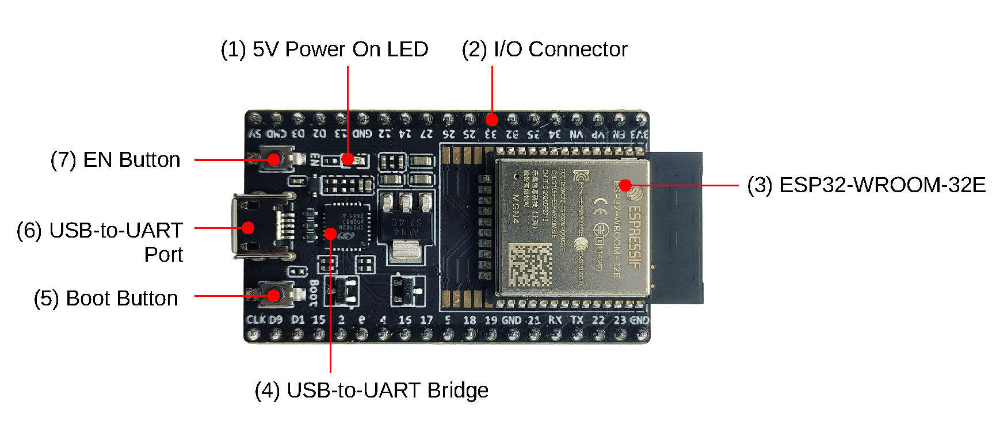
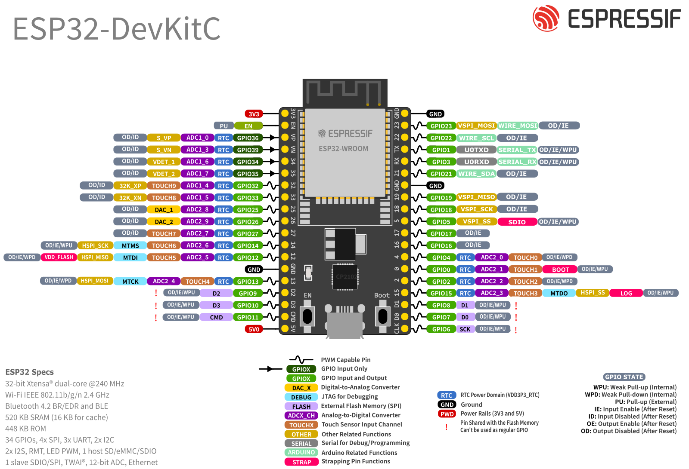
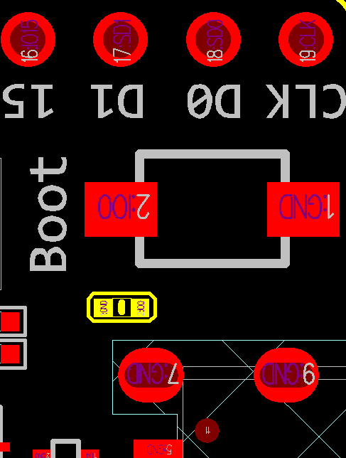

<!-- source: https://docs.espressif.com/projects/esp-dev-kits/en/latest/esp32/esp32-devkitc/user_guide.html | fetched: 2026-09-22 -->
# ESP32-DevKitC V4 - ESP32 -  — esp-dev-kits latest documentation

# ESP32-DevKitC V4

[[中文]](https://docs.espressif.com/projects/esp-dev-kits/zh_CN/latest/esp32/esp32-devkitc/user_guide.html)

The older version: [ESP32-DevKitC V2](https://docs.espressif.com/projects/esp-dev-kits/en/latest/esp32/esp32-devkitc/user_guide_v2.html)

This guide shows how to start using the ESP32-DevKitC V4 development board.

## What You Need

- [ESP32-DevKitC V4 board](https://docs.espressif.com/projects/esp-dev-kits/en/latest/esp32/esp32-devkitc/user_guide.html)
- USB 2.0 cable (Standard-A to Micro-B)
- Computer running Windows, Linux, or macOS

You can skip the introduction sections and go directly to Section [Start Application Development](https://docs.espressif.com/projects/esp-dev-kits/en/latest/esp32/esp32-devkitc/user_guide.html).

## Overview

ESP32-DevKitC V4 is a small-sized ESP32-based development board produced by [Espressif](https://espressif.com). Most of the I/O pins are broken out to the pin headers on both sides for easy interfacing. Developers can either connect peripherals with jumper wires or mount ESP32-DevKitC V4 on a breadboard.

To cover a wide range of user requirements, the following versions of ESP32-DevKitC V4 are available:

- different ESP32 modules

  > - [ESP32-WROOM-32E](https://www.espressif.com/sites/default/files/documentation/esp32-wroom-32e_esp32-wroom-32ue_datasheet_en.pdf)
  > - [ESP32-WROOM-32UE](https://www.espressif.com/sites/default/files/documentation/esp32-wroom-32e_esp32-wroom-32ue_datasheet_en.pdf)
  > - [ESP32-WROVER-E](https://www.espressif.com/sites/default/files/documentation/esp32-wrover-e_esp32-wrover-ie_datasheet_en.pdf)
  > - [ESP32-WROVER-IE](https://www.espressif.com/sites/default/files/documentation/esp32-wrover-e_esp32-wrover-ie_datasheet_en.pdf)
  > - [ESP32-WROOM-32D](https://www.espressif.com/sites/default/files/documentation/esp32-wroom-32d_esp32-wroom-32u_datasheet_en.pdf)
  > - [ESP32-WROOM-32U](https://www.espressif.com/sites/default/files/documentation/esp32-wroom-32d_esp32-wroom-32u_datasheet_en.pdf)
  > - [ESP32-WROOM-DA](https://www.espressif.com/sites/default/files/documentation/esp32-wroom-da_datasheet_en.pdf) (End of Life)
  > - [ESP32-SOLO-1](https://www.espressif.com/sites/default/files/documentation/esp32-solo-1_datasheet_en.pdf)
  > - [ESP32-WROOM-32](https://espressif.com/sites/default/files/documentation/esp32-wroom-32_datasheet_en.pdf)
- male or female pin headers

For details please refer to [ESP Product Selector](https://products.espressif.com/).

## Functional Description

The following figure and the table below describe the key components, interfaces and controls of the ESP32-DevKitC V4 board.

ESP32-DevKitC V4 with ESP32-WROOM-32E module soldered

The key components of the board are described, starting from the 5V Power On LED, in a clockwise direction.

| No. | Key Component | Description |
| --- | --- | --- |
| 1 | 5V Power On LED | Turns on when the USB or an external 5V power supply is connected to the board. For details see the schematics in [Related Documents](https://docs.espressif.com/projects/esp-dev-kits/en/latest/esp32/esp32-devkitc/user_guide.html). |
| 2 | I/O Connector | Most of the pins on the ESP module are broken out to the pin headers on the board. You can program ESP32 to enable multiple functions such as PWM, ADC, DAC, I2C, I2S, SPI, etc. |
| 3 | ESP32-WROOM-32E | A module with ESP32 at its core. For more information, see [ESP32-WROOM-32E Datasheet](https://www.espressif.com/sites/default/files/documentation/esp32-wroom-32e_esp32-wroom-32ue_datasheet_en.pdf). |
| 4 | USB-to-UART Bridge | Single USB-to-UART bridge chip, providing transfer rates up to 3 Mbps. |
| 5 | Boot Button | Download button. Holding down **Boot** and then pressing **EN** initiates Firmware Download mode for downloading firmware through the serial port. |
| 6 | USB-to-UART Port | A Micro-USB port used for power supply to the board, as well as for communication between a computer and the ESP32-WROOM-32E module. |
| 7 | EN Button | Reset button. |

## Power Supply Options

There are three mutually exclusive ways to provide power to the board:

- Micro USB port, default power supply
- 5V and GND header pins
- 3V3 and GND header pins

Warning

The power supply must be provided using **one and only one of the options above**, otherwise the board and/or the power supply source can be damaged.

## Header Block

The two tables below provide the **Name** and **Function** of I/O header pins on both sides of the board, as shown in [ESP32-DevKitC V4 with ESP32-WROOM-32E module soldered](https://docs.espressif.com/projects/esp-dev-kits/en/latest/esp32/esp32-devkitc/user_guide.html).

### J2

| No. | Name | Type [[1]](https://docs.espressif.com/projects/esp-dev-kits/en/latest/esp32/esp32-devkitc/user_guide.html) | Function |
| --- | --- | --- | --- |
| 1 | 3V3 | P | 3.3 V power supply |
| 2 | EN | I | CHIP\_PU, Reset |
| 3 | VP | I | GPIO36, ADC1\_CH0, S\_VP |
| 4 | VN | I | GPIO39, ADC1\_CH3, S\_VN |
| 5 | IO34 | I | GPIO34, ADC1\_CH6, VDET\_1 |
| 6 | IO35 | I | GPIO35, ADC1\_CH7, VDET\_2 |
| 7 | IO32 | I/O | GPIO32, ADC1\_CH4, TOUCH\_CH9, XTAL\_32K\_P |
| 8 | IO33 | I/O | GPIO33, ADC1\_CH5, TOUCH\_CH8, XTAL\_32K\_N |
| 9 | IO25 | I/O | GPIO25, ADC2\_CH8, DAC\_1 |
| 10 | IO26 | I/O | GPIO26, ADC2\_CH9, DAC\_2 |
| 11 | IO27 | I/O | GPIO27, ADC2\_CH7, TOUCH\_CH7 |
| 12 | IO14 | I/O | GPIO14, ADC2\_CH6, TOUCH\_CH6, MTMS |
| 13 | IO12 | I/O | GPIO12, ADC2\_CH5, TOUCH\_CH5, MTDI |
| 14 | GND | G | Ground |
| 15 | IO13 | I/O | GPIO13, ADC2\_CH4, TOUCH\_CH4, MTCK |
| 16 | D2 | I/O | GPIO9, D2 [[2]](https://docs.espressif.com/projects/esp-dev-kits/en/latest/esp32/esp32-devkitc/user_guide.html) |
| 17 | D3 | I/O | GPIO10, D3 [[2]](https://docs.espressif.com/projects/esp-dev-kits/en/latest/esp32/esp32-devkitc/user_guide.html) |
| 18 | CMD | I/O | GPIO11, CMD [[2]](https://docs.espressif.com/projects/esp-dev-kits/en/latest/esp32/esp32-devkitc/user_guide.html) |
| 19 | 5V | P | 5 V power supply |

### J3

| No. | Name | Type [[1]](https://docs.espressif.com/projects/esp-dev-kits/en/latest/esp32/esp32-devkitc/user_guide.html) | Function |
| --- | --- | --- | --- |
| 1 | GND | G | Ground |
| 2 | IO23 | I/O | GPIO23 |
| 3 | IO22 | I/O | GPIO22 |
| 4 | TX | I/O | GPIO1, U0TXD |
| 5 | RX | I/O | GPIO3, U0RXD |
| 6 | IO21 | I/O | GPIO21 |
| 7 | GND | G | Ground |
| 8 | IO19 | I/O | GPIO19 |
| 9 | IO18 | I/O | GPIO18 |
| 10 | IO5 | I/O | GPIO5 |
| 11 | IO17 | I/O | GPIO17 [[3]](https://docs.espressif.com/projects/esp-dev-kits/en/latest/esp32/esp32-devkitc/user_guide.html) |
| 12 | IO16 | I/O | GPIO16 [[3]](https://docs.espressif.com/projects/esp-dev-kits/en/latest/esp32/esp32-devkitc/user_guide.html) |
| 13 | IO4 | I/O | GPIO4, ADC2\_CH0, TOUCH\_CH0 |
| 14 | IO0 | I/O | GPIO0, ADC2\_CH1, TOUCH\_CH1, Boot |
| 15 | IO2 | I/O | GPIO2, ADC2\_CH2, TOUCH\_CH2 |
| 16 | IO15 | I/O | GPIO15, ADC2\_CH3, TOUCH\_CH3, MTDO |
| 17 | D1 | I/O | GPIO8, D1 [[2]](https://docs.espressif.com/projects/esp-dev-kits/en/latest/esp32/esp32-devkitc/user_guide.html) |
| 18 | D0 | I/O | GPIO7, D0 [[2]](https://docs.espressif.com/projects/esp-dev-kits/en/latest/esp32/esp32-devkitc/user_guide.html) |
| 19 | CLK | I/O | GPIO6, CLK [[2]](https://docs.espressif.com/projects/esp-dev-kits/en/latest/esp32/esp32-devkitc/user_guide.html) |

### Pin Layout

ESP32-DevKitC Pin Layout (click to enlarge)

## Note on C15

The component C15 may cause the following issues on earlier ESP32-DevKitC V4 boards:

- The board may boot into Download mode
- If you output clock on GPIO0, C15 may impact the signal

In case these issues occur, please remove the component. The figure below shows the location of C15 highlighted in yellow.

Location of C15 (yellow) on ESP32-DevKitC V4 board

## Start Application Development

Before powering up your ESP32-DevKitC V4, please make sure that the board is in good condition with no obvious signs of damage.

After that, proceed to [ESP-IDF Get Started](https://docs.espressif.com/projects/esp-idf/en/latest/esp32/get-started/index.html), which will quickly help you set up the development environment then flash an application example onto your board.

## Related Documents

- [ESP32 Datasheet](https://www.espressif.com/sites/default/files/documentation/esp32_datasheet_en.pdf) (PDF)
- [ESP32-DevKitC V4 Schematics](https://dl.espressif.com/dl/schematics/esp32_devkitc_v4_sch.pdf) (PDF)
- [ESP32-DevKitC V4 PCB Layout](https://dl.espressif.com/dl/schematics/esp32_devkitc_v4_pcb_layout.pdf) (PDF)
- [ESP32-DevKitC V4 Dimensions](https://dl.espressif.com/dl/schematics/esp32_devkitc_v4_dimensions.pdf) (PDF)
- [ESP32-DevKitC V4 Dimensions source file](https://dl.espressif.com/dl/schematics/esp32_devkitc_v4_dimensions.dxf) (DXF) - You can view it with [Autodesk Viewer](https://viewer.autodesk.com/) online
- [ESP Product Selector](https://products.espressif.com/)

For further design documentation for the board, please contact us at [sales@espressif.com](mailto:sales%40espressif.com).

## Disclaimer and Copyright Notice

See [Disclaimer and Copyright Notice](https://docs.espressif.com/projects/esp-dev-kits/en/latest/esp32/disclaimer-and-copyright.html).
