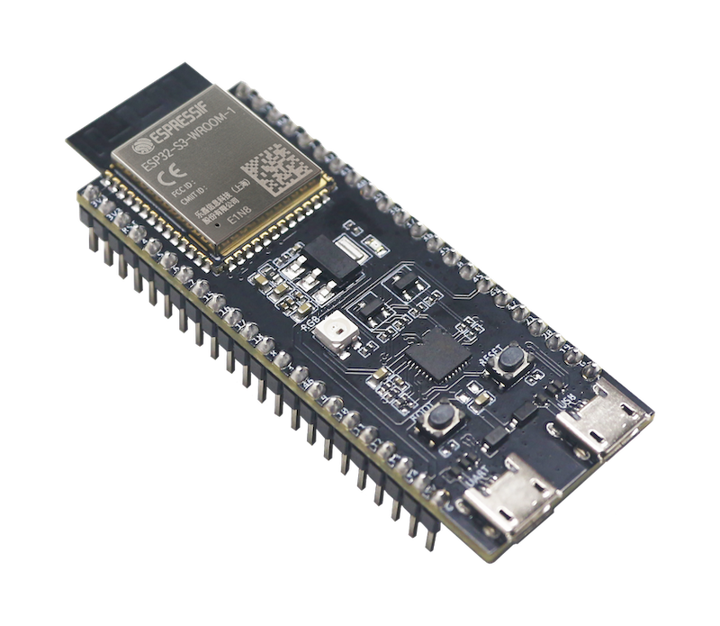
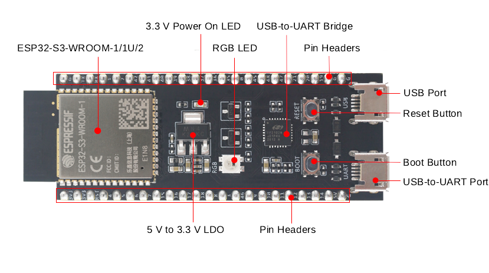
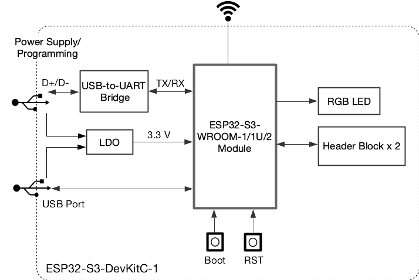

<!-- source: https://docs.espressif.com/projects/esp-dev-kits/en/latest/esp32s3/esp32-s3-devkitc-1/user_guide_v1.1.html | fetched: 2026-09-22 -->
# ESP32-S3-DevKitC-1 v1.1 - ESP32-S3 -  — esp-dev-kits latest documentation

# ESP32-S3-DevKitC-1 v1.1

[[中文]](https://docs.espressif.com/projects/esp-dev-kits/zh_CN/latest/esp32s3/esp32-s3-devkitc-1/user_guide_v1.1.html)

The older version: [ESP32-S3-DevKitC-1 v1.0](https://docs.espressif.com/projects/esp-dev-kits/en/latest/esp32s3/esp32-s3-devkitc-1/user_guide_v1.0.html)

This user guide will help you get started with ESP32-S3-DevKitC-1 and will also provide more in-depth information.

The ESP32-S3-DevKitC-1 is an entry-level development board equipped with ESP32-S3-WROOM-1, ESP32-S3-WROOM-1U, or ESP32-S3-WROOM-2, a general-purpose Wi-Fi + Bluetooth® Low Energy MCU module that integrates complete Wi-Fi and Bluetooth Low Energy functions.

Most of the I/O pins on the module are broken out to the pin headers on both sides of this board for easy interfacing. Developers can either connect peripherals with jumper wires or mount ESP32-S3-DevKitC-1 on a breadboard.

ESP32-S3-DevKitC-1 with ESP32-S3-WROOM-1 Module

The document consists of the following major sections:

- [Getting started](https://docs.espressif.com/projects/esp-dev-kits/en/latest/esp32s3/esp32-s3-devkitc-1/user_guide_v1.1.html): Overview of the board and hardware/software setup instructions to get started.
- [Hardware Reference](https://docs.espressif.com/projects/esp-dev-kits/en/latest/esp32s3/esp32-s3-devkitc-1/user_guide_v1.1.html): More detailed information about the board’s hardware.
- [Hardware Revision Details](https://docs.espressif.com/projects/esp-dev-kits/en/latest/esp32s3/esp32-s3-devkitc-1/user_guide_v1.1.html): Revision history, known issues, and links to user guides for previous versions (if any) of the board.
- [Related Documents](https://docs.espressif.com/projects/esp-dev-kits/en/latest/esp32s3/esp32-s3-devkitc-1/user_guide_v1.1.html): Links to related documentation.
- [Disclaimer and Copyright Notice](https://docs.espressif.com/projects/esp-dev-kits/en/latest/esp32s3/esp32-s3-devkitc-1/user_guide_v1.1.html): Link to the disclaimer and copyright notice.

## Getting Started

This section provides a brief introduction of ESP32-S3-DevKitC-1, instructions on how to do the initial hardware setup and how to flash firmware onto it.

### Description of Components

ESP32-S3-DevKitC-1 - front

The key components of the board are described in a counter-clockwise direction.

| Key Component | Description |
| --- | --- |
| ESP32-S3-WROOM-1/1U/2 | ESP32-S3-WROOM-1, ESP32-S3-WROOM-1U, and ESP32-S3-WROOM-2 are powerful, generic Wi-Fi + Bluetooth Low Energy MCU modules that have a rich set of peripherals. They provide acceleration for neural network computing and signal processing workloads. ESP32-S3-WROOM-1 and ESP32-S3-WROOM-2 comes with a PCB antenna. ESP32-S3-WROOM-1U comes with an external antenna connector. |
| 5 V to 3.3 V LDO | Power regulator that converts a 5 V supply into a 3.3 V output. |
| Pin Headers | All available GPIO pins (except for the SPI bus for flash) are broken out to the pin headers on the board for easy interfacing and programming. For details, please see [Header Block](https://docs.espressif.com/projects/esp-dev-kits/en/latest/esp32s3/esp32-s3-devkitc-1/user_guide_v1.1.html). |
| USB-to-UART Port | A Micro-USB port used for power supply to the board, for flashing applications to the chip, as well as for communication with the chip via the on-board USB-to-UART bridge. |
| Boot Button | Download button. Holding down **Boot** and then pressing **Reset** initiates Firmware Download mode for downloading firmware through the serial port. |
| Reset Button | Press this button to restart the system. |
| USB Port | ESP32-S3 full-speed USB OTG interface, compliant with the USB 1.1 specification. The interface is used for power supply to the board, for flashing applications to the chip, for communication with the chip using USB 1.1 protocols, as well as for JTAG debugging. |
| USB-to-UART Bridge | Single USB-to-UART bridge chip provides transfer rates up to 3 Mbps. |
| RGB LED | Addressable RGB LED, driven by GPIO38. |
| 3.3 V Power On LED | Turns on when the USB power is connected to the board. |

Note

For boards with Octal SPI flash/PSRAM memory embedded ESP32-S3-WROOM-1/1U modules, and boards with ESP32-S3-WROOM-2 modules, the pins GPIO35, GPIO36 and GPIO37 are used for the internal communication between ESP32-S3 and SPI flash/PSRAM memory, thus not available for external use.

### Start Application Development

Before powering up your board, please make sure that it is in good condition with no obvious signs of damage.

#### Required Hardware

- ESP32-S3-DevKitC-1
- USB 2.0 cable (Standard-A to Micro-B)
- Computer running Windows, Linux, or macOS

Note

Be sure to use an appropriate USB cable. Some cables are for charging only and do not provide the needed data lines nor work for programming the boards.

#### Hardware Setup

Connect the board with the computer using **USB-to-UART Port** or **ESP32-S3 USB Port**. In subsequent steps, **USB-to-UART Port** will be used by default.

#### Software Setup

Please proceed to [Get Started](https://docs.espressif.com/projects/esp-idf/en/latest/esp32s3/get-started/index.html), where Section [Installation](https://docs.espressif.com/projects/esp-idf/en/latest/esp32s3/get-started/index.html) will quickly help you set up the development environment and then flash an application example onto your board.

### Contents and Packaging

#### Ordering Information

The development board has a variety of variants to choose from, as shown in the table below.

| Ordering Code | Module Integrated | Flash | PSRAM | SPI Voltage |
| --- | --- | --- | --- | --- |
| ESP32-S3-DevKitC-1-N8R8 | ESP32-S3-WROOM-1-N8R8 | 8 MB QD | 8 MB OT | 3.3 V |
| ESP32-S3-DevKitC-1-N32R16V | ESP32-S3-WROOM-2-N32R16V | 32 MB OT | 16 MB OT | 1.8 V |
| ESP32-S3-DevKitC-1U-N8R8 | ESP32-S3-WROOM-1U-N8R8 | 8 MB QD | 8 MB OT | 3.3 V |

Note

In the table above, QD stands for Quad SPI and OT stands for Octal SPI.

#### Retail Orders

If you order a few samples, each board comes in an individual package in either antistatic bag or any packaging depending on your retailer.

For retail orders, please go to <https://www.espressif.com/en/contact-us/get-samples>.

#### Wholesale Orders

If you order in bulk, the boards come in large cardboard boxes.

For wholesale orders, please go to <https://www.espressif.com/en/contact-us/sales-questions>.

## Hardware Reference

### Block Diagram

The block diagram below shows the components of ESP32-S3-DevKitC-1 and their interconnections.

ESP32-S3-DevKitC-1 (click to enlarge)

#### Power Supply Options

There are three mutually exclusive ways to provide power to the board:

- USB-to-UART Port and ESP32-S3 USB Port (either one or both), default power supply (recommended)
- 5V and G (GND) pins
- 3V3 and G (GND) pins

### Header Block

The two tables below provide the **Name** and **Function** of the pins on both sides of the board (J1 and J3). The pin names are shown in [ESP32-S3-DevKitC-1 - front](https://docs.espressif.com/projects/esp-dev-kits/en/latest/esp32s3/esp32-s3-devkitc-1/user_guide_v1.1.html). The numbering is the same as in the [Board Schematic](https://dl.espressif.com/dl/schematics/SCH_ESP32-S3-DevKitC-1_V1.1_20220413.pdf) (PDF).

#### J1

| No. | Name | Type [[1]](https://docs.espressif.com/projects/esp-dev-kits/en/latest/esp32s3/esp32-s3-devkitc-1/user_guide_v1.1.html) | Function |
| --- | --- | --- | --- |
| 1 | 3V3 | P | 3.3 V power supply |
| 2 | 3V3 | P | 3.3 V power supply |
| 3 | RST | I | EN |
| 4 | 4 | I/O/T | RTC\_GPIO4, GPIO4, TOUCH4, ADC1\_CH3 |
| 5 | 5 | I/O/T | RTC\_GPIO5, GPIO5, TOUCH5, ADC1\_CH4 |
| 6 | 6 | I/O/T | RTC\_GPIO6, GPIO6, TOUCH6, ADC1\_CH5 |
| 7 | 7 | I/O/T | RTC\_GPIO7, GPIO7, TOUCH7, ADC1\_CH6 |
| 8 | 15 | I/O/T | RTC\_GPIO15, GPIO15, U0RTS, ADC2\_CH4, XTAL\_32K\_P |
| 9 | 16 | I/O/T | RTC\_GPIO16, GPIO16, U0CTS, ADC2\_CH5, XTAL\_32K\_N |
| 10 | 17 | I/O/T | RTC\_GPIO17, GPIO17, U1TXD, ADC2\_CH6 |
| 11 | 18 | I/O/T | RTC\_GPIO18, GPIO18, U1RXD, ADC2\_CH7, CLK\_OUT3 |
| 12 | 8 | I/O/T | RTC\_GPIO8, GPIO8, TOUCH8, ADC1\_CH7, SUBSPICS1 |
| 13 | 3 | I/O/T | RTC\_GPIO3, GPIO3, TOUCH3, ADC1\_CH2 |
| 14 | 46 | I/O/T | GPIO46 |
| 15 | 9 | I/O/T | RTC\_GPIO9, GPIO9, TOUCH9, ADC1\_CH8, FSPIHD, SUBSPIHD |
| 16 | 10 | I/O/T | RTC\_GPIO10, GPIO10, TOUCH10, ADC1\_CH9, FSPICS0, FSPIIO4, SUBSPICS0 |
| 17 | 11 | I/O/T | RTC\_GPIO11, GPIO11, TOUCH11, ADC2\_CH0, FSPID, FSPIIO5, SUBSPID |
| 18 | 12 | I/O/T | RTC\_GPIO12, GPIO12, TOUCH12, ADC2\_CH1, FSPICLK, FSPIIO6, SUBSPICLK |
| 19 | 13 | I/O/T | RTC\_GPIO13, GPIO13, TOUCH13, ADC2\_CH2, FSPIQ, FSPIIO7, SUBSPIQ |
| 20 | 14 | I/O/T | RTC\_GPIO14, GPIO14, TOUCH14, ADC2\_CH3, FSPIWP, FSPIDQS, SUBSPIWP |
| 21 | 5V | P | 5 V power supply |
| 22 | G | G | Ground |

#### J3

| No. | Name | Type | Function |
| --- | --- | --- | --- |
| 1 | G | G | Ground |
| 2 | TX | I/O/T | U0TXD, GPIO43, CLK\_OUT1 |
| 3 | RX | I/O/T | U0RXD, GPIO44, CLK\_OUT2 |
| 4 | 1 | I/O/T | RTC\_GPIO1, GPIO1, TOUCH1, ADC1\_CH0 |
| 5 | 2 | I/O/T | RTC\_GPIO2, GPIO2, TOUCH2, ADC1\_CH1 |
| 6 | 42 | I/O/T | MTMS, GPIO42 |
| 7 | 41 | I/O/T | MTDI, GPIO41, CLK\_OUT1 |
| 8 | 40 | I/O/T | MTDO, GPIO40, CLK\_OUT2 |
| 9 | 39 | I/O/T | MTCK, GPIO39, CLK\_OUT3, SUBSPICS1 |
| 10 | 38 | I/O/T | GPIO38, FSPIWP, SUBSPIWP, RGB LED |
| 11 | 37 | I/O/T | SPIDQS, GPIO37, FSPIQ, SUBSPIQ |
| 12 | 36 | I/O/T | SPIIO7, GPIO36, FSPICLK, SUBSPICLK |
| 13 | 35 | I/O/T | SPIIO6, GPIO35, FSPID, SUBSPID |
| 14 | 0 | I/O/T | RTC\_GPIO0, GPIO0 |
| 15 | 45 | I/O/T | GPIO45 |
| 16 | 48 | I/O/T | GPIO48, SPICLK\_N, SUBSPICLK\_N\_DIFF |
| 17 | 47 | I/O/T | GPIO47, SPICLK\_P, SUBSPICLK\_P\_DIFF |
| 18 | 21 | I/O/T | RTC\_GPIO21, GPIO21 |
| 19 | 20 | I/O/T | RTC\_GPIO20, GPIO20, U1CTS, ADC2\_CH9, CLK\_OUT1, USB\_D+ |
| 20 | 19 | I/O/T | RTC\_GPIO19, GPIO19, U1RTS, ADC2\_CH8, CLK\_OUT2, USB\_D- |
| 21 | G | G | Ground |
| 22 | G | G | Ground |

For description of function names, please refer to [ESP32-S3 Series Datasheet](https://www.espressif.com/sites/default/files/documentation/esp32-s3_datasheet_en.pdf) (PDF).

#### Pin Layout

ESP32-S3-DevKitC-1 Pin Layout (click to enlarge)

## Hardware Revision Details

[Initial release](https://docs.espressif.com/projects/esp-dev-kits/en/latest/esp32s3/esp32-s3-devkitc-1/user_guide_v1.0.html)

Note

Both the initial and v1.1 versions of ESP32-S3-DevKitC-1 are available on the market. The main difference lies in the GPIO assignment for the RGB LED: the initial version uses GPIO48, whereas v1.1 uses GPIO38.

## Related Documents

- [ESP32-S3 Datasheet](https://www.espressif.com/sites/default/files/documentation/esp32-s3_datasheet_en.pdf) (PDF)
- [ESP32-S3-WROOM-1 & ESP32-S3-WROOM-1U Datasheet](https://www.espressif.com/sites/default/files/documentation/esp32-s3-wroom-1_wroom-1u_datasheet_en.pdf) (PDF)
- [ESP32-S3-WROOM-2 Datasheet](https://www.espressif.com/sites/default/files/documentation/esp32-s3-wroom-2_datasheet_en.pdf) (PDF)
- [ESP32-S3-DevKitC-1 Schematic](https://dl.espressif.com/dl/schematics/SCH_ESP32-S3-DevKitC-1_V1.1_20221130.pdf) (PDF)
- [ESP32-S3-DevKitC-1 PCB layout](https://dl.espressif.com/dl/schematics/PCB_ESP32-S3-DevKitC-1_V1.1_20220429.pdf) (PDF)
- [ESP32-S3-DevKitC-1 Dimensions](https://dl.espressif.com/dl/schematics/esp_idf/DXF_ESP32-S3-DevKitC-1_V1.1_20220429.pdf) (PDF)
- [ESP32-S3-DevKitC-1 Dimensions source file](https://dl.espressif.com/dl/schematics/esp_idf/DXF_ESP32-S3-DevKitC-1_V1.1_20220429.dxf) (DXF) - You can view it with [Autodesk Viewer](https://viewer.autodesk.com/) online
- [ESP32-S3-DevKitC-1 Reference Design](https://documentation.espressif.com/ESP32-S3-DevKitC-1_Reference_Design.zip) (ZIP)

For further design documentation for the board, please contact us at [sales@espressif.com](mailto:sales%40espressif.com).

## Disclaimer and Copyright Notice

See [Disclaimer and Copyright Notice](https://docs.espressif.com/projects/esp-dev-kits/en/latest/esp32s3/disclaimer-and-copyright.html).
