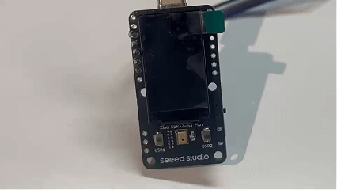
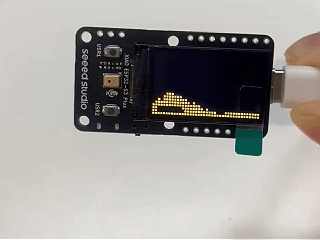
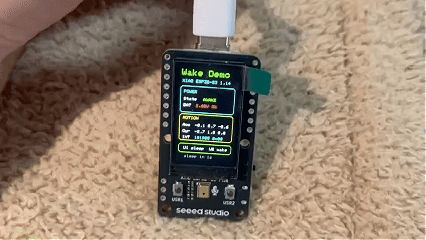
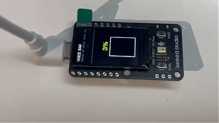
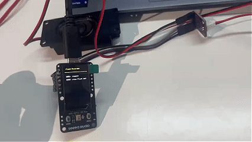
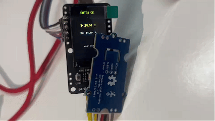

<!-- source: https://wiki.seeedstudio.com/function_1.14_inch_display_esp32s3/ | fetched: 2026-09-21 -->
# Onboard Peripheral Usage | Seeed Studio Wiki

This page collects standalone function-level demos for each onboard peripheral of the 1.14'' IPS Display. Each section is self-contained — you can pick the one that matches your use case without reading through the others.

tip

The demo GIFs on this page are sped up to keep them short.

note

All demos in this page require **esp32 Boards by Espressif (3.3.11)** as described in [Getting Started](https://wiki.seeedstudio.com/getting_started_1.14_inch_display_esp32s3/), plus the **Seeed\_GFX2** library installed manually as described below.

- **Seeed\_GFX2 (Manual Installation)** — this library is not available in Library Manager and must be installed manually:

[**Download Seeed\_GFX2**](https://github.com/Seeed-Studio/Seeed_GFX2/archive/refs/tags/v1.0.0.zip)

  

**Step 1.** Click the button above to download `Seeed_GFX2` v1.0.0 as a ZIP file (pinned to a release tag so the tutorial stays reproducible). Alternatively, clone the repository from [Seeed-Studio/Seeed\_GFX2](https://github.com/Seeed-Studio/Seeed_GFX2).

**Step 2.** In the Arduino IDE, go to **Sketch > Include Library > Add .ZIP Library...** and select the downloaded ZIP. The IDE reads `library.properties` and installs it into the correct `Seeed_GFX2` folder automatically — you do not need to rename the extracted folder. (To install manually instead, unzip the archive and rename the extracted folder to `Seeed_GFX2` before placing it in `Documents/Arduino/libraries/`.)

**Step 3.** Restart the Arduino IDE so the new library is detected.

tip

- **Seeed\_GFX2** is Seeed Studio's graphics library built on a layered `Board` + `Panel Config` architecture. Each demo initializes the display with a single `display.begin<Board_..., Config_...>()` call — the **Board** template owns the pin map (CS/DC/SCK/MOSI/RST/BL), and the **Panel Config** bakes in the 135×240 resolution, color order, and inversion. No `driver.h` or manual pin setup is needed.
- On this board the demos use `Board_XIAO_1inch14_LCD<13, 12>` (RST=13, BL=12) with `Config_Seeed_1inch14_LCD_ST7789` (135×240). A few demos define a sketch-local `Config_XIAO_1inch14_LCD_ST7789_BGR` override for the BGR color order.
- The **IMU** is read directly over I2C (`Wire`) in these demos — no external IMU library is needed. The **PDM microphone** and **I2S output** use the ESP-IDF 5 drivers (`driver/i2s_pdm.h`, `driver/i2s_std.h`) and `LittleFS`, all included with the esp32 board package.
- The 1.14'' IPS Display has **no touch controller, no SD card slot**, so no touch or SD libraries are needed.

## Getting the Demo Code

Every demo on this page lives in the [Display-Gadgets](https://github.com/Seeed-Projects/Display-Gadgets) repository, under the `code_GFX2/Function/` directory. Each demo is a folder containing a single `.ino` sketch. **Always download the complete folder** rather than copying the `.ino` source from the GitHub web view.

**Option A — Download the repository as a ZIP (recommended):**

1. Open [github.com/Seeed-Projects/Display-Gadgets](https://github.com/Seeed-Projects/Display-Gadgets) and click **Code > Download ZIP**, then extract the archive anywhere convenient.
2. Navigate into `code_GFX2/Function/` and open the folder shown in each demo's **Code location** line. For example, the GraphicTest demo for this board lives in `code_GFX2/Function/114_ESP32/xiao_esp32s3_114_graphictest/`.
3. **Double-click the `.ino` file** to open it in the Arduino IDE.

**Option B — git clone:**

```sh
git clone https://github.com/Seeed-Projects/Display-Gadgets.git
```

Then open the demo's `.ino` file from the cloned `code_GFX2/Function/...` folder.

## Screen Display — GraphicTest

This demo runs a full graphics benchmark on the 1.14-inch ST7789 IPS panel (135×240), covering color bars, lines, rectangles, circles, triangles, rounded rectangles, text, and a pixel gradient. Use it to verify that the screen is wired correctly and that all draw calls work as expected.

**Code location:** `code_GFX2/Function/114_ESP32/xiao_esp32s3_114_graphictest/`

[**View on GitHub**](https://github.com/Seeed-Projects/Display-Gadgets/tree/main/code_GFX2/Function/114_ESP32/xiao_esp32s3_114_graphictest)

  

### How It Works

The sketch initializes the ST7789 IPS panel via **Seeed\_GFX2**, then runs through ten graphics primitives in sequence, measuring the execution time of each one via `micros()` and printing the result to the serial monitor.

The display is initialized with a single template call:

```cpp
display.begin<Board_XIAO_1inch14_LCD<13, 12>,
              Config_Seeed_1inch14_LCD_ST7789>();
```

The **Board** template owns the pin map — CS=D2, DC=D3, SCK=D8, MOSI=D10 — and its `<RST, BL>` template parameters take bare GPIO numbers, so `<13, 12>` sets RST=GPIO13 (D17) and BL=GPIO12 (D18). The **Panel Config** bakes in the 135×240 resolution, color order, and inversion (`invert = true`), so no `driver.h` or manual `invertDisplay()` call is needed.

### Running the Demo

**Step 1.** Open `xiao_esp32s3_114_graphictest.ino` in Arduino IDE.

**Step 2.** Select **Tools > Board > esp32 > XIAO\_ESP32S3\_PLUS** and the correct **Port**.

**Step 3.** Click **Upload**.

**Step 4.** Open **Tools > Serial Monitor** (115200 baud). You should see the panel size followed by timing output for each test:

```text
=== XIAO ESP32-S3 Plus 1.14 graphic test ===
LCD width: 135
LCD height: 240
Color bars: 96.02 ms
Lines: 2634.02 ms
Fast lines: 143.65 ms
Rectangles: 113.85 ms
Filled rectangles: 340.06 ms
Circles: 358.57 ms
Triangles: 378.17 ms
Round rectangles: 163.69 ms
Text: 1458.63 ms
Pixel gradient: 4670.28 ms
Graphic test finished.
```

On the screen, you will see each test pattern displayed for about one second before the next one starts. When all tests complete, a "Graphic / Finished" screen appears with a blue rounded-rectangle border.

### Expected Result



After the sketch runs through all patterns, the screen shows a "Graphic / Finished" message with "Reset to rerun" below it. Reset the board to run the test again.

---

## IMU

The 1.14'' IPS Display features an onboard **LSM6DS3** 6-axis IMU (3-axis accelerometer + 3-axis gyroscope) connected via I2C on D4/D5 at address **0x6A**. The motion interrupt line on **D14** supports hardware wake-up and gesture detection.

note

The onboard IMU is the **LSM6DS3** (confirmed from the board schematic, I2C address `0x6A`). The Electronic Quicksand demo probes for a QMI8658-compatible sensor as a defensive fallback. The Raise to Wake demo targets the onboard LSM6DS3 wake-up registers.

The demos below read the IMU directly over I2C (`Wire`) — no external IMU library is required.

### Demo 1: Electronic Quicksand

This demo turns the screen into an interactive fluid simulation — golden sand particles that flow and settle according to gravity, as measured by the onboard 6-axis IMU. Tilt the board and the sand shifts direction in real time.

**Code location:** `code_GFX2/Function/114_ESP32/xiao_esp32s3_114_electronic_quicksand/`

[**View on GitHub**](https://github.com/Seeed-Projects/Display-Gadgets/tree/main/code_GFX2/Function/114_ESP32/xiao_esp32s3_114_electronic_quicksand)

  

### How It Works

The simulation uses a **22×40 occupancy grid** overlaid on the 135×240 screen, where each cell is 6×6 pixels. Around **150 particles** are placed in the grid, each with a position, velocity, and a golden color gradient.

The IMU is read via I2C (D4/D5). The sketch probes for an IMU at both known addresses — QMI8658 first, then LSM6DS3 — and uses whichever one responds. Raw acceleration values are low-pass filtered and used to derive a gravity vector. When you tilt the board:

1. **Gravity vector updates** — accelerometer data is smoothed with an exponential moving average to avoid jitter.
2. **Particle velocity** — each particle accelerates in the direction of the gravity vector, with damping and a per-particle mobility factor based on its depth in the flow.
3. **Cell occupancy** — particles deeper in the flow (closer to the "bottom" relative to gravity) have reduced mobility, creating a realistic packing effect.
4. **Differential rendering** — only cells where particles moved into or out of are redrawn, minimizing SPI traffic and keeping the animation smooth.

Particles near the surface flow freely (higher mobility); particles buried deeper pack tightly (lower mobility) — mimicking how real sand behaves.

### Running the Demo

**Step 1.** Open `xiao_esp32s3_114_electronic_quicksand.ino` in Arduino IDE.

**Step 2.** Select the board and port, then click **Upload**.

**Step 3.** Once uploaded, the screen fills with golden particles at the bottom. Tilt the board in different directions — the sand flows as if pulled by gravity.

**Step 4.** Open **Tools > Serial Monitor** (115200 baud) to confirm initialization:

```text
=== Electronic Quicksand 1.14 ===
[IMU] LSM6-compatible at 0x6A, WHO=0x6A
```

### Expected Result



The particles flow toward the lower edge as you tilt the board. When the display lies flat, the demo retains the previous gravity direction.

---

### Demo 2: Raise to Wake

This demo implements a **screen sleep/wake system** driven by the IMU's built-in wake-up interrupt on **D14**. The screen automatically turns off (backlight off + ESP32 light sleep) after 8 seconds of inactivity, and wakes instantly when you pick up or move the device.

**Code location:** `code_GFX2/Function/114_ESP32/xiao_esp32s3_114_wakeup/`

[**View on GitHub**](https://github.com/Seeed-Projects/Display-Gadgets/tree/main/code_GFX2/Function/114_ESP32/xiao_esp32s3_114_wakeup)

  

### How It Works

The demo uses the LSM6-compatible IMU's **embedded wake-up event detector** — a hardware feature that monitors accelerometer data internally and asserts the INT1 pin (routed to D14 on this board) when motion exceeds a configurable threshold. This means the MCU does not need to poll the accelerometer continuously.

**IMU configuration (LSM6-compatible):**

| Register | Value | Purpose |
| --- | --- | --- |
| `CTRL3_C` | `0x44` | Enable BDU + auto-increment for block reads |
| `CTRL1_XL` | `0x40` | Accelerometer @ 104 Hz, ±2g |
| `CTRL2_G` | `0x40` | Gyroscope @ 104 Hz |
| `TAP_CFG` | `0x80` | Enable embedded interrupts |
| `WAKE_UP_THS` | `0x05` | Wake-up threshold (medium-low sensitivity) |
| `WAKE_UP_DUR` | `0x00` | No duration filter (responsive wake) |
| `MD1_CFG` | `0x20` | Route wake-up to INT1 |

**Sleep/wake flow:**

1. **Active state** — screen is on, backlight at PWM 160. IMU data and battery voltage refresh periodically. A countdown timer shows seconds remaining until auto-sleep.
2. **Auto-sleep** — after 8 seconds of no activity, the sketch turns off the backlight, displays a "Sleeping... Pick up device to wake" message, configures D14 as a wake-up source via `esp_sleep_enable_gpio_wakeup()`, and enters ESP32 light sleep.
3. **Wake-up** — when the user picks up the board, the IMU detects motion and asserts D14 HIGH. The ESP32 wakes from light sleep and redraws the UI.

**Manual test buttons:**

| Button | Pin | Action |
| --- | --- | --- |
| USR1 | D6 | Force sleep |
| USR2 | D7 | Force wake |

### Running the Demo

**Step 1.** Open `xiao_esp32s3_114_wakeup.ino` in Arduino IDE, select the board and port, and click **Upload**.

**Step 2.** The screen shows a dashboard with power state, motion data, and a countdown timer. Let the board sit still for 8 seconds — it will automatically sleep.

**Step 3.** Pick up the board or shake it gently — the screen wakes immediately.

**Step 4.** Open **Tools > Serial Monitor** (115200 baud) to confirm initialization:

```text
=== XIAO ESP32-S3 Plus 1.14 IMU Wake Demo ===
[IMU] LSM6-compatible at 0x6A, WHO=0x6A
```

### Expected Result



The screen displays real-time motion data while awake. After 8 seconds of stillness, the screen goes dark and the ESP32-S3 enters light sleep. Pick up the device and the screen restores within a fraction of a second, with the wake counter incremented.

---

## Microphone & Speaker

The 1.14'' IPS Display has an onboard **PDM (Pulse Density Modulation) digital microphone** for audio input, plus I2S output pads for driving an external speaker/amplifier. This section shows two demos: a real-time **Voice Bar** visualization of the microphone input (no extra hardware), and a **Flash Recorder** that records audio to onboard Flash and plays it back through an external I2S amplifier.

| Pin | Signal | Function |
| --- | --- | --- |
| D0 | PDM\_CLK | PDM clock output to microphone |
| D1 | MIC\_DATA | PDM data input from microphone |

### Demo 1: Voice Bar

This demo visualizes the PDM microphone's real-time audio input as a dynamic equalizer-style waveform and a segmented volume bar. Speak, clap, or blow into the onboard microphone and watch the bars react instantly — no external hardware is required.

**Code location:** `code_GFX2/Function/114_ESP32/xiao_esp32s3_114_voice_bar/`

[**View on GitHub**](https://github.com/Seeed-Projects/Display-Gadgets/tree/main/code_GFX2/Function/114_ESP32/xiao_esp32s3_114_voice_bar)

  

#### How It Works

The sketch captures the onboard PDM microphone through the ESP32-S3's I2S peripheral configured in **PDM RX mode**, using the ESP-IDF v5 driver API (`driver/i2s_pdm.h`). This requires **esp32 Boards by Espressif 3.x** — the legacy `i2s_config_t` API from core 2.x will not compile.

note

The ESP-IDF v5 API (`i2s_new_channel()` / `i2s_channel_read()`) is different from the nRF52840 version of this demo, which uses the nRF52 `PDM` library. If you are porting the nRF52840 code, you must replace the PDM setup entirely.

The microphone is sampled at **16 kHz mono** into 256-sample DMA buffers (4 descriptors). In `loop()`, `i2s_channel_read()` fetches a buffer, removes the DC offset, computes the peak amplitude, and down-samples the signal into 27 bins for the waveform visualizer. The PDM clock drive strength is also reduced with `gpio_set_drive_capability()` to cut EMI/coupling noise.

The screen is divided into three zones:

| Zone | Position | Description |
| --- | --- | --- |
| **Waveform** | Top (y=30–95) | 27-bar equalizer visualizer. Raw samples are down-sampled and drawn as symmetric bars around a center baseline. Waveform color follows the smoothed volume — green (<50%), yellow (50–90%), red (>90%). |
| **Percentage** | Middle | Large numeric volume percentage (0–100%), color-coded green (<50%), yellow (50–90%), red (>90%). |
| **Volume Bar** | Bottom (y=130–225) | 10-segment bar (green/yellow/red gradient). Updates with smoothed volume from the PDM peak. |

**Signal processing:**

1. **I2S PDM RX** — `i2s_channel_read()` fetches 256 PDM samples. The sketch removes the DC offset (mean) so the peak reflects actual loudness, then computes the peak magnitude.
2. **Normalization** — peak values below `VOL_FLOOR` (20) are treated as silence. Values above `VOL_CEIL` (2400) saturate to 100%. In between, linear mapping produces a 0.0–1.0 volume level.
3. **Exponential smoothing** — the displayed volume is smoothed with a 20% mix factor (`SMOOTH = 0.20`) to avoid jitter. During silence, the volume decays at 6% per frame.
4. **Differential rendering** — the volume bar and percentage label are only redrawn when the value changes, minimizing SPI traffic.

#### Running the Demo

**Step 1.** Open `xiao_esp32s3_114_voice_bar.ino` in Arduino IDE.

**Step 2.** Select **Tools > Board > esp32 > XIAO\_ESP32S3\_PLUS** and the correct **Port**.

**Step 3.** Click **Upload**.

**Step 4.** Open **Tools > Serial Monitor** (115200 baud). You should see:

```text
=== Voice Bar | XIAO ESP32-S3 Plus 1.14 ===
[MIC] PDM RX ready (ESP-IDF v5)
[MIC] ready
```

**Step 5.** Speak, clap, or blow into the microphone. The waveform and volume bar respond in real time. The percentage label changes color as the volume increases.

#### Expected Result



When silent, the waveform is flat and the volume bar is empty (0%). Speak into the microphone and the equalizer bars animate while the volume bar fills up from green through yellow to red. The percentage label updates in real time.

---

### Demo 2: Flash Recorder

This demo records 5 seconds of audio from the onboard PDM microphone into onboard Flash memory, then plays it back through an external speaker connected to the I2S output. Press one button to record, another to play.

**Code location:** `code_GFX2/Function/114_ESP32/xiao_esp32s3_114_flash_record/`

[**View on GitHub**](https://github.com/Seeed-Projects/Display-Gadgets/tree/main/code_GFX2/Function/114_ESP32/xiao_esp32s3_114_flash_record)

  

### Hardware Setup

Playback requires an external **I2S audio amplifier and speaker**. The demo is written for a **MAX98357A** breakout connected to the board's I2S output pads:

| I2S Pad | XIAO Pin | MAX98357A |
| --- | --- | --- |
| 3V3 | 3V3 | VIN |
| GND | GND | GND |
| I2S\_SD | D11 | DIN |
| I2S\_SCK | D12 | BCLK |
| I2S\_WS | D13 | LRC |

The I2S pads (3V3, GND, D11, D12, D13) are exposed on the bottom expansion pad group of the display board.

### How It Works

**Recording** — the onboard **PDM (Pulse Density Modulation) digital microphone** is sampled through the ESP32-S3's I2S peripheral configured in PDM RX mode. On ESP-IDF v5 (Arduino core 3.3.11), this uses the new driver API (`driver/i2s_pdm.h`). The microphone is captured at **16 kHz mono** with 4 DMA descriptors of 256 frames each. When you press **USR1**, the sketch samples 5 seconds of audio into a RAM buffer, then writes it to onboard Flash as a WAV file (`/REC_RAW.WAV`) using `LittleFS`.

After the PDM microphone starts, the sketch discards the first **300 ms** of captured data as warm-up data to reduce the startup transient at the beginning of the recording.

If the sketch cannot capture all samples within **7 seconds**, it stops recording and displays **"Mic capture timeout"** instead of remaining blocked in the recording loop.

**Playback** — pressing **USR2** reads the WAV back from Flash and streams it out through the I2S peripheral in standard (Philips) stereo mode on D11/D12/D13. The mono samples are duplicated to both channels with a `0.75×` gain applied to avoid clipping. The amplifier drives a small speaker so you can hear the recording.

**On-screen states:**

| State | Description |
| --- | --- |
| **Ready** | "Flash Recorder" title with "USR1: record" and "USR2: play Flash WAV" (or "No saved recording") |
| **Warm-up** | "Warming up mic..." with "Please wait" before capture begins |
| **Recording** | "Capturing 5 seconds" shown while capturing (no live progress) |
| **Error** | "Mic capture timeout" with "Try recording again" when capture exceeds 7 seconds |
| **Saved** | "Done — Saved Flash WAV" confirmation, then returns to Ready |
| **Playback** | "Playing raw audio" while streaming, then "Finished" |

### Running the Demo

**Step 1.** Connect a MAX98357A amplifier and speaker to the I2S pads as described above.

**Step 2.** Open `xiao_esp32s3_114_flash_record.ino` in Arduino IDE.

**Step 3.** Select the board: **Tools > Board > esp32 > XIAO\_ESP32S3\_PLUS** (using esp32 Boards **3.3.11**).

**Step 4.** Select **Tools > Partition Scheme > "Default with spiffs (3MB APP/1.5MB SPIFFS)"**.

**Step 5.** Select the correct **Port**, then click **Upload**.

caution

The recorder stores the WAV file in `LittleFS`, which uses the **SPIFFS** partition. The board's default partition scheme (`16M Flash (2MB APP/12.5MB FATFS)`) contains no SPIFFS partition, so `LittleFS.begin()` returns `false` and the screen shows "Flash write failed / Check partition". You **must** select the SPIFFS partition scheme above, or recording will not work.

**Step 6.** Press **USR1 (D6)** to record 5 seconds of audio from the onboard microphone. The screen shows "Capturing 5 seconds" while recording.

**Step 7.** Press **USR2 (D7)** to play the recording back through the speaker.

note

The recording is stored in onboard Flash (`LittleFS`), so it survives a power cycle — you can record once and play it back later. Recording again overwrites the previous file.

### Expected Result



Press USR1 and the screen shows "Capturing 5 seconds". After 5 seconds it confirms the WAV was saved. Press USR2 and the audio plays through the connected speaker while the screen shows the playback status.

---

## Grove I2C

The 1.14'' IPS Display features a dedicated **Grove I2C connector** that exposes D4 (SDA) and D5 (SCL) on a standard 4-pin Grove socket (GND / 3V3 / SDA / SCL). D4/D5 are shared internally with the onboard IMU.

| Grove Pin | XIAO Pin | Notes |
| --- | --- | --- |
| GND | GND | Common ground |
| 3V3 | 3V3 | 3.3V power output |
| SDA | D4 | I2C data — shared with onboard IMU |
| SCL | D5 | I2C clock — shared with onboard IMU |

note

D4/D5 are shared between the Grove connector and the onboard IMU. The IMU is at address `0x6A`. When connecting an external I2C device, make sure it does not conflict with this address.

### Demo: SHT31 Temperature & Humidity

This demo reads temperature and humidity from a **Grove SHT31** sensor plugged into the Grove I2C connector and displays the readings on the screen. The sketch talks to the sensor directly over I2C with `Wire.h` — no SHT31 library is needed — and validates each reading with the sensor's CRC.

**Code location:** `code_GFX2/Function/114_ESP32/xiao_esp32s3_114_sht31_temperature_humidity/`

[**View on GitHub**](https://github.com/Seeed-Projects/Display-Gadgets/tree/main/code_GFX2/Function/114_ESP32/xiao_esp32s3_114_sht31_temperature_humidity)

  

#### Hardware Setup

Plug a **Grove SHT31** temperature & humidity sensor into the Grove I2C connector. The sensor is powered at 3.3V and communicates at I2C address `0x44`:

| Grove Pin | XIAO Pin | SHT31 |
| --- | --- | --- |
| GND | GND | GND |
| 3V3 | 3V3 | VCC |
| SDA | D4 | SDA |
| SCL | D5 | SCL |

#### How It Works

The sketch reads the SHT31 directly over I2C (`Wire`) at address `0x44`:

1. **I2C scan** — on startup it scans the I2C bus and reports every device found.
2. **Single-shot measurement** — it sends a high-repeatability single-shot command (`0x24 0x00`, no clock stretching), waits 20 ms, then reads 6 bytes: temperature high/low + CRC, humidity high/low + CRC.
3. **CRC check** — each 16-bit value is verified against its CRC byte; a mismatch is reported as an error (wiring or a damaged/noisy module).
4. **Conversion** — raw values are converted to temperature (`-45 + 175 × raw / 65535` °C) and relative humidity (`100 × raw / 65535` %).

The display is initialized with `Board_XIAO_1inch14_LCD<13, 12>` and a sketch-local `Config_XIAO_1inch14_LCD_ST7789_BGR` (135×240, BGR color order, inverted) so colors render correctly. The screen shows "SHT31 OK" with the live temperature and humidity, or "SHT31 ERROR" plus an error code if a read fails.

#### Running the Demo

**Step 1.** Open `xiao_esp32s3_114_sht31_temperature_humidity.ino` in Arduino IDE.

**Step 2.** Select **Tools > Board > esp32 > XIAO\_ESP32S3\_PLUS** and the correct **Port**, then click **Upload**.

**Step 3.** Open **Tools > Serial Monitor** (115200 baud). You should see:

```text
=== XIAO ESP32-S3 1.14 SHT31 Temperature/Humidity ===
[PIN] SDA=D4 SCL=D5 address=0x44
[I2C] scan start
[I2C] found 0x44
[I2C] scan done
[SHT31] OK T=26.81 C H=48.32 %
```

The screen shows "SHT31 OK" with the temperature and humidity, updating once per second. If the sensor is disconnected or the CRC check fails, the screen shows "SHT31 ERROR" with an error code.

#### Expected Result



The temperature and humidity update once per second on the screen. Breathe on the sensor and the humidity reading rises.

---

## User Buttons

The 1.14'' IPS Display has **three physical push buttons** connected to the XIAO ESP32-S3 Plus:

| Button | Pin | Logic | Silkscreen Label | Breakout Pad |
| --- | --- | --- | --- | --- |
| **USR1** | D6 | Active-low (pressed = LOW) | USR1 | U1 |
| **USR2** | D7 | Active-low (pressed = LOW) | USR2 | U2 |
| **USR3** | D19 | Active-low (pressed = LOW) | USR3 | U3 |

### Reading a Button

The three buttons have external 1 KΩ pull-up resistors on the board, and the demo code additionally enables the XIAO's internal pull-ups (`INPUT_PULLUP`). A simple polled read with debounce looks like this:

```cpp
const int USR1 = D6;
const int USR2 = D7;
const int USR3 = D19;

void setup() {
  pinMode(USR1, INPUT_PULLUP);
  pinMode(USR2, INPUT_PULLUP);
  pinMode(USR3, INPUT_PULLUP);
  Serial.begin(115200);
}

void loop() {
  if (digitalRead(USR1) == LOW) {
    Serial.println("USR1 (D6) pressed");
    delay(200); // simple debounce
  }
  if (digitalRead(USR2) == LOW) {
    Serial.println("USR2 (D7) pressed");
    delay(200);
  }
  if (digitalRead(USR3) == LOW) {
    Serial.println("USR3 (D19) pressed");
    delay(200);
  }
}
```

### Debounce with Interrupts

For responsive, debounced button handling, you can use GPIO interrupts with a short settling delay:

```cpp
volatile bool btn1Flag = false;
volatile bool btn2Flag = false;
volatile bool btn3Flag = false;

void btn1Isr() { btn1Flag = true; }
void btn2Isr() { btn2Flag = true; }
void btn3Isr() { btn3Flag = true; }

void setup() {
  pinMode(D6, INPUT_PULLUP);
  pinMode(D7, INPUT_PULLUP);
  pinMode(D19, INPUT_PULLUP);
  attachInterrupt(digitalPinToInterrupt(D6), btn1Isr, FALLING);
  attachInterrupt(digitalPinToInterrupt(D7), btn2Isr, FALLING);
  attachInterrupt(digitalPinToInterrupt(D19), btn3Isr, FALLING);
}

void loop() {
  if (btn1Flag) {
    btn1Flag = false;
    delay(30); // debounce settling time
    if (digitalRead(D6) == LOW) {
      // handle USR1 press
    }
  }
  if (btn2Flag) {
    btn2Flag = false;
    delay(30);
    if (digitalRead(D7) == LOW) {
      // handle USR2 press
    }
  }
  if (btn3Flag) {
    btn3Flag = false;
    delay(30);
    if (digitalRead(D19) == LOW) {
      // handle USR3 press
    }
  }
}
```

### Default Behavior in the Factory Dashboard

In the preloaded factory firmware, the buttons are mapped as follows (you can override these in your own code):

| Button | Pin | Action |
| --- | --- | --- |
| **USR1** | D6 | Cycle screen brightness (100% → 75% → 50% → 25% → 0% → 100%) |
| **USR2** | D7 | Toggle screen off / restore to last brightness |
| **USR3** | D19 | Toggle header title between "Hello,XIAO!" and "Seeed" |

The button breakout pads (labeled U1, U2, and U3 on the board) mirror D6, D7, and D19 respectively, allowing you to connect external buttons if desired.

---

## Battery Voltage Detection

This demo reads the onboard battery voltage divider on **D16** and shows two live yellow readings on the 1.14'' IPS Display: the raw D16 divider voltage and the calculated battery voltage. It displays voltage readings only; it does not estimate battery percentage or report charging status.

**Code location:** `code_GFX2/Function/114_ESP32/xiao_esp32s3_114_battery_status/`

[**View on GitHub**](https://github.com/Seeed-Projects/Display-Gadgets/tree/main/code_GFX2/Function/114_ESP32/xiao_esp32s3_114_battery_status)

  

### How It Works

**Battery circuit:**

The ESP32-S3 Plus reads the LiPo battery voltage through an onboard voltage divider connected to **D16**:

| Signal | ESP32-S3 Pin | Function |
| --- | --- | --- |
| `BAT_ADC` | **D16** | Analog input reading the divided battery voltage. Internally connected to a voltage divider circuit (316K / 160K). **Do not use this pin externally.** |

**Voltage divider ratio:** R13 = 316 kΩ, R14 = 160 kΩ → **Divider ratio = (316 + 160) / 160 ≈ 2.975**

**Reading:**

The sketch initializes the display with `Board_XIAO_1inch14_LCD<13, 12>` and a sketch-local `Config_XIAO_1inch14_LCD_ST7789_BGR` (135×240, BGR, invert = true), then samples **D16** twelve times (700 µs apart) using `analogReadMilliVolts()` at 12-bit resolution with 11 dB attenuation. It averages the samples into the raw divider voltage, multiplies by the divider ratio to get the battery voltage (`Calc = D16 × 2.975`), and draws both as two centered yellow lines. The screen refreshes only when either value changes by a meaningful amount (D16 ≥ 0.02 V or Calc ≥ 0.05 V).

note

No charging-status signal is connected to an ESP32-S3 GPIO. This demo displays voltage readings only; it does not detect battery presence or charging status, or estimate battery percentage.

### Running the Demo

**Step 1.** Open `xiao_esp32s3_114_battery_status.ino` in Arduino IDE.

**Step 2.** Select **Tools > Board > esp32 > XIAO\_ESP32S3\_PLUS** and the correct **Port**.

**Step 3.** Click **Upload**.

**Step 4.** Observe the screen — it shows two yellow lines: the raw D16 divider voltage and the calculated battery voltage. Connect or disconnect a LiPo battery (or the USB-C cable) to watch the values update.

### Expected Result

|  |  |
| --- | --- |
| **Voltage reading** (D16 + Calc) | **Battery connector** (back) |

The screen shows the raw D16 divider voltage on the top line and the calculated battery voltage (`Calc`) on the bottom line. With a LiPo battery connected, `Calc` approximates the battery terminal voltage. A reading can also appear under USB power alone, so `Calc` cannot by itself confirm whether a battery is attached.

The demo also prints a diagnostic line to the Serial Monitor every second, for example:

```text
D16 1.39V | Calc 4.14V
```

---

## Resources

- **🗃️[PCB Design Files]** [XIAO 1.14'' IPS Display (ESP32-S3) KiCad Project](https://files.seeedstudio.com/wiki/Display_Gadgets/resources/kicad/XIAO%201.14%27%27%20IPS%20Display%20%28ESP32-S3%29%20KiCad%20Project.zip)
- **📄[Schematic]** [XIAO 1.14'' IPS Display (ESP32-S3) Schematic](https://files.seeedstudio.com/wiki/Display_Gadgets/resources/schematic/XIAO%201.14%27%27%20IPS%20Display%20%28ESP32-S3%29%20Schematic.pdf)
- **📦[3D Model]** [XIAO 1.14'' IPS Display (STEP)](https://files.seeedstudio.com/wiki/Display_Gadgets/resources/3d-model/XIAO%201.14%27%27%20IPS%20Display.step)
- **🖨️[3D Printed Enclosure]** [XIAO 1.14'' IPS Display Enclosure (by gokul)](https://www.printables.com/model/1843003-enclosure-for-xiao-114-ips-display-esp32nrf52840)
- **📄[Datasheet]** [1.14 Inch Display Datasheet](https://files.seeedstudio.com/wiki/Display_Gadgets/resources/datasheet/1.14%20Inch%20Display%20Datasheet.pdf)
- **💾[Factory Firmware]** [XIAO 1.14'' IPS Display (ESP32-S3) Factory Firmware](https://files.seeedstudio.com/wiki/Display_Gadgets/resources/firmware/XIAO%201.14%27%27%20IPS%20Display%20%28ESP32-S3%29%20Factory%20Firmware.zip)
- **[Demo]** [XIAO Display Board Demo Code](https://github.com/Seeed-Projects/Display-Gadgets) — all Function demos are in the `code_GFX2/Function/114_ESP32/` directory

## Tech Support & Product Discussion

Thank you for choosing our products! We are here to provide you with different support to ensure that your experience with our products is as smooth as possible. We offer several communication channels to cater to different preferences and needs.
