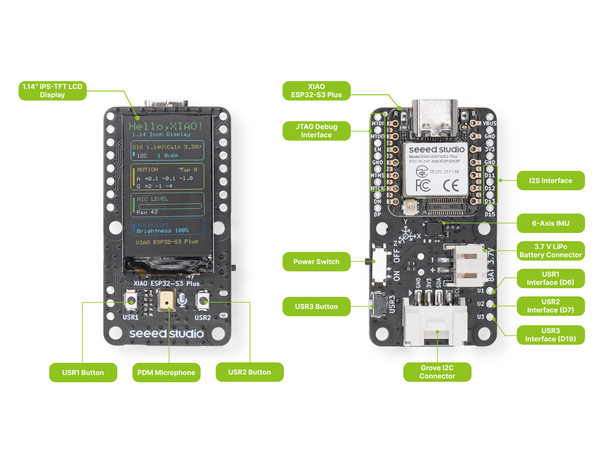
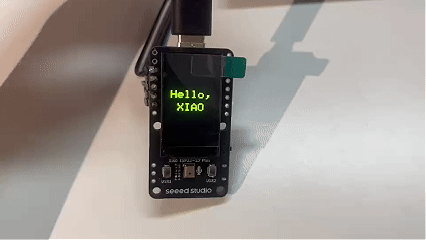

<!-- source: https://wiki.seeedstudio.com/getting_started_1.14_inch_display_esp32s3 | fetched: 2026-09-21 -->
# Getting Started with XIAO 1.14'' IPS Display (ESP32-S3) | Seeed Studio Wiki

| XIAO 1.14'' IPS Display (ESP32-S3) |
| --- |
|  |
| [**Get One Now 🖱️**](https://www.seeedstudio.com/1-14-Inch-Display-Powered-by-XIAO-ESP32-S3-Plus-p-6991.html) |

## Introduction

The 1.14'' IPS Display is an expansion board designed for the XIAO series, powered by the XIAO ESP32-S3 Plus. It features a 135×240 IPS color LCD, onboard PDM microphone, 6-axis IMU, Grove I2C connector, three user buttons, and battery voltage measurement — all integrated into a compact form factor.

This combination makes it an ideal platform for wearable devices, compact sensor nodes, portable instruments, and IoT prototyping where space is at a premium. With the ESP32-S3's dual-core processor, Wi-Fi, and Bluetooth capabilities, it extends the display into a wireless-connected device.

| Specification | Detail |
| --- | --- |
| Product Positioning | Sensing & Expansion |
| Core Controller | Seeed Studio XIAO ESP32-S3 Plus |
| Processor | ESP32-S3R8, Dual-Core, up to 240 MHz |
| Memory | 8 MB PSRAM + 16 MB Flash |
| Wireless Connectivity | 2.4 GHz Wi-Fi + BLE 5.0 |
| Display Type | 1.14" IPS TFT LCD |
| Resolution | 135 × 240 |
| Display Driver | ST7789 |
| Display Interface | SPI |
| Touch Input | No |
| 6-Axis IMU | Yes |
| PDM Digital Microphone | Yes |
| MicroSD Card Slot | No |
| Grove I2C Connector | Yes |
| User Buttons | 3 |
| Battery Connector | 2-pin JST, 3.7 V LiPo |
| Battery Monitoring | Battery voltage monitoring via D16 ADC; battery level can be estimated from the measured voltage. Battery status detection is not supported. |
| Expansion Interfaces | 1x I2S Interface, 1x JTAG Interface, 3x User Button Interface |
| Board Size | 26 × 48 × 10.6 mm |
| Best For | Sensor dashboards, Grove projects, physical controllers |

note

This display board is designed for the **XIAO ESP32-S3 Plus**. If you are using the XIAO nRF52840 Plus version, please refer to the [XIAO 1.14'' IPS Display (nRF52840)](https://wiki.seeedstudio.com/getting_started_1.14_inch_display_nrf52840/) guide instead.

note

The ESP32-S3 Plus uses D16 for voltage measurement. The voltage demo does not display battery percentage, and no charging-status signal is connected to an ESP32-S3 GPIO.

## Hardware Overview

Before we start, refer to the following image to understand the physical layout of the 1.14'' IPS Display.



### Pin Map

The 1.14'' IPS Display breaks out all XIAO ESP32-S3 Plus pins. The table below lists every pin, its net name on the display board, its function, and how it is connected to onboard peripherals.

| XIAO Pin | Net Name | Function Description | Hardware Connection Notes |
| --- | --- | --- | --- |
| D0 | PDM\_CLK | PDM digital microphone clock | Internally connected to PDM Mic |
| D1 | MIC\_DATA | PDM digital microphone data | Internally connected to PDM Mic |
| D2 | LCD\_CS | Screen chip select signal | Internally connected to LCD driver IC |
| D3 | LCD\_DC | Screen data/command switch | Internally connected to LCD driver IC |
| D4 | SDA | I2C data bus | Bus sharing: internally connected to IMU; externally exposed to Grove I2C connector |
| D5 | SCL | I2C clock bus | Bus sharing: internally connected to IMU; externally exposed to Grove I2C connector |
| D6 | BTN\_A | Physical button A (left) | Internally connected to front-left microswitch with external 1 KΩ pull-up. Externally exposed as U1 test pad |
| D7 | BTN\_B | Physical button B (right) | Internally connected to front-right microswitch with external 1 KΩ pull-up. Externally exposed as U2 test pad |
| D8 | SCK | Hardware SPI clock | Internally connected to LCD driver IC |
| D9 | NC | Floating (reserved) | No physical connection |
| D10 | MOSI | Hardware SPI data output | Internally connected to LCD driver IC |
| D11 | I2S\_SD | Audio data output | Externally exposed to bottom expansion pad |
| D12 | I2S\_SCK | Audio bit clock | Externally exposed to bottom expansion pad |
| D13 | I2S\_WS | Audio word select | Externally exposed to bottom expansion pad |
| D14 | IMU\_INT | IMU motion hardware interrupt | Internally connected to 6-axis IMU for asynchronous wake-up |
| D15 | NC | Reserved (test point) | Connected to test point TP15 on PCB, no functional peripheral |
| D16 | BAT\_ADC | Battery voltage detection | Internally connected to voltage divider circuit (316K / 160K). **Do not use externally** |
| D17 | LCD\_RST | Screen soft reset | Internally connected to LCD driver IC |
| D18 | LCD\_BL | Screen backlight control | Internally connected to backlight driver circuit |
| D19 | BTN\_C | Physical button C (side) | Internally connected to side microswitch with external 1 KΩ pull-up. Externally exposed as U3 test pad |

## Getting Started

This guide uploads a minimal **"Hello, XIAO"** sketch to the display board: the screen turns on its backlight, fills black, and prints **"Hello,"** and **"XIAO"** as two centered lines of large green text. It is the fastest way to confirm the screen and your development environment are working before diving into the individual peripheral demos.

### Software Preparation

You will need the following tools and libraries:

- **Arduino IDE** (version 1.8 or later)

[**Download Arduino IDE**](https://www.arduino.cc/en/software)

  

- **esp32 Boards by Espressif (3.3.11)** — add the following URL to **File > Preferences > Additional Boards Manager URLs**:

```text
https://espressif.github.io/arduino-esp32/package_esp32_index.json
```

Then go to **Tools > Board > Boards Manager**, search for **esp32** and install version **3.3.11**.

- **Seeed\_GFX2 (Manual Installation)** — this library is not available in the Library Manager and must be installed manually:

[**Download Seeed\_GFX2**](https://github.com/Seeed-Studio/Seeed_GFX2/archive/refs/tags/v1.0.0.zip)

  

**Step 1.** Click the button above to download `Seeed_GFX2` v1.0.0 as a ZIP file (pinned to a release tag so the tutorial stays reproducible). Alternatively, clone the repository from [Seeed-Studio/Seeed\_GFX2](https://github.com/Seeed-Studio/Seeed_GFX2).

**Step 2.** In the Arduino IDE, go to **Sketch > Include Library > Add .ZIP Library...** and select the downloaded ZIP. The IDE reads `library.properties` and installs it into the correct `Seeed_GFX2` folder automatically — you do not need to rename the extracted folder. (To install manually instead, unzip the archive and rename the extracted folder to `Seeed_GFX2` before placing it in `Documents/Arduino/libraries/`.)

**Step 3.** Restart the Arduino IDE so the new library is detected.

tip

- **Seeed\_GFX2** is Seeed Studio's graphics library built on a layered `Board` + `Panel Config` architecture. Each demo initializes the display with a single `display.begin<Board_..., Config_...>()` call — the **Board** template owns the pin map (CS/DC/SCK/MOSI/RST/BL), and the **Panel Config** bakes in the 135×240 resolution, color order, and orientation. No `driver.h` or manual pin setup is needed.
- On this board the sketch uses `Board_XIAO_1inch14_LCD<13, 12>` (RST=13, BL=12) with `Config_Seeed_1inch14_LCD_ST7789`.

### Download the Code

The example sketch is available on GitHub:

[**Download the Code**](https://github.com/Seeed-Projects/Display-Gadgets/tree/main/code_GFX2/getting_started_code/xiao_esp32s3_114_hello)

  

Navigate to `code_GFX2/getting_started_code/xiao_esp32s3_114_hello/` and open `xiao_esp32s3_114_hello.ino` in the Arduino IDE. **Download the complete folder** rather than copying the `.ino` source from the GitHub web view.

### Upload the Sketch

**Step 1.** Connect the XIAO ESP32-S3 Plus to your computer via the USB-C port.

**Step 2.** In Arduino IDE, select the board: **Tools > Board > esp32 > XIAO\_ESP32S3\_PLUS**.

**Step 3.** Select the correct **Port** under **Tools > Port**.

**Step 4.** Click the **Upload** button (→). The sketch will compile and upload to the board.

### Expected Output

After uploading, the screen lights up with a black background and shows two centered lines of large green text — **"Hello,"** on the first line and **"XIAO"** on the second. The greeting stays on screen without redrawing.



If the display fails to initialize, the sketch prints the library error message to the serial monitor at **115200** baud. Open **Tools > Serial Monitor** and set the baud rate to 115200 to read it.

## What's Next

The display board packs several onboard peripherals. The [Function](https://wiki.seeedstudio.com/function_1.14_inch_display_esp32s3/) page provides a standalone demo for each one:

| Peripheral | Demo |
| --- | --- |
| Screen | [GraphicTest](https://wiki.seeedstudio.com/function_1.14_inch_display_esp32s3/) — ten graphics primitives with timing benchmarks |
| IMU | [Electronic Quicksand + Raise to Wake](https://wiki.seeedstudio.com/function_1.14_inch_display_esp32s3/) — 6-axis motion effects and wake-on-motion |
| Microphone & Speaker | [Voice Bar + Flash Recorder](https://wiki.seeedstudio.com/function_1.14_inch_display_esp32s3/) — live PDM level meter and recording |
| Grove I2C | [SHT31 Temperature & Humidity](https://wiki.seeedstudio.com/function_1.14_inch_display_esp32s3/) — read a Grove SHT31 sensor |
| Buttons | [User Buttons](https://wiki.seeedstudio.com/function_1.14_inch_display_esp32s3/) — read presses and debounce with interrupts |
| Battery | [Battery Voltage Detection](https://wiki.seeedstudio.com/function_1.14_inch_display_esp32s3/) — measure the divider voltage |

## FAQ

### The board doesn't appear in the Tools > Board menu

Make sure you have added the ESP32 board package to Arduino IDE:

1. Go to **File > Preferences** and paste the URL below into **Additional Boards Manager URLs**:

   ```text
   https://espressif.github.io/arduino-esp32/package_esp32_index.json
   ```
2. Go to **Tools > Board > Boards Manager**, search for **esp32**, and install version **3.3.11**.
3. After installation, **Tools > Board > esp32 > XIAO\_ESP32S3\_PLUS** should appear in the menu.

If the board still doesn't show up, restart Arduino IDE and try again.

### [About Factory Firmware-DashBoard]

#### The I2C scan on the dashboard freezes — what should I do?

Press the **Reset** button on the XIAO ESP32-S3 Plus once to reboot the board. This clears the stuck I2C bus and the dashboard returns to normal.

We strongly recommend **against hot-plugging** devices on the I2C interface. Always power off the board before connecting or disconnecting anything on the Grove I2C connector or the SDA/SCL breakout pads — hot-plugging can hang the I2C bus.

## Resources

- **🗃️[PCB Design Files]** [XIAO 1.14'' IPS Display (ESP32-S3) KiCad Project](https://files.seeedstudio.com/wiki/Display_Gadgets/resources/kicad/XIAO%201.14%27%27%20IPS%20Display%20%28ESP32-S3%29%20KiCad%20Project.zip)
- **📄[Schematic]** [XIAO 1.14'' IPS Display (ESP32-S3) Schematic](https://files.seeedstudio.com/wiki/Display_Gadgets/resources/schematic/XIAO%201.14%27%27%20IPS%20Display%20%28ESP32-S3%29%20Schematic.pdf)
- **📦[3D Model]** [XIAO 1.14'' IPS Display (STEP)](https://files.seeedstudio.com/wiki/Display_Gadgets/resources/3d-model/XIAO%201.14%27%27%20IPS%20Display.step)
- **🖨️[3D Printed Enclosure]** [XIAO 1.14'' IPS Display Enclosure (by gokul)](https://www.printables.com/model/1843003-enclosure-for-xiao-114-ips-display-esp32nrf52840)
- **📄[Datasheet]** [1.14 Inch Display Datasheet](https://files.seeedstudio.com/wiki/Display_Gadgets/resources/datasheet/1.14%20Inch%20Display%20Datasheet.pdf)
- **💾[Factory Firmware]** [XIAO 1.14'' IPS Display (ESP32-S3) Factory Firmware](https://files.seeedstudio.com/wiki/Display_Gadgets/resources/firmware/XIAO%201.14%27%27%20IPS%20Display%20%28ESP32-S3%29%20Factory%20Firmware.zip)

## Tech Support & Product Discussion

Thank you for choosing our products! We are here to provide you with different support to ensure that your experience with our products is as smooth as possible. We offer several communication channels to cater to different preferences and needs.
