<!-- source: https://wiki.seeedstudio.com/xiao_esp32s3_getting_started/ | fetched: 2026-09-21 -->
# Getting Started with Seeed Studio XIAO ESP32-S3 Series | Seeed Studio Wiki

| Seeed Studio XIAO ESP32-S3 | Seeed Studio XIAO ESP32-S3 Sense | Seeed Studio XIAO ESP32-S3 Plus |
| --- | --- | --- |
|  |  |  |
| [**Get One Now 🖱️**](https://www.seeedstudio.com/XIAO-ESP32S3-p-5627.html) | [**Get One Now 🖱️**](https://www.seeedstudio.com/XIAO-ESP32S3-Sense-p-5639.html) | [**Get One Now 🖱️**](https://www.seeedstudio.com/Seeed-Studio-XIAO-ESP32S3-Plus-p-6361.html) |

## Introduction

Seeed Studio XIAO Series are diminutive development boards, sharing a similar hardware structure, where the size is literally thumb-sized. The code name "XIAO" here represents its half feature "Tiny", and the other half will be "Puissant".

Seeed Studio XIAO ESP32-S3 Sense integrates camera sensor, digital microphone and SD card supporting. Combining embedded ML computing power and photography capability, this development board can be your great tool to get started with intelligent voice and vision AI.

tip

The **OV2640 camera** has been discontinued, and the subsequent XIAO ESP32-S3 Sense uses the **OV3660 camera** model.However, the Wiki example code for the camera still applies.

### Specification

|  |  |  |  |
| --- | --- | --- | --- |
| Product | [XIAO ESP32-S3](https://www.seeedstudio.com/XIAO-ESP32S3-p-5627.html) | [XIAO ESP32-S3 Sense](https://www.seeedstudio.com/XIAO-ESP32S3-Sense-p-5639.html) | [XIAO ESP32-S3 Plus](https://www.seeedstudio.com/Seeed-Studio-XIAO-ESP32S3-Plus-p-6361.html) |
| Processor | ESP32-S3R8 Xtensa LX7 dual-core, 32-bit processor that operates at up to 240 MHz | | |
| Wireless | Complete 2.4GHz Wi-Fi subsystem Bluetooth Low Energy 5.0 / Bluetooth Mesh | | |
| Built-in Sensors | / | 1x OV3660 camera sensor 1x Digital Microphone | / |
| Memory | On-chip 8MB PSRAM & 8MB Flash | On-chip 8MB PSRAM & 8MB Flash Onboard SD Card Slot, supporting 32GB FAT | On-chip 8MB PSRAM & 16MB Flash |
| Interface | 1x UART 1x IIC 1x SPI 11x GPIO(PWM) 9x ADC 1x User LED 1x Charge LED 1x Reset button 1x Boot button | 1x UART 1x IIC 1x IIS 1x SPI 11x GPIOs (PWM) 9x ADC 1x User LED 1x Charge LED 1x B2B Connector (with 2 additional GPIOs) 1x Reset button 1x Boot button | 2x UART 1x IIC 1x IIS 2x SPI 18x GPIOs (PWM) 9x ADC 1x User LED 1x Charge LED 1x B2B Connector 1x Reset button 1x Boot button |
| Dimensions | 21 x 17.8mm | 21 x 17.8 x 15mm (with expansion board) | 21 x 17.8mm |
| Power(Typ.) | Input voltage (Type-C): 5V Input voltage (BAT): 3.7V | | |
| Power Consumption | Circuit operating Voltage: - Type-C: 5V@19mA - BAT: 3.8V@22mA | Circuit operating Voltage: `- Type-C: [email protected]` `- BAT: [email protected] (with expansion board)` | Circuit operating Voltage: - Type-C: 5V@28mA - BAT: 3.8V@35mA |
| / | Webcam Web application: - Type-C: -- Average power Consumption: 5V/~140mA -- Peak power consumption(Image Capture): 5V/~347mA - Battery: -- Average power Consumption: 3.8V/~155mA -- Peak power consumption(Image Capture): 3.8V/~366mA | / |
| / | Microphone recording & SD card writing: - Type-C: -- Average power consumption: 5V/54.58mA -- Peak power consumption: 5V/86.7mA - Battery: -- Average power consumption: 3.8V/64.5mA -- Peak power consumption: 3.8V/109.3mA | / |
| 50mA(Fast) / 3.8mA(Trickle) | / | Charging current: 100mA(Fast) / 0.9mA(Trickle) |
| Low Power Consumption Model(Typ.) (Supply Power: 3.8V) | Modem-sleep Mode: 27mA Light-sleep Mode: 2mA Deep Sleep Mode: 14μA | Modem-sleep Mode: 44mA Light-sleep Mode: 5mA Deep Sleep Mode: 3mA | Modem-sleep Mode: 3.8V/31.6 mA Light-sleep Mode: 3.8V/2.45 mA Deep Sleep Mode: 3.8V/33.51 μA |
| Wi-Fi Enabled Power Consumption(Typ.) | Active Mode: 100 mA | Active Mode: 110 mA (with expansion board) | Active Mode: 81 mA |
| BLE Enabled Power Consumption(Typ.) | Active Mode: 85 mA | Active Mode: 102 mA (with expansion board) | Active Mode: 101 mA |
| Working Temperature | -20°C ~ 65°C | | |

### Features

- **Powerful MCU Board**: Incorporate the ESP32S3 32-bit, dual-core, Xtensa processor chip operating up to 240 MHz, mounted multiple development ports, Arduino / MicroPython supported
- **Advanced Functionality** (for Sense): Detachable **OV2640 camera sensor for 1600x1200** resolution and **OV3660 camera sensor for 2048x1536** compatible with OV5640 camera sensor, intergating additional digital microphone
- **Elaborate Power Design**: Lithium battery charge management capability, offer 4 power consumption model which allows for deep sleep mode with power consumption as low as 14μA
- **Great Memory for more Possibilities**: Offer 8MB PSRAM and 8MB FLASH (16MB in **Plus** version), supporting SD card slot for external 32GB FAT memory (only for XIAO ESP32-S3)
- **Outstanding RF performance**: Support 2.4GHz Wi-Fi and BLE dual wireless communication, support 100m+ remote communication when connected with U.FL antenna
- **Thumb-sized Compact Design**: 21 x 17.8mm, adopting the classic form factor of XIAO, suitable for space limited projects like wearable devices

| Item | OV3660 Camera | OV2640 Camera |
| --- | --- | --- |
| MAX Power Consumption on (640\*480) | Active Model: **~ 0.6A** | Active Model: **~ 0.65A** |
| AVG Power Consumption on (640\*480) | Active Model: **~ 0.12A** | Active Model: **~ 0.24A** |
| MIN Power Consumption on (640\*480) | Active Model: **~ 0.12A** | Active Model: **~ 0.15A** |

## Hardware Overview

Before everything starts, it is quite essential to have some basic parameters of the product. The following table provides information about the characteristics of Seeed Studio XIAO ESP32-S3.

- XIAO ESP32-S3
- XIAO ESP32-S3 Sense
- XIAO ESP32-S3 Plus

### XIAO ESP32-S3 Front


### XIAO ESP32-S3 Back


**Pin Map**

| XIAO Pin | Function | Chip Pin | Alternate Functions | Description |
| --- | --- | --- | --- | --- |
| 5V | VBUS |  |  | Power Input/Output |
| GND |  |  |  |  |
| 3V3 | 3V3\_OUT |  |  | Power Output |
| D0 | Analog | GPIO1 | TOUCH1 | GPIO, ADC |
| D1 | Analog | GPIO2 | TOUCH2 | GPIO, ADC |
| D2 | Analog | GPIO3 | TOUCH3 | GPIO, ADC |
| D3 | Analog | GPIO4 | TOUCH4 | GPIO, ADC |
| D4 | Analog, SDA | GPIO5 | TOUCH5 | GPIO, I2C Data, ADC |
| D5 | Analog, SCL | GPIO6 | TOUCH6 | GPIO, I2C Clock, ADC |
| D6 | TX | GPIO43 |  | GPIO, UART Transmit |
| D7 | RX | GPIO44 |  | GPIO, UART Receive |
| D8 | Analog, SCK | GPIO7 | TOUCH7 | GPIO, SPI Clock, ADC |
| D9 | Analog, MISO | GPIO8 | TOUCH8 | GPIO, SPI Data, ADC |
| D10 | Analog, MOSI | GPIO9 | TOUCH9 | GPIO, SPI Data, ADC |
| D11 | Analog | GPIO42 | TOUCH12 | GPIO, ADC |
| D12 | Analog | GPIO41 | TOUCH13 | GPIO, ADC |
| MTDO |  | GPIO40 |  | JTAG |
| MTDI |  | GPIO41 |  | JTAG, ADC |
| MTCK |  | GPIO39 |  | JTAG, ADC |
| MTMS |  | GPIO42 |  | JTAG, ADC |
| Reset |  | CHIP\_PU |  |  |
| Boot |  | GPIO0 |  | Enter Boot Mode |
| U.FL-R-SMT1 |  | LNA\_IN |  | UFL antenna |
| CHARGE\_LED |  |  |  | CHG-LED |
| USER\_LED |  | GPIO21 |  | User Light |

### XIAO ESP32-S3 Sense Front

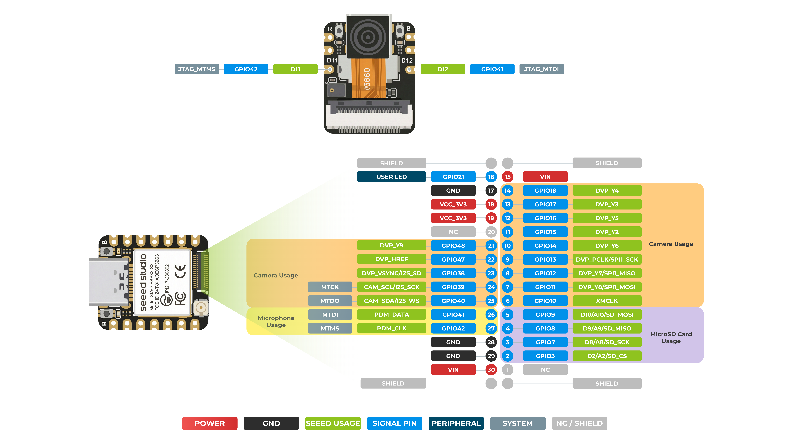

### XIAO ESP32-S3 Sense Back

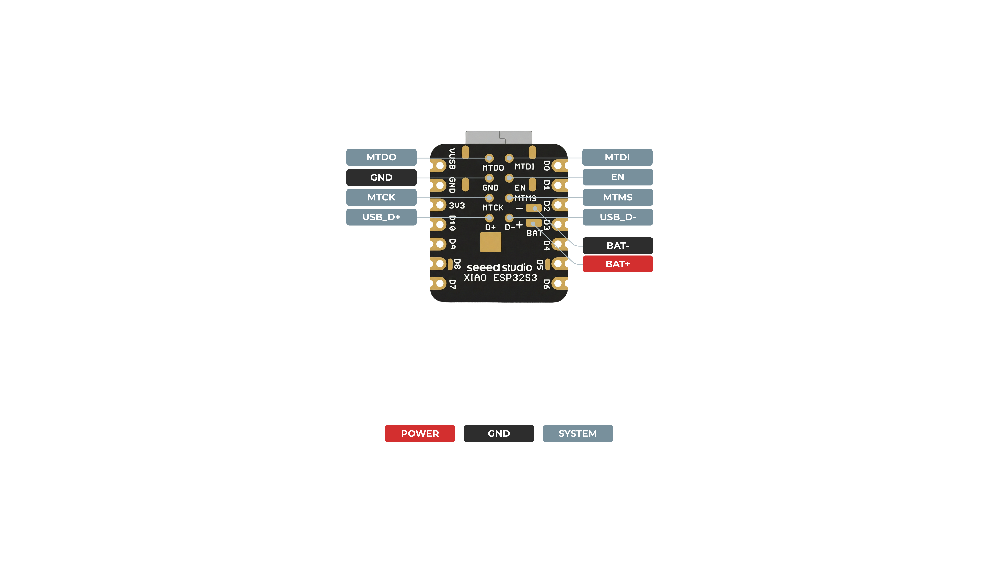

**Pin Map**

| XIAO Pin | Function | Chip Pin | Alternate Functions | Description |
| --- | --- | --- | --- | --- |
| 5V | VBUS |  |  | Power Input/Output |
| GND |  |  |  |  |
| 3V3 | 3V3\_OUT |  |  | Power Output |
| D0 | Analog | GPIO1 | TOUCH1 | GPIO, ADC |
| D1 | Analog | GPIO2 | TOUCH2 | GPIO, ADC |
| D2 | Analog | GPIO3 | TOUCH3 | GPIO, ADC |
| D3 | Analog | GPIO4 | TOUCH4 | GPIO, ADC |
| D4 | Analog, SDA | GPIO5 | TOUCH5 | GPIO, I2C Data, ADC |
| D5 | Analog, SCL | GPIO6 | TOUCH6 | GPIO, I2C Clock, ADC |
| D6 | TX | GPIO43 |  | GPIO, UART Transmit |
| D7 | RX | GPIO44 |  | GPIO, UART Receive |
| D8 | Analog, SCK | GPIO7 | TOUCH7 | GPIO, SPI Clock, ADC |
| D9 | Analog, MISO | GPIO8 | TOUCH8 | GPIO, SPI Data, ADC |
| D10 | Analog, MOSI | GPIO9 | TOUCH9 | GPIO, SPI Data, ADC |
| D11 | Analog | GPIO42 | TOUCH12 | GPIO, ADC |
| D12 | Analog | GPIO41 | TOUCH13 | GPIO, ADC |
| MTDO |  | GPIO40 |  | JTAG |
| MTDI |  | GPIO41 |  | JTAG, ADC |
| MTCK |  | GPIO39 |  | JTAG, ADC |
| MTMS |  | GPIO42 |  | JTAG, ADC |
| Reset |  | CHIP\_PU |  |  |
| Boot |  | GPIO0 |  | Enter Boot Mode |
| U.FL-R-SMT1 |  | LNA\_IN |  | UFL antenna |
| CHARGE\_LED |  |  |  | CHG-LED |
| USER\_LED |  | GPIO21 |  | User Light |
| Digital microphone\_CLK |  | GPIO42 |  | PDM clock pin for MIC |
| Digital microphone\_DATA |  | GPIO41 |  | PDM data pin for MIC |
| Onboard SD Card\_\_CS |  | GPIO21 |  | SD card chip select pin |
| Onboard SD Card\_SCK |  | GPIO7 |  | SD card clock pin |
| Onboard SD Card\_MISO |  | GPIO8 |  | SD card data input pin |
| Onboard SD Card Slot\_MOSI |  | GPIO9 |  | SD card data output pin |

**Camera**

| Chip Pin | Description |
| --- | --- |
| GPIO10 | Camera-related clock pin |
| GPIO11 | Camera video data pin (Y8) |
| GPIO12 | Camera video data pin (Y7) |
| GPIO13 | Camera pixel clock pin |
| GPIO14 | Camera video data pin (Y6) |
| GPIO15 | Camera video data pin (Y2) |
| GPIO16 | Camera video data pin (Y5) |
| GPIO17 | Camera video data pin (Y3) |
| GPIO18 | Camera video data pin (Y4) |
| GPIO40 | I2C data pin for Camera |
| GPIO39 | I2C clock pin for Camera |
| GPIO38 | Camera vertical sync pin |
| GPIO47 | Camera horizontal sync pin |
| GPIO48 | Camera video data pin (Y9) |

### XIAO ESP32-S3 Plus Front

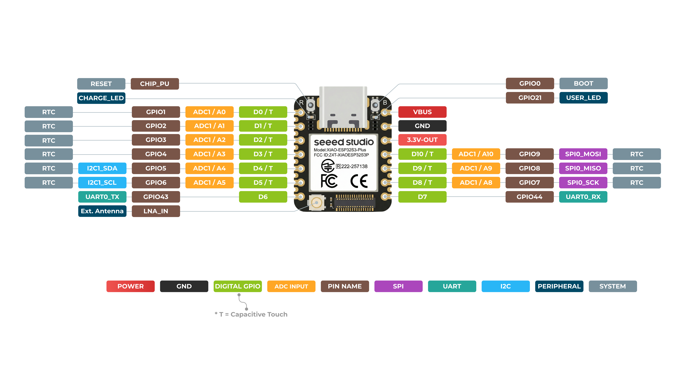

### XIAO ESP32-S3 Plus Back

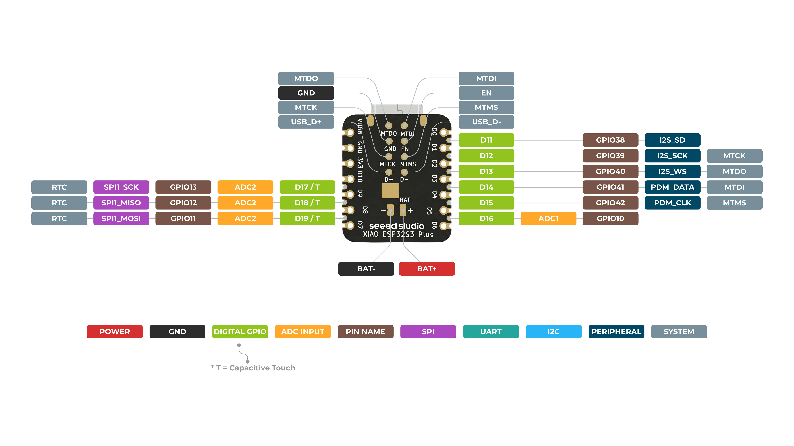

**Pin Map**

| XIAO Pin | Function | Chip Pin | Alternate Functions | Description |
| --- | --- | --- | --- | --- |
| 5V | VBUS |  |  | Power Input/Output |
| GND |  |  |  |  |
| 3V3 | 3V3\_OUT |  |  | Power Output |
| D0 | Analog | GPIO1 |  | GPIO, ADC |
| D1 | Analog | GPIO2 |  | GPIO, ADC |
| D2 | Analog | GPIO3 |  | GPIO, ADC |
| D3 | Analog | GPIO4 |  | GPIO, ADC |
| D4 | Analog, SDA | GPIO5 |  | GPIO, I2C Data, ADC |
| D5 | Analog, SCL | GPIO6 |  | GPIO, I2C Clock, ADC |
| D6 | TX | GPIO43 |  | GPIO, UART Transmit |
| D7 | RX | GPIO44 |  | GPIO, UART Receive |
| D8 | Analog, SCK | GPIO7 |  | GPIO, SPI Clock, ADC |
| D9 | Analog, MISO | GPIO8 |  | GPIO, SPI Data, ADC |
| D10 | Analog, MOSI | GPIO9 |  | GPIO, SPI Data, ADC |
| D11 |  | GPIO38 |  | GPIO, ADC |
| D12 |  | GPIO39 |  | GPIO, ADC |
| D13 |  | GPIO40 |  |  |
| D14 |  | GPIO41 |  |  |
| D15 |  | GPIO42 |  |  |
| D16 |  | GPIO10 |  |  |
| D17 |  | GPIO13 |  |  |
| D18 |  | GPIO12 |  |  |
| D19 |  | GPIO11 |  |  |
| MTDO |  | GPIO40 |  | JTAG |
| MTDI |  | GPIO41 |  | JTAG, ADC |
| MTCK |  | GPIO39 |  | JTAG, ADC |
| MTMS |  | GPIO42 |  | JTAG, ADC |
| Reset |  | CHIP\_PU |  |  |
| Boot |  | GPIO0 |  | Enter Boot Mode |
| ADC\_BAT |  | GPIO10 |  | Read the BAT voltage value |
| U.FL-R-SMT1 |  | LNA\_IN |  | UFL antenna |
| CHARGE\_LED |  | VCC\_3V3 |  | CHG-LED |
| USER\_LED |  | GPIO21 |  | User Light |

caution

- Although the XIAO ESP32-S3 assigns GPIO41 and GPIO42 to pins A11 and A12, due to the nature of the ESP32-S3 chip, pins A11 and A12 do not support ADC functionality. Please be sure to distinguish and differentiate between them.
- The B2B connector of XIAO ESP32-S3 Plus is compatible with [Wio-SX1262 extension board](https://www.seeedstudio.com/Wio-SX1262-with-XIAO-ESP32S3-p-5982.html) but not with Plug-in camera sensor board.

### Power Pins

- 5V - This is 5v out from the USB port. You can also use this as a voltage input but you must have some sort of diode (schottky, signal, power) between your external power source and this pin with anode to battery, cathode to 5V pin.
- 3V3 - This is the regulated output from the onboard regulator. You can draw 700mA
- GND - Power/data/signal ground

### Strapping Pins

At each startup or reset, a chip requires some initial configuration parameters, such as in which boot mode to load the chip, voltage of flash memory, etc. These parameters are passed over via the strapping pins. After reset, the strapping pins operate as regular IO pins.

The parameters controlled by the given strapping pins at chip reset are as follows:

- **Chip boot mode** – GPIO0 and GPIO46
- **VDD\_SPI voltage** – GPIO45
- **ROM messages printing** – GPIO46
- **JTAG signal source** – GPIO3

GPIO0, GPIO45, and GPIO46 are connected to the chip’s internal weak pull-up/pull-down resistors at chip reset.
These resistors determine the default bit values of the strapping pins. Also, these resistors determine the bit values if the strapping pins are connected to an external high-impedance circuit.

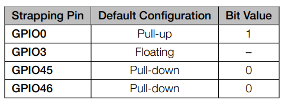

To change the bit values, the strapping pins should be connected to external pull-down/pull-up resistances. If the ESP32-S3 is used as a device by a host MCU, the strapping pin voltage levels can also be controlled by the host MCU.

All strapping pins have latches. At system reset, the latches sample the bit values of their respective strapping pins and store them until the chip is powered down or shut down. The states of latches cannot be changed in any other way. It makes the strapping pin values available during the entire chip operation, and the pins are freed up to be used as regular IO pins after reset.

Regarding the timing requirements for the strapping pins, there are such parameters as setup time and hold time.

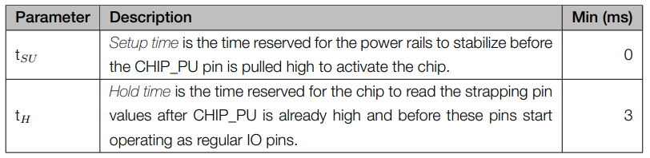

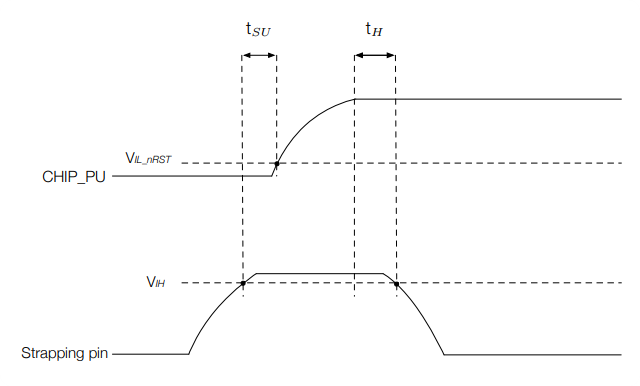

## Getting Started

To enable you to get started with the XIAO ESP32-S3 faster, please read the hardware and software preparation below to prepare the XIAO.

1. **XIAO ESP32-S3**

The factory program preset in the regular version is the touch pin light-up program. When you power up the XIAO, touch some of its pins and the orange user indicator will light up.

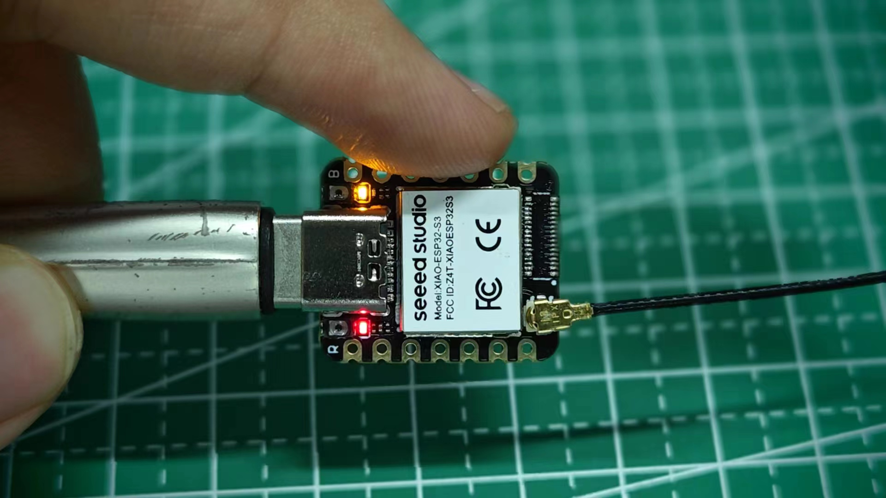

2. **XIAO ESP32-S3 Sense**

The XIAO ESP32-S3 Sense is shipped with the WebCam sample program pre-installed. You can use this program by giving the XIAO a good antenna installation and powering it up. For details, you can read the Wiki about this program.

- [Video Streaming](https://wiki.seeedstudio.com/xiao_esp32s3_camera_usage)

note

Starting from **June 2025**, the factory firmware of XIAO ESP32-S3 Sense enables a default AP Wi‑Fi with the following credentials:

- **SSID:** `XIAO_ESP32S3_Sense`
- **Password:** `seeedstudio`

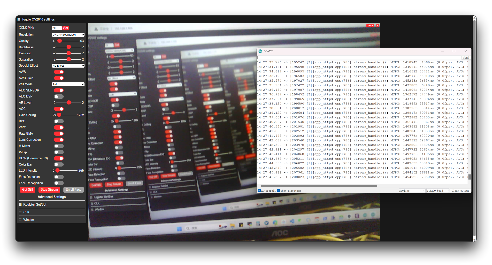

### Hardware Preparation

#### Solder header

XIAO ESP32-S3 is shipped without pin headers by default, you need to prepare your own pin headers and solder it to the corresponding pins of XIAO so that you can connect to the expansion board or sensor.

Due to the miniature size of XIAO ESP32-S3, please be careful when soldering headers, do not stick different pins together, and do not stick solder to the shield or other components. Otherwise, it may cause XIAO to short circuit or not work properly, and the consequences caused by this will be borne by the user.

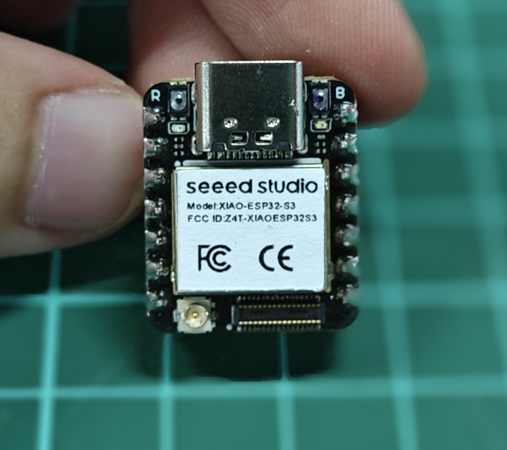

#### Installation of antenna

On the bottom left of the front of XIAO ESP32-S3, there is a separate "WiFi/BT Antenna Connector". In order to get better WiFi/Bluetooth signal, you need to take out the antenna inside the package and install it on the connector.

There is a little trick to the installation of the antenna, if you press down hard on it directly, you will find it very difficult to press and your fingers will hurt! The correct way to install the antenna is to put one side of the antenna connector into the connector block first, then press down a little on the other side, and the antenna will be installed.

Remove the antenna is also the case, do not use brute force to pull the antenna directly, one side of the force to lift, the antenna is easy to take off.

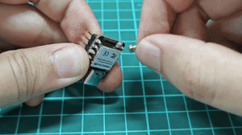

#### Installation of expansion boards (for Sense)

If you are shopping for the XIAO ESP32-S3 Sense, then you should also include an expansion board. This expansion board has a 1600x1200 OV2640/2048x1536 OV3660 camera sensor, Onboard SD Card Slot and digital microphone.

By installing the expansion board with XIAO ESP32-S3 Sense, you can use the functions on the expansion board.

Installing the expansion board is very simple, you just need to align the connector on the expansion board with the B2B connector on the XIAO ESP32-S3, press it hard and hear a "click", the installation is complete.

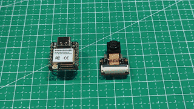

We now have a new fully XIAO ESP32-S3 Sense-compatible powerful camera, the OV5640, on our shelves, and if you purchase it, you can replace the camera to use it.

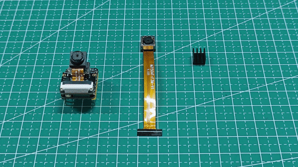

[**Get One Now 🖱️**](https://www.seeedstudio.com/OV5640-Camera-for-XIAO-ESP32S3-Sense-With-Heat-Sink-p-5739.html)

If you need to know the detailed parameter information of ov5640, you can refer to the following chart.

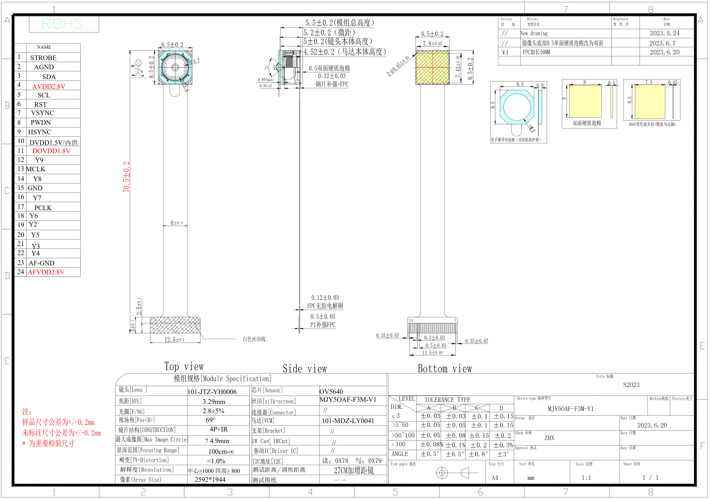

tip

All the programs about cameras in the Wiki are compatible with both OV5640、OV2640 and OV3660 cameras.

##### Removing the expansion board

If you need to separate the Sense expansion board from the XIAO ESP32-S3, use the same side-entry approach as installation — but in reverse.

**Step 1.** Hold the XIAO ESP32-S3 firmly in one hand and the expansion board in the other.

**Step 2.** Apply gentle pressure from the **side** of the board pair and slide the expansion board off the B2B connector. Work along one edge first, then release the rest of the connector gradually.

**Step 3.** Once the expansion board is free, set it aside on a flat, static-safe surface.

Do not pry the boards apart vertically

Never pull the expansion board **straight up** or **straight down**, and do not twist or rock the two boards like opening a book. The XIAO and the expansion board are joined by a **B2B (board-to-board) connector** — prying in the vertical direction can bend pins, crack the connector housing, or break the B2B socket on the XIAO itself.

Always separate the boards by pushing or sliding from the **side**, keeping the motion parallel to the connector. If it feels stuck, recheck your angle and apply steady side pressure instead of increasing upward force.

#### Installing the Upgraded Heat Sink

Ensure optimal cooling for your XIAO ESP32-S3 Sense by installing our upgraded heat sink. This new design is tailored to address the cooling deficiencies observed with the previous models, particularly during intensive operations like camera usage. Feedback highlighted that the original heat sink did not adequately dissipate heat, leading to the development of a more effective solution.

Click to View Performance Comparison

Our testing has demonstrated the benefits of the upgraded heat sink over the original setup:

| Test Sample | Peak Temperature on Backside |
| --- | --- |
| **Without Heat Sink** | 63.6°C |
| **With dual Heat Sinks** | 53.5°C (🔻10°C) |

***Test Details:***

- **Environment**: Air-conditioned room (approximately 27°C)
- **Temperature Measuring Tool**: OMEGA CL3515R thermocouple
- **Measurement Location**: Backside thermal pad of the XIAO ESP32-S3
- **Testing Firmware**: WebCamera
- **Power Supply**: Type-C 5V
- **Operating Duration**: 1 hour

***Key result:***

- The device equipped with the heat sink maintained stable operation for over an hour, reaching its peak temperature without performance degradation.
- During testing with the WebCamera in SVGA (800x600) mode:
  - The XIAO ESP32-S3 operated smoothly.
  - The video output was fluid.
  - There was a significant reduction in temperature, ensuring reliable performance without any frame drops or disconnections.

***Gather the following items before starting the installation:***

- Selected heat sink (single or dual)
- A clean ESP32S3

Ensure your device is powered off and unplugged from any power source before you start.

notice

***Purchasing Note:*** When purchasing your XIAO ESP32-S3 Sense, it's important to note that only **models equipped with a camera** come with a heat sink included. If you have a version of the ESP32S3 that does not include a camera, you will need to purchase a heat sink separately.

***Installation Tip:*** Prioritize covering the Thermal PAD with the heat sink, as it is directly above the ESP32S3 chip, the primary source of heat. Proper alignment ensures optimal heat dissipation, and note keep the BAT pins as unobstructed as possible.

Now, let’s begin the installation process:

***Step 1. Prepare the Heat Sink:***
Start by removing the protective cover from the heat sink to expose the thermal adhesive. This will prepare the heat sink for a secure attachment to the ESP32S3 chip.

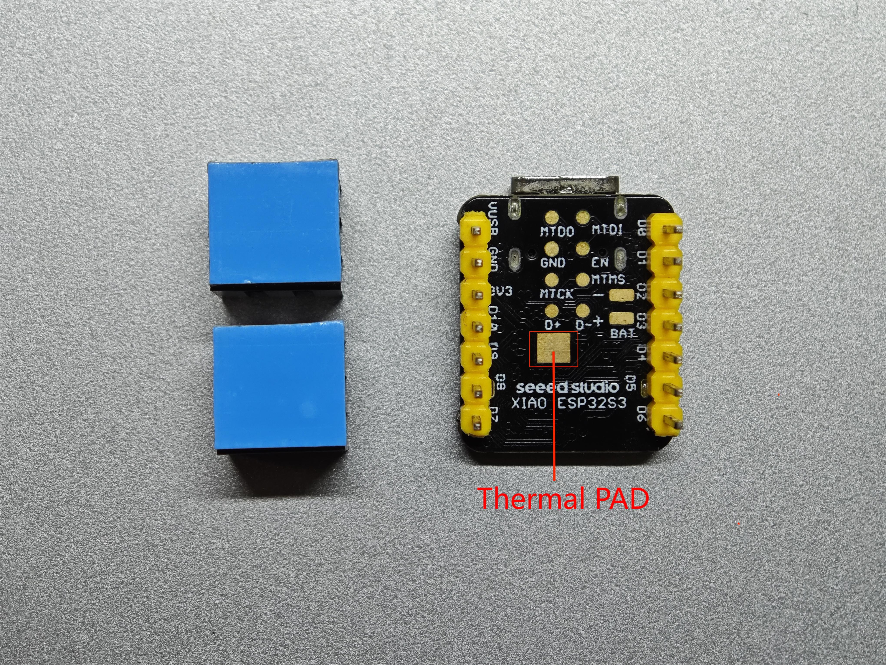

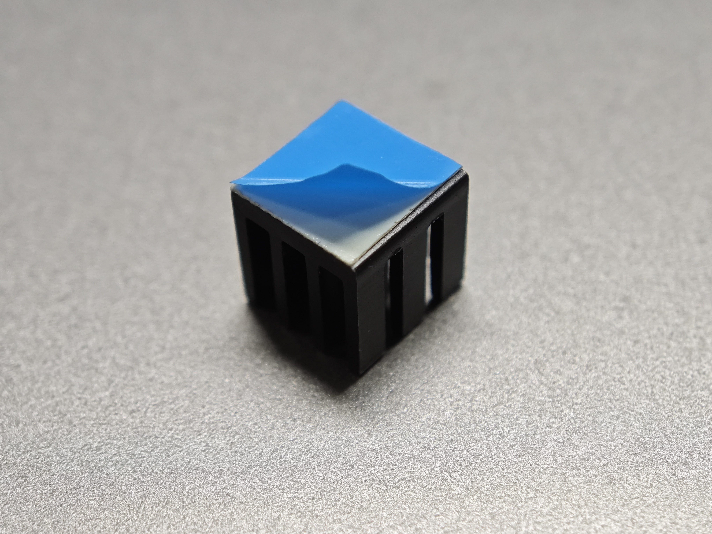

***Step 2. Assemble the Heat Sink:***

- Single Heat Sink
- Dual Heat Sinks

This smaller, compact option is sufficient for regular use and allows full access to all GPIO pins.

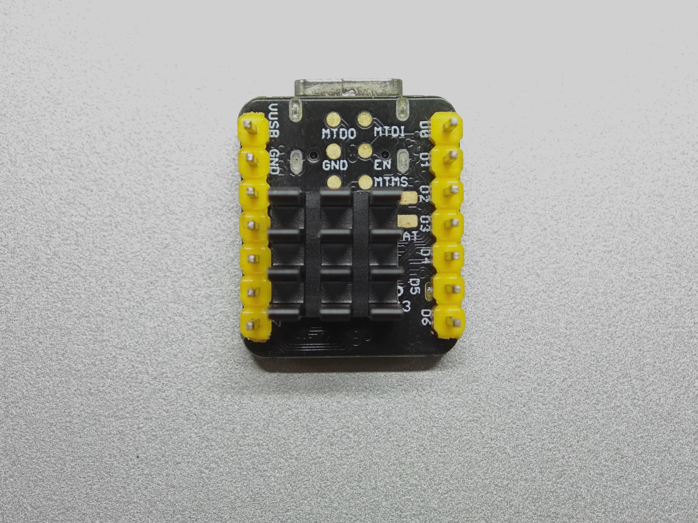

The larger option provides superior cooling, which is ideal for high-performance tasks but may limit access to some GPIO pins.

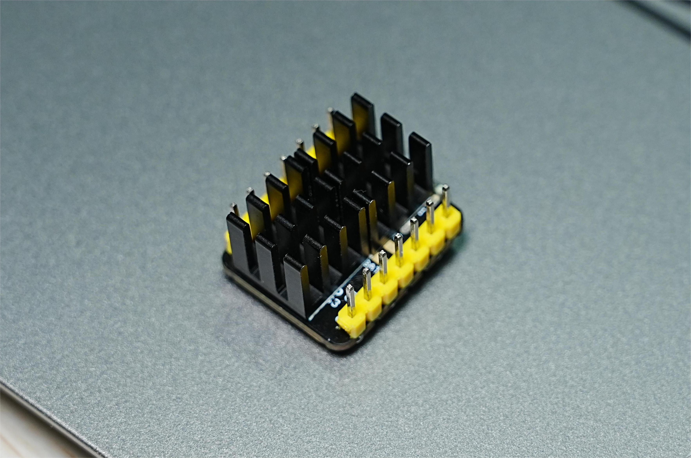

note

If you want to use the BAT pin of the XIAO ESP32-S3 Plus, this case dual heat sink is not suitable for it.

***Step 3: Final Inspection and Testing***

After installation, ensure everything is properly secured with no risk of short circuits. Verify that the heat sink is properly aligned and securely attached.

### Software Preparation

The recommended programming tool for the XIAO ESP32-S3 is the Arduino IDE, so as part of the software preparation, you will need to complete the Arduino installation.

tip

If this is your first time using Arduino, we highly recommend you to refer to [Getting Started with Arduino](https://wiki.seeedstudio.com/Getting_Started_with_Arduino/).

- **Step 1.** Download and Install the stable version of Arduino IDE according to your operating system.

[**Download Arduino IDE**](https://www.arduino.cc/en/software)

- **Step 2.** Launch the Arduino application.
- **Step 3.** Add ESP32 board package to your Arduino IDE.

- For Windows
- For Mac OS

Navigate to **File > Preferences**, and fill **"Additional Boards Manager URLs"** with the url below:

```text
https://raw.githubusercontent.com/espressif/arduino-esp32/gh-pages/package_esp32_index.json
```

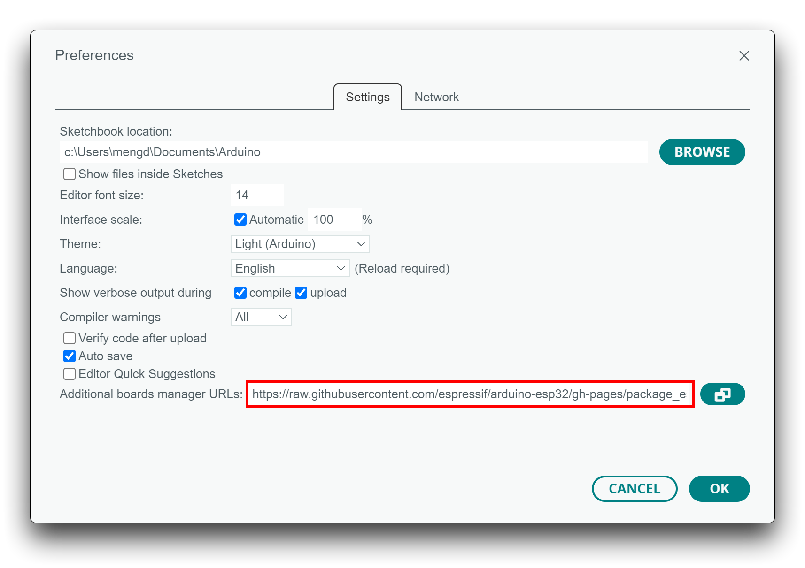

Navigate to **Tools > Board > Boards Manager...**, type the keyword **esp32** in the search box, select the latest version of **esp32**, and install it.

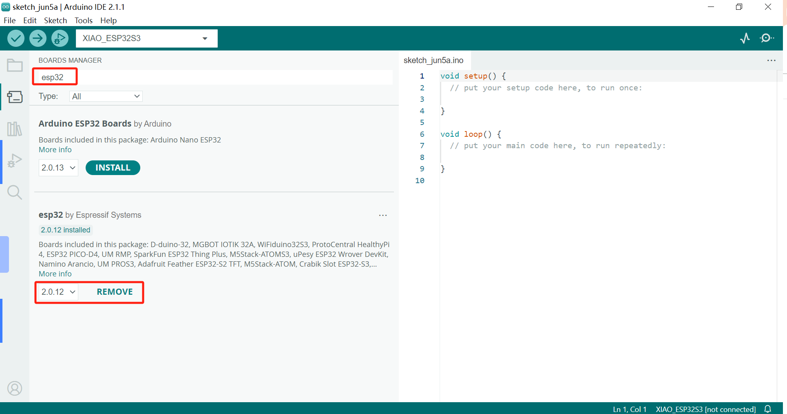

caution

The on-board package for XIAO ESP32-S3 requires version **2.0.8** and above to be available.

- **Step 4.** Select your board and port.

On top of the Arduino IDE, you can select the port directly. This is likely to be COM3 or higher (**COM1** and **COM2** are usually reserved for hardware serial ports).

Navigate to **Arduino IDE > Preferences**, and fill **"Additional Boards Manager URLs"** with the url below:

```text
https://raw.githubusercontent.com/espressif/arduino-esp32/gh-pages/package_esp32_index.json
```

|  |  |
| --- | --- |
|  |  |

Navigate to **Tools > Board > Boards Manager...**, type the keyword **esp32** in the search box, select the latest version of **esp32**, and install it.


caution

The on-board package for XIAO ESP32-S3 requires version **2.0.8** and above to be available.

- **Step 4.** Select your board and port.

At the top of the Arduino IDE you can directly select the port. This will probably be the one with "usbmodem" or "usbserial" in the name. If you're unsure, unplug and plug again to see which port is missing.

- for XIAO ESP32-S3 (Sense)
- for XIAO ESP32-S3 Plus

Also, search for **xiao** in the development board on the left. select **XIAO\_ESP32S3**.

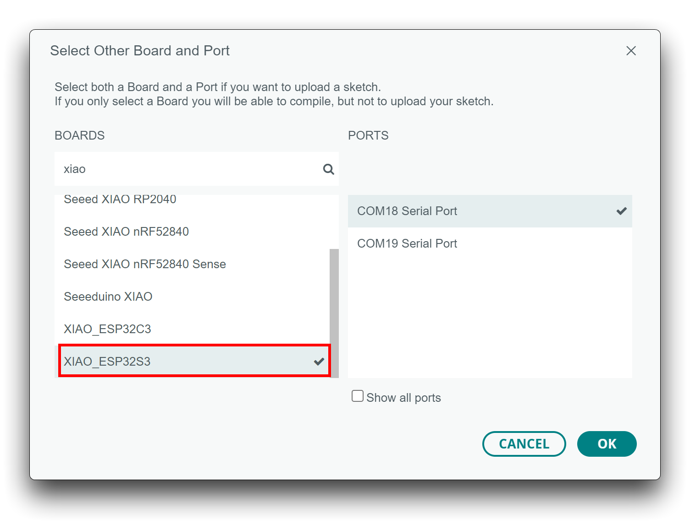

It will be released soon; keep tuned for future updates.

With this preparation, you can start writing programs for XIAO ESP32-S3 to compile and upload.

### BootLoader Mode

Sometimes, using the wrong program can cause the XIAO to lose its port or not function correctly. Common issues include:

- The XIAO is connected to the computer, but *no port number* is found.
- The XIAO is connected, and a port number appears, but the *program upload fails*.

When you encounter the above two situations, you can try to put XIAO into BootLoader mode, which can solve most of the problems of unrecognized devices and failed uploads. The specific method is:

- **Step 1**. Press and hold the `BOOT` button on the XIAO ESP32-S3 without releasing it.
- **Step 2**. Keep the `BOOT` button pressed and then connect to the computer via the data cable. Release the `BOOT` button after connecting to the computer.
- **Step 3**. Upload the **File > Examples > 01.Basics > Blink** program to check the operation of the XIAO ESP32-S3.

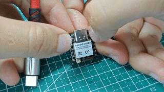

### Reset

When the program runs abnormally, you can press `Reset` once during power-up to let XIAO re-execute the uploaded program.

When you press and hold the `BOOT` key while powering up and then press the `Reset` key once, you can also enter BootLoader mode.

### Run your first Blink program

By now, I believe you have a good understanding of the features and hardware of the XIAO ESP32-S3. Next, let's take the simplest Blink program as an example and perform the first blink for your XIAO ESP32-S3!

- **Step 1.** Launch the Arduino application.
- **Step 2.** Navigate to **File > Examples > 01.Basics > Blink**, open the program.

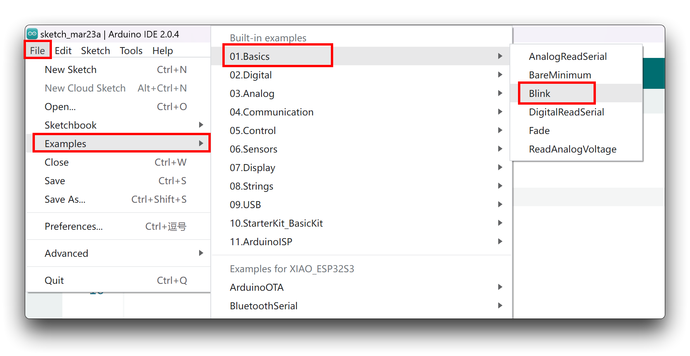

- **Step 3.** Select the board model to **XIAO ESP32-S3**, and select the correct port number to upload the program.

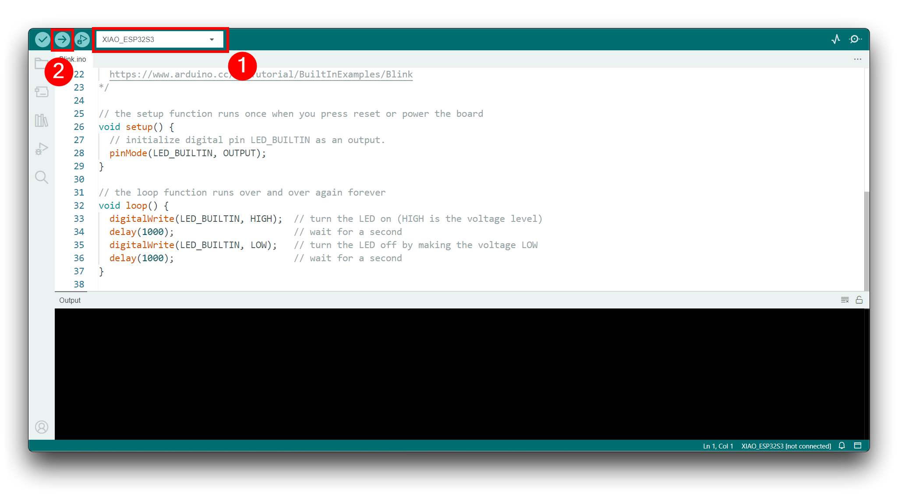

Once the program is successfully uploaded, you will see the following output message and you can observe that the orange LED on the right side of the XIAO ESP32-S3 is blinking.

|  |  |
| --- | --- |
|  |  |

Congratulations, you've learned how to write and upload programs for the XIAO ESP32-S3!

note

The LED will only turn off when the user LED pin on the XIAO ESP32-S3 is set to a high level, and it will only turn on when the pin is set to a low level.

## Battery Usage

The XIAO ESP32-S3 series has a built-in power management chip that allows the XIAO ESP32-S3 to be powered independently by using a battery or to charge the battery through the XIAO ESP32-S3's USB port.

If you want to connect the battery for XIAO, we recommend you to purchase qualified rechargeable 3.7V lithium battery. When soldering the battery, please be careful to distinguish between the positive and negative terminals. The negative terminal of the power supply should be the side closest to the USB port, and the positive terminal of the power supply is the side away from the USB port.

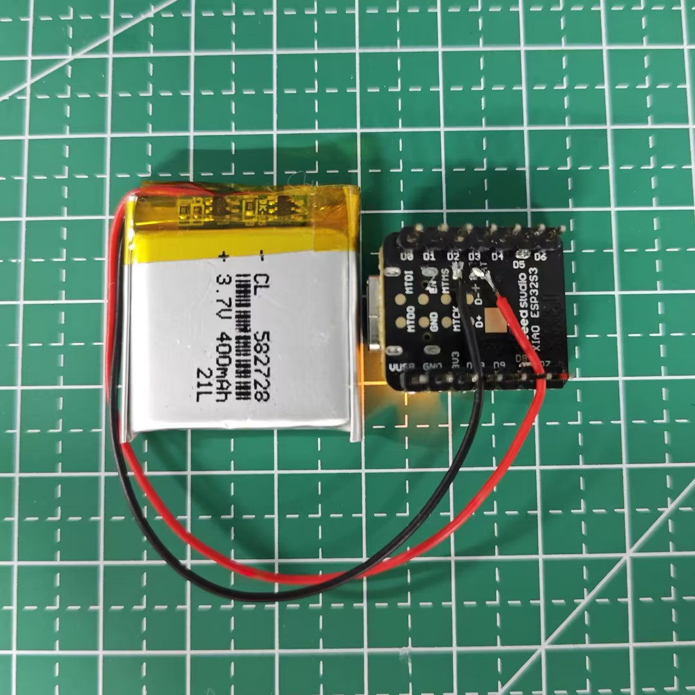

note

Since all GPIO pins of the XIAO ESP32-S3 are assigned their own functions, we do not have a GPIO configured for the battery pin. this means that we cannot get the battery voltage at the software level by reading the analog value of one of the GPIOs. If necessary, you can consider connecting the positive and negative terminals of the battery to two of the pins to measure the battery voltage.

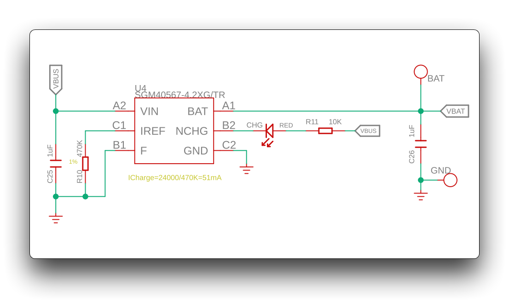

caution

When you use battery power, there will be no voltage on the 5V pin.

At the same time, we designed a red indicator light for battery charging, through the indicator light display to inform the user of the current state of the battery in the charge.

1. When XIAO ESP32-S3 is not connected to the battery, the red light comes on when the Type-C cable is connected and goes off after 30 seconds.
2. The red light flashes when the battery is connected and the Type-C cable is connected for charging.
3. When connecting Type-C to charge the battery fully, the red light turns off.

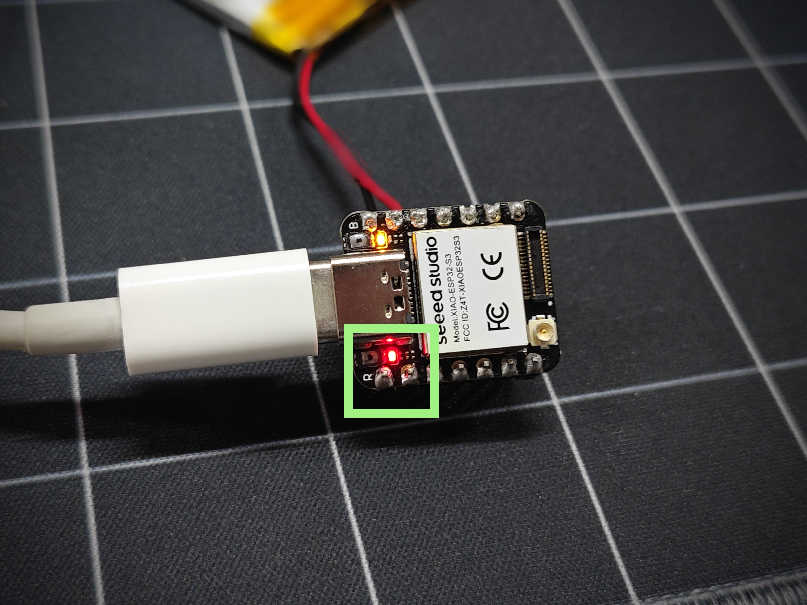

## UF2 BootLoader

We understand that some users are looking to flash UF2 files directly to XIAO, which will enable the process of batch flashing programs. Here we will describe this method.

- Method I
- Method II

note

This method is currently only available on Windows systems.

**Step 1**: Download and Extract the Script

Download the required script zip file and extract it to your local machine:

*<https://files.seeedstudio.com/wiki/SeeedStudio-XIAO-ESP32S3/res/xiaos3-bin2uf2.zip>*

**Step 2**: Convert BIN Files to UF2 Files

After compiling and saving an Arduino program, you can export the binary `BIN` file. This file will be generated in your Arduino project folder.

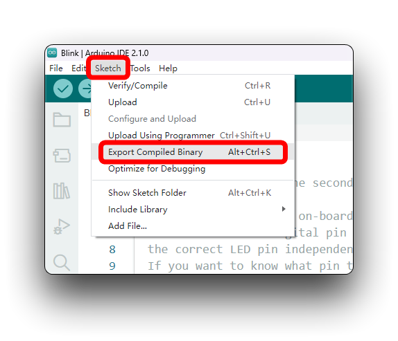

Copy the `BIN` file to the **xiaos3-bin2uf2** directory that you extracted earlier. Then, run the **convert\_uf2.bat** script to generate a UF2 file, which will require the name of your `bin` file.

**Step 3**: Enter UF2 BootLoader Mode

Connect the XIAO to your computer and run the **boot\_uf2.bat** script. The XIAO will appear on your computer as a USB drive, indicating it has successfully entered UF2 BootLoader mode.

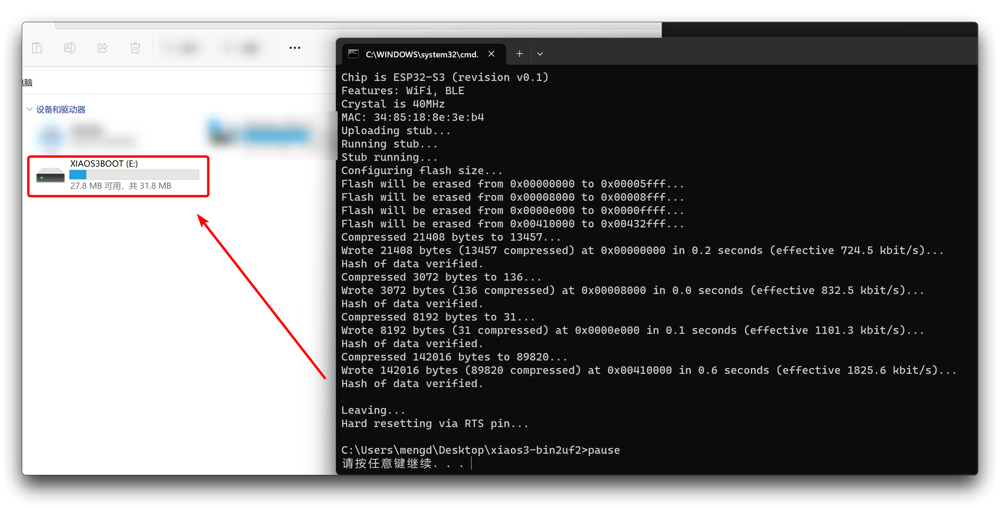

**Step 4**: Copy the UF2 File to XIAO ESP32-S3

Access the XIAO ESP32-S3's USB drive and copy the converted UF2 file to it. Once the copying is complete, the XIAO USB drive will automatically disappear, and the program will start running.

tip

1. Ensure your program is compiled and running correctly; otherwise, the UF2 file may not execute as expected.
2. A sample UF2 file for Blink is provided in the **xiaos3-bin2uf2** folder. When uploaded, the orange LED on the XIAO ESP32-S3 will blink. You can use this UF2 file as a test.

**Step 5**: Re-enter UF2 BootLoader Mode

If you need to re-enter UF2 BootLoader mode to upload another UF2 file, quickly press the **Reset** button followed by the **Boot** button. There’s no need to run the boot\_uf2.bat script again.

note

Press Reset, then Boot, quickly!

The project is composed of customizing the 2nd stage bootloader from IDF and UF2 factory application as 3rd stage bootloader.

**Note:** since IDF is actively developed and change very often, it is included as submodule at lib/esp-idf, please run export script there to have your environment setup correctly.

[**📚 Learn More**](https://github.com/adafruit/tinyuf2/tree/master/ports/espressif)

## Troubleshooting

### Q1: What should I do if the upload program fails/the program runs abnormally/the device port is not found?

If you encounter the above problem, it is recommended that you first try pressing the reset button on the XIAO ESP32-S3 to try to get the program running again. If the problem persists, please recheck your program and read the methods provided in **[BootLoader Mode](https://wiki.seeedstudio.com/xiao_esp32s3_getting_started/)** to restore the device.

### Q2: Why does my XIAO have the problem of not being flush at the rounded corners? Is this a quality problem?

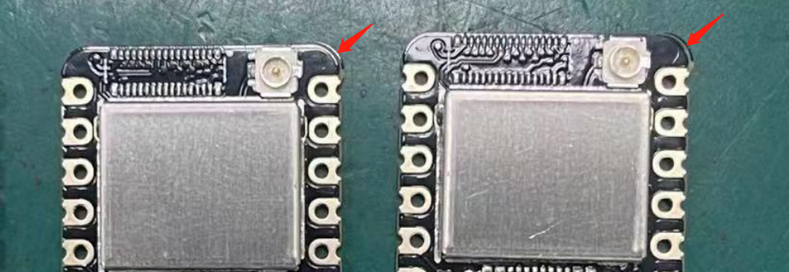

First of all, it should be noted that this is not a quality issue and will not affect the normal function of XIAO.

XIAO ESP32-S3 is the most complex one in all XIAO because of its high integration, and the PCB needs to be put together in factory production. Due to the high level of integration, the splicing board connection can only be placed at the four rounded corners, which will lead to the problem of uneven rounded corners on the picture. We will try to improve the process to ensure that this problem will be solved in the subsequent production.

### Q3: How to Flash the Factory Firmware to XIAO ESP32-S3 Provided on the Resource Section?

The script provided in the resource section supports Windows. After downloading the zip file, you'll find the following files:

- XIAO ESP32-S3 Factory firmware
- XIAO ESP32-S3 Sense Factory firmware

```shell
.
├── boot_app0.bin
├── esp32_flasher.py
├── esptool.exe
├── project_config.json
├── xiao_esp32s3_firmware.bin
├── xiao_esp32s3_firmware.bootloader.bin
├── xiao_esp32s3_firmware.partitions.bin
└── xiao_esp32s3_firmware_win.bat
```

```shell
.
├── CameraWebServer.bin
├── boot_app0.bin
├── bootloader.bin
├── esp32_flasher.py
├── esptool.exe
├── partition-table.bin
├── project_config.json
└── xiao_esp32s3_sense_firmware_win.bat
```

To flash the firmware, simply run the appropriate `.bat` file. If the flashing process fails, copy the command line from the prompt and run it manually in the terminal where the files are located.

## Resources

### For Seeed Studio XIAO ESP32-S3

**Hardware Design**

- **📄[Datasheet]** [Espressif ESP32-S3 Datasheet](https://files.seeedstudio.com/wiki/SeeedStudio-XIAO-ESP32S3/res/esp32-s3_datasheet.pdf)
- **📄[Schematic]** [XIAO ESP32-S3 Schematic](https://files.seeedstudio.com/wiki/SeeedStudio-XIAO-ESP32S3/new-res/202003751_XIAO%20ESP32S3_v1.4_SCH_260226.pdf.pdf)
- **🗃️[PCB Design Files]**
  - [XIAO ESP32-S3 KiCad Project](https://files.seeedstudio.com/wiki/SeeedStudio-XIAO-ESP32S3/new-res/202003751_XIAO%20ESP32S3_v1.4_SCH&PCB_260226.zip)
- **🗃️[PCB Design Libraries]**
  - [XIAO Series KiCad Footprints](https://files.seeedstudio.com/wiki/XIAO-KiCad-Library/New_XIAO_Series_Footprints.zip)
  - [XIAO Series KiCad SCH Symbols](https://files.seeedstudio.com/wiki/XIAO-KiCad-Library/XIAO_Series_SCH_Symbols.zip)
- **📄[Pinout Diagram]** [XIAO ESP32-S3 Pinout Sheet](https://files.seeedstudio.com/wiki/SeeedStudio-XIAO-ESP32S3/res/XIAO_ESP32S3_Sense_Pinout.xlsx)

**Mechanical Design**

- **📄[2D Dimensions]** [XIAO ESP32-S3 Dimension in DXF](https://files.seeedstudio.com/wiki/SeeedStudio-XIAO-ESP32S3/res/XIAO_ESP32S3_v1.1_Dimensioning.dxf)
- **🗃️[3D Model]** [XIAO ESP32-S3 3D Model](https://files.seeedstudio.com/wiki/SeeedStudio-XIAO-ESP32S3/res/seeed-studio-xiao-esp32s3-3d_model.zip)

**Software & Tools**

- **🗃️[Factory Firmware]** [XIAO ESP32-S3 Factory Firmware](https://files.seeedstudio.com/wiki/SeeedStudio-XIAO-ESP32S3/res/XIAO-ESP32S3-firmware-20240814.zip)

### For Seeed Studio XIAO ESP32-S3 Sense

**Hardware Design**

- **📄[Datasheet]** [Espressif ESP32-S3 Datasheet](https://files.seeedstudio.com/wiki/SeeedStudio-XIAO-ESP32S3/res/esp32-s3_datasheet.pdf)
- **📄[Schematic]** [XIAO ESP32-S3 Sense Schematic](https://files.seeedstudio.com/wiki/SeeedStudio-XIAO-ESP32S3/new-res/202003753_XIAO%20ESP32S3%20Sense_v1.5_SCH_260226.pdf.pdf)
- **📄[Schematic]** [XIAO ESP32-S3 ExpBoard Schematic](https://files.seeedstudio.com/wiki/SeeedStudio-XIAO-ESP32S3/res/XIAO_ESP32S3_ExpBoard_v1.0_SCH.pdf)
- **🗃️[PCB Design Files]**
  - [XIAO ESP32-S3 Sense KiCad Project](https://files.seeedstudio.com/wiki/SeeedStudio-XIAO-ESP32S3/new-res/202003753_XIAO%20ESP32S3%20Sense_v1.5_SCH&PCB_260226.zip)
- **🗃️[PCB Design Libraries]**
  - [XIAO Series KiCad Footprints](https://files.seeedstudio.com/wiki/XIAO-KiCad-Library/New_XIAO_Series_Footprints.zip)
  - [XIAO Series KiCad SCH Symbols](https://files.seeedstudio.com/wiki/XIAO-KiCad-Library/XIAO_Series_SCH_Symbols.zip)
- **📄[Pinout Diagram]** [XIAO ESP32-S3 Sense Pinout Sheet](https://files.seeedstudio.com/wiki/SeeedStudio-XIAO-ESP32S3/res/XIAO_ESP32S3_Sense_Pinout.xlsx)

**Mechanical Design**

- **📄[2D Dimensions]** [XIAO ESP32-S3 Sense Dimension in DXF (Top)](https://files.seeedstudio.com/wiki/SeeedStudio-XIAO-ESP32S3/res/XIAO_ESP32S3_ExpBoard_v1.0_top.dxf)
- **📄[2D Dimensions]** [XIAO ESP32-S3 Sense Dimension in DXF (Bottom)](https://files.seeedstudio.com/wiki/SeeedStudio-XIAO-ESP32S3/res/XIAO_ESP32S3_ExpBoard_v1.0_bot.dxf)
- **🗃️[3D Model]** [XIAO ESP32-S3 Sense 3D Model](https://files.seeedstudio.com/wiki/SeeedStudio-XIAO-ESP32S3/res/seeed-studio-xiao-esp32s3-sense-3d_model.zip)
- **📄[3D Model]** [XIAO ESP32-S3 Sense 3D Printing Purple Enclosure (Top)](https://files.seeedstudio.com/wiki/SeeedStudio-XIAO-ESP32S3/res/XIAO-ESP32S3-Sense-housing-design(top).stp)
- **📄[3D Model]** [XIAO ESP32-S3 Sense 3D Printing Purple Enclosure (Bottom)](https://files.seeedstudio.com/wiki/SeeedStudio-XIAO-ESP32S3/res/XIAO-ESP32S3-Sense-housing-design(bottom).stp)

**Software & Tools**

- **🗃️[Factory Firmware]** [XIAO ESP32-S3 Sense Factory Firmware](https://files.seeedstudio.com/wiki/SeeedStudio-XIAO-ESP32S3/res/XIAO-ESP32S3-Sense-firmware-20240814.zip)

### For Seeed Studio XIAO ESP32-S3 Plus

**Hardware Design**

- **📄[Datasheet]** [Espressif ESP32-S3 Datasheet](https://files.seeedstudio.com/wiki/SeeedStudio-XIAO-ESP32S3/res/esp32-s3_datasheet.pdf)
- **📄[Schematic]** [XIAO ESP32-S3 Plus Schematic](https://files.seeedstudio.com/wiki/SeeedStudio-XIAO-ESP32S3/res/XIAO_ESP32S3_Plus_V1.1_SCH_260115.pdf)
- **🗃️[PCB Design Files]**
  - [XIAO ESP32-S3 Plus KiCad Project](https://files.seeedstudio.com/wiki/SeeedStudio-XIAO-ESP32S3/res/XIAO_ESP32S3_Plus_V1.1_KiCad_260115.zip)
  - [XIAO Plus Base （with bottom pad lead out） KiCad Project](https://files.seeedstudio.com/wiki/SeeedStudio-XIAO-ESP32S3/res/XIAO_Plus_Base_with_botton_pad_lead_out_V1.0.zip)
  - [XIAO Plus Base （without bottom pad lead out） KiCad Project](https://files.seeedstudio.com/wiki/SeeedStudio-XIAO-ESP32S3/res/XIAO_Plus_Base_without_botton_pad_lead_out_V1.0.zip)
- **🗃️[PCB Design Libraries]**
  - [XIAO Series KiCad Footprints](https://files.seeedstudio.com/wiki/XIAO-KiCad-Library/New_XIAO_Series_Footprints.zip)
  - [XIAO Series KiCad SCH Symbols](https://files.seeedstudio.com/wiki/XIAO-KiCad-Library/XIAO_Series_SCH_Symbols.zip)
- **📄[Pinout Diagram]** [XIAO ESP32-S3 Plus Pinout Sheet](https://files.seeedstudio.com/wiki/SeeedStudio-XIAO-ESP32S3/res/Seeed_Studio_XIAO_ESP32S3_Plus_Pinout.xlsx)

**Mechanical Design**

- **📄[2D Dimensions]** [XIAO ESP32-S3 Plus Dimension in DXF (Top)](https://files.seeedstudio.com/wiki/SeeedStudio-XIAO-ESP32S3/res/TOP.dxf)
- **📄[2D Dimensions]** [XIAO ESP32-S3 Plus Dimension in DXF (Bottom)](https://files.seeedstudio.com/wiki/SeeedStudio-XIAO-ESP32S3/res/BOTTOM.dxf)
- **🔗[3D Model]** [XIAO ESP32-S3 Plus 3D Model](https://grabcad.com/library/seeed-studio-xiao-esp32s3-plus-1/files)

### For Seeed Studio XIAO ESP32-S3 Sense Camera

**Hardware Design**

- **[OV3660]**
  - **📄[Datasheet]** [OV3660 Camera Module Specification](https://files.seeedstudio.com/wiki/SeeedStudio-XIAO-ESP32S3/new-res/OV3660_Camera_Module_Specification.pdf)
  - **📄[Datasheet]** [OV3660 CMOS Sensor Datasheet](https://files.seeedstudio.com/wiki/SeeedStudio-XIAO-ESP32S3/res/OV3660_datasheet.pdf)
- **[OV5640]**
  - **📄[Datasheet]** [OV5640 Camera Module Specification](https://files.seeedstudio.com/wiki/SeeedStudio-XIAO-ESP32S3/new-res/OV5640_Camera_Module_Specification.pdf)
  - **📄[Datasheet]** [OV5640 CMOS Sensor Datasheet](https://files.seeedstudio.com/wiki/SeeedStudio-XIAO-ESP32S3/res/OV5640_datasheet.pdf)
- **[OV2640]**
  - **📄[Datasheet]** [OV2640 CMOS Sensor Datasheet](https://files.seeedstudio.com/wiki/SeeedStudio-XIAO-ESP32S3/res/OV2640_datasheet.pdf)

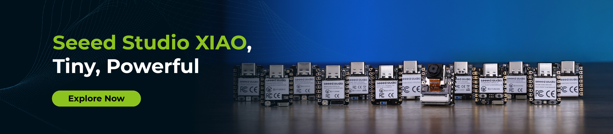Request Quote of Customization →

## Course Resources


- **[Ebook]** [XIAO: Big Power, Small Board Mastering Arduino and TinyML](https://mjrovai.github.io/XIAO_Big_Power_Small_Board-ebook/)

### Other

- **[STP]** [XIAO ESP32-S3 Sense housing design (top)](https://files.seeedstudio.com/wiki/SeeedStudio-XIAO-ESP32S3/res/XIAO-ESP32S3-Sense-housing-design(top).stp)
- **[STP]** [XIAO ESP32-S3 Sense housing design (bottom)](https://files.seeedstudio.com/wiki/SeeedStudio-XIAO-ESP32S3/res/XIAO-ESP32S3-Sense-housing-design(bottom).stp)

*The remaining open source material is being compiled, so stay tuned!*

## Tech Support & Product Discussion

Thank you for choosing our products! We are here to provide you with different support to ensure that your experience with our products is as smooth as possible. We offer several communication channels to cater to different preferences and needs.
