<!-- source: https://wiki.seeedstudio.com/XIAO_BLE/ | fetched: 2026-09-21 -->
# Getting Started with Seeed Studio XIAO nRF52840 Series | Seeed Studio Wiki

| XIAO nRF52840 | XIAO nRF52840 Sense | XIAO nRF52840 Plus | XIAO nRF52840 Sense Plus |
| --- | --- | --- | --- |
|  |  |  |  |
| [**Get One Now 🖱**](https://www.seeedstudio.com/Seeed-XIAO-BLE-nRF52840-p-5201.html) | [**Get One Now 🖱**](https://www.seeedstudio.com/Seeed-XIAO-BLE-Sense-nRF52840-p-5253.html) | [**Get One Now 🖱**](https://www.seeedstudio.com/Seeed-Studio-XIAO-nRF52840-Plus-p-6359.html) | [**Get One Now 🖱**](https://www.seeedstudio.com/Seeed-Studio-XIAO-nRF52840-Sense-Plus-p-6360.html) |

As the first wireless product in the Seeed Studio XIAO family, **Seeed Studio XIAO nRF52840** is equipped with a powerful **Nordic nRF52840 MCU** which integrates **Bluetooth 5.0** connectivity. Meanwhile, it has a **small and exquisite form-factor** which can be used for wearable devices and Internet of Things projects. The **single-sided surface-mountable design** and the onboard **Bluetooth antenna** can greatly facilitate the rapid deployment of IoT projects.

In addition, there is an advanced version of this board, **Seeed Studio XIAO nRF52840 Sense**. It is integrated with two extra onboard sensors. One of them is a **Pulse Density Modulation (PDM) Digital Microphone**. It can receive audio data in real-time which allows it to be used for audio recognition. The other one is a **6-axis Inertial Measurement Unit (IMU)**, this IMU can be very useful in TinyML projects like gesture recognition. These onboard sensors provide a great convenience for users while the board is ultra-small.

The newly upgraded **XIAO nRF52840 Plus and XIAO nRF52840 Sense Plus** provide considerable increases in functionality and usability. The number of multifunctional pins has been increased to **20**, **I2S** and **SPI** resources have been added to support more complex projects, **NFC pins** have been exposed for easier integration into IoT and smart card applications, and the **BAT pin** has been repositioned for better soldering convenience, resulting in a more user-friendly hardware experience.

Compared to Seeed Studio XIAO RP2040, Seeed Studio XIAO nRF52840 contains **richer interfaces**. The first thing to note is that the **Near Field Communication (NFC) interface** is functional on the board. Secondly, there is a tiny **reset button** on the side of the Type-C interface. On the other side, there is a **3-in-one LED (User LED)** along with a **Charge LED** to indicate the charging status when a battery is connected. There are **11 digital I/O** that can be used as **PWM pins** and **6 analog I/O** that can be used as **ADC pins**. It supports all three common serial interfaces such as **UART, I2C, and SPI**. Same as Seeed Studio XIAO RP2040, it has an **onboard 2 MB flash** which means it can also be programmed using **Arduino, MicroPython, CircuitPython, or other programming languages**.

Seeed Studio XIAO nRF52840 Sense is compatible to the Seeed Studio XIAO expansion board.

[**Get One Now 🖱️**](https://www.seeedstudio.com/Seeed-XIAO-BLE-nRF52840-p-5201.html)

## Features

- Powerful wireless capabilities: Bluetooth 5.0 with onboard antenna
- Powerful CPU: Nordic nRF52840, ARM® Cortex®-M4 32-bit processor with FPU, 64 MHz
- Ultra-Low Power: Standby power consumption is less than 5μA
- Battery charging chip: Supports lithium battery charge and discharge management
- Onboard 2 MB flash
- Onboard PDM microphone (only in Seeed Studio XIAO nRF52840 Sense)
- Onboard 6-axis LSM6DS3TR-C IMU (only in Seeed Studio XIAO nRF52840 Sense)
- Ultra Small Size: 21 x 17.8mm, Seeed Studio XIAO series classic form-factor for wearable devices
- Rich interfaces: 1xUART, 1xI2C, 1xSPI, 1xNFC, 1xSWD, 11xGPIO(PWM), 6xADC in XIAO nRF52840 (Sense); and 2xUART, 1xI2C, 2xSPI, 1xI2S, 1xNFC, 1xSWD, 18xGPIO(PWM), 6xADC in XIAO nRF52840 (Sense) Plus
- Single-sided components, surface mounting design

## Specifications comparison

| Item | Seeed Studio XIAO nRF52840 | Seeed Studio XIAO nRF52840 Sense | Seeed Studio XIAO nRF52840 Plus | Seeed Studio XIAO nRF52840 Sense Plus |
| --- | --- | --- | --- | --- |
| Processor | Nordic nRF52840, ARM® Cortex®-M4 32-bit processor with FPU, 64 MHz | | | |
| Wireless Connectivity | Bluetooth Low Energy 5.4/ Bluetooth Mesh/NFC | | | |
| Memory | 256 KB RAM,1MB Flash 2MB onboard Flash | | | |
| Built-in Sensors | N/A | 6 DOF IMU (LSM6DS3TR-C), PDM Microphone | N/A | 6 DOF IMU (LSM6DS3TR-C), PDM Microphone |
| Interfaces | 1xI2C, 1xUART, 1xSPI | | 1xI2C, 2xUART, 2xSPI, 1xI2S | |
| PWM/Analog Pins | 11/6 | | 20/6 | |
| Onboard Buttons | Reset Button | | | |
| Onboard LEDs | 3-in-one LED/ Charge LED | | | |
| Battery Charge Chip | BQ25101 | | | |
| Programming Languages | Arduino/ MicroPython/ CircuitPython | | | |

## Hardware overview

- XIAO nRF52840
- XIAO nRF52840 Plus
- XIAO nRF52840 Sense
- XIAO nRF52840 Sense Plus

### XIAO nRF52840 Front

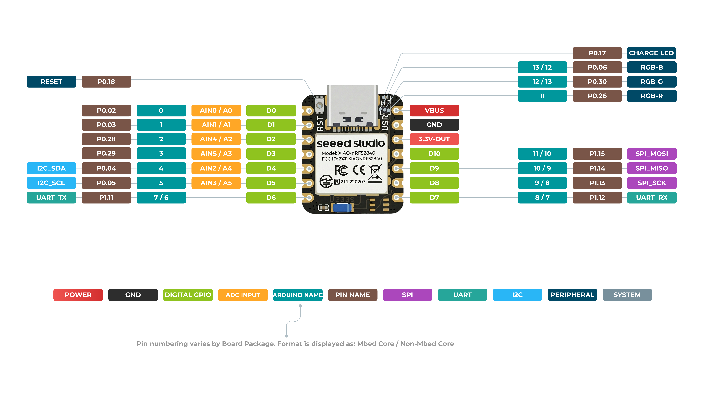

### XIAO nRF52840 Back


**Pin Map**

| XIAO Pin | Function | Chip Pin | Description | Arduino Name |
| --- | --- | --- | --- | --- |
| 5V | VBUS |  | Power Input/Output |  |
| GND |  |  |  |  |
| 3V3 | 3V3\_OUT |  | Power Output |  |
| D0 | Analog | P0.02 | GPIO, AIN0 | 0 |
| D1 | Analog | P0.03 | GPIO, AIN1 | 1 |
| D2 | Analog | P0.28 | GPIO, AIN4 | 2 |
| D3 | Analog | P0.29 | GPIO, AIN5 | 3 |
| D4 | Analog, SDA | P0.04 | GPIO, I2C Data, AIN2 | 4 |
| D5 | Analog, SCL | P0.05 | GPIO, I2C Clock, AIN3 | 5 |
| D6 | TX | P1.11 | GPIO, UART Transmit | 7/6 |
| D7 | RX | P1.12 | GPIO, UART Receive | 8/7 |
| D8 | SPI\_SCK | P1.13 | GPIO, SPI Clock | 9/8 |
| D9 | SPI\_MISO | P1.14 | GPIO, SPI Data | 10/9 |
| D10 | SPI\_MOSI | P1.15 | GPIO, SPI Data | 11/10 |
| NFC1 |  | P0.09 | NFC |  |
| NFC2 |  | P0.10 | NFC |  |
| Reset |  | P0.18 | RESET |  |
| ADC\_BAT | READ\_BAT\_ENABLE | P0.14 | Enable control for battery voltage reading |  |
| RF Switch Port Select |  | P2.05 | Switch onboard antenna |  |
| RF Switch Power |  | P2.03 | Power |  |
| CHARGE\_LED |  | P0.17 | CHG-LED\_Red |  |
| USER\_LED\_R |  | P0.26 | User-controlled red RGB LED pin | 11 |
| USER\_LED\_B |  | P0.06 | User-controlled blue RGB LED pin | 13/12 |
| USER\_LED\_G |  | P0.30 | User-controlled green RGB LED pin | 12/13 |

### XIAO nRF52840 Plus Front

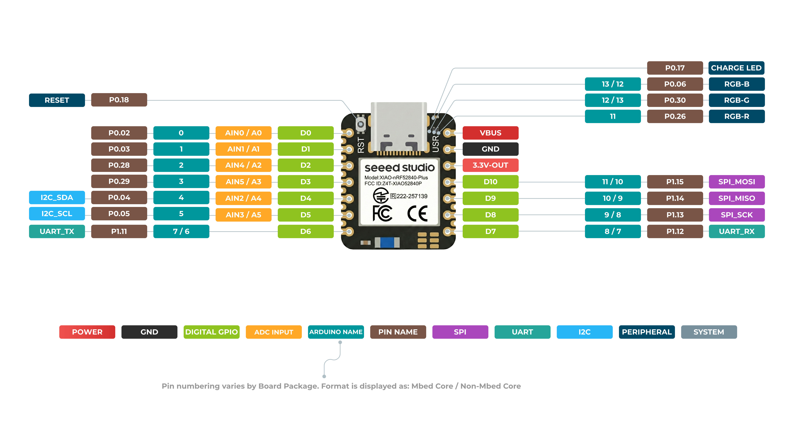

### XIAO nRF52840 Plus Back


**Pin Map**

| XIAO Pin | Function | Chip Pin | Alternate Functions | Description | Arduino Name |
| --- | --- | --- | --- | --- | --- |
| 5V | VBUS |  |  | Power Input/Output |  |
| GND |  |  |  |  |  |
| 3V3 | 3V3\_OUT |  |  | Power Output |  |
| D0 | Analog | P0.02 |  | GPIO, ADC | 0 |
| D1 | Analog | P0.03 |  | GPIO, ADC | 1 |
| D2 | Analog | P0.28 |  | GPIO, ADC | 2 |
| D3 | Analog | P0.29 |  | GPIO, ADC | 3 |
| D4 | Analog, SDA | P0.04 |  | GPIO, I2C Data, ADC | 4 |
| D5 | Analog, SCL | P0.05 |  | GPIO, I2C Clock, ADC | 5 |
| D6 | TX | P1.11 |  | GPIO, UART Transmit | 7/6 |
| D7 | RX | P1.12 |  | GPIO, UART Receive | 8/7 |
| D8 | SPI\_SCK | P1.13 |  | GPIO, SPI Clock | 9/8 |
| D9 | SPI\_MISO | P1.14 |  | GPIO, SPI Data | 10/9 |
| D10 | SPI\_MOSI | P1.15 |  | GPIO, SPI Data | 11/10 |
| D11 | I2S\_SD | P0.15 |  | GPIO, I2S, ADC |  |
| D12 | I2S\_SCK | P0.19 |  | GPIO, I2S, ADC |  |
| D13 | I2S\_WS | P1.01 |  | GPIO, I2S, ADC |  |
| D14 | RX1 | P0.09 | NFC1 | GPIO, UART Receive, ADC |  |
| D15 | TX1 | P0.10 | NFC2 | GPIO, UART Transmit, ADC |  |
| D16 | AIN7\_BAT | P0.31 |  | Battery voltage ADC read pin |  |
| D17 | SCK1 | P1.03 |  | GPIO, SPI |  |
| D18 | MISO1 | P1.05 |  | GPIO, SPI |  |
| D19 | MOSI1 | P1.07 |  | GPIO, SPI |  |
| ADC\_BAT | READ\_BAT\_ENABLE | P0.14 |  | Enable control for battery voltage reading |  |
| Reset |  | P0.18 |  | RESET |  |
| RF Switch Port Select |  | P2.05 |  | Switch onboard antenna |  |
| RF Switch Power |  | P2.03 |  | Power |  |
| CHARGE\_LED |  | P0.17 |  | CHG-LED\_Red |  |
| USER\_LED\_R |  | P0.26 |  | User-controlled red RGB LED pin | 11 |
| USER\_LED\_B |  | P0.06 |  | User-controlled blue RGB LED pin | 13/12 |
| USER\_LED\_G |  | P0.30 |  | User-controlled green RGB LED pin | 12/13 |

### XIAO nRF52840 Sense Front

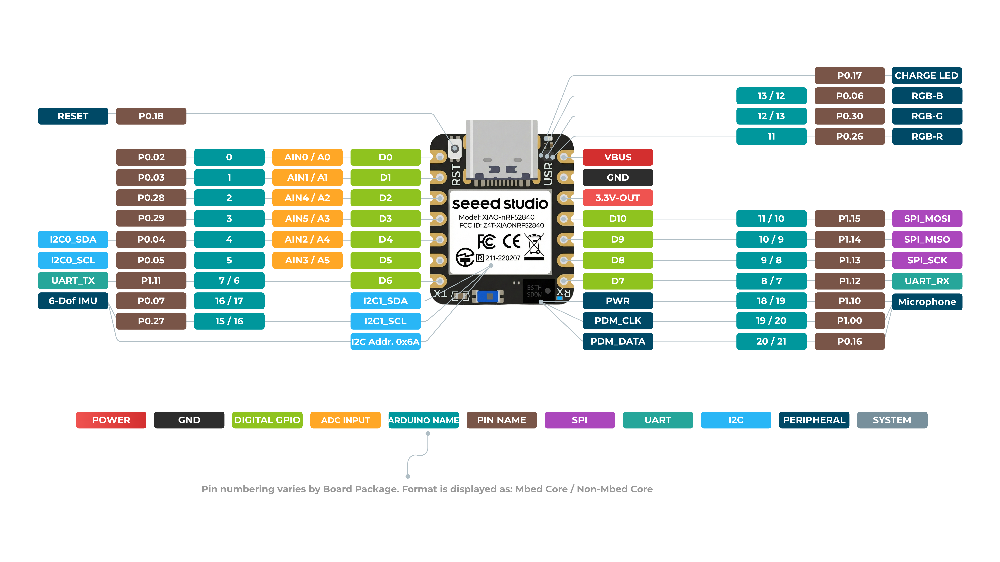

### XIAO nRF52840 Sense Back

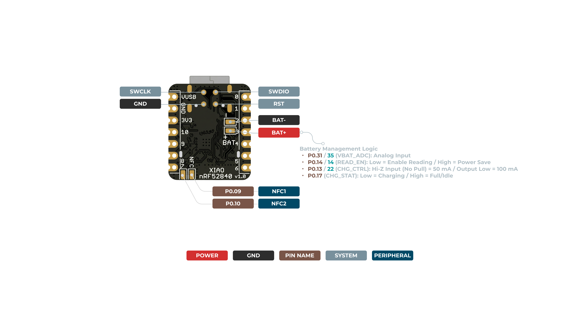

**Pin Map**

| XIAO Pin | Function | Chip Pin | Description | Arduino Name |
| --- | --- | --- | --- | --- |
| 5V | VBUS |  | Power Input/Output |  |
| GND |  |  |  |  |
| 3V3 | 3V3\_OUT |  | Power Output |  |
| D0 | Analog | P0.02 | GPIO, AIN0 | 0 |
| D1 | Analog | P0.03 | GPIO, AIN1 | 1 |
| D2 | Analog | P0.28 | GPIO, AIN4 | 2 |
| D3 | Analog | P0.29 | GPIO, AIN5 | 3 |
| D4 | Analog, SDA | P0.04 | GPIO, I2C Data, AIN2 | 4 |
| D5 | Analog, SCL | P0.05 | GPIO, I2C Clock, AIN3 | 5 |
| D6 | TX | P1.11 | GPIO, UART Transmit | 7/6 |
| D7 | RX | P1.12 | GPIO, UART Receive | 8/7 |
| D8 | SPI\_SCK | P1.13 | GPIO, SPI Clock | 9/8 |
| D9 | SPI\_MISO | P1.14 | GPIO, SPI Data | 10/9 |
| D10 | SPI\_MOSI | P1.15 | GPIO, SPI Data | 11/10 |
| NFC1 |  | P0.09 | NFC |  |
| NFC2 |  | P0.10 | NFC |  |
| Reset |  | P0.18 | RESET |  |
| ADC\_BAT | READ\_BAT\_ENABLE | P0.14 | Enable control for battery voltage reading |  |
| 6 DOF IMU\_PWR |  | P1.08 | Power switch of the 6D module |  |
| 6 DOF IMU\_\_INT1 |  | P0.11 | Interrupt signal pin of the 6D module |  |
| PDM Microphone\_DATA |  | P0.16 | PDM audio data input pin |  |
| PDM Microphone\_CLK |  | P1.00 | PDM audio clock output pin |  |
| RF Switch Port Select |  | P2.05 | Switch onboard antenna |  |
| RF Switch Power |  | P2.03 | Power |  |
| CHARGE\_LED |  | P0.17 | CHG-LED\_Red |  |
| USER\_LED\_R |  | P0.26 | User-controlled red RGB LED pin | 11 |
| USER\_LED\_B |  | P0.06 | User-controlled blue RGB LED pin | 13/12 |
| USER\_LED\_G |  | P0.30 | User-controlled green RGB LED pin | 12/13 |

### XIAO nRF52840 Sense Plus Front

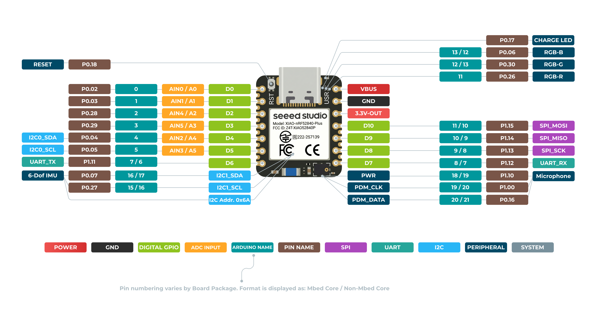

### XIAO nRF52840 Sense Plus Back

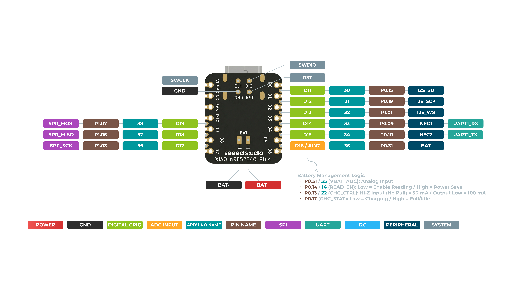

**Pin Map**

| XIAO Pin | Function | Chip Pin | Alternate Functions | Description | Arduino Name |
| --- | --- | --- | --- | --- | --- |
| 5V | VBUS |  |  | Power Input/Output |  |
| GND |  |  |  |  |  |
| 3V3 | 3V3\_OUT |  |  | Power Output |  |
| D0 | Analog | P0.02 |  | GPIO, ADC | 0 |
| D1 | Analog | P0.03 |  | GPIO, ADC | 1 |
| D2 | Analog | P0.28 |  | GPIO, ADC | 2 |
| D3 | Analog | P0.29 |  | GPIO, ADC | 3 |
| D4 | Analog, SDA | P0.04 |  | GPIO, I2C Data, ADC | 4 |
| D5 | Analog, SCL | P0.05 |  | GPIO, I2C Clock, ADC | 5 |
| D6 | TX | P1.11 |  | GPIO, UART Transmit | 7/6 |
| D7 | RX | P1.12 |  | GPIO, UART Receive | 8/7 |
| D8 | SPI\_SCK | P1.13 |  | GPIO, SPI Clock | 9/8 |
| D9 | SPI\_MISO | P1.14 |  | GPIO, SPI Data | 10/9 |
| D10 | SPI\_MOSI | P1.15 |  | GPIO, SPI Data | 11/10 |
| D11 | I2S\_SD | P0.15 |  | GPIO, I2S, ADC |  |
| D12 | I2S\_SCK | P0.19 |  | GPIO, I2S, ADC |  |
| D13 | I2S\_WS | P1.01 |  | GPIO, I2S, ADC |  |
| D14 | RX1 | P0.09 | NFC1 | GPIO, UART Receive, ADC |  |
| D15 | TX1 | P0.10 | NFC2 | GPIO, UART Transmit, ADC |  |
| D16 | AIN7\_BAT | P0.31 |  | Battery voltage ADC read pin |  |
| D17 | SCK1 | P1.03 |  | GPIO, SPI |  |
| D18 | MISO1 | P1.05 |  | GPIO, SPI |  |
| D19 | MOSI1 | P1.07 |  | GPIO, SPI |  |
| ADC\_BAT | READ\_BAT\_ENABLE | P0.14 |  | Enable control for battery voltage reading |  |
| 6 DOF IMU\_PWR |  | P1.08 |  | Power switch of the 6D module |  |
| 6 DOF IMU\_\_INT1 |  | P0.11 |  | Interrupt signal pin of the 6D module |  |
| PDM Microphone\_DATA |  | P0.16 |  | PDM audio data input pin |  |
| PDM Microphone\_CLK |  | P1.00 |  | PDM audio clock output pin |  |
| Reset |  | P0.18 |  | RESET |  |
| RF Switch Port Select |  | P2.05 |  | Switch onboard antenna |  |
| RF Switch Power |  | P2.03 |  | Power |  |
| CHARGE\_LED |  | P0.17 |  | CHG-LED\_Red |  |
| USER\_LED\_R |  | P0.26 |  | User-controlled red RGB LED pin | 11 |
| USER\_LED\_B |  | P0.06 |  | User-controlled blue RGB LED pin | 13/12 |
| USER\_LED\_G |  | P0.30 |  | User-controlled green RGB LED pin | 12/13 |

## Two Arduino Libraries

Seeed Studio XIAO nRF52840 assembles many functions in one tiny board and sometimes may not perform the best of them. Hence, Seeed has published two Arduino libraries to let it **maximum the power of each function**. Therefore:

- It is recommanded to use the `Seeed nRF52 Boards` library if you want to apply **Bluetooth function** and "**Low Energy Cost Function**".
- It is recommanded to use the `Seeed nRF52 mbed-enabled Boards` library if you want to use it in **embedded Machine Learning Applications** or apply "**IMU & PDM advanced function**".
- Both libraries support very well when it comes to the basic usage, such as **LED, Digital, Analog, Serial, I2C, SPI**.

The Pin definition supported by these two libraries might be a little different and Seeed will keep update the wiki until it is clear.

tip

1. If you use the onboard package of Seeed nRF52 Boards, the Serial function may not compile. The solution is to add the line `#include <Adafruit_TinyUSB.h>` in your code. You can download this package from: <https://github.com/adafruit/Adafruit_TinyUSB_Arduino>
2. If you prefer a simpler approach, you can choose Seeed nRF52 mbed-enabled Boards from the beginning. It supports the compilation of the Serial function without the need for additional modifications.

## Getting started

First, we are going to connect the Seeed Studio XIAO nRF52840 (Sense) to the computer and upload a simple code from Arduino IDE to check whether the board is functioning well.

### Hardware setup

You need to prepare the following:

- 1 x [Seeed Studio XIAO nRF52840](https://www.seeedstudio.com/Seeed-XIAO-BLE-nRF52840-p-5201.html) or [Studio XIAO nRF52840 Sense](https://www.seeedstudio.com/Seeed-XIAO-BLE-Sense-nRF52840-p-5253.html)
- 1 x Computer
- 1 x USB Type-C cable

tip

Some USB cables can only supply power and cannot transfer data. If you don't have a USB cable or don't know if your USB cable can transmit data, you can check [Seeed USB Type-C support USB 3.1](https://www.seeedstudio.com/USB-3-1-Type-C-to-A-Cable-1-Meter-3-1A-p-4085.html).

Connect the Seeed Studio XIAO nRF52840 (Sense) to your computer via a USB Type-C cable.

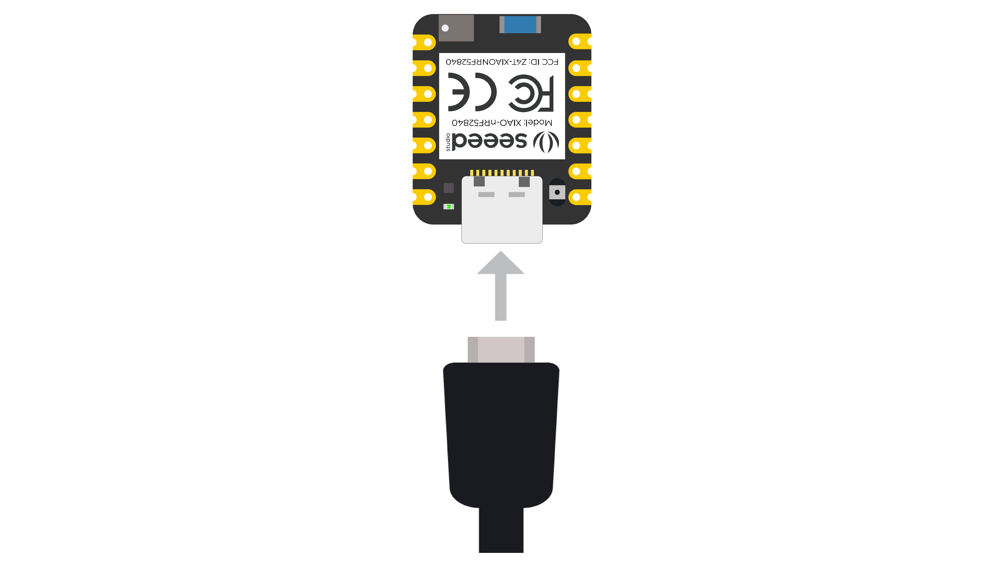

### Software setup

- **Step 1.** Download and Install the latest version of Arduino IDE according to your operating system

[](https://www.arduino.cc/en/software)

- **Step 2.** Launch the Arduino application
- **Step 3.** Add Seeed Studio XIAO nRF52840 (Sense) board package to your Arduino IDE

Navigate to **File > Preferences**, and fill **"Additional Boards Manager URLs"** with the url below:
*<https://files.seeedstudio.com/arduino/package_seeeduino_boards_index.json>*

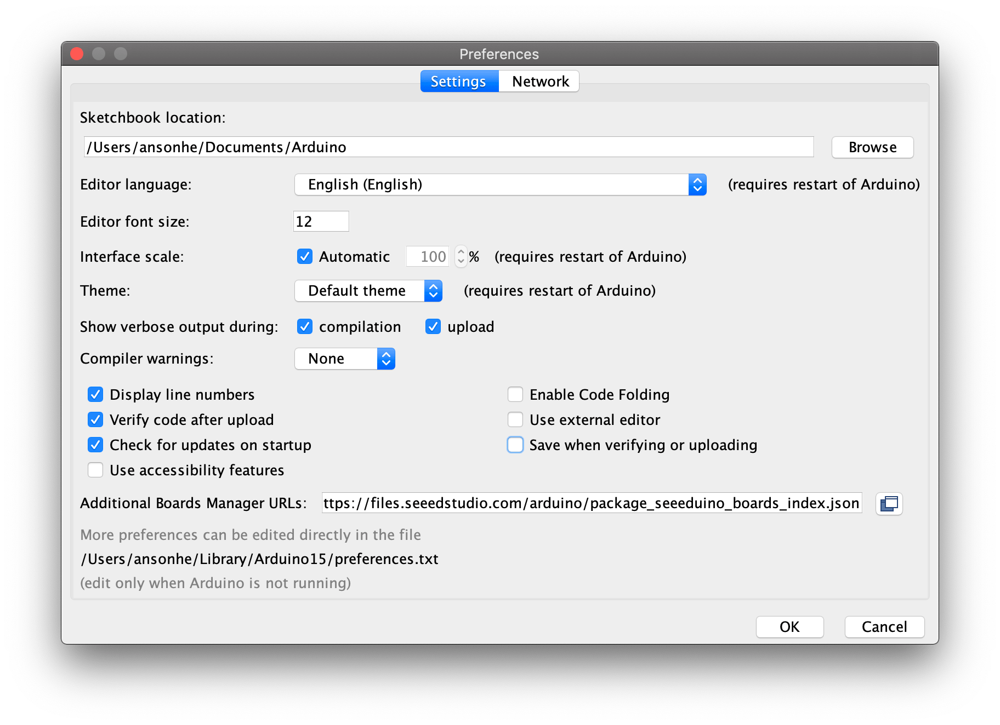

Navigate to **Tools > Board > Boards Manager...**, type the keyword "**seeed nrf52**" in the search box, select the latest version of the board you want, and install it. You can install both.

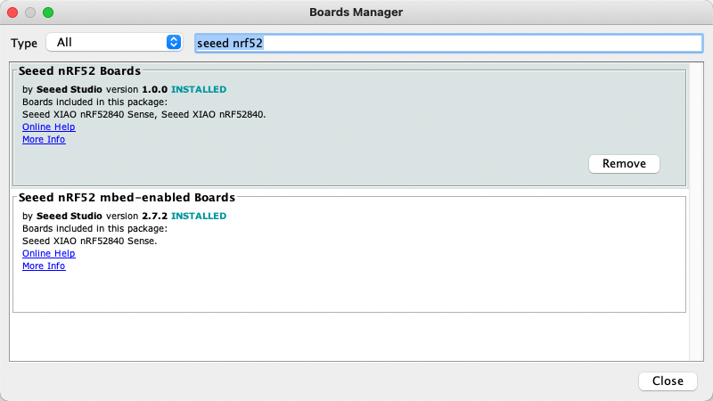

- **Step 4.** Select your board and port

**Board**

After installing the board package, navigate to **Tools > Board** and choose the board you want, continue to select "**Seeed XIAO nRF52840 Sense**". Now we have finished setting up the Seeed Studio XIAO nRF52840 (Sense) for Arduino IDE.

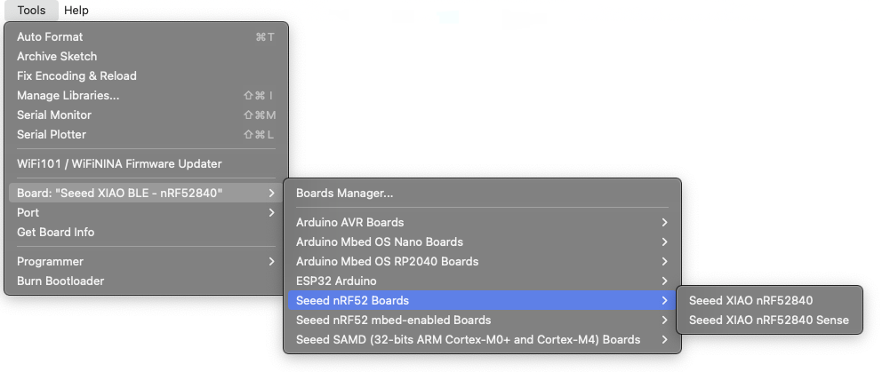

**Port**

Navigate to **Tools > Port** and select the serial port name of the connected Seeed Studio XIAO nRF52840 (Sense). This is likely to be COM3 or higher (**COM1** and **COM2** are usually reserved for hardware serial ports). The serial port of the connected Seeed Studio XIAO nRF52840 (Sense) usually contains parentheses that are written **Seeed Studio XIAO nRF52840** for **Seeed Studio XIAO nRF52840** or **Seeed Studio XIAO nRF52840 Sense** for **Seeed Studio XIAO nRF52840 Sense**.

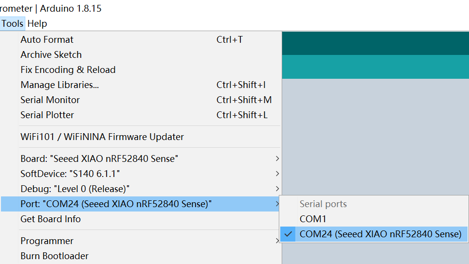

- **Step 5.** Navigate to **File > Examples > 01.Basics > Blink** to open **Blink** example

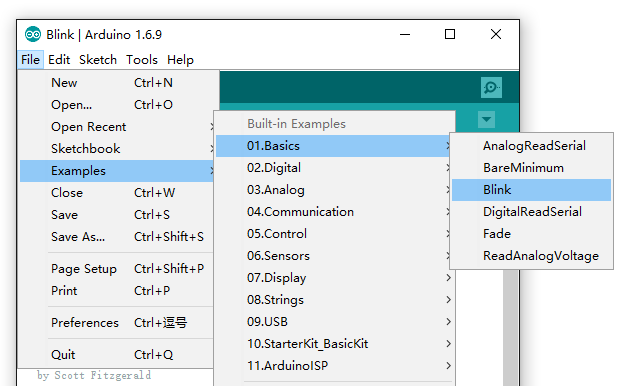

- **Step 6.** Click the **Upload** button to upload the Blink example code to the board

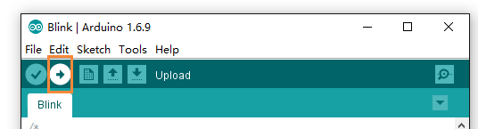

Once uploaded, you will see the built-in red LED blinking with a 1-second delay between each blink. This means the connection is successful and now you can explore more projects with the Seeed Studio XIAO nRF52840 (Sense)!

## Playing with the built-in 3-in-one LED

Seeed Studio XIAO nRF52840 (Sense) has an **onboard 3-in-one LED** which is user-programmable. Now you will learn how to control the RGB colors one-by-one using Arduino!

You first have to understand that the behavior of this LED is not as usual when controlled by the code. The **LED turns ON** when we give a **LOW signal** and it **turns OFF** when we give a **HIGH signal**. This is because this LED is controlled by a common anode and will light up only with a low-level signal.

An example code would be:

```cpp
void setup() {
  pinMode(LED_BUILTIN, OUTPUT);
}

void loop() {
  digitalWrite(LED_BUILTIN, HIGH);   
}
```

Here, even though **HIGH** is used, the LED will be **OFF**. You need to replace **HIGH** with **LOW** to turn **ON** the LED.

Refer to the following pin mappings of the LEDs and use them in your codes:

- Red LED = LED\_BUILTIN or LED\_RED
- Blue LED = LED\_BLUE
- Green LED = LED\_GREEN

## Power Consumption Verification

The Seeed Studio XIAO nRF52840 is low power consumption and here we provide a method to verify. It is highly recommend to use the `Seeed nRF52 Boards` library here.

- **Step 1.** Use **JLink** Downloader to flash the [bootloader firmware](https://github.com/0hotpotman0/BLE_52840_Core/blob/main/bootloader/Seeed_XIAO_nRF52840_Sense/Seeed_XIAO_nRF52840_Sense_bootloader-0.6.1_s140_7.3.0.hex) for Seeed Studio XIAO nRF52840 (Sense).

note

If you are using the factory firmware of the Seeed Studio XIAO nRF52840 or have never made changes to the firmware of the Seeed Studio XIAO nRF52840, you can skip this step.

- **Step 2.** Use the`Seeed nRF52 Boards` library here.


- **Step 3.** Upload the deep\_sleep demo here and run it with **Arduino**

```cpp
// The MIT License (MIT)
// Copyright (c) 2019 Ha Thach for Adafruit Industries

#include "SdFat.h"
#include "Adafruit_SPIFlash.h"

// Uncomment to run example with custom SPI and SS e.g with FRAM breakout
// #define CUSTOM_CS   A5
// #define CUSTOM_SPI  SPI

#if defined(CUSTOM_CS) && defined(CUSTOM_SPI)
  Adafruit_FlashTransport_SPI flashTransport(CUSTOM_CS, CUSTOM_SPI);

#elif defined(ARDUINO_ARCH_ESP32)
  // ESP32 use same flash device that store code.
  // Therefore there is no need to specify the SPI and SS
  Adafruit_FlashTransport_ESP32 flashTransport;

#else
  // On-board external flash (QSPI or SPI) macros should already
  // defined in your board variant if supported
  // - EXTERNAL_FLASH_USE_QSPI
  // - EXTERNAL_FLASH_USE_CS/EXTERNAL_FLASH_USE_SPI
  #if defined(EXTERNAL_FLASH_USE_QSPI)
    Adafruit_FlashTransport_QSPI flashTransport;

  #elif defined(EXTERNAL_FLASH_USE_SPI)
    Adafruit_FlashTransport_SPI flashTransport(EXTERNAL_FLASH_USE_CS, EXTERNAL_FLASH_USE_SPI);

  #else
    #error No QSPI/SPI flash are defined on your board variant.h !
  #endif
#endif

Adafruit_SPIFlash flash(&flashTransport);

/*  If you want to use a specific flash device, for example for a custom built board, first look for it in Adafruit_SPIFlash\src\flash_devices.h
 *  If it isn't in there you need to create your own definition like the W25Q80DLX_EXAMPLE example below.
 *  These definitions need to be edited to match information on the data sheet of the flash device that you want to use.
 *  If you are not sure what the manufacture ID, memory type and capacity values should be, try running the sketch anyway and look at the serial output
 *  The flash device will report these values to you as a single hexadecimal value (the JDEC ID)
 *  For example, the first device on the list - the W25Q80DLX - will report its JDEC ID as 0xef4014, which is made of these three values:
 *  manufacturer_id = 0xef
 *  memory_type     = 0x40
 *  capacity        = 0x14
 *  With this macro properly defined you can then create an array of device definitions as shown below, this can include any from the list of devices in flash_devices.h, and any you define yourself here
 *  You need to update the variable on line 71 to reflect the number of items in the array
 *  You also need to uncomment line 84 and comment out line 81 so this array will be passed to the flash memory driver. 
 */
//Example of a user defined flash memory device:
//#define W25Q80DLX_EXAMPLE                                                               \
//  {                                                                            \
//    .total_size = (1 << 20), /* 1 MiB */                                       \
//        .start_up_time_us = 5000, .manufacturer_id = 0xef,                     \
//    .memory_type = 0x40, .capacity = 0x14, .max_clock_speed_mhz = 80,         \
//    .quad_enable_bit_mask = 0x02, .has_sector_protection = false,              \
//    .supports_fast_read = true, .supports_qspi = true,                         \
//    .supports_qspi_writes = false, .write_status_register_split = false,       \
//    .single_status_byte = false, .is_fram = false,                             \
//  }

/*
 * Create an array of data structures and fill it with the settings we defined above.
 * We are using two devices, but more can be added if you want.
 */
//static const SPIFlash_Device_t my_flash_devices[] = {
//    W25Q80DLX_EXAMPLE,
//};
/*
 * Specify the number of different devices that are listed in the array we just created. If you add more devices to the array, update this value to match.
 */
//const int flashDevices = 1;

#include <bluefruit.h>

bool deepPowerDown(Adafruit_SPIFlash& flash, Adafruit_FlashTransport& transport) {
  uint32_t id_before = flash.getJEDECID();

  transport.begin();
  transport.runCommand(0xB9);  // SPI deep power-down command
  delay(10);

  uint32_t id_after = flash.getJEDECID();

  return (id_after == 0xFFFFFF || id_after == 0xFFFFFFFF);
}

void setup() {
  flash.begin();
  Bluefruit.begin();

  if (!deepPowerDown(flash, flashTransport)) {
    pinMode(LED_BUILTIN, OUTPUT);
    digitalWrite(LED_BUILTIN, LOW);
    while (1) {
      yield();
    }
  }

  flash.end();

  sd_power_system_off();
}

void loop() {
  // nothing to do
}
```

tip

Here , We would like to express our special thanks to the author for providing the code → ***daCoder*** ←

**If you want to know about this example more detail inforation , Click [Here](https://forum.seeedstudio.com/t/xiao-sense-accelerometer-examples-and-low-power/270801)**

## Battery Charging current

The battery charging current can be set to approximately 50 mA or 100 mA using P0.13. Configure P0.13 as a high-impedance input with no pull-up or pull-down to select 50 mA, or as an output driven LOW to select 100 mA. These values apply during the constant-current charging phase; the actual charging current decreases as the battery approaches full charge.

**Low Charging Current**

```cpp
void setup(){
pinMode (P0_13, OUTPUT);
}
void loop() {
digitalWrite(P0_13, HIGH);
}
```

**High Charging Current**

```cpp
void setup(){
pinMode (P0_13, OUTPUT);
}
void loop() {
digitalWrite(P0_13, LOW);
}
```

## Access the SWD Pins for Debugging and Reflashing Bootloader

**Hardware Required**

- [Seeed Studio XIAO nRF52840](https://www.seeedstudio.com/Seeed-XIAO-BLE-Sense-nRF52840-p-5253.html)
- Jlink

**Software Required**

It is required to download the [Segger](https://www.segger.com/downloads/jlink/) software from the website.

- **Step 1.** Use Jlink to connect pins below:

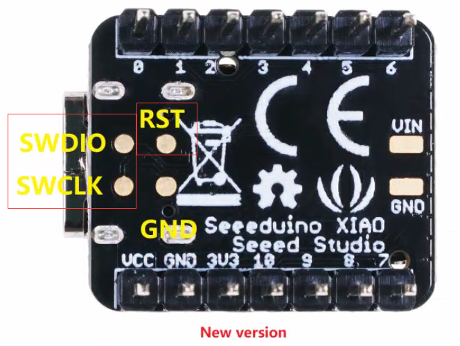

- **Step 2.** Start the J-Flash and search nRF52840, creating a new project:

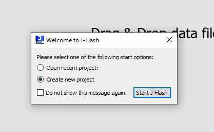

- **Step 3.** Click "Target" and then select "Connect".

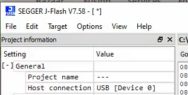

- **Step 4.** Draw the bin or [hex file](https://files.seeedstudio.com/wiki/XIAO-BLE/Seeed_XIAO_nRF52840_Sense_bootloader-0.6.1_s140_7.3.0.hex) to software. Then press F4 and F5 in that order. The reflashing is done.

## FAQ

### Q1: My Arduino IDE is stuck when uploading code to the board

You can first try to **reset** the board by clicking the "Reset Button" once. If that does not work, rapidly click it twice to enter **bootloader mode**. If that also doesn't work, disconnect the board from the PC, and connect the board again.

### Q2: My board is not showing up as a serial device on Arduino IDE

You can first try to **reset** the board by clicking the "Reset Button" once. If that does not work, rapidly click it twice to enter **bootloader mode**.

### Q3: What are the considerations when using XIAO nRF52840 (Sense) for battery charging?

In the XIAO nRF52840 Sense battery circuit, **P0.14** is the **READ\_BAT\_ENABLE** control pin and **P0.31** is the **AIN7\_BAT** ADC read pin for measuring battery voltage.

When P0.14 is set HIGH, the battery voltage reading path is disabled and P0.31 may reach the input voltage limit of 3.6V, posing a risk of damaging the P0.31 pin. To safely read battery voltage, set P0.14 LOW (to enable the reading path) and then read the ADC value on P0.31.

We recommend that users always keep P0.14 set LOW when reading battery voltage, and avoid setting P0.14 HIGH during battery charging.

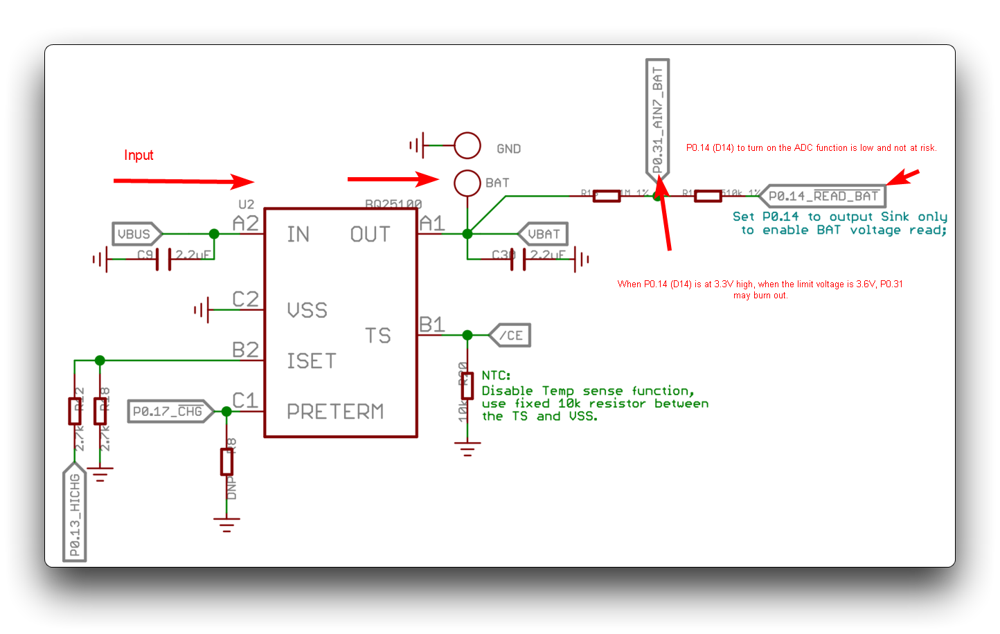

### Q4: How does the green light behave when powered on?

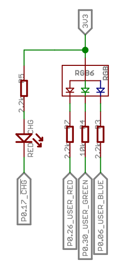

The `P0.17` pin is used to control the green indicator light behavior, indicating the charging status:

- Low level: when **charging** is in progress.
- High level: when the battery is either **not charging** or **fully charged**.

When it is at a low level, the `RED_CHG` LED will light up.

For more details, check the PMIC datasheet: [BQ25100](https://www.ti.com/lit/ds/symlink/bq25100a.pdf) and [XIAO nRF52840 datasheet](https://files.seeedstudio.com/wiki/XIAO-BLE/nRF52840_PS_v1.5.pdf).

## Resources

### Seeed Studio XIAO nRF52840

**Hardware Design**

- **📄[Datasheet]** [Nordic nRF52840 Datasheet](https://files.seeedstudio.com/wiki/XIAO-BLE/nRF52840_PS_v1.5.pdf)
- **📄[Datasheet]** [Flash P25Q16H-UXH-IR Datasheet](https://files.seeedstudio.com/wiki/github_weiruanexample/Flash_P25Q16H-UXH-IR_Datasheet.pdf)
- **📄[Schematic]** [XIAO nRF52840 Schematic](https://files.seeedstudio.com/wiki/XIAO-BLE/Res/260828_XIAO_nRF52840.pdf)
- **🗃️[PCB Design Files]**
  - [XIAO nRF52840 KiCad Project](https://files.seeedstudio.com/wiki/XIAO-BLE/Res/260828_Seeed_Studio_XIAO_nRF52840_v1.2.zip)
- **🗃️[PCB Design Libraries]**
  - [XIAO Series KiCad Footprints](https://files.seeedstudio.com/wiki/XIAO-KiCad-Library/New_XIAO_Series_Footprints.zip)
  - [XIAO Series KiCad SCH Symbols](https://files.seeedstudio.com/wiki/XIAO-KiCad-Library/XIAO_Series_SCH_Symbols.zip)
- **📄[Pinout Diagram]** [XIAO nRF52840 Pinout Sheet](https://files.seeedstudio.com/wiki/XIAO-BLE/XIAO-nRF52840-pinout_sheet.xlsx)

**Mechanical Design**

- **📄[2D Dimensions]** [XIAO nRF52840 Dimension in DXF](https://files.seeedstudio.com/wiki/XIAO-BLE/XIAO-nRF52840-DXF.zip)
- **📄[2D Dimensions]** [XIAO nRF52840 Bottom Pad Data](https://files.seeedstudio.com/wiki/XIAO-BLE/Bottom-pad-positioning.zip)

### Seeed Studio XIAO nRF52840 Sense

**Hardware Design**

- **📄[Datasheet]** [Nordic nRF52840 Datasheet](https://files.seeedstudio.com/wiki/XIAO-BLE/nRF52840_PS_v1.5.pdf)
- **📄[Datasheet]** [Flash-P25Q16H-UXH-IR Datasheet](https://files.seeedstudio.com/wiki/github_weiruanexample/Flash_P25Q16H-UXH-IR_Datasheet.pdf)
- **📄[Datasheet]** [Charger IC-BQ25101 Datasheet](https://files.seeedstudio.com/wiki/XIAO-BLE/BQ25101.pdf)
- **📄[Datasheet]** [IMU-LSM6DS3TR Datasheet](https://files.seeedstudio.com/wiki/XIAO-BLE/ST_LSM6DS3TR_Datasheet.pdf)
- **📄[Datasheet]** [Mic-WMM7035DTTJ0](https://files.seeedstudio.com/wiki/XIAO-BLE/mic_WMM7035DTTJ0_Datasheet.pdf.pdf)
- **📄[Schematic]** [XIAO nRF52840 Sense Schematic](https://files.seeedstudio.com/wiki/XIAO-BLE/Seeed_Studio_XIAO_nRF52840_PDF.pdf)
- **🗃️[PCB Design Files]**
  - [XIAO nRF52840 Sense KiCad Project](https://files.seeedstudio.com/wiki/XIAO-BLE/Seeed-Studio-XIAO-nRF52840V1.1-KiCad-Project-260105.zip)
- **🗃️[PCB Design Libraries]**
  - [XIAO Series KiCad Footprints](https://files.seeedstudio.com/wiki/XIAO-KiCad-Library/New_XIAO_Series_Footprints.zip)
  - [XIAO Series KiCad SCH Symbols](https://files.seeedstudio.com/wiki/XIAO-KiCad-Library/XIAO_Series_SCH_Symbols.zip)
- **📄[Pinout Diagram]** [XIAO nRF52840 Sense Pinout Sheet](https://files.seeedstudio.com/wiki/XIAO-BLE/XIAO-nRF52840-Senese-pinout_sheet.xlsx)

**Mechanical Design**

- **📄[2D Dimensions]** [XIAO nRF52840 Sense Dimension in DXF](https://files.seeedstudio.com/wiki/XIAO-BLE/XIAO-nRF52840-Sense-DXF.zip)
- **📄[2D Dimensions]** [XIAO nRF52840 Bottom Pad Data](https://files.seeedstudio.com/wiki/XIAO-BLE/Bottom-pad-positioning.zip)
- **📄[3D Model]** [XIAO nRF52840 Sense 3D Model](https://files.seeedstudio.com/wiki/XIAO-BLE/seeed-studio-xiao-nrf52840-3d-model.zip)

**Others**

- **📄[Document]** [XIAO nRF52840 Sense BLE Communication Distance Test Report](https://files.seeedstudio.com/wiki/XIAO-BLE/Seeed_XIAO_BLE_nRF52840_BLE_Communication_Distance_Test_Report.pdf)

### Seeed Studio XIAO nRF52840 (Sense) Plus

**Hardware Design**

- **📄[Datasheet]** [Nordic nRF52840 Datasheet](https://files.seeedstudio.com/wiki/XIAO-BLE/nRF52840_PS_v1.5.pdf)
- **📄[Datasheet]** [Flash-P25Q16H-UXH-IR Datasheet](https://files.seeedstudio.com/wiki/github_weiruanexample/Flash_P25Q16H-UXH-IR_Datasheet.pdf)
- **🗃️[Schematic]** [XIAO nRF52840 (Sense) Plus Schematic](https://files.seeedstudio.com/wiki/XIAO-BLE/Seeed_Studio_XIAO_nRF52840_Plus_SCH_PCB_v1.1.zip)
- **🗃️[PCB Design Files]**
  - [XIAO nRF52840 (Sense) Plus KiCad Project](https://files.seeedstudio.com/wiki/XIAO-BLE/Seeed_Studio_XIAO_nRF52840_Plus.zip)
  - [XIAO Plus Base （with bottom pad lead out） KiCad Project](https://files.seeedstudio.com/wiki/SeeedStudio-XIAO-ESP32S3/res/XIAO_Plus_Base_with_botton_pad_lead_out_V1.0.zip)
  - [XIAO Plus Base （without bottom pad lead out） KiCad Project](https://files.seeedstudio.com/wiki/SeeedStudio-XIAO-ESP32S3/res/XIAO_Plus_Base_without_botton_pad_lead_out_V1.0.zip)
- **🗃️[PCB Design Libraries]**
  - [XIAO Series KiCad Footprints](https://files.seeedstudio.com/wiki/XIAO-KiCad-Library/New_XIAO_Series_Footprints.zip)
  - [XIAO Series KiCad SCH Symbols](https://files.seeedstudio.com/wiki/XIAO-KiCad-Library/XIAO_Series_SCH_Symbols.zip)

**Mechanical Design**

- **🗃️[2D Dimensions]** [XIAO nRF52840 Sense Dimension in DXF](https://files.seeedstudio.com/wiki/XIAO-BLE/XIAO-nRF52840-Sense-DXF.zip)

Request Quote of Customization →

## Course Resources

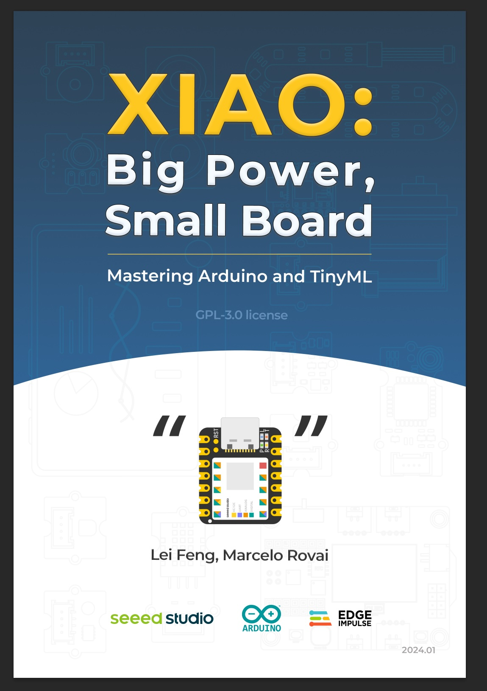

- **[Ebook]** [XIAO: Big Power, Small Board Mastering Arduino and TinyML](https://mjrovai.github.io/XIAO_Big_Power_Small_Board-ebook/)

## Tech Support & Product Discussion

Thank you for choosing our products! We are here to provide you with different support to ensure that your experience with our products is as smooth as possible. We offer several communication channels to cater to different preferences and needs.
