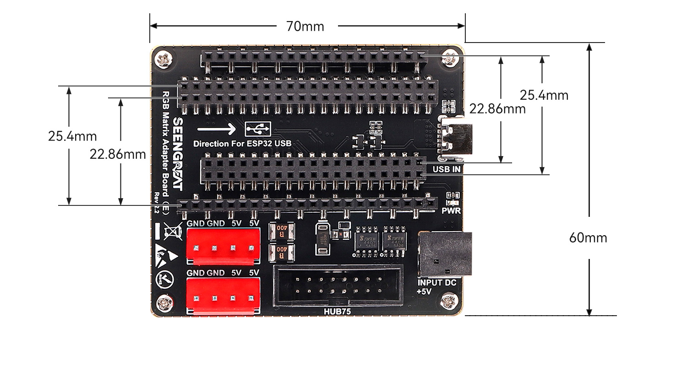
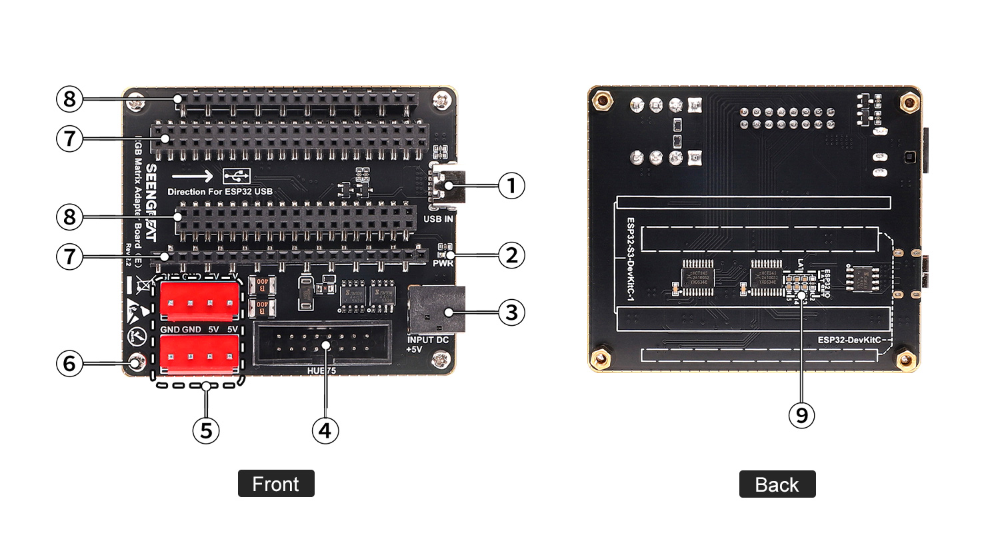
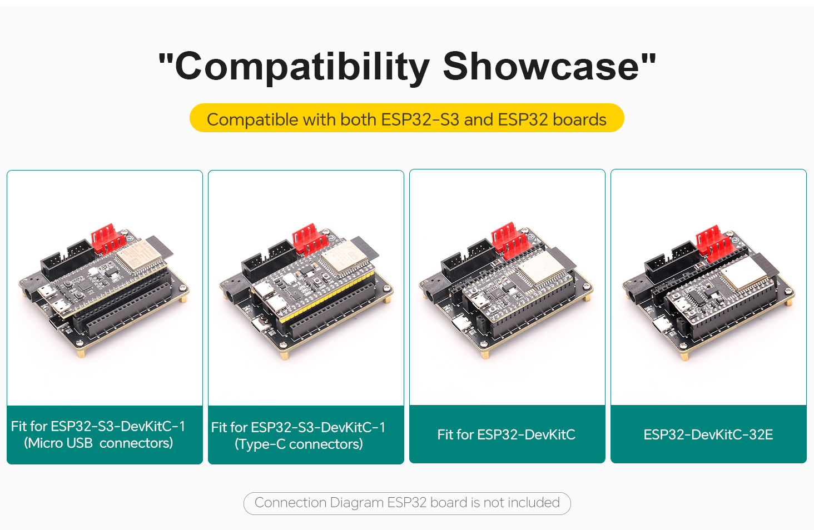
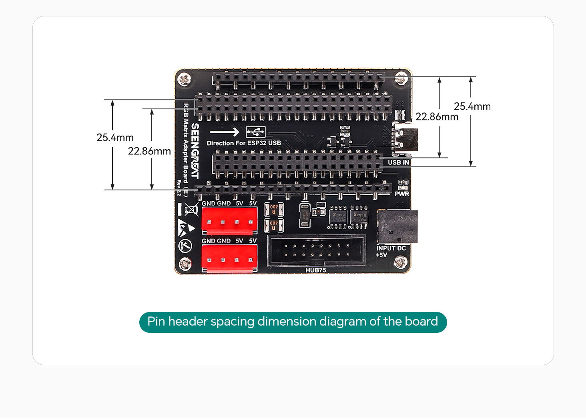
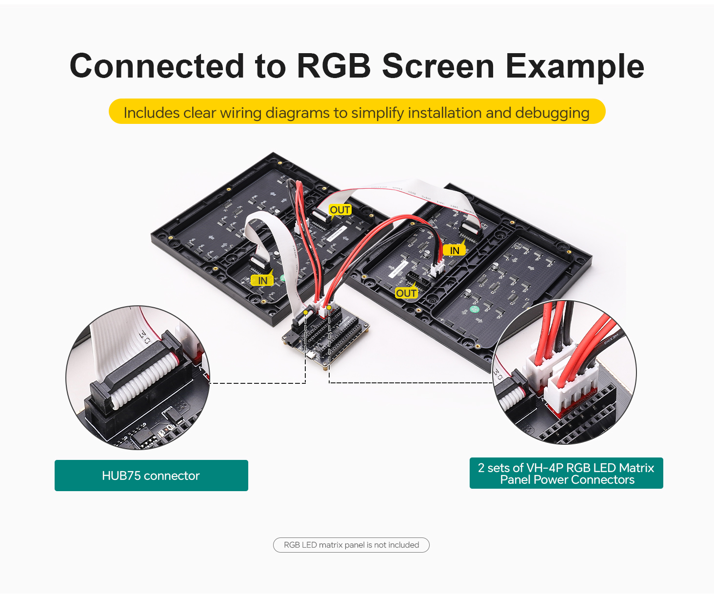
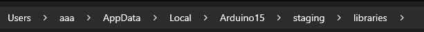

<!-- source: https://seengreat.com/wiki/186/rgb-matrix-adapter-board-e | fetched: 2026-09-21 -->
# RGB Matrix Adapter Board (E) - Wiki

# RGB Matrix Adapter Board (E)

## **I. Product Overview**

The RGB Matrix Adapter Board (E) is designed based on the ESP32-S3-DevKitC-1 and ESP32-DevKitC V4 development boards. It is specifically built for efficient data transmission and stable power management. This board is suitable for displaying text, graphics, animations, and more, helping users quickly bring various creative designs to life.

The adapter board integrates multiple key interfaces, providing both reliable power supply and stable data transmission.

## **II. Product Features**

· Compatible with ESP32-DevKitC and ESP32-S3-DevKitC-1

· Onboard two VH-4P (3.96 mm pitch) power connectors and HUB75 interface for RGB LED matrix panels

· Dual power input ports: USB Type-C 5V/4A or DC-044 5V/8A

· Gold-plated edge design for enhanced durability and aesthetics

## **III. Product Specifications**

|  |  |
| --- | --- |
| Item | Specification |
| Dimensions | 70 mm (Length) × 60 mm (Width) |
| Power Input Connectors | USB Type-C: 5V / 4A; DC-044: 5V / 8A |
| Power Output Connectors | Two VH-4P (3.96 mm pitch) connectors, 5V / 4A each |
| RGB LED Matrix Panel Interface | HUB75 |
| Data Interfaces | ESP32-S3-DevKitC-1 connectors, ESP32-DevKitC connectors |

## **IV. Product Usage**

### **4.1 Module Resource Profile**

① USB connector (5V power input only)

② Power indicator LED

③ DC-044 5V power input connector

④ HUB75 connector

⑤ Two VH-4P connectors for RGB LED matrix panel power supply

⑥ M2.5 mounting holes

⑦ ESP32-S3-DevKitC-1 connector

⑧ ESP32-DevKitC connector

#### **4.1.1 Wiring Diagram with ESP32-S3-DevKitC-1**

Pin mapping for version V1.x

|  |  |  |  |  |  |
| --- | --- | --- | --- | --- | --- |
| Mark | Description | Pin | Mark | Description | Pin |
| R1 | R higher bit data | IO37 | G1 | G higher bit data | IO06 |
| B1 | B higher bit data | IO36 | GND | Ground | GND |
| R2 | R lower bit data | IO35 | G2 | G lower bit data | IO05 |
| B2 | B lower bit data | IO0 | E | E line selection | IO04 |
| A | A line selection | IO45 | B | B line selection | IO01 |
| C | C line selection | IO48 | D | D line selection | IO02 |
| CLK | Clock input | IO47 | LAT | Latch pin | IO38 |
| OE | Output enable | IO21 | GND | Ground | GND |

Pin mapping for version V2.x

|  |  |  |  |  |  |
| --- | --- | --- | --- | --- | --- |
| Mark | Description | Pin | Mark | Description | Pin |
| R1 | R higher bit data | IO18 | G1 | G higher bit data | IO8 |
| B1 | B higher bit data | IO17 | GND | Ground | GND |
| R2 | R lower bit data | IO16 | G2 | G lower bit data | IO1 |
| B2 | B lower bit data | IO15 | E | E line selection | IO2 |
| A | A line selection | IO7 | B | B line selection | IO48 |
| C | C line selection | IO6 | D | D line selection | IO47 |
| CLK | Clock input | IO5 | LAT | Latch pin | IO21 |
| OE | Output enable | IO4 | GND | Ground | GND |

#### **4.1.2 Wiring Diagram with ESP32-DevKitC V4**

Pin mapping for version V1.x

|  |  |  |  |  |  |
| --- | --- | --- | --- | --- | --- |
| Mark | Description | Pin | Mark | Description | Pin |
| R1 | R higher bit data | IO18 | G1 | G higher bit data | IO25 |
| B1 | B higher bit data | IO05 | GND | Ground | GND |
| R2 | R lower bit data | IO17 | G2 | G lower bit data | IO33 |
| B2 | B lower bit data | IO16 | E | E line selection | IO32 |
| A | A line selection | IO04 | B | B line selection | IO3 |
| C | C line selection | IO0 | D | D line selection | IO21 |
| CLK | Clock input | IO02 | LAT | Latch pin | IO19 |
| OE | Output enable | IO15 | GND | Ground | GND |

Pin mapping for version V2.x

|  |  |  |  |  |  |
| --- | --- | --- | --- | --- | --- |
| Mark | Description | Pin | Mark | Description | Pin |
| R1 | R higher bit data | IO18 | G1 | G higher bit data | IO17 |
| B1 | B higher bit data | IO19 | GND | Ground | GND |
| R2 | R lower bit data | IO21 | G2 | G lower bit data | IO23 |
| B2 | B lower bit data | IO27 | E | E line selection | IO22 |
| A | A line selection | IO26 | B | B line selection | IO16 |
| C | C line selection | IO25 | D | D line selection | IO4 |
| CLK | Clock input | IO33 | LAT | Latch pin | Default IO2 |
| OE | Output enable | IO32 | GND | Ground | GND |

### **4.2 Notes**

· Before powering on, check the power supply to prevent reverse polarity. Do not plug or unplug while powered.

· Do not touch core components directly with bare hands during operation.

· Always take proper ESD (Electrostatic Discharge) protection measures.

· ESP32-HUB75-MatrixPanel-I2S-DMA Library: A library specifically designed for driving HUB75 interface LED matrix panels. It encapsulates complex low-level driving logic, and you need to download this library in Arduino.

· You can install the library files by following these steps:

Download and unzip the Library file. After unzipping, copy it to the Library directory of Arduino. For example, in my case, the directory is shown in the image below. Copy the downloaded ESP32-HUB75-MatrixPanel-I2S-DMA library to this directory.

## Resources

[Schematic](https://seengreat.com/upload/file/133 RGB E/Schematic.zip)

#### [ESP32-DevKitC-V4\_Demo Codes](https://seengreat.com/upload/file/133 RGB E/ESP32.zip) V1.x

[ESP32-S3-DevKitC-1\_Demo Codes](https://seengreat.com/upload/file/133 RGB E/ESP32S3.zip) V1.x

#### [ESP32-DevKitC-V4\_Demo Codes V2.x](https://seengreat.com/upload/file/133 RGB E/ESP32-DevKitC-V4_Demo Codes V2.x.zip)

[ESP32-S3-DevKitC-1\_Demo Codes V2.x](https://seengreat.com/upload/file/133 RGB E/ESP32-S3-DevKitC-1_Demo Codes V2.x.zip)

[Library](https://seengreat.com/upload/file/133 RGB E/ESP32-HUB75-MatrixPanel-DMA-master.zip)

[3D document](https://seengreat.com/upload/file/133 RGB E/RGB Matrix Adapter Board (E) V1.1 3D modle.zip)

[Product](https://seengreat.com/product/327/compatible-with-esp32-s3-devkitc-1-and-esp32-devkitc-development-board)

Related Data Resources of RGB LED Matrix Panels

WIKI: [RGB Matrix P3.0-64x64](https://seengreat.com/wiki/74/rgb-matrix-p3-0-64x64)

WIKI: [RGB Matrix P3.0-64x32](https://seengreat.com/wiki/73/rgb-matrix-p3-0-64x32)

WIKI: [RGB Matrix P2.5-64x32](https://seengreat.com/wiki/72/rgb-matrix-p2-5-64x32)
