<!-- source: https://docs.waveshare.com/ESP32-S3-RGB-Matrix/Arduino | fetched: 2026-09-21 -->
# ESP32-S3-RGB-Matrix Working with Arduino | WaveShare Documentation

This chapter includes the following sections. Please read as needed:

- [Arduino Getting Started](https://docs.waveshare.com/ESP32-S3-RGB-Matrix/Arduino)
- [Setting Up the Development Environment](https://docs.waveshare.com/ESP32-S3-RGB-Matrix/Arduino)
- [Example](https://docs.waveshare.com/ESP32-S3-RGB-Matrix/Arduino)

## Arduino Getting Started

New to Arduino ESP32 development and looking for a quick start? We have prepared a comprehensive **[Getting Started Tutorial](https://docs.waveshare.com/ESP32-Arduino-Tutorials)** for you.

- [Section 0: Getting to Know ESP32](https://docs.waveshare.com/ESP32-Tutorials/Getting-To-Know-Esp32)
- [Section 1: Installing and Configuring Arduino IDE](https://docs.waveshare.com/ESP32-Arduino-Tutorials/Arduino-IDE-Setup)
- [Section 2: Arduino Basics](https://docs.waveshare.com/ESP32-Arduino-Tutorials/Arduino-Basics)
- [Section 3: Digital Output/Input](https://docs.waveshare.com/ESP32-Arduino-Tutorials/Digital-IO)
- [Section 4: Analog Input](https://docs.waveshare.com/ESP32-Arduino-Tutorials/Analog-Input)
- [Section 5: Pulse Width Modulation (PWM)](https://docs.waveshare.com/ESP32-Arduino-Tutorials/PWM)
- [Section 6: Serial Communication (UART)](https://docs.waveshare.com/ESP32-Arduino-Tutorials/UART-Communication)
- [Section 7: I2C Communication](https://docs.waveshare.com/ESP32-Arduino-Tutorials/I2C-Communication)
- [Section 8: SPI Communication](https://docs.waveshare.com/ESP32-Arduino-Tutorials/SPI-Communication)
- [Section 9: Wi-Fi Basics](https://docs.waveshare.com/ESP32-Arduino-Tutorials/WiFi-Networking-Basic)
- [Section 10: Web Server](https://docs.waveshare.com/ESP32-Arduino-Tutorials/Web-Server)
- [Section 11: Bluetooth](https://docs.waveshare.com/ESP32-Arduino-Tutorials/Bluetooth-Communication)
- [Section 12: LVGL GUI Development](https://docs.waveshare.com/ESP32-Arduino-Tutorials/LVGL)
- [Section 13: Comprehensive Project](https://docs.waveshare.com/ESP32-Arduino-Tutorials/Fun-Project)

**Note**: This tutorial uses the [ESP32-S3-Zero](https://www.waveshare.com/esp32-s3-zero.htm?sku=25517) as a reference example, and all hardware code is based on its pinout. Before you start, we recommend checking the pinout of your development board to ensure the pin configuration is correct.

## Setting Up the Development Environment

### 1. Installing and Configuring the Arduino IDE

Please refer to the tutorial **[Install and Configure Arduino IDE](https://docs.waveshare.com/ESP32-Arduino-Tutorials/Arduino-IDE-Setup)** to download and install the Arduino IDE and add ESP32 support.

|  |  |  |  |  |  |  |  |  |  |  |  |  |  |  |  |  |  |  |  |  |  |  |  |
| --- | --- | --- | --- | --- | --- | --- | --- | --- | --- | --- | --- | --- | --- | --- | --- | --- | --- | --- | --- | --- | --- | --- | --- |
| Board Name Board Installation Requirement Version Requirement|  |  |  |  |  |  |  |  |  |  |  |  |  |  |  |  |  |  |  |  |  | | --- | --- | --- | --- | --- | --- | --- | --- | --- | --- | --- | --- | --- | --- | --- | --- | --- | --- | --- | --- | --- | | esp32 by Espressif Systems "Offline Installation" / "Online Installation" 3.3.7|  |  |  |  |  |  |  |  |  |  |  |  |  |  |  |  |  |  | | --- | --- | --- | --- | --- | --- | --- | --- | --- | --- | --- | --- | --- | --- | --- | --- | --- | --- | | FastLED `FastLED` 3.1.0|  |  |  |  |  |  |  |  |  |  |  |  |  |  |  | | --- | --- | --- | --- | --- | --- | --- | --- | --- | --- | --- | --- | --- | --- | --- | | AnimatedGIF `AnimatedGIF` 2.2.0|  |  |  |  |  |  |  |  |  |  |  |  | | --- | --- | --- | --- | --- | --- | --- | --- | --- | --- | --- | --- | | Adafruit SHTC3 Library `Adafruit SHTC3 Library` 1.0.2|  |  |  |  |  |  |  |  |  | | --- | --- | --- | --- | --- | --- | --- | --- | --- | | SensorLib `SensorLib` 0.4.1|  |  |  |  |  |  | | --- | --- | --- | --- | --- | --- | | ESP32-audioI2S-master `ESP32-audioI2S-master` 3.4.6|  |  |  | | --- | --- | --- | | U8g2\_for\_Adafruit\_GFX `U8g2_for_Adafruit_GFX` 1.8.0 | | | | | | | | | | | | | | | | | | | | | | | |

note

The ESP32-HUB75-MatrixPanel-I2S-DMA library is already provided with the example projects in each example directory and does not need to be installed separately.

### Arduino Settings:

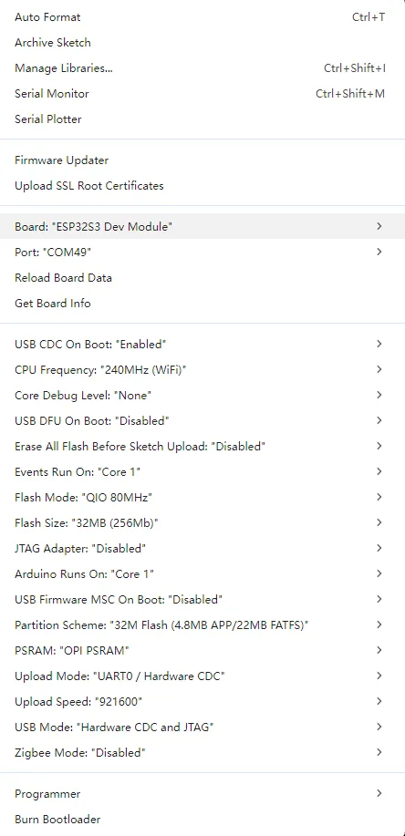

### 3. Running the Examples

Arduino example programs: [ESP32-S3-RGB-Matrix Example - GitHub](https://github.com/waveshareteam/ESP32-S3-RGB-Matrix)

Below are the purpose, key points, and operational effects for each example (for quick start).

|  |  |  |  |  |  |  |  |  |  |  |  |  |  |  |  |  |  |  |  |  |  |  |  |  |  |  |  |  |  |  |  |  |
| --- | --- | --- | --- | --- | --- | --- | --- | --- | --- | --- | --- | --- | --- | --- | --- | --- | --- | --- | --- | --- | --- | --- | --- | --- | --- | --- | --- | --- | --- | --- | --- | --- |
| Example Basic Description Dependency Library|  |  |  |  |  |  |  |  |  |  |  |  |  |  |  |  |  |  |  |  |  |  |  |  |  |  |  |  |  |  | | --- | --- | --- | --- | --- | --- | --- | --- | --- | --- | --- | --- | --- | --- | --- | --- | --- | --- | --- | --- | --- | --- | --- | --- | --- | --- | --- | --- | --- | --- | | [01\_SimpleTestShapes](https://docs.waveshare.com/ESP32-S3-RGB-Matrix/Arduino) Simple shape drawing -|  |  |  |  |  |  |  |  |  |  |  |  |  |  |  |  |  |  |  |  |  |  |  |  |  |  |  | | --- | --- | --- | --- | --- | --- | --- | --- | --- | --- | --- | --- | --- | --- | --- | --- | --- | --- | --- | --- | --- | --- | --- | --- | --- | --- | --- | | [02\_PatternPlasma](https://docs.waveshare.com/ESP32-S3-RGB-Matrix/Arduino) Plasma effect FastLED|  |  |  |  |  |  |  |  |  |  |  |  |  |  |  |  |  |  |  |  |  |  |  |  | | --- | --- | --- | --- | --- | --- | --- | --- | --- | --- | --- | --- | --- | --- | --- | --- | --- | --- | --- | --- | --- | --- | --- | --- | | [03\_DoubleBuffer](https://docs.waveshare.com/ESP32-S3-RGB-Matrix/Arduino) Double-buffer test, drawing dynamic graphics -|  |  |  |  |  |  |  |  |  |  |  |  |  |  |  |  |  |  |  |  |  | | --- | --- | --- | --- | --- | --- | --- | --- | --- | --- | --- | --- | --- | --- | --- | --- | --- | --- | --- | --- | --- | | [04\_OtherShiftDriverPanel](https://docs.waveshare.com/ESP32-S3-RGB-Matrix/Arduino) Drive the panel using a shift-register driver chip FastLED|  |  |  |  |  |  |  |  |  |  |  |  |  |  |  |  |  |  | | --- | --- | --- | --- | --- | --- | --- | --- | --- | --- | --- | --- | --- | --- | --- | --- | --- | --- | | [05\_AnimatedGIFPanel\_SD](https://docs.waveshare.com/ESP32-S3-RGB-Matrix/Arduino) Read GIF images from TF card and display them AnimatedGIF|  |  |  |  |  |  |  |  |  |  |  |  |  |  |  | | --- | --- | --- | --- | --- | --- | --- | --- | --- | --- | --- | --- | --- | --- | --- | | [06\_BitmapIcons](https://docs.waveshare.com/ESP32-S3-RGB-Matrix/Arduino) Display BMP images -|  |  |  |  |  |  |  |  |  |  |  |  | | --- | --- | --- | --- | --- | --- | --- | --- | --- | --- | --- | --- | | [07\_Pixel\_Mapping\_Test](https://docs.waveshare.com/ESP32-S3-RGB-Matrix/Arduino) Demonstrate basic HUB75 control logic -|  |  |  |  |  |  |  |  |  | | --- | --- | --- | --- | --- | --- | --- | --- | --- | | [08\_Sensor\_Test](https://docs.waveshare.com/ESP32-S3-RGB-Matrix/Arduino) Sensor test Adafruit SHTC3 Library, SensorLib|  |  |  |  |  |  | | --- | --- | --- | --- | --- | --- | | [09\_Music\_Player](https://docs.waveshare.com/ESP32-S3-RGB-Matrix/Arduino) Music player ESP32-audioI2S-master|  |  |  | | --- | --- | --- | | [10\_Chinese\_Font](https://docs.waveshare.com/ESP32-S3-RGB-Matrix/Arduino) Chinese font display U8g2\_for\_Adafruit\_GFX | | | | | | | | | | | | | | | | | | | | | | | | | | | | | | | | |

---

tip

Note:

- When driving a P4 series panel, be sure to add `mxconfig.driver = HUB75_I2S_CFG::SHIFTREG;` in the code, otherwise display anomalies may occur.

### 01\_SimpleTestShapes

**Code Analysis**

- `loop()`: Sequentially performs text drawing, solid color filling, and screen clearing operations to quickly verify the basic display functionality of the panel.
- `drawText(wheelval)`: Draws text and changes color effects based on `wheelval` to check whether character rendering and color changes are normal.
- `dma_display->fillScreen()`: Fills the screen with solid colors such as black, red, green, blue, and white in sequence to observe the full-screen refresh and color display effect.
- `delay(2000)`: Pauses for 2 seconds after each display step for easy visual confirmation.
- `dma_display->clearScreen()`: Clears the screen after the test to avoid residual content from the previous frame.

```cpp
void loop() {

  // animate by going through the colour wheel for the first two lines
  drawText(wheelval);
  wheelval +=1;
  delay(2000);
  dma_display->clearScreen();
  dma_display->fillScreen(myBLACK);
  delay(2000);
  dma_display->fillScreen( myRED);
  delay(2000);
  dma_display->fillScreen(myGREEN);
  delay(2000);
  dma_display->fillScreen(myBLUE);
  delay(2000);
  dma_display->fillScreen(myWHITE);
  delay(2000);
  dma_display->clearScreen();

}
```

**Expected Behavior**

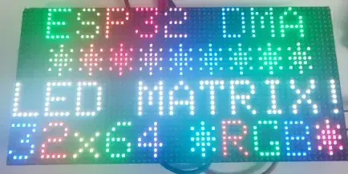

### 02\_PatternPlasma

**Code Analysis**

- `loop()`: Generates a dynamic plasma effect through per-pixel calculation and palette mapping.
- `for (int x ...)` / `for (int y ...)`: Iterates over each pixel of the panel, calculating and drawing colors point by point.
- `sin8()`, `sin16()`, `cos16()`: Combine coordinates and `time_counter` to generate a dynamically changing intermediate value `v`, creating a flowing ripple effect.
- `ColorFromPalette(currentPalette, (v >> 8))`: Fetches a color from the current palette based on the calculation result.
- `dma_display->drawPixelRGB888()`: Writes the calculated RGB color to the current pixel.
- `time_counter`, `cycles`, `fps`: Used to drive animation changes, count the number of cycles, and calculate the drawing frame rate.
- `if (cycles >= 1024)`: Resets the counter and randomly switches the palette to achieve automatic cycling through different color schemes.
- `Serial.printf_P()`: Outputs the `Effect fps` every 5 seconds to observe the effect drawing speed.

```cpp
void loop() {
  
    for (int x = 0; x < PANE_WIDTH; x++) {
            for (int y = 0; y <  PANE_HEIGHT; y++) {
                int16_t v = 128;
                uint8_t wibble = sin8(time_counter);
                v += sin16(x * wibble * 3 + time_counter);
                v += cos16(y * (128 - wibble)  + time_counter);
                v += sin16(y * x * cos8(-time_counter) / 8);

                currentColor = ColorFromPalette(currentPalette, (v >> 8)); //, brightness, currentBlendType);
                dma_display->drawPixelRGB888(x, y, currentColor.r, currentColor.g, currentColor.b);
            }
    }

    ++time_counter;
    ++cycles;
    ++fps;

    if (cycles >= 1024) {
        time_counter = 0;
        cycles = 0;
        currentPalette = palettes[random(0,sizeof(palettes)/sizeof(palettes[0]))];
    }

    // print FPS rate every 5 seconds
    // Note: this is NOT a matrix refresh rate, it's the number of data frames being drawn to the DMA buffer per second
    if (fps_timer + 5000 < millis()){
      Serial.printf_P(PSTR("Effect fps: %d\n"), fps/5);
      fps_timer = millis();
      fps = 0;
    }
} // end loop
```

**Expected Behavior**

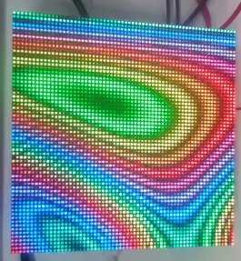

### 03\_DoubleBuffer

**Code Analysis**

- `loop()`: Demonstrates the full flow of double-buffered animation, including buffer swapping, back-buffer drawing, and motion state updates.
- `display->flipDMABuffer()`: Switches subsequent drawing to the back buffer that is not currently displayed, used to reduce flicker in dynamic graphics.
- `delay(1000/display->calculated_refresh_rate)`: Waits long enough for the current frame to finish displaying, avoiding tearing or flicker caused by flipping the buffer too early.
- `display->clearScreen()`: Clears the back buffer to prepare for drawing the next frame.
- `delay(25)`: Simulates a time-consuming drawing process, making it easier to visually observe the smoothness effect after enabling double buffering.
- `display->fillRect()`: Draws multiple moving squares to form a dynamic test screen.
- `velocityx` / `velocityy` logic: Reverses the movement direction when a square hits the screen edge, creating a bounce effect.
- `Squares[i].xpos` / `Squares[i].ypos` update: Updates the square coordinates based on the velocity, driving the next frame of animation.

```cpp
void loop()
{

  // Flip all future drawPixel calls to write to the back buffer which is NOT being displayed.
  display->flipDMABuffer(); 

  // SUPER IMPORTANT: Wait at least long enough to ensure that a "frame" has been displayed on the LED Matrix Panel before the next flip!
  delay(1000/display->calculated_refresh_rate);  

  // Now clear the back-buffer we are drawing to.
  display->clearScreen();   

  // This is here to demonstrate flicker if double buffering is disabled. Emulates a long draw routine that would typically occur after a 'clearscreen'.
  delay(25);
 

  for (int i = 0; i < numSquares; i++)
  {
    // Draw rect and then calculate
    display->fillRect(Squares[i].xpos, Squares[i].ypos, Squares[i].square_size, Squares[i].square_size, Squares[i].colour);

    if (Squares[i].square_size + Squares[i].xpos >= display->width()) {
      Squares[i].velocityx *= -1;
    } else if (Squares[i].xpos <= 0) {
      Squares[i].velocityx = abs (Squares[i].velocityx);
    }

    if (Squares[i].square_size + Squares[i].ypos >= display->height()) {
      Squares[i].velocityy *= -1;
    } else if (Squares[i].ypos <= 0) {
      Squares[i].velocityy = abs (Squares[i].velocityy);
    }

    Squares[i].xpos += Squares[i].velocityx;
    Squares[i].ypos += Squares[i].velocityy;
  }
}
```

**Expected Behavior**

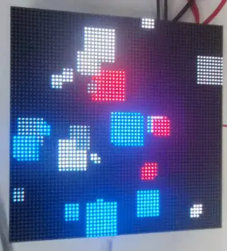

### 04\_OtherShiftDriverPanel

**Code Analysis**

- `loop()`: Continuously generates a full-screen dynamic effect to verify display compatibility with panels using shift-register driver chips.
- `for (int x ...)` / `for (int y ...)`: Iterates over each pixel of the screen, calculating the color value for each pixel individually.
- `sin8()`, `sin16()`, `cos16()`: Combine coordinates and `time_counter` to generate a continuously changing color index.
- `ColorFromPalette(currentPalette, (v >> 8) + 127)`: Maps the intermediate value to a final color from the palette.
- `dma_display->drawPixelRGB888()`: Writes the RGB color point-by-point to the DMA display buffer.
- `time_counter`, `cycles`, `fps`: Used to drive animation changes, control the color-cycling period, and count the drawing frame rate.
- `if (cycles >= 1024)`: Periodically resets animation parameters and randomly switches the palette for easy observation of display effects under different color schemes.
- `Serial.printf_P()`: Periodically outputs FPS information to evaluate the current pattern drawing speed.

```cpp
void loop() {
   for (int x = 0; x <  dma_display->width(); x++) {
        for (int y = 0; y <  dma_display->height(); y++) {
            int16_t v = 0;
            uint8_t wibble = sin8(time_counter);
            v += sin16(x * wibble * 3 + time_counter);
            v += cos16(y * (128 - wibble)  + time_counter);
            v += sin16(y * x * cos8(-time_counter) / 8);

            currentColor = ColorFromPalette(currentPalette, (v >> 8) + 127); //, brightness, currentBlendType);
            dma_display->drawPixelRGB888(x, y, currentColor.r, currentColor.g, currentColor.b);
        }
    }

    ++time_counter;
    ++cycles;
    ++fps;

    if (cycles >= 1024) {
        time_counter = 0;
        cycles = 0;
        currentPalette = palettes[random(0,sizeof(palettes)/sizeof(palettes[0]))];
    }

    // print FPS rate every 5 seconds
    // Note: this is NOT a matrix refresh rate, it's the number of data frames being drawn to the DMA buffer per second
    if (fps_timer + 5000 < millis()){
      Serial.printf_P(PSTR("Effect fps: %d\n"), fps/5);
      fps_timer = millis();
      fps = 0;
    }
}
```

**Expected Behavior**

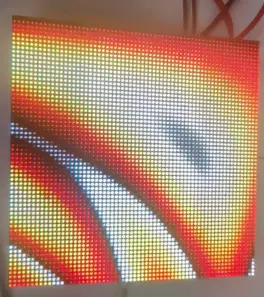

### 05\_AnimatedGIFPanel\_SD

**Code Analysis**

- `setup()`: Completes initializations of the TF card, HUB75 panel, and GIF decoder, preparing for GIF animation playback.
- `SD_MMC.setPins()`: Configures the clock, command, and data pins used by the TF card.
- `SD_MMC.begin("/sdcard", true)`: Mounts the TF card file system in 1-bit mode.
- `SD_MMC.cardType()`, `cardSize()`, `totalBytes()`, `usedBytes()`: Reads the card type, capacity, and space usage information to confirm storage medium status.
- `HUB75_I2S_CFG mxconfig(...)`: Configures the width, height, and cascade count of the HUB75 panel.
- `dma_display = new MatrixPanel_I2S_DMA(mxconfig)`: Creates the DMA display object.
- `dma_display->begin()`: Starts DMA display and allocates the display buffer.
- `SD_MMC.open("/gifs")`: Opens the GIF file directory.
- `root.openNextFile()`: Iterates through files in the `/gifs` directory.
- `GifFiles.push_back(filename)`: Saves the found GIF file paths to a list for later loop playback.
- `gif.begin(LITTLE_ENDIAN_PIXELS)`: Initializes the GIF decoder and sets the pixel byte order.

```cpp
void setup()
{
    Serial.begin(115200);

    // **************************** Setup TF Card access via SD_MMC 1-bit ****************************
    if (!SD_MMC.setPins(BSP_SD_CLK, BSP_SD_CMD, BSP_SD_D0)) {
        Serial.println("SD_MMC setPins Failed");
        return;
    }

    if (!SD_MMC.begin( "/sdcard", true)) {
        Serial.println("Card Mount Failed");
        return;
    }
    uint8_t cardType = SD_MMC.cardType();

    if (cardType == CARD_NONE) {
        Serial.println("No TF card attached");
        return;
    }

    Serial.print("TF Card Type: ");
    if (cardType == CARD_MMC) {
        Serial.println("MMC");
    } else if (cardType == CARD_SD) {
        Serial.println("SDSC");
    } else if (cardType == CARD_SDHC) {
        Serial.println("SDHC");
    } else {
        Serial.println("UNKNOWN");
    }

    uint64_t cardSize = SD_MMC.cardSize() / (1024 * 1024);
    Serial.printf("TF Card Size: %lluMB\n", cardSize);

    //listDir(SD_MMC, "/", 1, false);

    Serial.printf("Total space: %lluMB\n", SD_MMC.totalBytes() / (1024 * 1024));
    Serial.printf("Used space: %lluMB\n", SD_MMC.usedBytes() / (1024 * 1024));

    // **************************** Setup DMA Matrix ****************************
    HUB75_I2S_CFG mxconfig(
      PANEL_RES_X,   // module width
      PANEL_RES_Y,   // module height
      PANEL_CHAIN    // Chain length
    );

    // Keep ESP32-S3 default HUB75 mapping to avoid Flash/PSRAM reserved pins.

    //mxconfig.clkphase = false;
    //mxconfig.driver = HUB75_I2S_CFG::FM6126A;

    // Display Setup
    dma_display = new MatrixPanel_I2S_DMA(mxconfig);

    // Allocate memory and start DMA display
    if( not dma_display->begin() )
        Serial.println("****** !KABOOM! HUB75 memory allocation failed ***********");
 
    dma_display->setBrightness8(128); //0-255
    dma_display->clearScreen();

    // **************************** Setup Sketch ****************************
    Serial.println("Starting AnimatedGIFs Sketch");

    // TF CARD STOPS WORKING WITH DMA DISPLAY ENABLED>...

    File root = SD_MMC.open("/gifs");
    if (!root) {
        Serial.println("Failed to open directory");
        return;
    }

    File file = root.openNextFile();
    while (file) {
        if(!file.isDirectory())
        {
            Serial.print("  FILE: ");
            Serial.print(file.name());
            Serial.print("  SIZE: ");
            Serial.println(file.size());

            std::string filename = "/gifs/" + std::string(file.name());
            Serial.println(filename.c_str());
            
            GifFiles.push_back( filename );
         //   Serial.println("Adding to gif list:" + String(filename));
            totalFiles++;
    
        }
        file = root.openNextFile();
    }

    file.close();
    Serial.printf("Found %d GIFs to play.", totalFiles);
    //totalFiles = getGifInventory("/gifs");

  // This is important - Set the right endianness.
  gif.begin(LITTLE_ENDIAN_PIXELS);

}
```

**Expected Behavior**

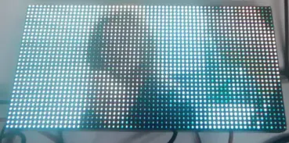

### 06\_BitmapIcons

**Code Analysis**

- `setup()`: Completes display initialization and draws a Wi-Fi icon with a fade-in effect to verify that bitmap resources and drawing interfaces are working properly.
- `dma_display->begin()`: Starts the HUB75 panel display.
- `dma_display->setBrightness8(90)`: Sets the panel brightness.
- `dma_display->fillScreen()` / `dma_display->clearScreen()`: Clears the screen during initialization and between icon switches to avoid image retention.
- `for (int r = 0; r < 255; r++)`: Gradually increases the red component to create a fade-in animation.
- `drawXbm565(0,0,64,32, wifi_image1bit, ...)`: Draws the Wi-Fi XBM bitmap onto the screen.
- `loop()`: Cycles through different icons, displaying them one after another.
- `drawXbm565(5,0, 32, 32, icon_bits[current_icon])`: Draws the icon data corresponding to the current index.
- `icon_name[current_icon]`: Outputs the name of the currently displayed icon via the serial port for debugging purposes.
- `current_icon = (current_icon + 1) % num_icons`: Updates the icon index cyclically to ensure the rotation does not go out of bounds.

```cpp
void setup() {

  // put your setup code here, to run once:
  delay(1000); Serial.begin(115200); delay(200);

  /************** DISPLAY **************/
  Sprintln("...Starting Display");
  dma_display = new MatrixPanel_I2S_DMA(mxconfig);
  dma_display->begin();
  dma_display->setBrightness8(90); //0-255
  dma_display->clearScreen();
  
  dma_display->fillScreen(dma_display->color444(0, 0, 0));  

  // Fade a Red Wi-Fi Logo In
  for (int r=0; r < 255; r++ )
  {
    drawXbm565(0,0,64,32, wifi_image1bit, dma_display->color565(r,0,0));  
    delay(10);
  }

  delay(2000);
  dma_display->clearScreen();
}

void loop() {

  // Loop through Weather Icons
  Serial.print("Showing icon ");
  Serial.println(icon_name[current_icon]);
  drawXbm565(5,0, 32, 32, icon_bits[current_icon]);

  current_icon = (current_icon  +1 ) % num_icons;
  delay(2000);
  dma_display->clearScreen();
  
}
```

**Expected Behavior**

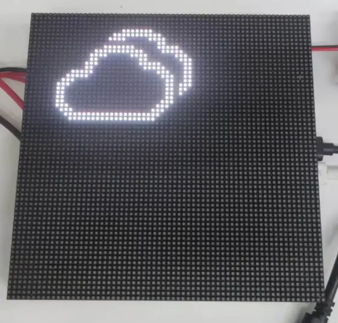

### 07\_Pixel\_Mapping\_Test

**Code Analysis**

- `loop()`: Lights pixels one by one in row-column order to verify that the panel pixel mapping matches the software configuration.
- `for (int i ...)` / `for (int j ...)`: Iterates over all pixel coordinates of `FourScanPanel`.
- `FourScanPanel->drawPixel(j, i, FourScanPanel->color565(255, 0, 0))`: Lights the current pixel in red, creating an observable scanning trace.
- `delay(30)`: Moves the scanning point slowly for easy observation of the actual lighting order.
- `dma_display->clearScreen()`: Clears the screen after a full-panel scan to start the next test round.
- `delay(2000)`: Pauses for 2 seconds after each scanning round to allow confirmation of mapping correctness.

```cpp
void loop() {
  for (int i = 0; i < FourScanPanel->height(); i++)
  {
    for (int j = 0; j < FourScanPanel->width(); j++)
    {
      FourScanPanel->drawPixel(j, i, FourScanPanel->color565(255, 0, 0));
      delay(30);
    }
  }
  delay(2000);
  dma_display->clearScreen();
} // end loop
```

**Expected Behavior**

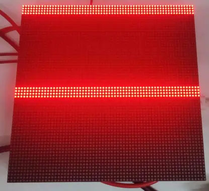

### 08\_Sensor\_Test

**Code Analysis**

- `setup()`: Sequentially initializes serial, RGB matrix, I2C bus, and sensors, displaying initialization status on the screen.
- `initDisplay()`: Configures HUB75 panel parameters (64x64, FM6126A driver), creates the DMA display object, and sets brightness.
- `initI2cBus()`: Starts the I2C bus at 400 kHz on pins 47 (SDA) and 48 (SCL).
- `detectQmiAddress()`: Probes both possible I2C addresses (high and low) for the QMI8658, identifying the device by reading the `whoami` register (value `0x05`).
- `initShtc3()`: Initializes and wakes up the SHTC3 temperature/humidity sensor.
- `initQmi8658()`: Configures the accelerometer (±4g, 125 Hz) and gyroscope (±512 dps, 112.1 Hz), and enables both sensors.
- `drawStatusScreen()`: Displays sensor initialization status; OK/FAIL messages for SHTC3 and QMI8658 are shown in green or red.
- `drawSensorScreen()`: Displays temperature (°C), humidity (%), acceleration (g), and angular velocity (dps) data in separate screen areas.
- `refreshSensors()`: Calls `readShtc3()` and `readQmi8658()` to fetch the latest sensor data.
- `loop()`: Refreshes sensor data and screen display every 200 ms, and outputs sensor data via serial every 1000 ms.

```cpp
static void drawSensorScreen()
{
  if (!g_state.display_ok || dma_display == nullptr) {
    return;
  }

  dma_display->fillScreen(color_black);
  dma_display->setTextWrap(false);
  dma_display->setTextSize(1);

  drawLineText(0, 0, color_yellow, "T/H");
  drawLineText(0, 8, color_white, String("T:") + String(g_state.temp_c, 1) + "C");
  drawLineText(0, 16, color_white, String("H:") + String(g_state.hum_rh, 1) + "%");

  drawLineText(0, 26, color_cyan, "ACC(g)");
  drawLineText(0, 34, color_green, String("X:") + String(g_state.ax, 1));
  drawLineText(0, 42, color_green, String("Y:") + String(g_state.ay, 1));
  drawLineText(0, 50, color_green, String("Z:") + String(g_state.az, 1));

  drawLineText(36, 26, color_cyan, "GYR");
  drawLineText(36, 34, color_blue, String("X:") + String(g_state.gx, 0));
  drawLineText(36, 42, color_blue, String("Y:") + String(g_state.gy, 0));
  drawLineText(36, 50, color_blue, String("Z:") + String(g_state.gz, 0));
}
```

**Expected Behavior**

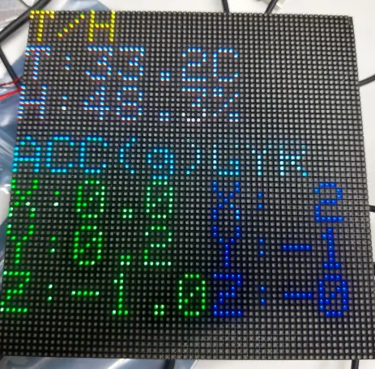

### 09\_Music\_Player

**Code Analysis**

- `setup()`: Sequentially initializes serial, RGB matrix, button, TF card, ES8311 codec, and audio output, builds the playlist, and starts playback of the first track.
- `mountSdCard()`: Mounts the TF card in 1-bit mode, configuring SD\_CLK / SD\_CMD / SD\_D0 pins.
- `initCodec()`: Initializes the ES8311 codec via I2C, enables the power amplifier (PA) pin, sets 16-bit sample depth, and maximum volume.
- `initAudioOutput()`: Configures I2S pins (BCLK / LRC / DOUT / MCLK) and registers audio event callbacks.
- `buildTrackList()`: Recursively scans the TF card `/music` directory for audio files (mp3, wav, aac, m4a, flac); if `/music` is empty, scans the root directory; results are sorted by filename.
- `playTrackByIndex()`: Stops current playback, opens the specified audio file from the TF card, and starts playing.
- `handleButton()`: Implements three button actions based on the BOOT button: single click (next track), double click (toggle volume direction), and long press (continuous volume adjustment); uses software debouncing and a state machine internally.
- `changeVolumeStep()`: Adjusts the volume by one step based on the current volume mode (increase or decrease), updating both the Audio library and the ES8311 codec volume.
- `processPendingActions()`: Processes pending volume-mode toggles or next-track requests after the double-click detection window expires.
- `updateDisplay()`: Shows track name, playback status, volume mode, status info, and playback progress on the screen.
- `loop()`: Continuously runs the audio decoding loop, processes button events and pending actions, and refreshes the screen every 150 ms.

```cpp
static void handleButton()
{
  const uint32_t now = millis();
  const bool button_level = digitalRead(BOARD_BUTTON_PIN);
  const bool button_changed = button_level != g_player.last_button_level;

  if (button_changed) {
    if (now - g_player.last_button_ms < BUTTON_DEBOUNCE_MS) {
      return;
    }

    g_player.last_button_ms = now;
    g_player.last_button_level = button_level;

    if (!button_level) {
      g_player.button_pressed = true;
      g_player.button_press_ms = now;
      g_player.long_press_active = false;
      g_player.last_volume_repeat_ms = now;
      return;
    }

    g_player.button_pressed = false;
    if (g_player.long_press_active) {
      g_player.long_press_active = false;
      g_player.click_count = 0;
      return;
    }

    ++g_player.click_count;
    g_player.last_click_ms = now;
    return;
  }

  if (!g_player.button_pressed) {
    return;
  }

  if (!g_player.long_press_active) {
    if (now - g_player.button_press_ms < LONG_PRESS_MS) {
      return;
    }

    g_player.long_press_active = true;
    g_player.click_count = 0;
    changeVolumeStep();
    g_player.last_volume_repeat_ms = now;
    return;
  }

  if (now - g_player.last_volume_repeat_ms < VOLUME_REPEAT_MS) {
    return;
  }

  g_player.last_volume_repeat_ms = now;
  changeVolumeStep();
}
```

**Expected Behavior**

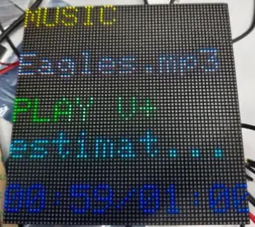

### 10\_Chinese\_Font

**Code Analysis**

- `setup()`: Initializes the HUB75 panel and U8g2 font renderer, then displays the first page of Chinese text.
- `U8G2_FOR_ADAFRUIT_GFX u8g2_for_display`: Adapts the U8g2 font engine to the Adafruit GFX interface, enabling UTF-8 Chinese rendering on the RGB matrix.
- `kFontList[]`: Contains 5 WenQuanYi Chinese fonts (12px to 16px), all using GB2312 encoding.
- `drawCenteredUtf8Line()`: Calculates the pixel width of the text using `getUTF8Width()`, then centers it horizontally and draws it.
- `drawPage()`: Clears the screen, displays the current font name and index using the GFX default font, then switches to the U8g2 font to draw two centered lines: "中文显示" and "你好世界".
- `loop()`: Automatically switches to the next font every 1600 ms, cycling through 5 different font sizes to demonstrate Chinese character rendering.

```cpp
static void drawPage(uint8_t font_index)
{
  const ChineseFontEntry &entry = kFontList[font_index];

  dma_display->fillScreen(dma_display->color565(0, 0, 0));
  dma_display->setTextSize(1);
  dma_display->setTextWrap(false);
  dma_display->setTextColor(dma_display->color565(255, 255, 0));
  dma_display->setCursor(0, 0);
  dma_display->print(entry.name);
  dma_display->setCursor(40, 0);
  dma_display->print(font_index + 1);
  dma_display->print("/");
  dma_display->print(sizeof(kFontList) / sizeof(kFontList[0]));

  u8g2_for_display.setFontMode(1);
  u8g2_for_display.setFontDirection(0);
  u8g2_for_display.setFont(entry.font);

  drawCenteredUtf8Line("中文显示", 26, dma_display->color565(255, 255, 255));
  drawCenteredUtf8Line("你好世界", 50, dma_display->color565(80, 220, 255));
}
```

**Expected Behavior**

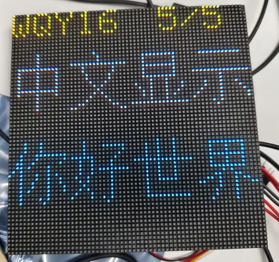

[Give Feedback](https://docs.google.com/forms/d/e/1FAIpQLSfayJEZ5J-dp-3Wq_dkWsVRhNuQ6C79_GNV62mYuFW8Mj6U8Q/viewform)
