<!-- source: https://docs.waveshare.com/ESP32-S3-RGB-Matrix/ESP-IDF | fetched: 2026-09-21 -->
# ESP32-S3-RGB-Matrix Working with ESP-IDF | WaveShare Documentation

This chapter includes the following sections. Please read as needed:

- [ESP-IDF Getting Started](https://docs.waveshare.com/ESP32-S3-RGB-Matrix/ESP-IDF)
- [Setting Up the Development Environment](https://docs.waveshare.com/ESP32-S3-RGB-Matrix/ESP-IDF)
- [Running Official Espressif Examples](https://docs.waveshare.com/ESP32-S3-RGB-Matrix/ESP-IDF)

## ESP-IDF Getting Started

New to ESP32 ESP-IDF development and looking to get started quickly? We have prepared a general **[Getting Started Tutorial](https://docs.waveshare.com/ESP32-ESP-IDF-Tutorials)** for you.

- [Section 1: Environment Setup](https://docs.waveshare.com/ESP32-ESP-IDF-Tutorials/ESP-IDF-Installation)
- [Section 2: Running Examples](https://docs.waveshare.com/ESP32-ESP-IDF-Tutorials/RunExample)
- [Section 3: Creating a Project](https://docs.waveshare.com/ESP32-ESP-IDF-Tutorials/Create-Project)
- [Section 4: Using Components](https://docs.waveshare.com/ESP32-ESP-IDF-Tutorials/Component)
- [Section 5: Debugging](https://docs.waveshare.com/ESP32-ESP-IDF-Tutorials/Debug)
- [Section 6: FreeRTOS](https://docs.waveshare.com/ESP32-ESP-IDF-Tutorials/FreeRTOS)
- [Section 7: Peripherals](https://docs.waveshare.com/ESP32-ESP-IDF-Tutorials/Peripheral)
- [Section 8: Wi-Fi Programming](https://docs.waveshare.com/ESP32-ESP-IDF-Tutorials/Wi-Fi)
- [Section 9: BLE Programming](https://docs.waveshare.com/ESP32-ESP-IDF-Tutorials/BLE)

**Please Note**: This tutorial uses the [ESP32-S3-Zero](https://www.waveshare.com/esp32-s3-zero.htm?sku=25517) as a teaching example, and all hardware code is based on its pinout. Before you start, it is recommended that you check the pinout of your development board to ensure the pin configuration is correct.

## Setting Up the Development Environment

note

The following guide uses **Windows** as an example, demonstrating development using **VS Code + the ESP-IDF extension**. macOS and Linux users should refer to the **[official documentation](https://docs.espressif.com/projects/esp-idf/en/latest/esp32/get-started/index.html)**.

Version Selection

The screenshots in this section use **ESP-IDF V5.5.2** as an example. When installing, please select the ESP-IDF version that matches your board's example.

### Install the ESP-IDF Development Environment

1. Download the installation manager from the [ESP-IDF Installation Manager](https://dl.espressif.com/dl/eim/) page. This is Espressif's latest cross-platform installer. The following steps demonstrate how to use its offline installation feature.

   Click the **Offline Installer** tab on the page, then select **Windows** as the operating system and **the ESP-IDF version you need** (the version shown in the screenshot is for reference only — choose the version that fits your actual needs).

   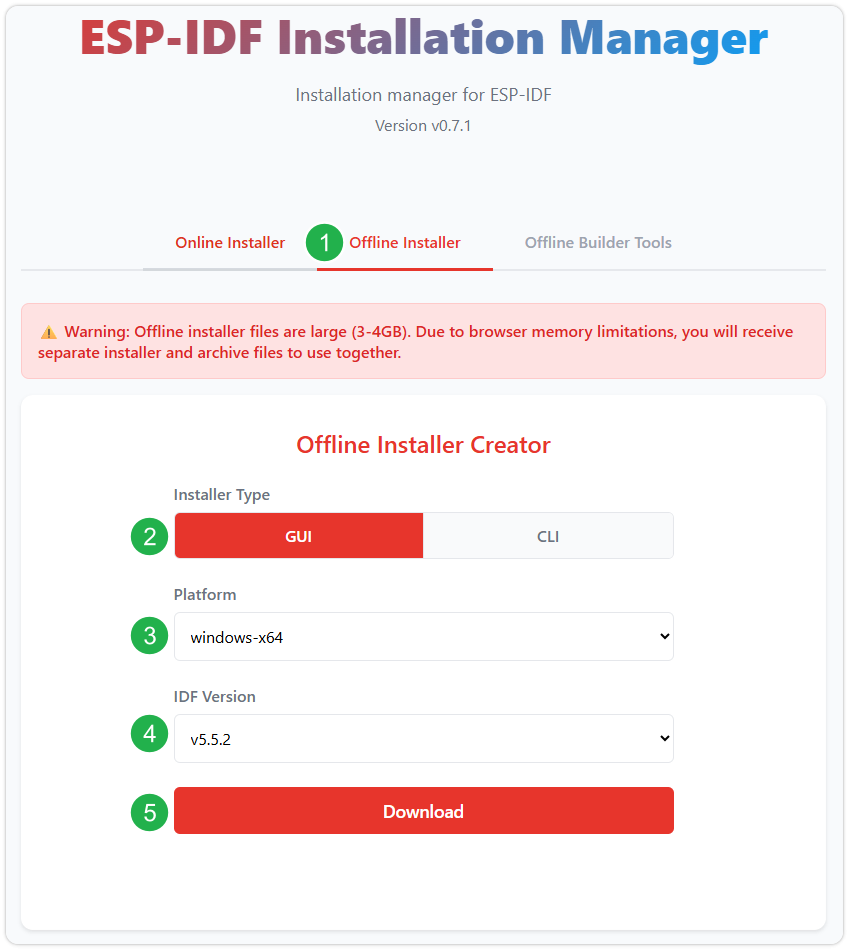

   After confirming your selection, click the download button. The browser will automatically download two files: the **ESP-IDF Offline Package (.zst)** and the **ESP-IDF Installer (.exe)**.

   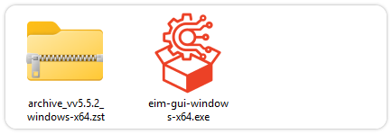

   Please wait for both files to finish downloading.
2. Once the download is complete, double-click to run the **ESP-IDF Installer (eim-gui-windows-x64.exe)**.

   The installer will automatically detect if the offline package exists in the same directory. Click **Install from archive**.

   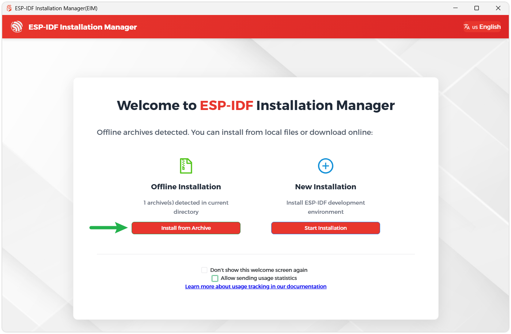

   Next, select the installation path. We recommend using the default path. If you need to customize it, ensure the path does not contain Chinese characters or spaces. Click **Start installation** to proceed.

   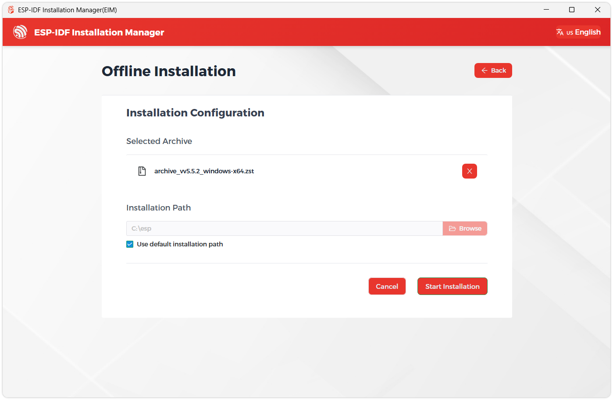
3. When you see the following screen, the ESP-IDF installation is successful.

   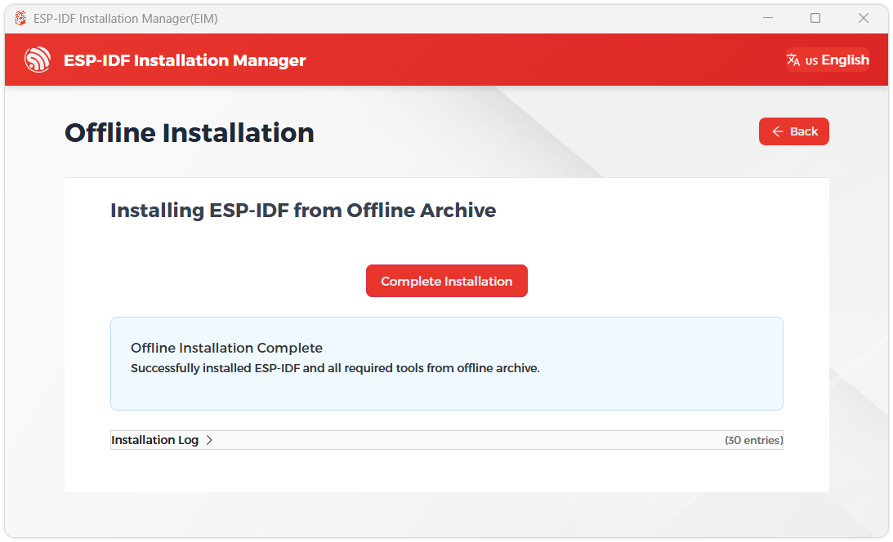
4. We recommend installing the drivers as well. Click **Finish installation**, then select **Install driver**.

   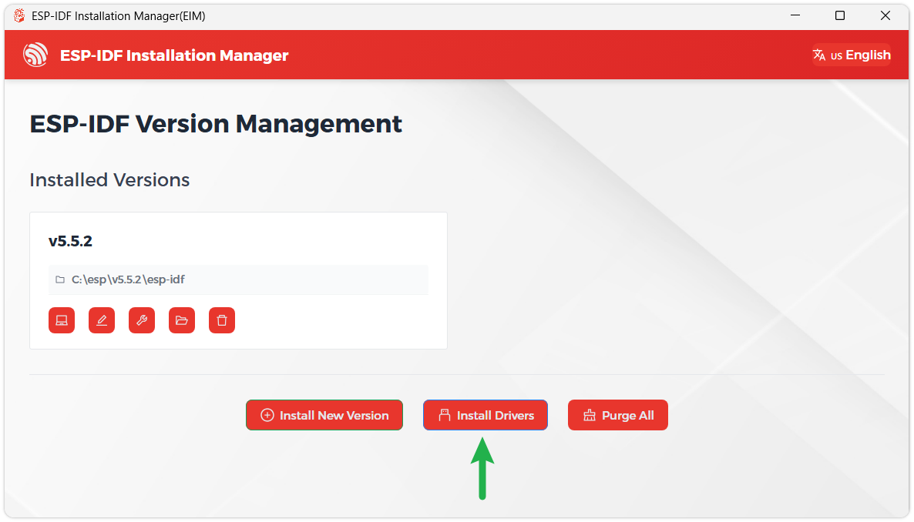

### Install Visual Studio Code and the ESP-IDF Extension

1. Download and install [Visual Studio Code](https://code.visualstudio.com/).
2. During installation, it is recommended to check **Add "Open with Code" action to Windows Explorer file context menu** to facilitate opening project folders quickly.
3. In VS Code, click the **Extensions** icon  in the Activity Bar on the side (or use the shortcut `Ctrl` + `Shift` + `X`) to open the **Extensions** view.
4. Enter **ESP-IDF** in the search box, locate the [ESP-IDF](https://marketplace.visualstudio.com/items?itemName=espressif.esp-idf-extension) extension, and click Install.

   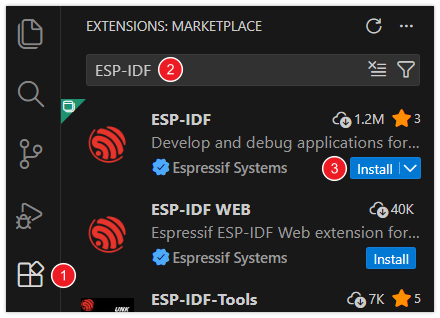
5. For **ESP-IDF extension versions ≥ 2.0**, the extension will automatically detect and recognize the ESP-IDF environment installed in the previous steps, requiring no manual configuration.

## Example

IDF example: [ESP32-S3-RGB-Matrix Example - GitHub](https://github.com/waveshareteam/ESP32-S3-RGB-Matrix)

Below are the purpose, key points, and operational effects for each example (for quick start).

|  |  |  |  |  |  |  |  |  |  |  |  |  |  |  |  |  |  |  |  |
| --- | --- | --- | --- | --- | --- | --- | --- | --- | --- | --- | --- | --- | --- | --- | --- | --- | --- | --- | --- |
| Example Basic Description|  |  |  |  |  |  |  |  |  |  |  |  |  |  |  |  |  |  | | --- | --- | --- | --- | --- | --- | --- | --- | --- | --- | --- | --- | --- | --- | --- | --- | --- | --- | | [01\_Matrix\_RGBW](https://docs.waveshare.com/ESP32-S3-RGB-Matrix/ESP-IDF) Simple test of RGBW LED color switching|  |  |  |  |  |  |  |  |  |  |  |  |  |  |  |  | | --- | --- | --- | --- | --- | --- | --- | --- | --- | --- | --- | --- | --- | --- | --- | --- | | [02\_Matrix\_Font\_5x7](https://docs.waveshare.com/ESP32-S3-RGB-Matrix/ESP-IDF) Test 5x7 font display|  |  |  |  |  |  |  |  |  |  |  |  |  |  | | --- | --- | --- | --- | --- | --- | --- | --- | --- | --- | --- | --- | --- | --- | | [03\_Matrix\_QMI](https://docs.waveshare.com/ESP32-S3-RGB-Matrix/ESP-IDF) Test QMI functionality display|  |  |  |  |  |  |  |  |  |  |  |  | | --- | --- | --- | --- | --- | --- | --- | --- | --- | --- | --- | --- | | [04\_Matrix\_RTC](https://docs.waveshare.com/ESP32-S3-RGB-Matrix/ESP-IDF) Test RTC time display|  |  |  |  |  |  |  |  |  |  | | --- | --- | --- | --- | --- | --- | --- | --- | --- | --- | | [05\_Matrix\_SDCard](https://docs.waveshare.com/ESP32-S3-RGB-Matrix/ESP-IDF) Test TF card mounting and capacity reading|  |  |  |  |  |  |  |  | | --- | --- | --- | --- | --- | --- | --- | --- | | [06\_Matrix\_SHTC3](https://docs.waveshare.com/ESP32-S3-RGB-Matrix/ESP-IDF) Test SHTC3 temperature and humidity sensor|  |  |  |  |  |  | | --- | --- | --- | --- | --- | --- | | [07\_Matrix\_WiFi](https://docs.waveshare.com/ESP32-S3-RGB-Matrix/ESP-IDF) Test Wi-Fi connection|  |  |  |  | | --- | --- | --- | --- | | [08\_Matrix\_Audio](https://docs.waveshare.com/ESP32-S3-RGB-Matrix/ESP-IDF) Test audio playback|  |  | | --- | --- | | [09\_Matrix\_CN\_Font](https://docs.waveshare.com/ESP32-S3-RGB-Matrix/ESP-IDF) Chinese font display | | | | | | | | | | | | | | | | | | | |

---

warning

- The three examples 03\_Matrix\_QMI, 06\_Matrix\_SHTC3, and 08\_Matrix\_Audio are designed for a 64x64 pixel screen. If used with other screen sizes, text display may overlap or become misaligned.

### 01\_Matrix\_RGBW

---

**Code Analysis**

- `rgbw_start()`: Cycles through the onboard RGBW LED colors to verify that the LED driver and logging output are functioning properly.
- `sizeof(rgbw_colors) / sizeof(rgbw_colors[0])`: Calculates the length of the preset color array for cycling.
- `bsp_display_lock()`: Locks the display before operating to avoid conflicts with other display tasks.
- `lv_obj_set_style_bg_color(screen, lv_color_hex(0x000000), 0)`: Sets the current screen background to black, reducing on-screen interference during the LED test.
- `rgbw_set_color(rgbw_colors[color_index].hex_color)`: Outputs the current color value to the RGBW LED.
- `ESP_LOGI(TAG, "Current color: %s", ...)`: Prints the current color name for debugging and observing the switching sequence.
- `vTaskDelay(pdMS_TO_TICKS(2000))`: Keeps each color for 2 seconds for easy observation.
- `if (color_index >= num_colors)`: Returns to the start after reaching the end of the color array, enabling cyclic switching.

```cpp
void rgbw_start(void) {
  /* =======================
   * 1. Basic Parameters
   * ======================= */
  int color_index = 0;
  const int num_colors = sizeof(rgbw_colors) / sizeof(rgbw_colors[0]);

  /* =======================
   * 2. Init Screen
   * ======================= */
  bool locked = bsp_display_lock(1000);
  if (locked) {
    lv_obj_t *screen = lv_scr_act();
    lv_obj_set_style_bg_color(screen, lv_color_hex(0x000000), 0);
    bsp_display_unlock();
  }
  /* =======================
   * 3. Loop Colors
   * ======================= */
  while (true) {
    locked = bsp_display_lock(1000);
    if (locked) {
      rgbw_set_color(rgbw_colors[color_index].hex_color);
      bsp_display_unlock();
    }
    ESP_LOGI(TAG, "Current color: %s", rgbw_colors[color_index].name);
    vTaskDelay(pdMS_TO_TICKS(2000));
    color_index++;
    if (color_index >= num_colors) {
      color_index = 0;
    }
  }
}
```

**Expected Behavior**

|  |  |  |  |  |  |
| --- | --- | --- | --- | --- | --- |
| |  |  |  |  | | --- | --- | --- | --- | | | | | | | | |

### 02\_Matrix\_Font\_5x7

---

**Code Analysis**

- `font_5x7_start()`: Starts the 5x7 font example interface and keeps the task running continuously.
- `ESP_LOGI(TAG, "Matrix Font 5x7 start")`: Outputs a start log to confirm that the example has entered the running state.
- `bsp_display_lock(0)`: Locks before entering the LVGL display context to ensure safe interface initialization.
- `font_5x7_ui_init()`: Creates the UI objects needed for the 5x7 font example.
- `font_5x7_ui_apply()`: Applies the font, layout, default text, etc., to the interface.
- `while (true)`: Keeps the task alive to prevent the example from exiting immediately after initialization.
- `vTaskDelay(pdMS_TO_TICKS(1000))`: Idle wait to reduce busy looping.

```cpp
void font_5x7_start(void) {
  /* =======================
   * 1. Start Display
   * ======================= */
  ESP_LOGI(TAG, "Matrix Font 5x7 start");
  /* =======================
   * 2. Init UI (LVGL Locked)
   * ======================= */
  bool locked = bsp_display_lock(0);
  if (locked) {
    font_5x7_ui_init();
    font_5x7_ui_apply();
    bsp_display_unlock();
  }

  /* =======================
   * 3. Idle Loop
   * ======================= */
  while (true) {
    vTaskDelay(pdMS_TO_TICKS(1000));
  }
}
```

**Expected Behavior**

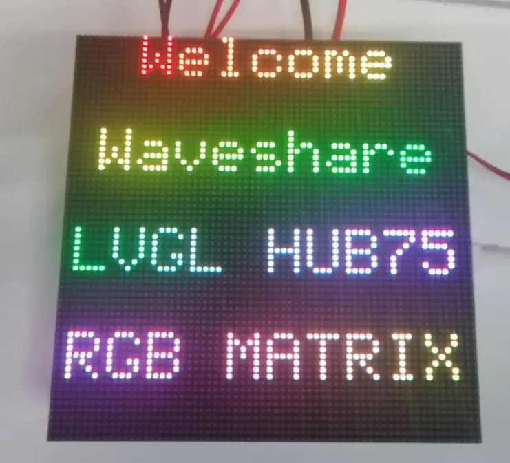

### 03\_Matrix\_QMI

---

**Code Analysis**

- `qmi_start()`: Initializes the QMI8658 sensor UI, starts the driver, and configures periodic refreshing.
- `qmi_ui_init()`: Creates the UI for QMI8658 data display.
- `middle_init_qmi8658()`: Initializes the QMI8658 sensor driver.
- `qmi_state.qmi_init_ret`: Stores the sensor initialization result for the UI layer to determine status and show prompts.
- `example_ui_install_timer(100, qmi_data_update)`: Installs a 100 ms periodic timer to refresh orientation or acceleration data.
- `qmi_data_update`: Updates sensor data and UI display in the timer callback.
- `while (true)`: Keeps the task alive.
- `vTaskDelay(pdMS_TO_TICKS(1000))`: Idle wait to reduce resource usage.

```cpp
void qmi_start(void) {
  /* =======================
   * 1. Start Display & UI
   * ======================= */
  bool locked = bsp_display_lock(0);
  if (locked) {
    qmi_ui_init();
    bsp_display_unlock();
  }

  /* =======================
   * 2. Start Sensor & Timer
   * ======================= */
  qmi_state.qmi_init_ret = middle_init_qmi8658();
  locked = bsp_display_lock(0);
  if (locked) {
    example_ui_install_timer(100, qmi_data_update);
    bsp_display_unlock();
  }

  /* =======================
   * 3. Idle Loop
   * ======================= */
  while (true) {
    vTaskDelay(pdMS_TO_TICKS(1000));
  }
}
```

**Expected Behavior**

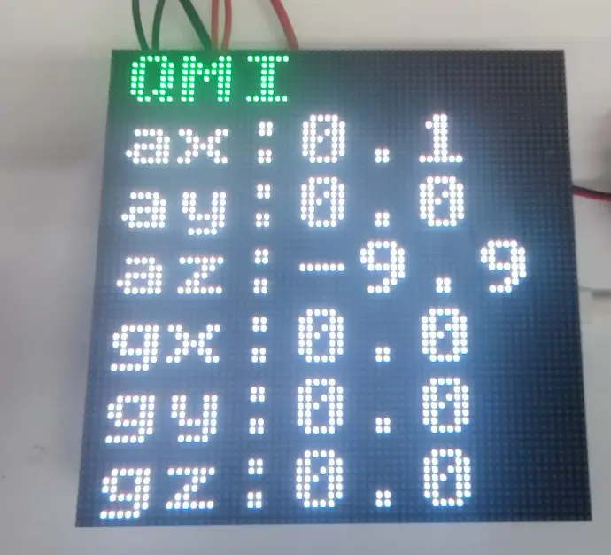

### 04\_Matrix\_RTC

---

**Code Analysis**

- `rtc_start()`: Initializes the RTC UI, sets the time, configures the alarm, and enables real-time refresh.
- `rtc_ui_init()`: Creates UI elements for time display.
- `middle_rtc_init()`: Initializes the RTC driver and underlying hardware interface.
- `middle_rtc_set_time(rtc_state.rtc_time)`: Writes the initial time (from the state structure) to the RTC chip.
- `middle_rtc_alarm(3)`: Configures an RTC alarm test condition to verify alarm functionality.
- `example_ui_install_timer(1, rtc_data_update)`: Installs a high-frequency refresh timer to keep the UI synchronized with the current time.
- `rtc_data_update`: Reads RTC data in the callback and updates the display content.
- `while (true)`: Keeps the RTC example task running.

```cpp
void rtc_start(void) {
  bool locked = bsp_display_lock(0);
  if (locked) {
    rtc_ui_init();
    bsp_display_unlock();
  }
  middle_rtc_init();
  middle_rtc_set_time(rtc_state.rtc_time);
  middle_rtc_alarm(3);
  locked = bsp_display_lock(0);
  if (locked) {
    example_ui_install_timer(1, rtc_data_update);
    bsp_display_unlock();
  }
  while (true) {
    vTaskDelay(pdMS_TO_TICKS(1000));
  }
}
```

**Expected Behavior**

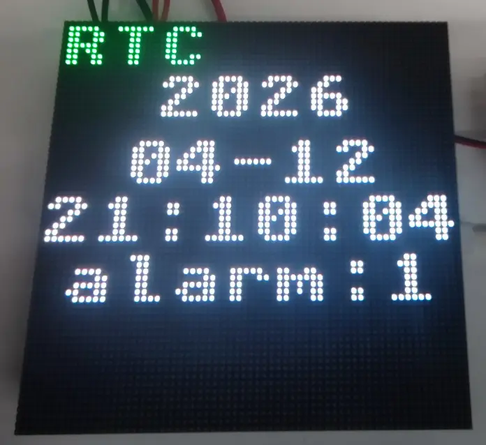

### 05\_Matrix\_SDCard

---

**Code Analysis**

- `sdcard_start()`: Initializes the TFcard UI, starts the underlying driver, and configures periodic status refresh.
- `sdcard_ui_init()`: Creates UI components for displaying mount status, capacity, and storage information.
- `middle_sdcard_init()`: Performs low-level TF card initialization, typically including bus configuration, card identification, and file system mounting.
- `example_ui_install_timer(1000, sdcard_data_update)`: Installs a 1-second periodic timer to refresh TF card status and capacity information.
- `sdcard_data_update`: Updates the TF card display content in the callback.
- `while (true)`: Keeps the example task running.
- `vTaskDelay(pdMS_TO_TICKS(1000))`: Idle wait to reduce task usage.

```cpp
void sdcard_start(void) {
  /* =======================
   * 1. Start Display & UI
   * ======================= */
  bool locked = bsp_display_lock(0);
  if (locked) {
    sdcard_ui_init();
    bsp_display_unlock();
  }

  /* =======================
   * 2. Init TF Card
   * ======================= */
  middle_sdcard_init();

  /* =======================
   * 3. Periodic Refresh
   * ======================= */
  locked = bsp_display_lock(0);
  if (locked) {
    example_ui_install_timer(1000, sdcard_data_update);
    bsp_display_unlock();
  }

  /* =======================
   * 4. Idle Loop
   * ======================= */
  while (true) {
    vTaskDelay(pdMS_TO_TICKS(1000));
  }
}
```

**Expected Behavior**

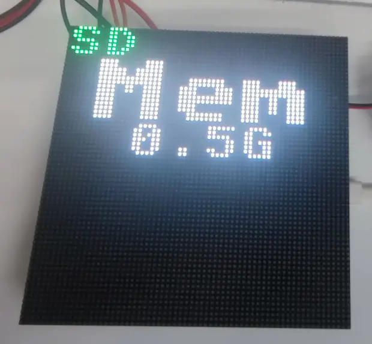

### 06\_Matrix\_SHTC3

---

**Code Analysis**

- `shtc3_start()`: Initializes the SHTC3 UI, starts the driver, and refreshes temperature/humidity data periodically.
- `shtc3_ui_init()`: Creates UI elements for temperature, humidity, and status prompts.
- `middle_init_shtc3()`: Initializes the SHTC3 sensor driver.
- `shtc3_state.shtc3_init_ret`: Stores the initialization result for the UI layer to decide whether to show data normally.
- `example_ui_install_timer(500, shtc3_data_update)`: Installs a 500 ms periodic timer to refresh sensor data.
- `shtc3_data_update`: Reads temperature and humidity information in the callback and refreshes the UI.
- `while (true)`: Keeps the example task running.
- `vTaskDelay(pdMS_TO_TICKS(1000))`: Idle wait to reduce task usage.

```cpp
void shtc3_start(void) {
  /* =======================
   * 1. Start Display & UI
   * ======================= */
  bool locked = bsp_display_lock(0);
  if (locked) {
    shtc3_ui_init();
    bsp_display_unlock();
  }
  /* =======================
   * 2. Init Sensor & Timer
   * ======================= */
  shtc3_state.shtc3_init_ret = middle_init_shtc3();
  locked = bsp_display_lock(0);
  if (locked) {
    example_ui_install_timer(500, shtc3_data_update);
    bsp_display_unlock();
  }

  /* =======================
   * 3. Idle Loop
   * ======================= */
  while (true) {
    vTaskDelay(pdMS_TO_TICKS(1000));
  }
}
```

**Expected Behavior**

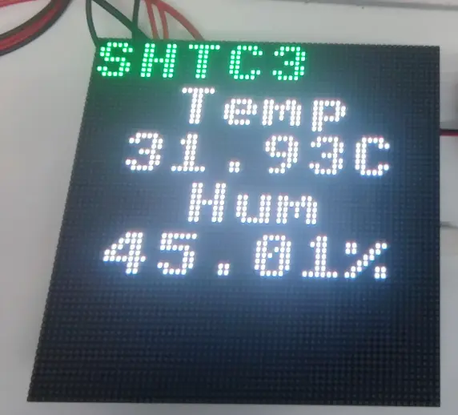

### 07\_Matrix\_WiFi

---

**Code Analysis**

- `wifi_start()`: Initializes the Wi-Fi UI, configures STA parameters, starts the driver, and enables status refresh.
- `wifi_ui_init()`: Creates the network status display UI.
- `middle_wifi_set_sta_config(WIFI_STA_SSID, WIFI_STA_PASS)`: Sets the SSID and password of the target access point.
- `middle_wifi_init()`: Starts the Wi-Fi driver and initiates the connection process.
- `wifi_state.wifi_init_ret`: Stores the Wi-Fi initialization result for the UI to display connection status.
- `example_ui_install_timer(1000, wifi_data_update)`: Installs a 1-second periodic timer to refresh connection status and network information.
- `wifi_data_update`: Updates the Wi-Fi connection status, IP address, and other UI content in the callback.
- `while (true)`: Keeps the example task running.

```cpp
void wifi_start(void) {
  /* =======================
   * 1. Start Display & UI
   * ======================= */
  bool locked = bsp_display_lock(0);
  if (locked) {
    wifi_ui_init();
    bsp_display_unlock();
  }

  /* =======================
   * 2. Configure & Enable Wi-Fi
   * ======================= */
  middle_wifi_set_sta_config(WIFI_STA_SSID, WIFI_STA_PASS);
  wifi_state.wifi_init_ret = middle_wifi_init();

  /* =======================
   * 3. Periodic Refresh
   * ======================= */
  locked = bsp_display_lock(0);
  if (locked) {
    example_ui_install_timer(1000, wifi_data_update);
    bsp_display_unlock();
  }

  /* =======================
   * 4. Idle Loop
   * ======================= */
  while (true) {
    vTaskDelay(pdMS_TO_TICKS(1000));
  }
}
```

**Expected Behavior**

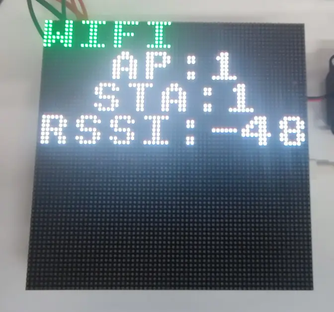

### 08\_Matrix\_Audio

---

**Code Analysis**

- `audio_start()`: Initializes the audio UI, creates an audio task, and configures periodic status refresh.
- `audio_ui_init()`: Creates UI elements related to volume, playback status, or spectrum.
- `audio_state.audio_out_vol = VOLUME`: Sets the default audio output volume.
- `xTaskCreate(audio_task, "aud", 4096, NULL, tskIDLE_PRIORITY + 4, NULL)`: Creates an independent audio task to handle audio logic in the background.
- `example_ui_install_timer(100, audio_data_update)`: Installs a 100 ms periodic timer to sync the audio state with the UI.
- `audio_data_update`: Updates playback status, volume, or other audio information in the callback.
- `while (true)`: Keeps the example task running.
- `vTaskDelay(pdMS_TO_TICKS(1000))`: Idle wait to reduce main task usage.

```cpp
void audio_start(void) {
    /* =======================
     * 1. Start Display & UI
     * ======================= */
    bool locked = bsp_display_lock(0);
    if (locked) {
        audio_ui_init();
        bsp_display_unlock();
    }
    /* =======================
     * 2. Start Audio Task
     * ======================= */
    audio_state.audio_out_vol = VOLUME;
    xTaskCreate(audio_task, "aud", 4096, NULL, tskIDLE_PRIORITY + 4, NULL);
    /* =======================
     * 3. Periodic UI Refresh
     * ======================= */
    locked = bsp_display_lock(0);
    if (locked) {
        example_ui_install_timer(100, audio_data_update);
        bsp_display_unlock();
    }
    /* =======================
     * 4. Idle Loop
     * ======================= */
    while (true) {
        vTaskDelay(pdMS_TO_TICKS(1000));
    }
}
```

**Expected Behavior**

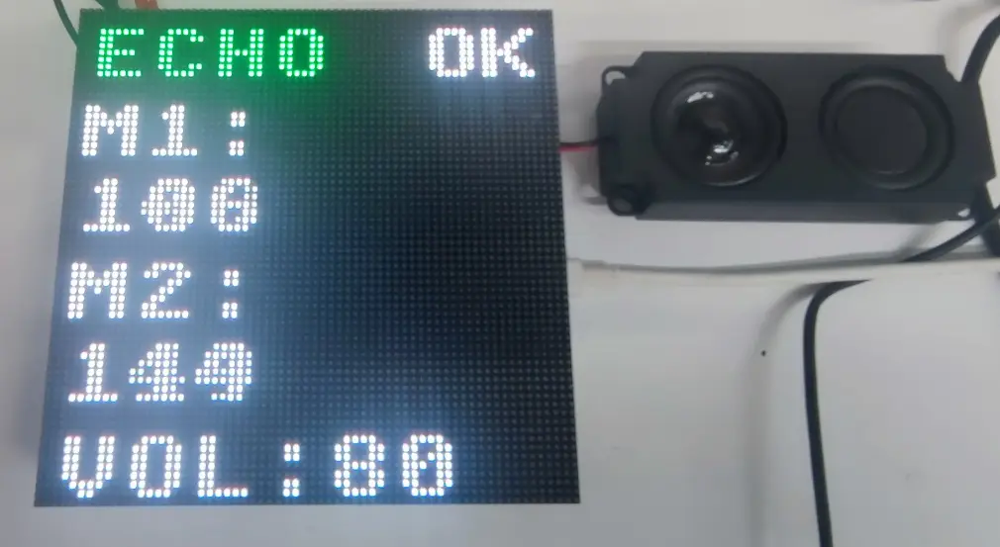

### 09\_Matrix\_CN\_Font

---

**Code Analysis**

- `cn_font_start()`: Initializes the LVGL display interface, applies the Chinese font layout, and keeps the task running.
- `lvgl_port_lock(0)`: Acquires the LVGL mutex to ensure thread-safe UI initialization.
- `cn_font_ui_init()`: Obtains common UI objects via `common_ui_get()`, displays 4 label lines, and uniformly sets the 18px bitmap Chinese font (`Bitmap_Font_18px`).
- `lv_obj_set_style_text_align(..., LV_TEXT_ALIGN_CENTER, 0)`: Sets the 4 label lines to center alignment.
- `lv_obj_align_to(..., LV_ALIGN_OUT_BOTTOM_MID, ...)`: Arranges the 4 label lines vertically from top to bottom in a stacked layout.
- `cn_font_ui_apply()`: Calls `set_label_gradient_text_safe()` for each label to set Chinese text and gradient colors, displaying "欢迎光临", "微雪电子", "中文字体", and "你好世界".
- `set_label_gradient_text_safe()`: Renders gradient colors character by character for UTF-8 Chinese text to avoid misalignment in non-monospace fonts.
- `while (true)`: Keeps the example task running.

```c
void cn_font_start(void) {
  /* =======================
   * 1. Start Display
   * ======================= */
  ESP_LOGI(TAG, "Matrix CN font start");
  /* =======================
   * 2. Init UI (LVGL Locked)
   * ======================= */
  bool locked = lvgl_port_lock(0);
  if (locked) {
    cn_font_ui_init();
    cn_font_ui_apply();
    lvgl_port_unlock();
  }

  /* =======================
   * 3. Idle Loop
   * ======================= */
  while (true) {
    vTaskDelay(pdMS_TO_TICKS(1000));
  }
}
```

**Expected Behavior**

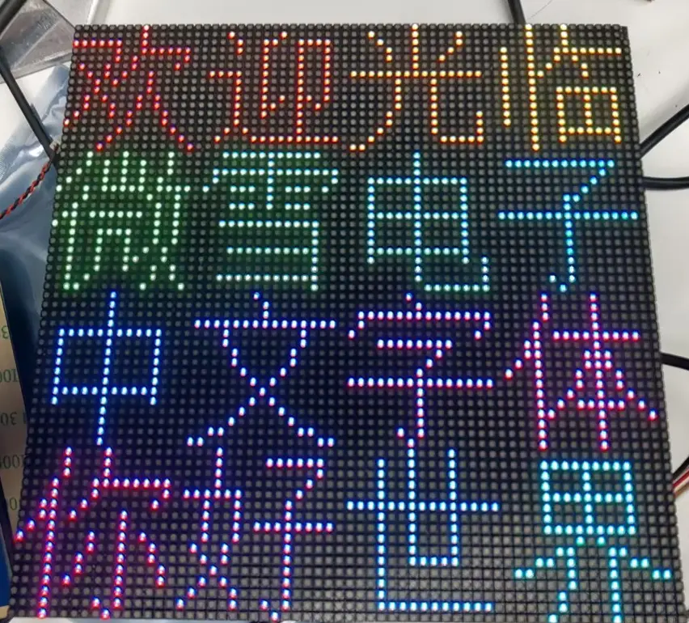

[Give Feedback](https://docs.google.com/forms/d/e/1FAIpQLSfayJEZ5J-dp-3Wq_dkWsVRhNuQ6C79_GNV62mYuFW8Mj6U8Q/viewform)
