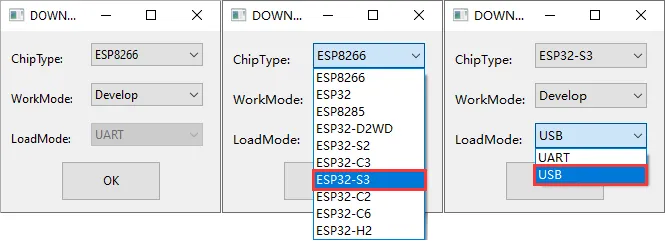
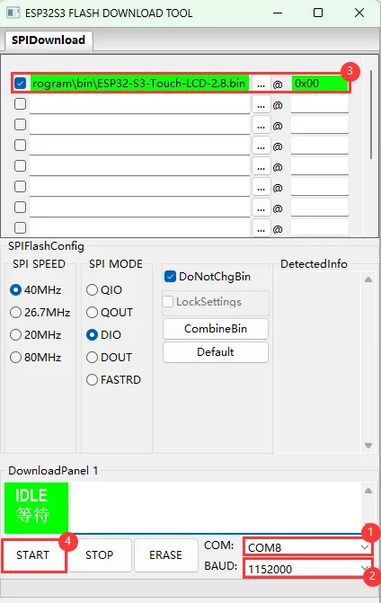
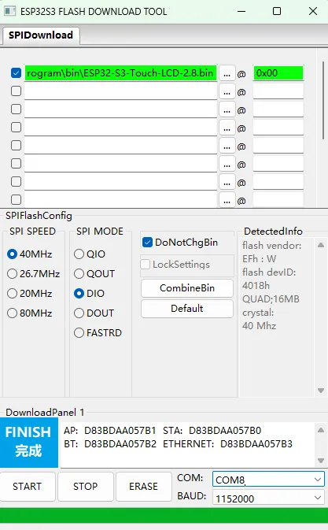
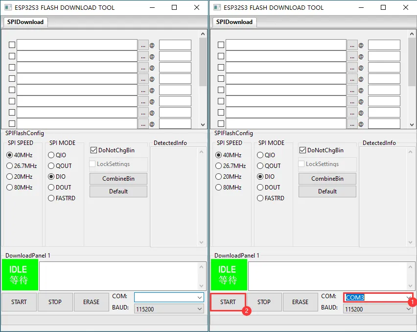
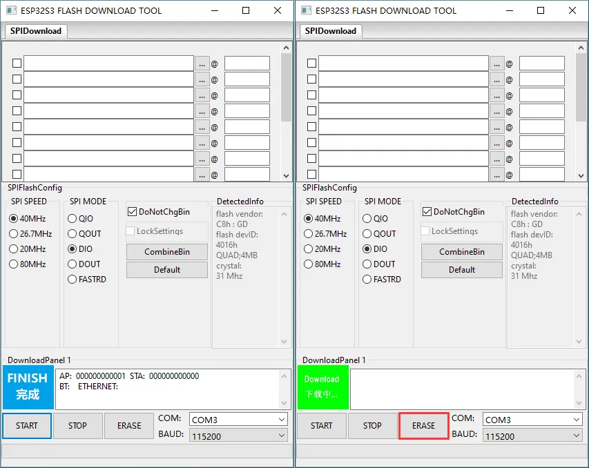

<!-- source: https://docs.waveshare.com/ESP32-S3-RGB-Matrix/Firmware-Flashing | fetched: 2026-09-21 -->
# ESP32-S3-RGB-Matrix Firmware Flashing and Erasing | WaveShare Documentation

This product provides test firmware that can be flashed directly to verify whether the onboard devices are functioning properly.

- Firmware download: [ESP32-S3-RGB-Matrix Example](https://github.com/waveshareteam/ESP32-S3-RGB-Matrix). The bin file is located in the `firmware` directory of the example package.
- Flash address: `0x00`

- Firmware Flashing- Firmware Erasing

The following steps apply to the firmware provided on this page.

- Download and extract Espressif's official Flash Download Tool ([Download](https://dl.espressif.com/public/flash_download_tool.zip))
- Run Flash Download Tool and select the options that match the development board's MCU and download interface. The screenshot below uses ESP32-S3 and USB as an example; use the options required by the product's hardware design.

  
- Parameter settings

  - Select the COM port for the development board
  - Set BAUD to the maximum value, 1152000
  - Click the "..." button in the row, select the bin file provided by Waveshare, manually enter the flash address given at the top of this page in the field to its right, and select the leftmost checkbox in the row
  - Click **START** to begin flashing

  
- Wait for flashing to complete (this may take some time; please be patient)
- Press the reset button and verify the result

  

tip

If the tool remains at "Waiting for power-on sync", hold down **BOOT** and power cycle the device to enter download mode.

tip

Click **ERASE** to erase the entire flash. If erasing fails or the device does not respond, hold down **BOOT** and power cycle the device to enter download mode, then try again.

- Download and extract Espressif's official Flash Download Tool ([Download](https://dl.espressif.com/public/flash_download_tool.zip))
- Run Flash Download Tool and select the options that match the development board's MCU and download interface. The screenshot below uses ESP32-S3 and USB as an example; use the options required by the product's hardware design.

  
- Select the COM port for the device, **do not select any bin file**, and click **START**

  
- When the operation above is complete, click **ERASE** to erase the flash

  
- Wait for erasing to complete

  

[Give Feedback](https://docs.google.com/forms/d/e/1FAIpQLSfayJEZ5J-dp-3Wq_dkWsVRhNuQ6C79_GNV62mYuFW8Mj6U8Q/viewform)
