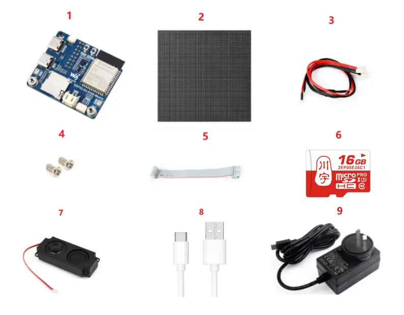
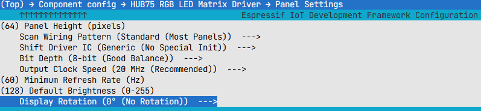

<!-- source: https://docs.waveshare.com/ESP32-S3-RGB-Matrix/Instructions-For-Use | fetched: 2026-09-21 -->
# ESP32-S3-RGB-Matrix User Guide | WaveShare Documentation

To help users quickly understand the features of the product, we provide a series of test examples that demonstrate how to use each interface. To run these examples, prepare the following components:

## Component Preparation

1. **ESP32-S3-RGB-Matrix ×1**
2. **Any model of LED screen x1** (you can prepare multiple if cascading is required)
3. **VH4 2PIN wire (approx. 500mm) ×1** (prepare multiple if cascading is required)
4. **Screw kit × 1**
5. **16PIN flat ribbon cable (approx. 200mm) ×1** (prepare multiple if cascading is required)
6. **TF card × 1**
7. **8Ω 5W speaker × 1**
8. **USB cable** Type-A male → Type-C male ×1
9. **PSU-27W-USB-C-EU-B x 1** USB Type-C charger

## Precautions

- To cascade multiple screens, prepare several screens and several flat ribbon cables. Connect each screen to one end of a ribbon cable. If the power supply is insufficient, you can use a dual-port USB Type-C charger.
- The TF card only supports **MMC** communication.

### ⚠️ USB Download Precautions (Important)

The development board uses USB for programming.

If the **port is not recognized**, please enter **Boot mode**:

1. Press and hold the **BOOT** button
2. Connect the USB cable to the computer
3. Release the **BOOT** button

After the download is complete, press the **RESET** button to run the program.

### The following options must be configured in `menuconfig` before compilation:

- Panel Height = 64
- Panel Width = 64
- Configure according to the specific pixel size. Incorrect settings will cause display misalignment.
- Scan Wiring Pattern = Standard
- Scan wiring modes and select the most common standard mode.
- Shift Driver IC = Generic
- Initialize the driver chip in generic mode, suitable for most common panels.
- Bit Depth = 8-bit
- Medium color depth, providing a good balance between effect and performance.
- Output Clock Speed = 20MHz
- Data output speed; 20MHz is typically stable and sufficient.
- Minimum Refresh Rate = 60Hz
- Set the minimum refresh rate to 60Hz to reduce visible flicker.
- Default Brightness = 128
- Half of the maximum brightness, a compromise between brightness and power consumption.
- Display Rotation = 0°
- No rotation, display in the default orientation.

[Give Feedback](https://docs.google.com/forms/d/e/1FAIpQLSfayJEZ5J-dp-3Wq_dkWsVRhNuQ6C79_GNV62mYuFW8Mj6U8Q/viewform)
