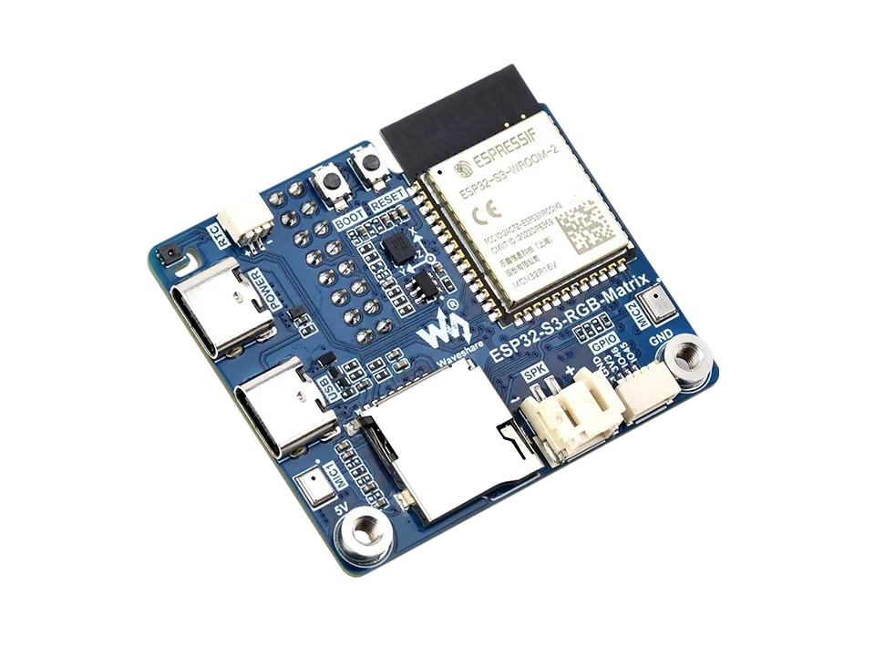
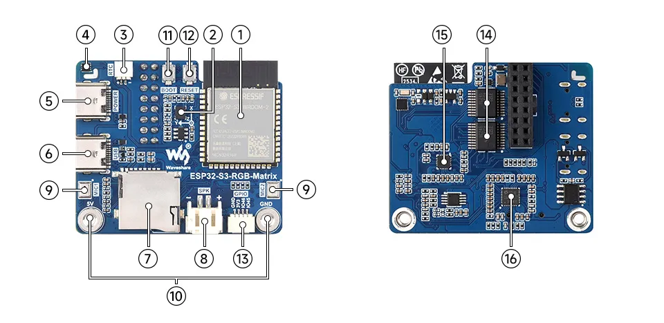
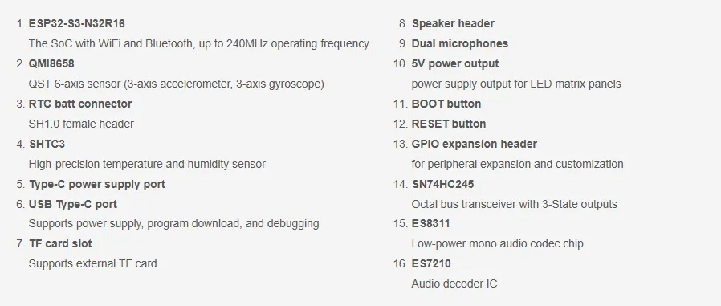
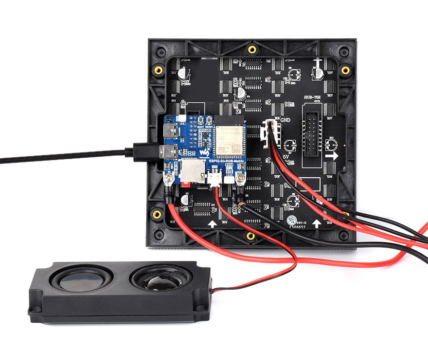
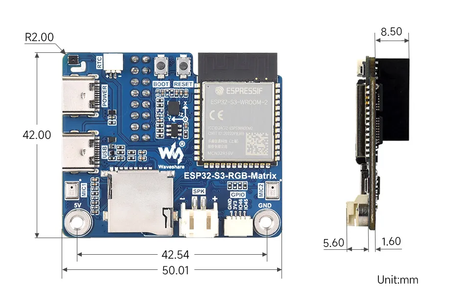

<!-- source: https://docs.waveshare.com/ESP32-S3-RGB-Matrix | fetched: 2026-09-21 -->
# ESP32-S3-RGB-Matrix | WaveShare Documentation

The ESP32-S3-Matrix is a high-performance, highly integrated LED screen driver board designed for HUB75 interface RGB Matrix displays and related embedded applications. It features a high-performance microcontroller with large Flash capacity, and integrates rich peripheral resources such as an RTC, IMU, TF card slot, low-power audio codec, and dual microphones. It also provides USB, UART, I2C, and GPIO interfaces for good expandability, enabling rapid development and integration into real-world products.

**If you are looking for:**

- **Coding with AI tools**: Click **Ask AI** and select an AI tool to ask questions about this page, or choose **Copy page** to copy its content and paste it into an AI tool for coding assistance.
- **Schematics, datasheets, and example code**: See [Resources](https://docs.waveshare.com/ESP32-S3-RGB-Matrix/Resources-And-Documents)
- **Factory firmware**: See [User Guide](https://docs.waveshare.com/ESP32-S3-RGB-Matrix/Instructions-For-Use)
- **Arduino development**: See [Working with Arduino](https://docs.waveshare.com/ESP32-S3-RGB-Matrix/Arduino)
- **ESP-IDF development**: See [Working with ESP-IDF](https://docs.waveshare.com/ESP32-S3-RGB-Matrix/ESP-IDF)
- **Troubleshooting**: See [Product FAQ](https://docs.waveshare.com/ESP32-S3-RGB-Matrix/FAQ) or contact [Technical Support](https://docs.waveshare.com/ESP32-S3-RGB-Matrix/Technical-Support)

|  |  |  |  |
| --- | --- | --- | --- |
| SKU Product|  |  | | --- | --- | | 34422 ESP32-S3-RGB-Matrix | | | |

## Features

- Equipped with the ESP32-S3-N32R16 chip, featuring an Xtensa 32-bit LX7 dual-core processor running at up to 240 MHz
- Supports 2.4 GHz Wi-Fi and Bluetooth 5 (BLE) dual-mode communication
- Built-in 512KB SRAM, 384KB ROM, stacked 32MB Flash and 16MB PSRAM, meeting storage needs in various scenarios
- Compatible with all sizes of the Matrix-RGB series from the Waveshare store, capable of smoothly running LVGL and other graphical UI programs
- Onboard ES7210 echo cancellation chip for improved voice processing
- Onboard ES8311 low-power audio codec chip supporting high-quality audio input/output
- Dual-microphone array supporting noise reduction and echo cancellation algorithms, suitable for voice recognition and wake-word applications
- Onboard speaker connector supporting audio playback output, ready for direct speaker connection
- Integrated QMI8658 6-axis IMU (3-axis accelerometer + 3-axis gyroscope) for motion detection
- Integrated SHTC3 temperature and humidity sensor for accurate environmental monitoring
- Onboard TF card slot for storing images, audio, and other file data, facilitating data read/write
- Onboard PCF85063 RTC real-time clock chip, with a reserved SH1.0 battery connector for continuous timekeeping when power is off
- Reserved GPIO expansion header for peripheral expansion and function customization, adapting to diverse development needs
- Dual power supply interface design, supporting stable operation of up to six 64×64 Matrix-RGB screens, with cascade expansion for large-size displays
- Onboard USB Type-C interface supporting power supply, program download, and debugging for convenient operation
- Onboard RST / BOOT buttons, where the BOOT button supports custom functions, enhancing development flexibility

## Onboard Resources

## Interface Introduction

## Dimensions

## Development Methods

The ESP32-S3-Matrix supports multiple development methods. You can use the official Espressif ESP-IDF framework for professional development, or choose platforms such as Arduino IDE for rapid prototyping, giving developers flexible options. You can select the development tool that best suits your project needs and personal preference.

- **Arduino IDE** is a convenient, flexible, and easy-to-use open-source electronics prototyping platform. It requires minimal foundational knowledge, allowing for rapid development after a short learning period. Arduino has a huge global user community, providing a vast amount of open-source code, project examples, and tutorials, as well as a rich library ecosystem that encapsulates complex functions, enabling developers to implement various features rapidly. You can refer to the **[Working with Arduino](https://docs.waveshare.com/ESP32-S3-RGB-Matrix/Arduino)** to complete the initial setup, and the tutorial also provides related examples for reference.
- **ESP-IDF**, short for Espressif IoT Development Framework, is a professional development framework launched by Espressif Systems for its ESP series of chips. It is based on C language development and includes compilers, debuggers, flashing tools, etc. It supports development via command line or integrated development environments (such as Visual Studio Code with the Espressif IDF plugin), which provides features like code navigation, project management, and debugging. We recommend using VS Code for development. For the specific configuration process, please refer to the **[Working with ESP-IDF](https://docs.waveshare.com/ESP32-S3-RGB-Matrix/ESP-IDF)**. The tutorial also provides relevant examples for reference.

[Give Feedback](https://docs.google.com/forms/d/e/1FAIpQLSfayJEZ5J-dp-3Wq_dkWsVRhNuQ6C79_GNV62mYuFW8Mj6U8Q/viewform)
