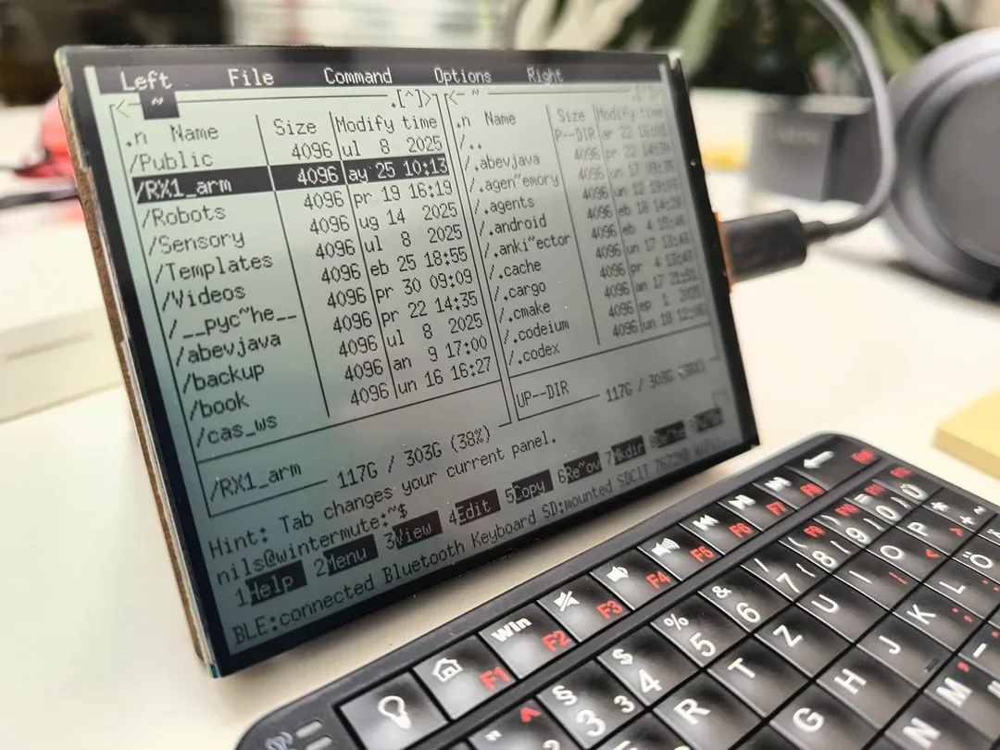
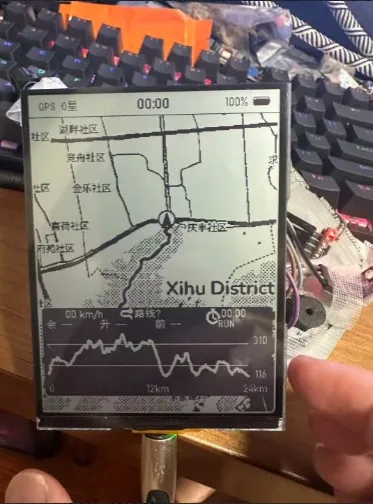

<!-- source: https://docs.waveshare.com/ESP32-S3-RLCD-4.2/Resources-And-Documents | fetched: 2026-09-22 -->
# ESP32-S3-RLCD-4.2 Resources | WaveShare Documentation

## 1. Examples

- [ESP32-S3-RLCD-4.2 Examples (GitHub)](https://github.com/waveshareteam/ESP32-S3-RLCD-4.2.git)

## 2. Hardware Resources

- [ESP32-S3-RLCD-4.2 Schematic](https://files.waveshare.com/wiki/ESP32-S3-RLCD-4.2/ESP32-S3-RLCD-4.2-schematic.pdf)
- [Structure and dimensions](https://files.waveshare.com/wiki/ESP32-S3-RLCD-4.2/ESP32-S3-RLCD-4.2-3dFile.rar)

## 3. Technical Manuals

- **ESP32-S3 Chip Official Manuals**

  - [Datasheet](https://documentation.espressif.com/esp32-s3_datasheet_en.pdf)
  - [Technical Reference Manual](https://documentation.espressif.com/esp32-s3_technical_reference_manual_en.pdf)
- **Datasheets**

  - [ST7305 Datasheet](https://files.waveshare.com/wiki/common/ST_7305_V0_2.pdf)
  - [ES8311 Datasheet](https://files.waveshare.com/wiki/common/ES8311.DS.pdf)
  - [PCF85063 Datasheet](https://files.waveshare.com/wiki/common/Pcf85063atl1118-NdPQpTGE-loeW7GbZ7.pdf)
  - [SHTC3 Datasheet](https://files.waveshare.com/wiki/common/SHTC3_Datasheet.pdf)

## 4. Community Showcase

info

Check out these amazing projects created by the community! Please note these are independently maintained by their creators.

### Volos Projects - Finally! An ESP32 Screen for Sunlight

- YouTube: <https://www.youtube.com/watch?v=MziW1InJwa4>
- GitHub: <https://github.com/VolosR/waveshareLRCL>

### J H - Using Waveshare ESP32-S3 4.2inch RLCD as Smart Clock

- YouTube: <https://www.youtube.com/watch?v=kfiwg6aNjsw>
- GitHub: <https://github.com/JasonHEngineering/waveshare_RLCD_400x300_monochrome>

### Draeger-IT-ESP32-S3 with 4.2″ display: ePaper killer? Unboxing & first impressions (Part 1)

- YouTube: <https://www.youtube.com/watch?v=TG7722V8UGw>
- Blog: <https://draeger-it.blog/esp32-s3-4-2-display-epaper-killer-unboxing/>

### Volos Projects - I Built an ESP32 E-Bike Dashboard You Can See in Sunlight (Full Code)

- YouTube: <https://www.youtube.com/watch?v=EKnZ7ZisUj4>
- GitHub: <https://github.com/VolosR/eBikeRLCD>

### Draeger-IT - Programming an ESP32-S3 RLCD Display – Arduino IDE & LVGL (Part 2)

- YouTube: <https://www.youtube.com/watch?v=-ohhYlIscEo>
- Blog: <https://draeger-it.blog/esp32-s3-rlcd-display-ansteuern-so-klappt-die-programmierung-mit-arduino-ide-teil-2/>

### GreatScott! - I tried finding Hidden Gems

- YouTube: <https://www.youtube.com/watch?v=6rlUO5NoYO0>

### Rubikrubi - NTP clock design for WAVESHARE ESP32-S3 board with 4.2" RLCD display

- GitHub: <https://github.com/Rubikrubi/zegar-WAVESHARE-ESP32-S3-4-2-cala-RLCD>

### У Павла! - Review of the Waveshare ESP32-S3-RLCD-4.2 module in ESPHome and XiaoZhi

- YouTube: <https://www.youtube.com/watch?v=sXTcgir5-rY>
- Guide: <https://psenyukov.ru/topics/5581>

### Marton Juhasz - Solar OS

- Reddit: <https://www.reddit.com/r/cyberDeck/comments/1uemtp6/solaros/>
- GitHub: <https://github.com/nilseuropa/solar_os>

### Lalo - trmnl-waveshare-esp32-s3-rlcd-4.2

- GitHub: <https://github.com/la-lo-go/trmnl-waveshare-esp32-s3-rlcd-4.2>

### LankyEvening6102 - ESP32-S3 offline hiking GPS

- Reddit: <https://www.reddit.com/r/esp32/comments/1undygh/esp32s3_offline_hiking_gps_gpx_route_executor/>
- GitHub: <https://github.com/chengshiwu619/hiking-gps>

### Rubikrubi - NTP clock with MP3 alarm clock

- GitHub: <https://github.com/Rubikrubi/zegar-WAVESHARE-ESP32-S3-4-2-cala-RLCD>

### SixSigmaEngineer - Waveshare ESP32 Clock Model ESP32-S3 RLCD 4.2

- GitHub: <https://github.com/SixSigmaEngineer/waveshareesp32clock>

### That Project - Why Bubble Sort is Terrible (8 Sorting Algorithms Benchmark)

- YouTube: <https://www.youtube.com/watch?v=wu1zD7QWn2I>

### Marton Juhasz - Build instructions for a SolarOS pocket terminal

- GitHub: <https://github.com/nilseuropa/solar_term>

[Give Feedback](https://docs.google.com/forms/d/e/1FAIpQLSfayJEZ5J-dp-3Wq_dkWsVRhNuQ6C79_GNV62mYuFW8Mj6U8Q/viewform)
