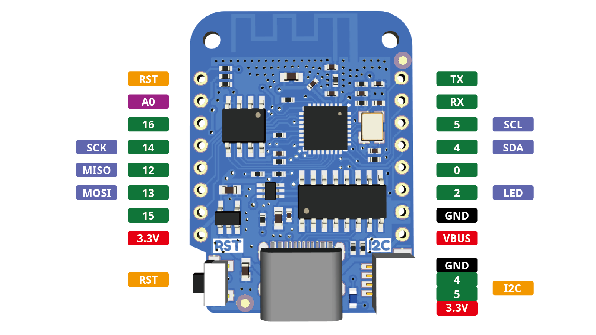

<!-- source: https://www.wemos.cc/en/latest/d1/d1_mini.html | fetched: 2026-09-23 -->
# LOLIN D1 mini — WEMOS  documentation

# LOLIN D1 mini

|  |  |
| --- | --- |
| [TOP_IMG](https://www.wemos.cc/en/latest/_static/boards/d1_mini_v4.0.0_1_16x16.png) | [BOTTOM_IMG](https://www.wemos.cc/en/latest/_static/boards/d1_mini_v4.0.0_2_16x16.png) |

A mini wifi board with 4MB flash based on ESP-8266EX.
[[Buy it]](https://www.aliexpress.com/item/32529101036.html)

## Features

> - 11 digital IO, interrupt/pwm/I2C/one-wire supported(except D0)
> - 1 analog input(3.2V max input)
> - Type-C USB Port
> - LOLIN I2C Port
> - Compatible with MicroPython, Arduino, nodemcu

## Tutorials

> - [Get started with MicroPython [D1/D1 mini series]](https://www.wemos.cc/en/latest/tutorials/d1/get_started_with_micropython_d1.html)
> - [Get started with Arduino [D1/D1 mini series]](https://www.wemos.cc/en/latest/tutorials/d1/get_started_with_arduino_d1.html)

## Documentation

> - [Schematic V4.0.0[PDF]](https://www.wemos.cc/en/latest/_static/files/sch_d1_mini_v4.0.0.pdf)
> - [Dimension V4.0.0[PDF]](https://www.wemos.cc/en/latest/_static/files/dim_d1_mini_v4.0.0.pdf)
> - [CH340 Driver](https://www.wemos.cc/en/latest/ch340_driver.html)

## Technical specs

|  |  |
| --- | --- |
| Operating Voltage | 3.3V |
| Digital I/O Pins | 11 |
| Analog Input Pins | 1(3.2V Max) |
| Clock Speed | 80/160MHz |
| Flash | 4M Bytes |
| Size | 34.2\*25.6mm |
| Weight | 3g |

## Pin

Note

All of the IO pins run at 3.3V.

## Certification

## Version

> - V4.0.0 (current)
> - [V3.1.0](https://www.wemos.cc/en/latest/d1/d1_mini_3.1.0.html)
> - V3.0.0
> - V2.3.0
> - V2.2.0
