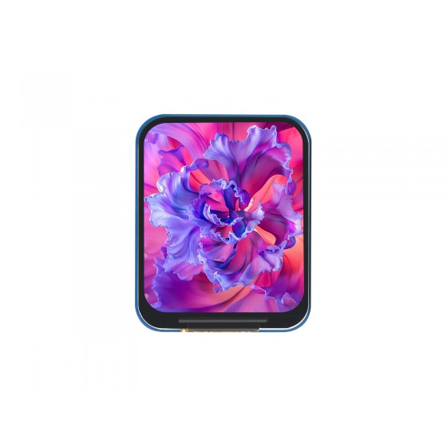
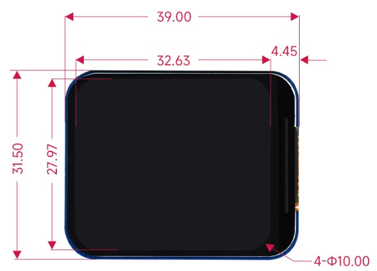
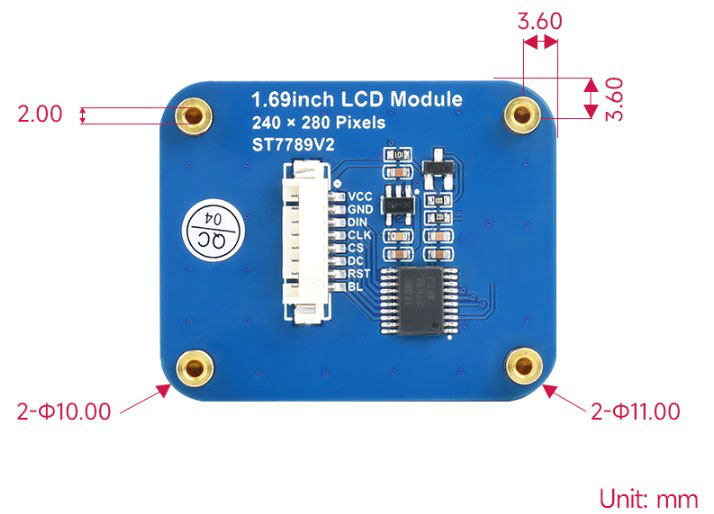
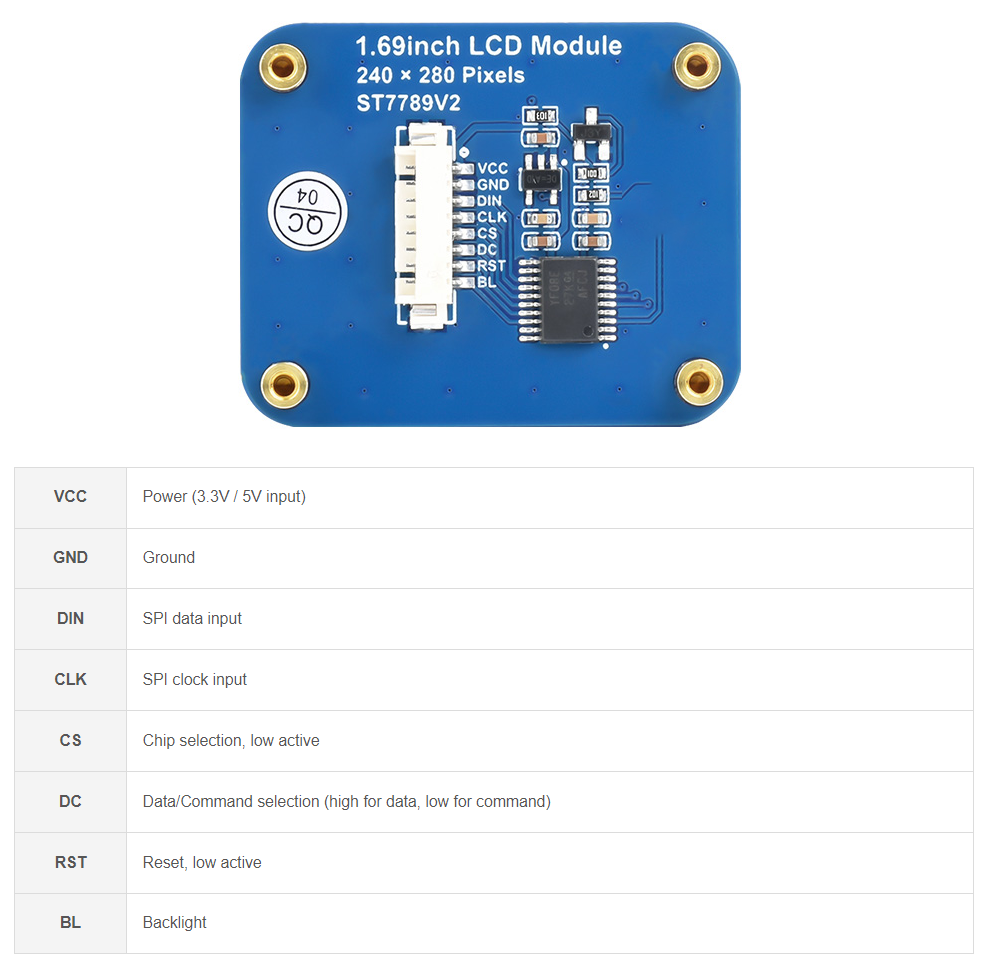
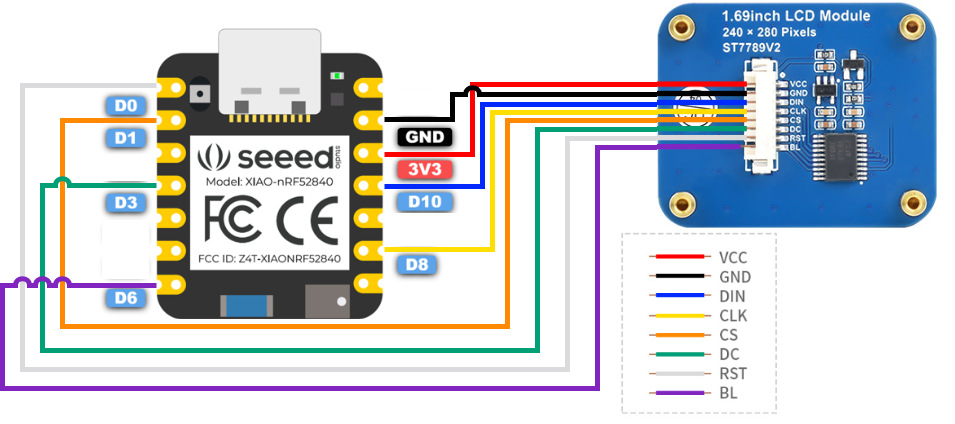
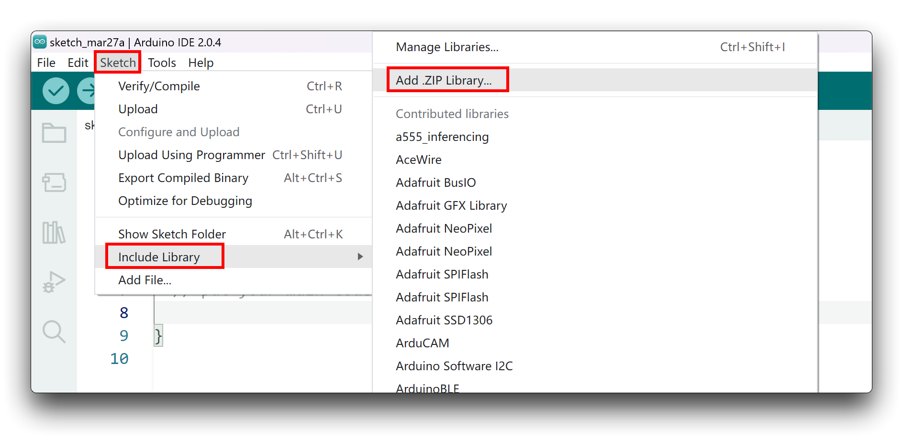
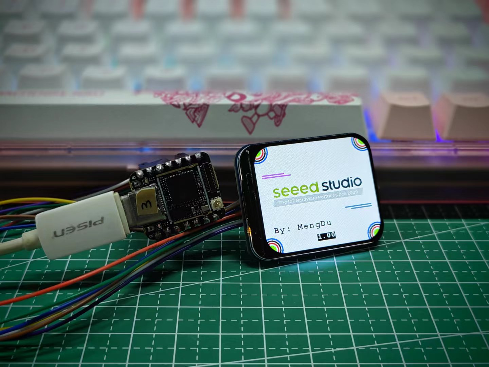

<!-- source: https://wiki.seeedstudio.com/1-69inch_lcd_spi_display/ | fetched: 2026-09-21 -->
# 1.69 inch LCD SPI Display | Seeed Studio Wiki



[**Get One Now 🖱️**](https://www.seeedstudio.com/1-69inch-240-280-Resolution-IPS-LCD-Display-Module-p-5755.html)

  

## Introduction

This 1.69 Inch LCD Display is 1.69-inch serial liquid crystal rounded corners display. Offering a superior resolution of 240×280 and 262K RGB display color, this display provides crystal clear, colorful image representation. The design rationale behind this display is to present a simple, high-quality display solution to meet the needs of various DIY or Internet of Things (IoT) projects.

It adopts a 8pin interface with the 4pin power supply with backlight and the 4pin SPI which communicate with the ST7789V2 driver IC. We have prepare the driver library and example for you get start quickly and convenience with your project development.

### Specifications

|  |  |  |  |
| --- | --- | --- | --- |
| Operating voltage | 3.3V / 5V | Resolution | 240 × 280 pixels |
| Communication Interface | 4-wire SPI | Display size | 27.97 × 32.63mm |
| Display Panel | IPS | Pixel pitch | 0.11655 × 0.11655mm |
| Driver | ST7789V2 | Dimensions | 31.50 × 39.00mm |

### Outline Dimensions





### Features

- 240×280 resolution, 262K RGB colors, clear and colorful displaying effect
- SPI interface, minimizes required IO pins, supports controller boards like XIAO/Raspberry Pi/Arduino/STM32
- Comes with development resources (examples for XIAO/Raspberry Pi/Arduino/STM32)

### Application Ideas

- **Band or Watch**: The display can be assemble with the XIAO mcu to build a band or watch device, where it can showcase the date and watch information with its high-resolution and colorful display. Its small size makes it an excellent component for quickly create a prototype.
- **PC information show screen:** You can use this lcd display to connect with the converter board and use it to display your PC running information such as temperature and fan rpm. Its bolts can help you easily fix it on the PC box.

## Hardware Overview



## Getting Started

### Hardware Preparation

Now we will show you how to use our XIAO nRF52840 board which contains the 6 dof of IMU, Bluetooth and PDM microphone, you may realize that this board with this display is the key components you need to build a digital watch.

| XIAO nRF52840 | 1.69-inch LCD SPI Display |
| --- | --- |
|  |  |
| [**Get One Now 🖱️**](https://www.seeedstudio.com/Seeed-XIAO-BLE-nRF52840-p-5201.html) | [**Get One Now 🖱️**](https://www.seeedstudio.com/1-69inch-240-280-Resolution-IPS-LCD-Display-Module-p-5755.html) |

Then, you should connect the pin of display to the XIAO nRF52840 board, please follow the picture below to connect them:

| 1.69-inch LCD SPI Display | XIAO nRF52840 |
| --- | --- |
| VCC | 3V3 |
| GND | GND |
| DIN | D10 |
| CLK | D8 |
| CS | D1 |
| DC | D3 |
| RST | D0 |
| BL | D6 |



## Arduino Library Overview

tip

If this is your first time using Arduino, we highly recommend you to refer to [Getting Started with Arduino](https://wiki.seeedstudio.com/Getting_Started_with_Arduino/).

Based on the Arduino example program provided by **Waveshare**, we have written an Arduino library for use with the entire XIAO series, and you can go straight to the Github for this library via the button below.

[**Download the Library**](https://github.com/limengdu/XIAO_ST7789V2_LCD_Display/tree/main)

  

### Function

Before we get started developing a sketch, let's look at the available functions of the library.

- `void Init(uint8_t cs = CS_PIN, uint8_t dc = DC_PIN, uint8_t rst = RST_PIN, uint8_t bl = BL_PIN)` —— Common register initialization.

  **Input Parameters**

  - `cs`: Set the chip select pin, the default value is the **D1** pin of the XIAO.
  - `dc`: Set the DC pin, the default value is the XIAO's **D3** pin.
  - `rst`: Set the reset pin, the default value is the **D0** pin of the XIAO.
  - `bl`: Set the backlight control pin, the default value is the **D6** pin of XIAO.
- `void SetBacklight(uint16_t Value)` —— Setting backlight.

  **Input Parameters**

  - `Value`: Backlight intensity with values ranging from 0 to 255.
- `void Reset(void)` —— Hardware reset.
- `void SetCursor(uint16_t Xstart, uint16_t Ystart, uint16_t Xend, uint16_t Yend)` —— Set the cursor position.

  **Input Parameters**

  - `Xstart`: Start uint16\_t x coordinate.
  - `Ystart`: Start uint16\_t y coordinate.
  - `Xend`: End uint16\_t coordinates.
  - `Yend`: End uint16\_t coordinatesen.
- `void Clear(uint16_t Color)` —— Clear screen function, refresh the screen to a certain color.

  **Input Parameters**

  - `Color`: The color you want to clear all the screen.
- `void ClearWindow(uint16_t Xstart, uint16_t Ystart, uint16_t Xend, uint16_t Yend, uint16_t color)` —— Refresh a certain area to the same color.

  **Input Parameters**

  - `Xstart`: Start uint16\_t x coordinate.
  - `Ystart`: Start uint16\_t y coordinate.
  - `Xend`: End uint16\_t coordinates.
  - `Yend`: End uint16\_t coordinatesen.
  - `color`: Set the color.
- `void SetWindowColor(uint16_t Xstart, uint16_t Ystart, uint16_t Xend, uint16_t Yend, uint16_t Color)` —— Set the color of an area.

  **Input Parameters**

  - `Xstart`: Start uint16\_t x coordinate.
  - `Ystart`: Start uint16\_t y coordinate.
  - `Xend`: End uint16\_t coordinates.
  - `Yend`: End uint16\_t coordinatesen.
  - `color`: Set the color.
- `void SetUWORD(uint16_t x, uint16_t y, uint16_t Color)` —— Draw a uint16\_t.

  **Input Parameters**

  - `x`: Set the X coordinate.
  - `y`: Set the Y coordinate.
  - `Color`: Set the color.
- `void SetRotate(uint16_t Rotate)` —— Select Image Rotate.

  **Input Parameters**

  - `Rotate`: ROTATE\_0, ROTATE\_90, ROTATE\_180, ROTATE\_270
- `void SetMirroring(uint8_t mirror)` —— Select Image mirror.

  **Input Parameters**

  - `mirror`: MIRROR\_NONE, MIRROR\_HORIZONTAL, MIRROR\_VERTICAL, MIRROR\_ORIGIN
- `void SetPixel(uint16_t Xpoint, uint16_t Ypoint, uint16_t Color)` —— Draw Pixels.

  **Input Parameters**

  - `Xpoint`: At point X.
  - `Ypoint`: At point Y.
  - `Color`: Painted colors.
- `void DrawPoint( uint16_t Xpoint, uint16_t Ypoint, uint16_t Color, DOT_PIXEL Dot_Pixel, DOT_STYLE Dot_FillWay)` —— Draw Point (Xpoint, Ypoint) Fill the color.

  **Input Parameters**

  - `Xpoint`: The Xpoint coordinate of the point.
  - `Ypoint`: The Ypoint coordinate of the point.
  - `Color`: Set color.
  - `Dot_Pixel`: point size.
- `void DrawLine(uint16_t Xstart, uint16_t Ystart, uint16_t Xend, uint16_t Yend, uint16_t Color, DOT_PIXEL Line_width, LINE_STYLE Line_Style)` —— Draw a line of arbitrary slope.

  **Input Parameters**

  - `Xstart`：Starting Xpoint point coordinates.
  - `Ystart`：Starting Xpoint point coordinates.
  - `Xend`：End point Xpoint coordinate.
  - `Yend`：End point Ypoint coordinate.
  - `Color`：The color of the line segment.
- `void DrawRectangle(uint16_t Xstart, uint16_t Ystart, uint16_t Xend, uint16_t Yend, uint16_t Color, DOT_PIXEL Line_width, DRAW_FILL Filled)` —— Draw a rectangle.

  **Input Parameters**

  - `Xstart`：Starting Xpoint point coordinates.
  - `Ystart`：Starting Xpoint point coordinates.
  - `Xend`：End point Xpoint coordinate.
  - `Yend`：End point Ypoint coordinate.
  - `Color`：The color of the line segment.
  - `Filled`: Whether it is filled--- 1 solid 0：empty
- `void DrawCircle(uint16_t X_Center, uint16_t Y_Center, uint16_t Radius, uint16_t Color, DOT_PIXEL Line_width, DRAW_FILL Draw_Fill)` —— Use the 8-point method to draw a circle of the specified size at the specified position.

  **Input Parameters**

  - `X_Center`：Center X coordinate
  - `Y_Center`：Center Y coordinate
  - `Radius`：circle Radius
  - `Color`：The color of the ：circle segment
  - `Filled`: Whether it is filled: 1 filling 0：Do not.
- `void DrawString_EN(int16_t Xstart, int16_t Ystart, const char * pString, sFONT* Font, int16_t Color_Background, int16_t Color_Foreground)` —— Display the string.

  **Input Parameters**

  - `Xstart`：X coordinate.
  - `Ystart`：Y coordinate.
  - `pString`：The first address of the English string to be displayed.
  - `Font`：A structure pointer that displays a character size.
  - `Color_Background`: Select the background color of the English character.
  - `Color_Foreground`: Select the foreground color of the English character.
- `void DrawNum(int16_t Xpoint, int16_t Ypoint, int32_t Nummber, sFONT* Font, int16_t Color_Background, int16_t Color_Foreground)` —— Display nummber.

  **Input Parameters**

  - `Xstart`：X coordinate.
  - `Ystart`：Y coordinate.
  - `Nummber`：The number displayed.
  - `Font`：A structure pointer that displays a character size.
  - `Color_Background`: Select the background color of the English character.
  - `Color_Foreground`: Select the foreground color of the English character.
- `void DrawFloatNum(int16_t Xpoint, int16_t Ypoint, double Nummber, int8_t Decimal_Point, sFONT* Font, int16_t Color_Background, int16_t Color_Foreground)` —— Display float number.

  **Input Parameters**

  - `Xstart`：X coordinate.
  - `Ystart`：Y coordinate.
  - `Nummber`：The float data that you want to display.
  - `Decimal_Point`：Show decimal places.
  - `Font`: A structure pointer that displays a character size.
  - `Color`: Select the background color of the English character.
- `void DrawImage(const unsigned char *image, int16_t xStart, int16_t yStart, int16_t W_Image, int16_t H_Image)` —— Display image.

  **Input Parameters**

  - `image`: Image start address.
  - `xStart`：X starting coordinates.
  - `yStart`：Y starting coordinates.
  - `xEnd`: Image width.
  - `yEnd`: Image height.

### Default Variables

```cpp
#define RST_PIN D0
#define DC_PIN  D3
#define BL_PIN  D6
#define CS_PIN  D1

#define LCD_WIDTH   240 //LCD width
#define LCD_HEIGHT  280 //LCD height

/**
 * image color
**/
#define WHITE         0xFFFF
#define BLACK         0x0000    
#define BLUE          0x001F  
#define BRED          0XF81F
#define GRED          0XFFE0
#define GBLUE         0X07FF
#define RED           0xF800
#define MAGENTA       0xF81F
#define GREEN         0x07E0
#define CYAN          0x7FFF
#define YELLOW        0xFFE0
#define BROWN         0XBC40 
#define BRRED         0XFC07 
#define GRAY          0X8430 
#define DARKBLUE      0X01CF  
#define LIGHTBLUE     0X7D7C   
#define GRAYBLUE      0X5458 
#define LIGHTGREEN    0X841F 
#define LGRAY         0XC618 
#define LGRAYBLUE     0XA651
#define LBBLUE        0X2B12

/**
 * Display rotate
**/
#define ROTATE_0            0
#define ROTATE_90           90
#define ROTATE_180          180
#define ROTATE_270          270

#define MIRROR_NONE        0x00
#define MIRROR_HORIZONTAL  0x01
#define MIRROR_VERTICAL    0x02
#define MIRROR_ORIGIN      0x03
```

### Installation

Since you have downloaded the zip Library, open your Arduino IDE, click on **Sketch > Include Library > Add .ZIP Library**. Choose the zip file you just downloaded，and if the library install correct, you will see **Library added to your libraries** in the notice window. Which means the library is installed successfully.



## XIAO Example

After downloading and installing the library correctly, you can find two example programs named **helloworld.ino** and **bgcolor.ino** in the examples folder. The bgcolor.ino is an example to show the background color, we set the red as default. And the helloworld.ino is an to show the animation about our company logo, and this example contains the effect which the bgcolor example have.

```cpp
#include <st7789v2.h>
#include "SPI.h"
#include "seeed.h"

st7789v2 Display;

void setup() {
  // put your setup code here, to run once:
  Display.SetRotate(270);
  Display.Init();
  Display.SetBacklight(100);
  Display.Clear(WHITE);
}

void loop() {
  // put your main code here, to run repeatedly:
//  Display.SetPixel(100, 100, RED);
//  Display.DrawPoint(50, 50, YELLOW, DOT_PIXEL_8X8, DOT_FILL_AROUND);

  Display.DrawImage(gImage_seeed, 20, 90, 240, 47);

  Display.DrawLine(15, 65, 65, 65, MAGENTA, DOT_PIXEL_2X2, LINE_STYLE_SOLID);
  Display.DrawLine(15, 70, 80, 70, MAGENTA, DOT_PIXEL_2X2, LINE_STYLE_SOLID);
  
  Display.DrawRectangle(15, 80, 265, 150, GRAY, DOT_PIXEL_2X2, DRAW_FILL_EMPTY);
  
  Display.DrawCircle(10, 10, 25, BLUE, DOT_PIXEL_2X2, DRAW_FILL_EMPTY);
  Display.DrawCircle(10, 10, 20, BLACK, DOT_PIXEL_2X2, DRAW_FILL_EMPTY);
  Display.DrawCircle(10, 10, 15, RED, DOT_PIXEL_2X2, DRAW_FILL_EMPTY);
  Display.DrawCircle(10, 10, 10, GREEN, DOT_PIXEL_2X2, DRAW_FILL_FULL);

  Display.DrawCircle(270, 10, 25, BLUE, DOT_PIXEL_2X2, DRAW_FILL_EMPTY);
  Display.DrawCircle(270, 10, 20, BLACK, DOT_PIXEL_2X2, DRAW_FILL_EMPTY);
  Display.DrawCircle(270, 10, 15, RED, DOT_PIXEL_2X2, DRAW_FILL_EMPTY);
  Display.DrawCircle(270, 10, 10, GREEN, DOT_PIXEL_2X2, DRAW_FILL_FULL);

  Display.DrawCircle(10, 230, 25, BLUE, DOT_PIXEL_2X2, DRAW_FILL_EMPTY);
  Display.DrawCircle(10, 230, 20, BLACK, DOT_PIXEL_2X2, DRAW_FILL_EMPTY);
  Display.DrawCircle(10, 230, 15, RED, DOT_PIXEL_2X2, DRAW_FILL_EMPTY);
  Display.DrawCircle(10, 230, 10, GREEN, DOT_PIXEL_2X2, DRAW_FILL_FULL);

  Display.DrawCircle(270, 230, 25, BLUE, DOT_PIXEL_2X2, DRAW_FILL_EMPTY);
  Display.DrawCircle(270, 230, 20, BLACK, DOT_PIXEL_2X2, DRAW_FILL_EMPTY);
  Display.DrawCircle(270, 230, 15, RED, DOT_PIXEL_2X2, DRAW_FILL_EMPTY);
  Display.DrawCircle(270, 230, 10, GREEN, DOT_PIXEL_2X2, DRAW_FILL_FULL);

  Display.DrawLine(200, 160, 265, 160, GRAYBLUE, DOT_PIXEL_2X2, LINE_STYLE_SOLID);
  Display.DrawLine(215, 165, 265, 165, GRAYBLUE, DOT_PIXEL_2X2, LINE_STYLE_SOLID);
  
  Display.DrawString_EN(20, 180, "By: Citric", &Font20, WHITE, BLACK);
//  Display.DrawNum(100, 220, 123456, &Font24, RED, BRED);
  Display.DrawFloatNum(100, 210, 1.00, 2, &Font16, WHITE, BLACK);
}
```

You will find Seeed Studio logo printed on the display dynamically.



## Troubleshooting

### 1. The screen does not work when I reprogram it while the screen is connected?

A: If your program is constantly communicating with the screen, reprogramming can interrupt this process, causing the screen to malfunction. You can try turning off the power to restore normal screen operation.

### 2. What kind of power supply should I use for the display?

A: The circuit board can accept an input voltage of 3.3V or 5V, so you can use a power supply within this range.

### 3. The colors on my display do not look right. What could be the problem?

A: Please ensure the display is correctly initialized in your code and you're using the correct color values. If you're still facing issues, there may be a problem with the display or the connecting wires. Please check the connections or try with another display if available.

## Resources

- **[PDF]** [Schematic](https://www.waveshare.com/w/upload/2/2b/1.69inch_LCD_Module.pdf)
- **[PDF]** [Datasheet](https://www.waveshare.com/w/upload/c/c9/ST7789V2.pdf)
- **[PDF]** [2D Drawing](https://www.waveshare.com/w/upload/4/41/1.69inch_LCD_Module_2Ddrawing.pdf)

## Tech Support & Product Discussion

Thank you for choosing our products! We are here to provide you with different support to ensure that your experience with our products is as smooth as possible. We offer several communication channels to cater to different preferences and needs.
