<!-- source: https://www.waveshare.com/wiki/1.69inch_LCD_Module | fetched: 2026-09-21 -->
# 1.69inch LCD Module - Waveshare Wiki

# 1.69inch LCD Module

From Waveshare Wiki

Jump to: [navigation](https://www.waveshare.com/wiki/1.69inch_LCD_Module), [search](https://www.waveshare.com/wiki/1.69inch_LCD_Module)

|  |  |  |
| --- | --- | --- |
| |  | | --- | | **1.69inch LCD Module** | | [1.69inch LCD Module.jpg](https://www.waveshare.com/1.69inch-lcd-module.htm)  1.69inch, 240 x 280, SPI | |
| |  | | --- | | **{{{name2}}}** | |  | |
| |  | | --- | | **{{{name3}}}** | |  | |
| |  | | --- | | **{{{name4}}}** | |  | |
| |  | | --- | | **{{{name5}}}** | |  | |
| |  | | --- | | **{{{name6}}}** | |  | |
| |  |  |  |  |  |  | | --- | --- | --- | --- | --- | --- | |  |  | Primary Attribute | |  |  | | **Category:** | | | | | | | {{{userDefinedInfo}}}: | | | {{{userdefinedvalue}}} | | | | **Brand:** Waveshare | | | | | | |
| |  |  |  |  |  |  | | --- | --- | --- | --- | --- | --- | |  |  | Website | |  |  | | **International:** [Website](https://www.waveshare.com/1.69inch-lcd-module.htm) | | | | | | | **Chinese:** [官网](https://www.waveshare.net/shop/1.69inch-LCD-Module.htm) | | | | | | |
| |  |  |  |  |  |  | | --- | --- | --- | --- | --- | --- | |  |  | Onboard Interfaces | |  |  | | |  |  |  |  | | --- | --- | --- | --- | |  |  |  |  | |  |  |  |  | |  |  |  |  | |  |  |  |  | |  |  |  |  | | | | | | | |
| |  |  |  |  |  |  | | --- | --- | --- | --- | --- | --- | |  |  | Related Products | |  |  | |  | | | | | | |

## Contents

- [1 Overview](https://www.waveshare.com/wiki/1.69inch_LCD_Module)
  - [1.1 Specifications](https://www.waveshare.com/wiki/1.69inch_LCD_Module)
  - [1.2 Module & Control Chip](https://www.waveshare.com/wiki/1.69inch_LCD_Module)
  - [1.3 Communication Protocol](https://www.waveshare.com/wiki/1.69inch_LCD_Module)
- [2 Raspberry Pi](https://www.waveshare.com/wiki/1.69inch_LCD_Module)
  - [2.1 Hardware Connection](https://www.waveshare.com/wiki/1.69inch_LCD_Module)
  - [2.2 Enable SPI Interface](https://www.waveshare.com/wiki/1.69inch_LCD_Module)
  - [2.3 Running C Demo](https://www.waveshare.com/wiki/1.69inch_LCD_Module)
  - [2.4 Run Python Demo](https://www.waveshare.com/wiki/1.69inch_LCD_Module)
- [3 FBCP Porting](https://www.waveshare.com/wiki/1.69inch_LCD_Module)
  - [3.1 Download Drivers](https://www.waveshare.com/wiki/1.69inch_LCD_Module)
  - [3.2 Method 1: Use a script (recommended)](https://www.waveshare.com/wiki/1.69inch_LCD_Module)
  - [3.3 Method 2: Manual Configuration](https://www.waveshare.com/wiki/1.69inch_LCD_Module)
    - [3.3.1 Environment Configuration](https://www.waveshare.com/wiki/1.69inch_LCD_Module)
    - [3.3.2 Compile and Run](https://www.waveshare.com/wiki/1.69inch_LCD_Module)
    - [3.3.3 Set up to Start Automatically](https://www.waveshare.com/wiki/1.69inch_LCD_Module)
    - [3.3.4 Set the Display Resolution](https://www.waveshare.com/wiki/1.69inch_LCD_Module)
- [4 STM32](https://www.waveshare.com/wiki/1.69inch_LCD_Module)
  - [4.1 Hardware Connection](https://www.waveshare.com/wiki/1.69inch_LCD_Module)
  - [4.2 Run the Demo](https://www.waveshare.com/wiki/1.69inch_LCD_Module)
  - [4.3 Demo Description](https://www.waveshare.com/wiki/1.69inch_LCD_Module)
    - [4.3.1 Underlying Hardware Interface](https://www.waveshare.com/wiki/1.69inch_LCD_Module)
    - [4.3.2 Upper Application](https://www.waveshare.com/wiki/1.69inch_LCD_Module)
- [5 Arduino](https://www.waveshare.com/wiki/1.69inch_LCD_Module)
  - [5.1 IDE Installation](https://www.waveshare.com/wiki/1.69inch_LCD_Module)
  - [5.2 Hardware Connection](https://www.waveshare.com/wiki/1.69inch_LCD_Module)
  - [5.3 Run the Demo](https://www.waveshare.com/wiki/1.69inch_LCD_Module)
  - [5.4 Demo Description](https://www.waveshare.com/wiki/1.69inch_LCD_Module)
    - [5.4.1 Document Introduction](https://www.waveshare.com/wiki/1.69inch_LCD_Module)
    - [5.4.2 Underlying Hardware Interface](https://www.waveshare.com/wiki/1.69inch_LCD_Module)
    - [5.4.3 Upper Application](https://www.waveshare.com/wiki/1.69inch_LCD_Module)
  - [5.5 Demo Description](https://www.waveshare.com/wiki/1.69inch_LCD_Module)
    - [5.5.1 Document Introduction](https://www.waveshare.com/wiki/1.69inch_LCD_Module)
    - [5.5.2 Underlying Hardware Interface](https://www.waveshare.com/wiki/1.69inch_LCD_Module)
    - [5.5.3 Upper Application](https://www.waveshare.com/wiki/1.69inch_LCD_Module)
- [6 Resource](https://www.waveshare.com/wiki/1.69inch_LCD_Module)
  - [6.1 Document](https://www.waveshare.com/wiki/1.69inch_LCD_Module)
  - [6.2 Demo](https://www.waveshare.com/wiki/1.69inch_LCD_Module)
  - [6.3 Software](https://www.waveshare.com/wiki/1.69inch_LCD_Module)
- [7 FAQ](https://www.waveshare.com/wiki/1.69inch_LCD_Module)
- [8 Support](https://www.waveshare.com/wiki/1.69inch_LCD_Module)

# Overview

## Specifications

- Operating voltage: 3.3V/5V **(Please ensure that the power supply voltage and logic voltage are the same, otherwise it will not work properly.)**
- Communication interface: SPI
- Display Panel: IPS
- Control chip: ST7789V2
- Resolution: 240 (H)RGB × 280(V)
- Display size: 27.972mm × 32.634mm
- Display R angle: 4-R5 (mm)
- Pixel pitch: 0.11655mm × 0.11655mm
- Dimensions: 31.5mm × 39.0mm

## Module & Control Chip

- The embedded controller used in this module is ST7789V2, an LCD controller with 240 × RGB × 320 pixels, and the pixels of the LCD itself is 240(H) × RGB × 280(V), so the internal RAM of the LCD is not fully used.
- This LCD supports input color formats of 12-bit, 16-bit, and 18-bit per pixel, which are RGB444, RGB565, and RGB666. This demo example uses the RGB565 color format, which is also a commonly used RGB format.
- The LCD uses a four-wire SPI communication interface, which greatly saves GPIO ports with faster communication speeds.
- TThe resolution of this module is 240 (H) x RGB x 280 (V), but due to the four round corners (see specifications for dimensions), some parts of the input images may not be displayed.

## Communication Protocol

[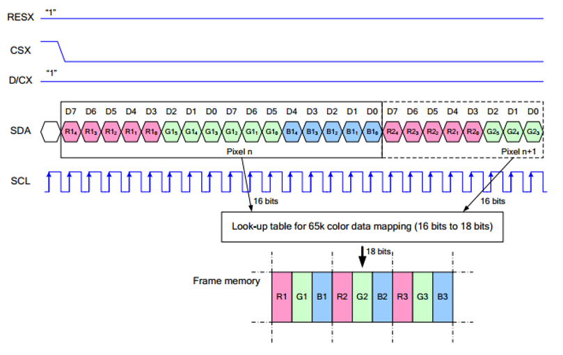](https://www.waveshare.com/wiki/File:0.96inch_lcd_module_spi.png)  
Note: The difference from the traditional SPI protocol is that the data line sent from the slave to the host is hidden because it only needs to be displayed. Please refer to Datasheet Page 66 for the table.   
RESX is reset, it is pulled low when the module is powered on, usually set to 1;  
CSX is the slave chip select, and the chip will be enabled only when CS is low.   
D/CX is the data/command control pin of the chip, when DC = 0, write command, when DC = 1, write data.   
SDA is the transmitted data, that is, RGB data;  
SCL is the SPI communication clock.   
For SPI communication, data is transmitted with timing, that is, the combination of clock phase (CPHA) and clock polarity (CPOL):  
The level of CPHA determines whether the serial synchronization clock is collected on the first clock transition edge or the second clock transition edge. When CPHA = 0, data acquisition is performed on the first transition edge;  
The level of CPOL determines the idle state level of the serial synchronous clock. CPOL = 0, which is a low level.   
As can be seen from the figure, when the first falling edge of SCLK starts to transmit data, 8-bit data is transmitted in one clock cycle, using SPI0, bit-by-bit transmission, high-order first, and low-order last.

# Raspberry Pi

## Hardware Connection

When connecting to the Raspberry Pi, you can choose the 8PIN cable to connect according to the following table:

Raspberry Pi Connection Pin Correspondence

|  |  |  |
| --- | --- | --- |
| LCD | Raspberry Pi | |
| BCM2835 | Board |
| VCC | 3.3V | 3.3V |
| GND | GND | GND |
| DIN | MOSI | 19 |
| CLK | SCLK | 23 |
| CS | CE0 | 24 |
| DC | 25 | 22 |
| RST | 27 | 13 |
| BL | 18 | 12 |

The 1.69inch LCD uses the GH1.25 8PIN interface, which can be connected to the Raspberry Pi according to the above table: (Please connect according to the pin definition table. The color of the wiring in the picture is for reference only, and the actual color shall prevail.)  
[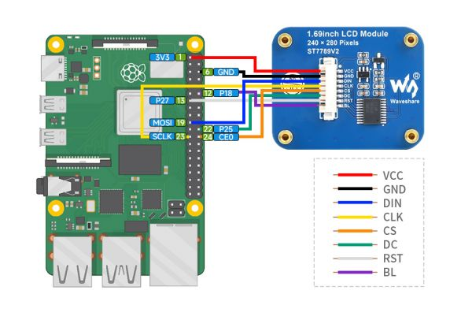](https://www.waveshare.com/wiki/File:RPI_for_1.69_lcd_module01.jpg)

## Enable SPI Interface

- Open the terminal, use the command to enter the configuration page:

```
sudo raspi-config
Choose Interfacing Options -> SPI -> Yes  to enable SPI interface
```

[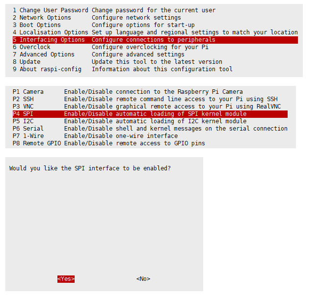](https://www.waveshare.com/wiki/File:RPI_open_spi.png)  
Reboot Raspberry Pi：

```
sudo reboot
```

- Check /boot/config.txt and you can see that 'dtparam=spi=on' has been written.

[](https://www.waveshare.com/wiki/File:Raspberry_Pi_Guides_for_4.37_e-Paper.jpg)

- To make sure that the SPI is not occupied, it is recommended that other driver overrides be turned off for now. You can use ls /dev/spi\* to check the SPI occupancy. The terminal output /dev/spidev0.0 and /dev/spidev0.1 indicates that the SPI status is normal.

[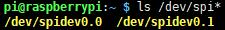](https://www.waveshare.com/wiki/File:Raspberry_Pi_Guides_for_4.37_e-Paper02.jpg)

## Running C Demo

- Install BCM2835

```
# Open the Raspberry Pi terminal and run the following command:
wget http://www.airspayce.com/mikem/bcm2835/bcm2835-1.71.tar.gz
tar zxvf bcm2835-1.71.tar.gz 
cd bcm2835-1.71/
sudo ./configure && sudo make && sudo make check && sudo make install
# For more information, please refer to the official website: http://www.airspayce.com/mikem/bcm2835/
```

- Indtall wiringPi

```
# Open the Raspberry Pi terminal and run the following command:
sudo apt-get install wiringpi
#For Raspberry Pi systems after May 2019 (earlier than that can be executed without), an upgrade may be required:
wget https://project-downloads.drogon.net/wiringpi-latest.deb
sudo dpkg -i wiringpi-latest.deb
gpio -v
# Run gpio -v and version 2.52 will appear, if it does not, there was an installation error.

# Bullseye branch system using the following command:
git clone https://github.com/WiringPi/WiringPi
cd WiringPi
. /build
gpio -v
# Run gpio -v and version 2.60 will appear, if it doesn't, there is an installation error.
```

- Install lgpio:

```
#Open the Raspberry Pi terminal and run the following commands:
wget https://github.com/joan2937/lg/archive/master.zip
unzip master.zip
cd lg-master
sudo make install

#For more details, you can refer to the official website: https://github.com/gpiozero/lg
```

- Download the Demo

```
sudo apt-get install unzip -y
sudo wget https://files.waveshare.com/upload/8/8d/LCD_Module_RPI_code.zip
sudo unzip LCD_Module_RPI_code.zip 
cd LCD_Module_RPI_code/RaspberryPi/
```

- Recompile, the compilation process may take a few seconds:

```
cd c
sudo make clean
sudo make -j 8
```

Test procedures for all screens can be called directly by entering the corresponding size:

```
sudo ./main 1.69
```

## Run Python Demo

- Install library:

```
sudo apt-get update
sudo apt-get install python3-pip
sudo apt-get install python3-pil
sudo apt-get install python3-numpy
sudo pip3 install spidev
```

- Download the demo:

```
sudo apt-get install unzip -y
sudo wget https://files.waveshare.com/upload/8/8d/LCD_Module_RPI_code.zip
sudo unzip LCD_Module_RPI_code.zip 
cd LCD_Module_RPI_code/RaspberryPi/
```

- Enter the python demo directory and run the "ls -l" commands:

```
cd python/example
ls -l
```

[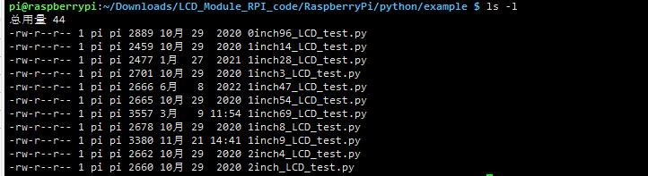](https://www.waveshare.com/wiki/File:RPI_for_1.69_lcd_module03.jpg)  
All test demos for screens can be viewed, sorted by size:

```
0inch96_LCD_test.py 0.96inch LCD test demo
1inch14_LCD_test.py 1.14inch LCD test demo
1inch28_LCD_test.py 1.28inch LCD test demo
1inch3_LCD_test.py 1.3inch LCD test demo
1inch47_LCD_test.py 1.47inch LCD test demo
1inch54_LCD_test.py 1.54inch LCD test demo
1inch69_LCD_test.py 1.69inch LCD test demo
1inch8_LCD_test.py 1.8inch LCD test demo
1inch9_LCD_test.py 1.9inch LCD test demo
2inch_LCD_test.py 2inch LCD test demo
2inch4_LCD_test.py 2.4inch LCD test demo
```

Just run the demo corresponding to the screen, the demo supports python2/3.

```
# python2
sudo python 1inch69_LCD_test.py
# python3
sudo python3 1inch69_LCD_test.py
```

# FBCP Porting

Framebuffer uses a video output device to drive a video display device from a memory buffer containing complete frame data. Simply put, a memory area is used to store the display content, and the display content can be changed by changing the data in the memory.   
There is an open source project on github: fbcp-ili9341. Compared with other fbcp projects, this project uses partial refresh and DMA to achieve a speed of up to 60fps.

## Download Drivers

```
sudo apt-get install cmake -y
cd ~
wget https://files.waveshare.com/upload/1/18/Waveshare_fbcp.zip
unzip Waveshare_fbcp.zip
cd Waveshare_fbcp/
sudo chmod +x ./shell/*
```

## Method 1: Use a script (recommended)

Here we have written several scripts that allow users to quickly use fbcp and run corresponding commands according to their own screen  
If you use a script and do not need to modify it, you can ignore the second method below.   
Note: The script will replace the corresponding /boot/config.txt and /etc/rc.local and restart, if the user needs, please back up the relevant files in advance.

```
#0.96inch LCD Module
sudo ./shell/waveshare-0inch96
#1.14inch LCD Module
sudo ./shell/waveshare-1inch14
#1.3inch LCD Module
sudo ./shell/waveshare-1inch3
#1.47inch LCD Module
sudo ./shell/waveshare-1inch47
#1.54inch LCD Module
sudo ./shell/waveshare-1inch54
#1.69inch LCD Module
sudo ./shell/waveshare-1inch69
#1.8inch LCD Module
sudo ./shell/waveshare-1inch8
#1.9inch LCD Module
sudo ./shell/waveshare-1inch9
#2inch LCD Module
sudo ./shell/waveshare-2inch
#2.4inch LCD Module
sudo ./shell/waveshare-2inch4
```

## Method 2: Manual Configuration

### Environment Configuration

Raspberry Pi's vc4-kms-v3d will cause fbcp to fail, so we need to close vc4-kms-v3d before installing it in fbcp.

```
sudo nano /boot/config.txt
```

Just block the statement corresponding to the picture below.  
[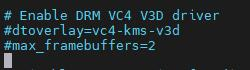](https://www.waveshare.com/wiki/File:FBCP_CLOSE.jpg)  
A reboot is then required.

```
sudo reboot
```

### Compile and Run

```
mkdir build
cd build
cmake [options] ..
sudo make -j
sudo ./fbcp
```

Replace it by yourself according to the LCD Module you use, above cmake [options] ..

```
#0.96inch LCD Module
sudo cmake -DSPI_BUS_CLOCK_DIVISOR=20 -DWAVESHARE_0INCH96_LCD=ON -DBACKLIGHT_CONTROL=ON -DSTATISTICS=0 ..
#1.14inch LCD Module
sudo cmake -DSPI_BUS_CLOCK_DIVISOR=20 -DWAVESHARE_1INCH14_LCD=ON -DBACKLIGHT_CONTROL=ON -DSTATISTICS=0 ..
#1.3inch LCD Module
sudo cmake -DSPI_BUS_CLOCK_DIVISOR=20 -DWAVESHARE_1INCH3_LCD=ON -DBACKLIGHT_CONTROL=ON -DSTATISTICS=0 ..
#1.47inch LCD Module
sudo cmake -DSPI_BUS_CLOCK_DIVISOR=20 -DWAVESHARE_1INCH47_LCD=ON -DBACKLIGHT_CONTROL=ON -DSTATISTICS=0 ..
#1.54inch LCD Module
sudo cmake -DSPI_BUS_CLOCK_DIVISOR=20 -DWAVESHARE_1INCH54_LCD=ON -DBACKLIGHT_CONTROL=ON -DSTATISTICS=0 ..
#1.69inch LCD Module
sudo cmake -DSPI_BUS_CLOCK_DIVISOR=20 -DWAVESHARE_1INCH69_LCD=ON -DBACKLIGHT_CONTROL=ON -DSTATISTICS=0 ..
#1.8inch LCD Module
sudo cmake -DSPI_BUS_CLOCK_DIVISOR=20 -DWAVESHARE_1INCH8_LCD=ON -DBACKLIGHT_CONTROL=ON -DSTATISTICS=0 ..
#1.9inch LCD Module
sudo cmake -DSPI_BUS_CLOCK_DIVISOR=20 -DWAVESHARE_1INCH9_LCD=ON -DBACKLIGHT_CONTROL=ON -DSTATISTICS=0 ..
#2inch LCD Module
sudo cmake -DSPI_BUS_CLOCK_DIVISOR=20 -DWAVESHARE_2INCH_LCD=ON -DBACKLIGHT_CONTROL=ON -DSTATISTICS=0 ..
#2.4inch LCD Module
sudo cmake -DSPI_BUS_CLOCK_DIVISOR=20 -DWAVESHARE_2INCH4_LCD=ON -DBACKLIGHT_CONTROL=ON -DSTATISTICS=0 ..
```

### Set up to Start Automatically

[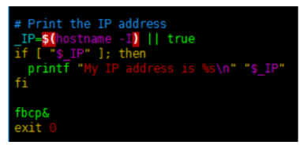](https://www.waveshare.com/wiki/File:1in3_lcd_fb5.png)

```
sudo cp ~/Waveshare_fbcp/build/fbcp /usr/local/bin/fbcp
sudo nano /etc/rc.local
```

Add fbcp& before exit 0. Note that you must add "&" to run in the background, otherwise the system may not be able to start.

### Set the Display Resolution

Set the user interface display size in the "/boot/config.txt" file.

```
sudo nano /boot/config.txt
```

Add the configuration statement for the resolution to the "config.txt" file.

```
hdmi_force_hotplug=1
hdmi_cvt=[options]
hdmi_group=2
hdmi_mode=1
hdmi_mode=87
display_rotate=0
```

Replace the above "hdmi\_cvt=[options]" according to the LCD Module that you are using.

```
#2.4inchinch LCD Module & 2inchinch LCD Module
hdmi_cvt=640 480 60 1 0 0 0
#1.9inch LCD Module
hdmi_cvt 640 340 60 6 0 0 0
#1.8inch LCD Module
hdmi_cvt=400 300 60 1 0 0 0
#1.69inch LCD Module
hdmi_cvt 560 480 60 6 0 0 0
#1.47inch LCD Module
hdmi_cvt 640 344 60 6 0 0 0
#1.3inch LCD Module & 1.54inch LCD Module
hdmi_cvt 480 480 60 6 0 0 0
#1.14inch LCD Module
hdmi_cvt 480 270 60 6 0 0 0
#0.96inch LCD Module
hdmi_cvt 320 160 60 6 0 0 0
```

And then reboot the system:

```
sudo reboot
```

After rebooting the system, the Raspberry Pi OS user interface will be displayed.

[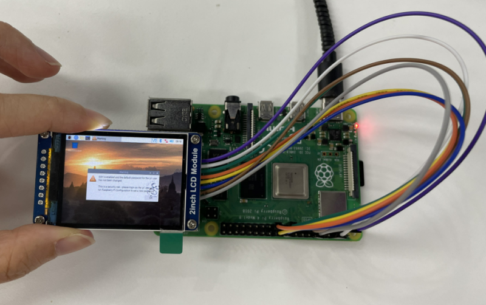](https://www.waveshare.com/wiki/File:800px-2inch_OLED01_fbcp.png)

# STM32

## Hardware Connection

The demo we provided is based on STM32F103RBT6 and the connections provided correspond to the pins of the STM32F103RBT6, so if you need to port the demo, please connect the pins according to the actual pins:

STM32F103ZET Pin

|  |  |
| --- | --- |
| LCD | STM32 |
| VCC | 3.3V |
| GND | GND |
| DIN | PA7 |
| CLK | PA5 |
| CS | PB6 |
| DC | PA8 |
| RST | PA9 |
| BL | PC7 |

Taking the [XNUCLEO-F103RB development board](https://www.waveshare.com/xnucleo-f103rb.htm) developed by our company as an example, the connection is as follows:  
[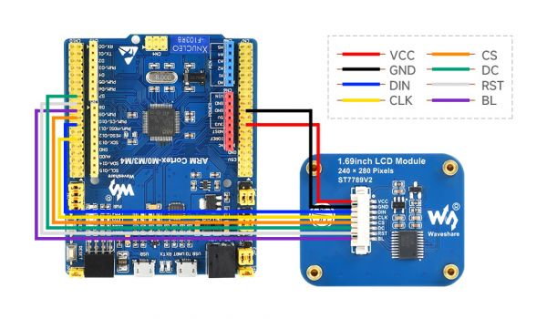](https://www.waveshare.com/wiki/File:Arduino_for_1.69_lcd_module02.jpg)

## Run the Demo

- Download the demo and find the STM32 demo file directory, open "LCD\_demo.uvprojx" in the directory of "STM32\STM32F103RBT6\MDK-ARM", and then you can see the project.

[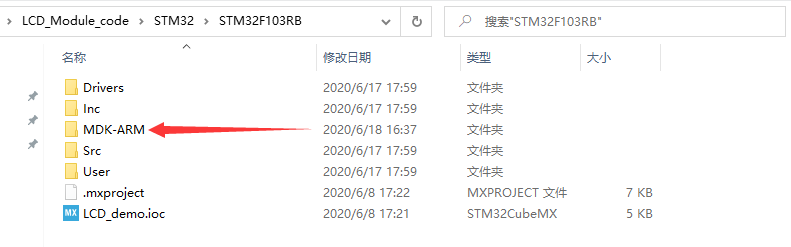](https://www.waveshare.com/wiki/File:LCD_STM32_CODE1.png)

- Open "main.c" and you can see all the test demos.
- As the demo we used is the 1.69-inch LCD module, you need to remove the comment in front of "LCD\_1in69\_test()"; and recompile and download it.

[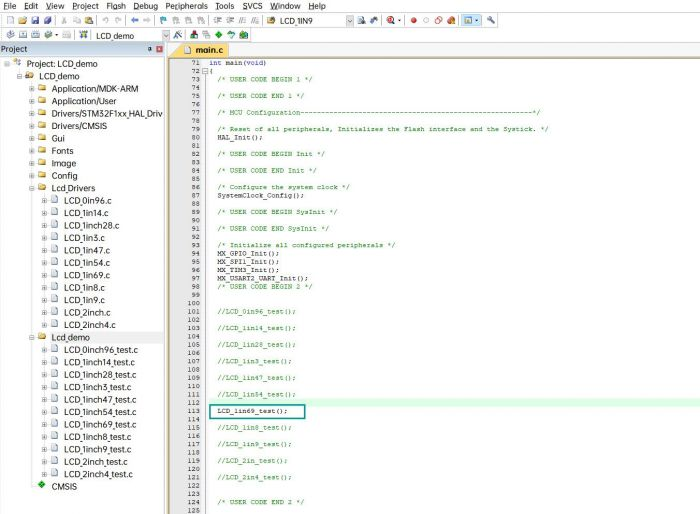](https://www.waveshare.com/wiki/File:Stm32_for_1.69_lcd_module_04.jpg)

## Demo Description

### Underlying Hardware Interface

- Data type:

```
#define UBYTE      uint8_t
#define UWORD      uint16_t
#define UDOUBLE    uint32_t
```

- How to initialize and exit the module:

```
void DEV_Module_Init(void);
void DEV_Module_Exit(void);
Note: 
1. Here is some GPIO processing before and after using the LCD screen.
2. After the System_Exit(void) function is used, the OLED display will be turned off;
```

- Write and read GPIO:

```
void 	DEV_Digital_Write(UWORD Pin, UBYTE Value);
UBYTE 	DEV_Digital_Read(UWORD Pin);
```

- SPI writes data:

```
void    DEV_SPI_WRITE(UBYTE _dat);
```

### Upper Application

For the screen, if you need to draw pictures, display Chinese and English characters, display pictures, etc., you can use the upper application to do, and we provide some basic functions here about some graphics processing in the directory STM32\STM32F103RB\User\GUI\_DEV\GUI\_Paint.c(.h).  
Note: Because of the size of the internal RAM of STM32 and Arduino, the GUI is directly written to the RAM of the LCD.  
[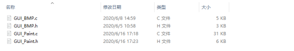](https://www.waveshare.com/wiki/File:LCD_rpi_GUI.png)  
The character font on which GUI dependent is in the directory STM32\STM32F103RB\User\Fonts  
[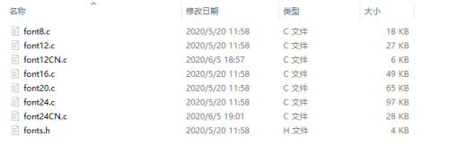](https://www.waveshare.com/wiki/File:LCD_rpi_Font.png)

- New Image Properties: Create a new image property, this property includes the image buffer name, width, height, flip Angle, and color.

```
void Paint_NewImage(UWORD Width, UWORD Height, UWORD Rotate, UWORD Color)
Parameters:
    Width: image buffer Width;
    Height: the Height of the image buffer;
    Rotate: Indicates the rotation Angle of an image
    Color: the initial Color of the image;
```

- Set the clear screen function, usually call the clear function of LCD directly.

```
void Paint_SetClearFuntion(void (*Clear)(UWORD));
parameter:
    Clear: Pointer to the clear screen function, used to quickly clear the screen to a certain color;
```

- Set the drawing pixel function

```
void Paint_SetDisplayFuntion(void (*Display)(UWORD,UWORD,UWORD));
parameter:
    Display: Pointer to the pixel drawing function, which is used to write data to the specified location in the internal RAM of the LCD;
```

- Select image buffer: the purpose of the selection is that you can create multiple image attributes, an image buffer can exist multiple, and you can select each image you create.

```
void Paint_SelectImage(UBYTE *image)
Parameters:
    Image: the name of the image cache, which is actually a pointer to the first address of the image buffer
```

- Image Rotation: Set the selected image rotation Angle, preferably after Paint\_SelectImage(), you can choose to rotate 0, 90, 180, 270.

[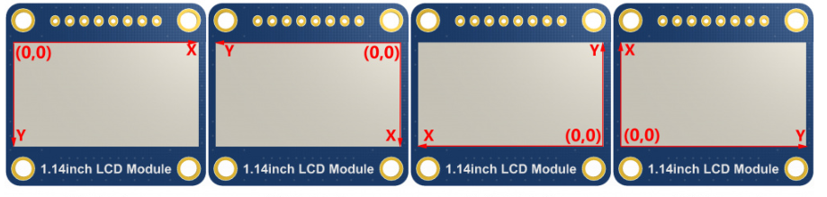](https://www.waveshare.com/wiki/File:Rotation-lcd.png)

```
void Paint_SetRotate(UWORD Rotate)
Parameters:
    Rotate: ROTATE_0, ROTATE_90, ROTATE_180, and ROTATE_270 correspond to 0, 90, 180, and 270 degrees respectively;
```

- Image mirror flip: Set the mirror flip of the selected image. You can choose no mirror, horizontal mirror, vertical mirror, or image center mirror.

```
void Paint_SetMirroring(UBYTE mirror)
Parameters:
    Mirror: indicates the image mirroring mode. MIRROR_NONE, MIRROR_HORIZONTAL, MIRROR_VERTICAL, MIRROR_ORIGIN correspond to no mirror, horizontal mirror, vertical mirror, and about image center mirror respectively.
```

- Set points of display position and color in the buffer: here is the core GUI function, processing points display position and color in the buffer.

```
void Paint_SetPixel(UWORD Xpoint, UWORD Ypoint, UWORD Color)
Parameters:
    Xpoint: the X position of a point in the image buffer
    Ypoint: Y position of a point in the image buffer
    Color: indicates the Color of the dot
```

- Image buffer fill color: Fills the image buffer with a color, usually used to flash the screen into blank.

```
void Paint_Clear(UWORD Color)
Parameters:
    Color: fill Color
```

- Image buffer part of the window filling color: the image buffer part of the window filled with a certain color, generally as a window whitewashing function, often used for time display, whitewashing on a second

```
void Paint_ClearWindows(UWORD Xstart, UWORD Ystart, UWORD Xend, UWORD Yend, UWORD Color)
Parameters:
    Xstart: the x-starting coordinate of the window
    Ystart: indicates the Y starting point of the window
    Xend: the x-end coordinate of the window
    Yend: indicates the y-end coordinate of the window
    Color: fill Color
```

- Draw points: In the image buffer, draw points on (Xpoint, Ypoint), you can choose the color, the size of the point, the style of the point.

```
void Paint_DrawPoint(UWORD Xpoint, UWORD Ypoint, UWORD Color, DOT_PIXEL Dot_Pixel, DOT_STYLE Dot_Style)
Parameters:
    Xpoint: indicates the X coordinate of a point
    Ypoint: indicates the Y coordinate of a point
    Color: fill Color
    Dot_Pixel: The size of the dot, providing a default of eight size points
        typedef enum {
            DOT_PIXEL_1X1   = 1,	// 1 x 1
            DOT_PIXEL_2X2  , 		// 2 X 2
            DOT_PIXEL_3X3  , 	 	// 3 X 3
            DOT_PIXEL_4X4  , 	 	// 4 X 4
            DOT_PIXEL_5X5  , 		// 5 X 5
            DOT_PIXEL_6X6  , 		// 6 X 6
            DOT_PIXEL_7X7  , 		// 7 X 7
            DOT_PIXEL_8X8  , 		// 8 X 8
        } DOT_PIXEL;
    Dot_Style: the size of a point that expands from the center of the point or from the bottom left corner of the point to the right and up
        typedef enum {
            DOT_FILL_AROUND  = 1,
            DOT_FILL_RIGHTUP,
        } DOT_STYLE;
```

- Line drawing: In the image buffer, line from (Xstart, Ystart) to (Xend, Yend), you can choose the color, line width, line style.

```
void Paint_DrawLine(UWORD Xstart, UWORD Ystart, UWORD Xend, UWORD Yend, UWORD Color, LINE_STYLE Line_Style ,  LINE_STYLE Line_Style)
Parameters:
    Xstart: the x-starting coordinate of a line
    Ystart: indicates the Y starting point of a line
    Xend: x-terminus of a line
    Yend: the y-end coordinate of a line
    Color: fill Color
    Line_width: The width of the line, which provides a default of eight widths
        typedef enum {
            DOT_PIXEL_1X1   = 1,	// 1 x 1
            DOT_PIXEL_2X2  , 		// 2 X 2
            DOT_PIXEL_3X3  ,		// 3 X 3
            DOT_PIXEL_4X4  ,		// 4 X 4
            DOT_PIXEL_5X5  , 		// 5 X 5
            DOT_PIXEL_6X6  , 		// 6 X 6
            DOT_PIXEL_7X7  , 		// 7 X 7
            DOT_PIXEL_8X8  , 		// 8 X 8
        } DOT_PIXEL;
    Line_Style: line style. Select whether the lines are joined in a straight or dashed way
        typedef enum {
            LINE_STYLE_SOLID = 0,
            LINE_STYLE_DOTTED,
        } LINE_STYLE;
```

- Draw a rectangle: In the image buffer, draw a rectangle from (Xstart, Ystart) to (Xend, Yend), you can choose the color, the width of the line, and whether to fill the inside of the rectangle.

```
void Paint_DrawRectangle(UWORD Xstart, UWORD Ystart, UWORD Xend, UWORD Yend, UWORD Color, DOT_PIXEL Line_width,  DRAW_FILL Draw_Fill)
Parameters:
        Xstart: the starting X coordinate of the rectangle
        Ystart: indicates the Y starting point of the rectangle
        Xend: X terminus of the rectangle
        Yend: specifies the y-end coordinate of the rectangle
        Color: fill Color
        Line_width: The width of the four sides of a rectangle. Default eight widths are provided
            typedef enum {
                DOT_PIXEL_1X1   = 1,	// 1 x 1
                DOT_PIXEL_2X2  , 		// 2 X 2
                DOT_PIXEL_3X3  ,		// 3 X 3
                DOT_PIXEL_4X4  ,		// 4 X 4
                DOT_PIXEL_5X5  , 		// 5 X 5
                DOT_PIXEL_6X6  , 		// 6 X 6
                DOT_PIXEL_7X7  , 		// 7 X 7
                DOT_PIXEL_8X8  , 		// 8 X 8
            } DOT_PIXEL;
        Draw_Fill: Fill, whether to fill the inside of the rectangle
            typedef enum {
                DRAW_FILL_EMPTY = 0,
                DRAW_FILL_FULL,
            } DRAW_FILL;
```

- Draw circle: In the image buffer, draw a circle of Radius with (X\_Center Y\_Center) as the center. You can choose the color, the width of the line, and whether to fill the inside of the circle.

```
void Paint_DrawCircle(UWORD X_Center, UWORD Y_Center, UWORD Radius, UWORD Color, DOT_PIXEL Line_width,  DRAW_FILL Draw_Fill)
Parameters:
    X_Center: the x-coordinate of the center of a circle
    Y_Center: Y coordinate of the center of a circle
    Radius: indicates the Radius of a circle
    Color: fill Color
    Line_width: The width of the arc, with a default of 8 widths
        typedef enum {
            DOT_PIXEL_1X1  = 1,	        // 1 x 1
            DOT_PIXEL_2X2  , 		// 2 X 2
            DOT_PIXEL_3X3  ,		// 3 X 3
            DOT_PIXEL_4X4  ,		// 4 X 4
            DOT_PIXEL_5X5  , 		// 5 X 5
            DOT_PIXEL_6X6  , 		// 6 X 6
            DOT_PIXEL_7X7  , 		// 7 X 7
            DOT_PIXEL_8X8  , 		// 8 X 8
        } DOT_PIXEL;
    Draw_Fill: fill, whether to fill the inside of the circle
        typedef enum {
            DRAW_FILL_EMPTY = 0,
            DRAW_FILL_FULL,
        } DRAW_FILL;
```

- Write Ascii character: In the image buffer, at (Xstart Ystart) as the left vertex, write an Ascii character, you can select Ascii visual character library, font foreground color, font background color.

```
void Paint_DrawChar(UWORD Xstart, UWORD Ystart, const char Ascii_Char, sFONT* Font, UWORD Color_Foreground,  UWORD Color_Background)
Parameters:
    Xstart: the x-coordinate of the left vertex of a character
    Ystart: the Y coordinate of the font's left vertex
    Ascii_Char: indicates the Ascii character
    Font: Ascii visual character library, in the Fonts folder provides the following Fonts:
        Font8: 5*8 font
        Font12: 7*12 font
        Font16: 11*16 font
        Font20: 14*20 font
        Font24: 17*24 font
    Color_Foreground: Font color
    Color_Background: indicates the background color
```

- Write English string: In the image buffer, use (Xstart Ystart) as the left vertex, write a string of English characters, can choose Ascii visual character library, font foreground color, font background color.

```
void Paint_DrawString_EN(UWORD Xstart, UWORD Ystart, const char * pString, sFONT* Font, UWORD Color_Foreground,  UWORD Color_Background)
Parameters:
    Xstart: the x-coordinate of the left vertex of a character
    Ystart: the Y coordinate of the font's left vertex
    PString: string, string is a pointer
    Font: Ascii visual character library, in the Fonts folder provides the following Fonts:
        Font8: 5*8 font
        Font12: 7*12 font
        Font16: 11*16 font
        Font20: 14*20 font
        Font24: 17*24 font
     Color_Foreground: Font color
     Color_Background: indicates the background color
```

- Write Chinese string: in the image buffer, use (Xstart Ystart) as the left vertex, and write a string of Chinese characters, you can choose GB2312 encoding character font, font foreground color, and font background color.

```
void Paint_DrawString_CN(UWORD Xstart, UWORD Ystart, const char * pString, cFONT* font, UWORD Color_Foreground,  UWORD Color_Background)
Parameters:
    Xstart: the x-coordinate of the left vertex of a character
    Ystart: the Y coordinate of the font's left vertex
    PString: string, string is a pointer
    Font: GB2312 encoding character Font library, in the Fonts folder provides the following Fonts:
        Font12CN: ASCII font 11*21, Chinese font 16*21
        Font24CN: ASCII font24 *41, Chinese font 32*41
    Color_Foreground: Font color
    Color_Background: indicates the background color
```

- Write numbers: In the image buffer, use (Xstart Ystart) as the left vertex, and write a string of numbers, you can choose Ascii visual character library, font foreground color, or font background color.

```
void Paint_DrawNum(UWORD Xpoint, UWORD Ypoint, double Nummber, sFONT* Font, UWORD Digit, UWORD Color_Foreground,   UWORD Color_Background)
Parameters:
    Xpoint: the x-coordinate of the left vertex of a character
    Ypoint: the Y coordinate of the left vertex of the font
    Nummber: indicates the number displayed, which can be a decimal
    Digit: It's a decimal number
    Font: Ascii visual character library, in the Fonts folder provides the following Fonts:
        Font8: 5*8 font
        Font12: 7*12 font
        Font16: 11*16 font
        Font20: 14*20 font
        Font24: 17*24 font
    Color_Foreground: Font color
    Color_Background: indicates the background color
```

- Display time: in the image buffer, use (Xstart Ystart) as the left vertex, display time,you can choose Ascii visual character font, font foreground color, or font background color.

```
void Paint_DrawTime(UWORD Xstart, UWORD Ystart, PAINT_TIME *pTime, sFONT* Font, UWORD Color_Background,  UWORD Color_Foreground)
Parameters:
    Xstart: the x-coordinate of the left vertex of a character
    Ystart: the Y coordinate of the font's left vertex
    PTime: display time, here defined a good time structure, as long as the hour, minute and second bits of data to the parameter;
    Font: Ascii visual character library, in the Fonts folder provides the following Fonts:
        Font8: 5*8 font
        Font12: 7*12 font
        Font16: 11*16 font
        Font20: 14*20 font
        Font24: 17*24 font
    Color_Foreground: Font color
    Color_Background: indicates the background color
```

# Arduino

Note: all the demos have been tested on the Arduino uno, you need to make sure the connection is correct if you want to use other Arduino.

## IDE Installation

[How to install Arduino IDE](https://www.waveshare.com/wiki/Template:Arduino_IDE_Installation_Steps)

## Hardware Connection

Arduino UNO Pins

|  |  |
| --- | --- |
| LCD | UNO |
| VCC | 5V |
| GND | GND |
| DIN | D11 |
| CLK | D13 |
| CS | D10 |
| DC | D7 |
| RST | D8 |
| BL | D9 |

The connection diagram is as follows (click to enlarge):  
[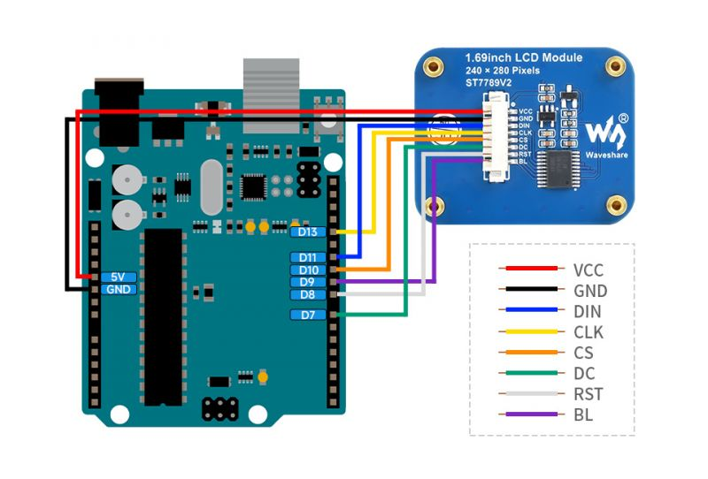](https://www.waveshare.com/wiki/File:Stm32_for_1.69_lcd_module_02.jpg)

## Run the Demo

- In the [#Resource](https://www.waveshare.com/wiki/1.69inch_LCD_Module) download [the demo](https://files.waveshare.com/upload/f/fc/LCD_Module_code.zip), and then unzip it. The Arduino demo is at ~/Arduino/…

[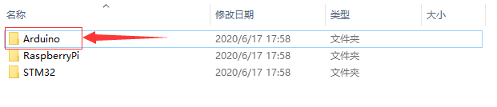](https://www.waveshare.com/wiki/File:LCD_arduino_cede1.png)

- The demo we used is 1.69inch LCD Module, so we need to open the LCD\_1inch69 file folder and run the LCD\_1inch69.ino file.

[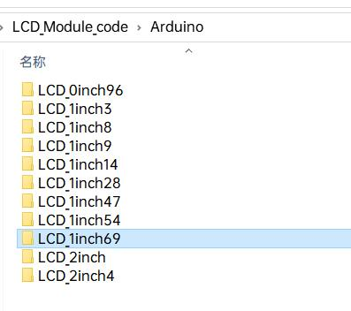](https://www.waveshare.com/wiki/File:Arduino_for_1.69inch_lcd_module06.jpg)

- Open the demo and chose the Dev board model as Arduino UNO.

[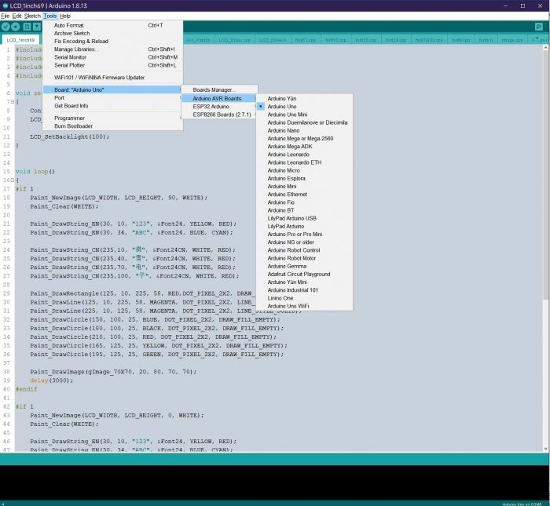](https://www.waveshare.com/wiki/File:Arduino_for_1.69inch_lcd_module03.jpg)

- Choose the corresponding COM port.

[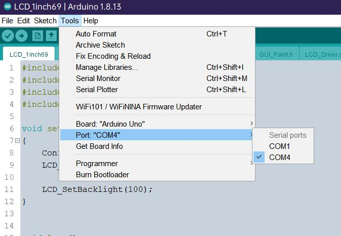](https://www.waveshare.com/wiki/File:Arduino_for_1.69inch_lcd_module04.jpg)

- Then click to compile and download.

[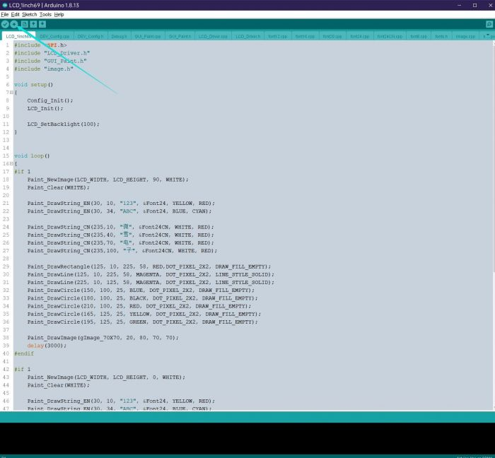](https://www.waveshare.com/wiki/File:Arduino_for_1.69inch_lcd_module05.jpg)

## Demo Description

### Document Introduction

Take Arduino UNO controlling a 1.54-inch LCD as an example, open the Arduino\LCD\_1inch54 directory:  
[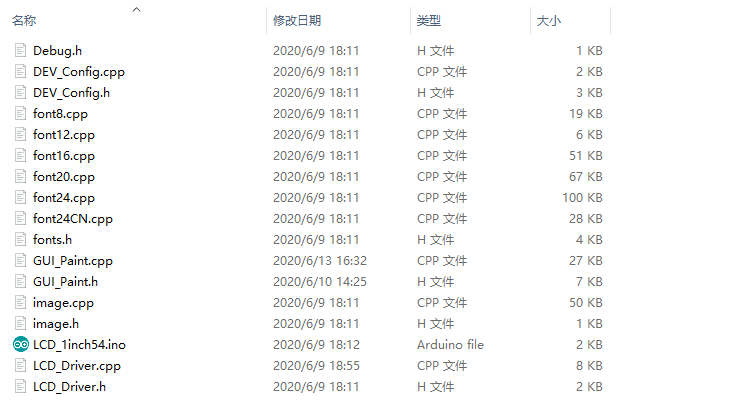](https://www.waveshare.com/wiki/File:LCD_arduino_ide_codeDescription1.png)  
Of which:   
LCD\_1inch54.ino: open with Arduino IDE;  
LCD\_Driver.cpp(.h): is the driver of the LCD screen;  
DEV\_Config.cpp(.h): It is the hardware interface definition, which encapsulates the read and write pin levels, SPI transmission data, and pin initialization;  
font8.cpp, font12.cpp, font16.cpp, font20.cpp, font24.cpp, font24CN.cpp, fonts.h: fonts for characters of different sizes;  
image.cpp(.h): is the image data, which can convert any BMP image into a 16-bit true color image array through Img2Lcd (downloadable in the development data).   
The demo is divided into bottom-layer hardware interface, middle-layer LCD screen driver, and upper-layer application.

### Underlying Hardware Interface

The hardware interface is defined in the two files DEV\_Config.cpp(.h), and functions such as read and write pin level, delay, and SPI transmission are encapsulated.

- Write pin level:

```
void DEV_Digital_Write(int pin, int value)
```

The first parameter is the pin, and the second is the high and low levels.

- Read pin level:

```
int DEV_Digital_Read(int pin)
```

The parameter is the pin, and the return value is the level of the read pin.

- Delay:

```
DEV_Delay_ms(unsigned int delaytime)
```

millisecond level delay.

- SPI output data:

```
DEV_SPI_WRITE(unsigned char data)
```

The parameter is char type, occupying 8 bits.

### Upper Application

For the screen, if you need to draw pictures, display Chinese and English characters, display pictures, etc., you can use the upper application to do, and we provide some basic functions here about some graphics processing in the directory GUI\_Paint.c(.h)  
Note: Because of the size of the internal RAM of STM32 and Arduino, the GUI is directly written to the RAM of the LCD.   
[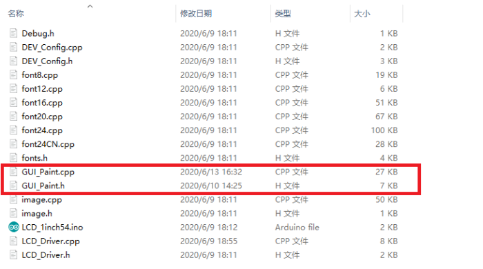](https://www.waveshare.com/wiki/File:LCD_arduino_ide_codeDescription_GUI.png)  
The fonts used by the GUI all depend on the font\*.cpp(h) files under the same file.  
[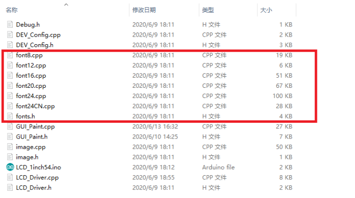](https://www.waveshare.com/wiki/File:LCD_arduino_ide_codeDescription_font.png)

- New Image Properties: Create a new image property, this property includes the image buffer name, width, height, flip Angle, color.

```
void Paint_NewImage(UWORD Width, UWORD Height, UWORD Rotate, UWORD Color)
Parameters:
    Width: image buffer Width;
    Height: the Height of the image buffer;
    Rotate: Indicates the rotation Angle of an image
    Color: the initial Color of the image;
```

- Set the clear screen function, usually call the clear function of LCD directly.

```
void Paint_SetClearFuntion(void (*Clear)(UWORD));
parameter:
    Clear: Pointer to the clear screen function, used to quickly clear the screen to a certain color;
```

- Set the drawing pixel function.

```
void Paint_SetDisplayFuntion(void (*Display)(UWORD,UWORD,UWORD));
parameter:
    Display: Pointer to the pixel drawing function, which is used to write data to the specified location in the internal RAM of the LCD;
```

- Select image buffer: the purpose of the selection is that you can create multiple image attributes, image buffer can exist multiple, and you can select each image you create.

```
void Paint_SelectImage(UBYTE *image)
Parameters:
    Image: the name of the image cache, which is actually a pointer to the first address of the image buffer
```

- Image Rotation: Set the selected image rotation Angle, preferably after Paint\_SelectImage(), you can choose to rotate 0, 90, 180, 270.

[](https://www.waveshare.com/wiki/File:Rotation-lcd.png)

```
void Paint_SetRotate(UWORD Rotate)
Parameters:
    Rotate: ROTATE_0, ROTATE_90, ROTATE_180, and ROTATE_270 correspond to 0, 90, 180, and 270 degrees respectively;
```

- Image mirror flip: Set the mirror flip of the selected image. You can choose no mirror, horizontal mirror, vertical mirror,or image center mirror.

```
void Paint_SetMirroring(UBYTE mirror)
Parameters:
    Mirror: indicates the image mirroring mode. MIRROR_NONE, MIRROR_HORIZONTAL, MIRROR_VERTICAL, MIRROR_ORIGIN correspond to no mirror, horizontal mirror, vertical mirror, and about image center mirror respectively.
```

- Set points of display position and color in the buffer: here is the core GUI function, processing points display position and color in the buffer.

```
void Paint_SetPixel(UWORD Xpoint, UWORD Ypoint, UWORD Color)
Parameters:
    Xpoint: the X position of a point in the image buffer
    Ypoint: Y position of a point in the image buffer
    Color: indicates the Color of the dot
```

- Image buffer fill color: Fills the image buffer with a color, usually used to flash the screen into blank.

```
void Paint_ClearWindows(UWORD Xstart, UWORD Ystart, UWORD Xend, UWORD Yend, UWORD Color)
Parameters:
    Xstart: the x-starting coordinate of the window
    Ystart: indicates the Y starting point of the window
    Xend: the x-end coordinate of the window
    Yend: indicates the y-end coordinate of the window
    Color: fill Color
```

- Draw points: In the image buffer, draw points on (Xpoint, Ypoint), you can choose the color, the size of the point, and the style of the point.

```
void Paint_DrawPoint(UWORD Xpoint, UWORD Ypoint, UWORD Color, DOT_PIXEL Dot_Pixel, DOT_STYLE Dot_Style)
Parameters:
    Xpoint: indicates the X coordinate of a point
    Ypoint: indicates the Y coordinate of a point
    Color: fill Color
    Dot_Pixel: The size of the dot, providing a default of eight size points
        typedef enum {
                DOT_PIXEL_1X1  = 1,	        // 1 x 1
                DOT_PIXEL_2X2  , 		// 2 X 2
                DOT_PIXEL_3X3  , 	 	// 3 X 3
                DOT_PIXEL_4X4  , 	 	// 4 X 4
                DOT_PIXEL_5X5  , 		// 5 X 5
                DOT_PIXEL_6X6  , 		// 6 X 6
                DOT_PIXEL_7X7  , 		// 7 X 7
                DOT_PIXEL_8X8  , 		// 8 X 8
        } DOT_PIXEL;
    Dot_Style: the size of a point that expands from the center of the point or from the bottom left corner of the point to the right and up
        typedef enum {
                DOT_FILL_AROUND  = 1,
                DOT_FILL_RIGHTUP,
        } DOT_STYLE;
```

- Line drawing: In the image buffer, line from (Xstart, Ystart) to (Xend, Yend), you can choose the color, line width, and line style.

```
void Paint_DrawLine(UWORD Xstart, UWORD Ystart, UWORD Xend, UWORD Yend, UWORD Color, LINE_STYLE Line_Style ,  LINE_STYLE Line_Style)
Parameters:
        Xstart: the x-starting coordinate of a line
        Ystart: indicates the Y starting point of a line
        Xend: x-terminus of a line
        Yend: the y-end coordinate of a line
        Color: fill Color
        Line_width: The width of the line, which provides a default of eight widths
                typedef enum {
                        DOT_PIXEL_1X1  = 1,	        // 1 x 1
                        DOT_PIXEL_2X2  , 		// 2 X 2
                        DOT_PIXEL_3X3  ,		// 3 X 3
                        DOT_PIXEL_4X4  ,		// 4 X 4
                        DOT_PIXEL_5X5  , 		// 5 X 5
                        DOT_PIXEL_6X6  , 		// 6 X 6
                        DOT_PIXEL_7X7  , 		// 7 X 7
                        DOT_PIXEL_8X8  , 		// 8 X 8
                    } DOT_PIXEL;
        Line_Style: line style. Select whether the lines are joined in a straight or dashed way
                typedef enum {
                        LINE_STYLE_SOLID = 0,
                        LINE_STYLE_DOTTED,
                } LINE_STYLE;
```

- Draw a rectangle: In the image buffer, draw a rectangle from (Xstart, Ystart) to (Xend, Yend), you can choose the color, the width of the line, and whether to fill the inside of the rectangle.

```
void Paint_DrawRectangle(UWORD Xstart, UWORD Ystart, UWORD Xend, UWORD Yend, UWORD Color, DOT_PIXEL Line_width,  DRAW_FILL Draw_Fill)
Parameters:
        Xstart: the starting X coordinate of the rectangle
        Ystart: indicates the Y starting point of the rectangle
        Xend: X terminus of the rectangle
        Yend: specifies the y-end coordinate of the rectangle
        Color: fill Color
        Line_width: The width of the four sides of a rectangle. Default eight widths are provided
        typedef enum {
                DOT_PIXEL_1X1  = 1,	        // 1 x 1
                DOT_PIXEL_2X2  , 		// 2 X 2
                DOT_PIXEL_3X3  ,		// 3 X 3
                DOT_PIXEL_4X4  ,		// 4 X 4
                DOT_PIXEL_5X5  , 		// 5 X 5
                DOT_PIXEL_6X6  , 		// 6 X 6
                DOT_PIXEL_7X7  , 		// 7 X 7
                DOT_PIXEL_8X8  , 		// 8 X 8
        } DOT_PIXEL;
        Draw_Fill: Fill, whether to fill the inside of the rectangle
        typedef enum {
                DRAW_FILL_EMPTY = 0,
                DRAW_FILL_FULL,
        } DRAW_FILL;
```

- Draw circle: In the image buffer, draw a circle of Radius with (X\_Center Y\_Center) as the center. You can choose the color, the width of the line, and whether to fill the inside of the circle.

```
void Paint_DrawCircle(UWORD X_Center, UWORD Y_Center, UWORD Radius, UWORD Color, DOT_PIXEL Line_width,  DRAW_FILL Draw_Fill)
Parameters:
        X_Center: the x-coordinate of the center of a circle
        Y_Center: Y coordinate of the center of a circle
        Radius: indicates the Radius of a circle
        Color: fill Color
        Line_width: The width of the arc, with a default of 8 widths
        typedef enum {
                DOT_PIXEL_1X1  = 1,	        // 1 x 1
                DOT_PIXEL_2X2  , 		// 2 X 2
                DOT_PIXEL_3X3  ,		// 3 X 3
                DOT_PIXEL_4X4  ,		// 4 X 4
                DOT_PIXEL_5X5  , 		// 5 X 5
                DOT_PIXEL_6X6  , 		// 6 X 6
                DOT_PIXEL_7X7  , 		// 7 X 7
                DOT_PIXEL_8X8  , 		// 8 X 8
        } DOT_PIXEL;
        Draw_Fill: fill, whether to fill the inside of the circle
        typedef enum {
                DRAW_FILL_EMPTY = 0,
                DRAW_FILL_FULL,
        } DRAW_FILL;
```

- Write Ascii character: In the image buffer, at (Xstart Ystart) as the left vertex, write an Ascii character, you can select Ascii visual character library, font foreground color, font background color.

```
void Paint_DrawChar(UWORD Xstart, UWORD Ystart, const char Ascii_Char, sFONT* Font, UWORD Color_Foreground,  UWORD Color_Background)
Parameters:
        Xstart: the x-coordinate of the left vertex of a character
        Ystart: the Y coordinate of the font's left vertex
        Ascii_Char: indicates the Ascii character
        Font: Ascii visual character library, in the Fonts folder provides the following Fonts:
                Font8: 5*8 font
                Font12: 7*12 font
                Font16: 11*16 font
                Font20: 14*20 font
                Font24: 17*24 font
        Color_Foreground: Font color
        Color_Background: indicates the background color
```

- Write English string: In the image buffer, use (Xstart Ystart) as the left vertex, write a string of English characters, can choose Ascii visual character library, font foreground color, font background color.

```
void Paint_DrawString_EN(UWORD Xstart, UWORD Ystart, const char * pString, sFONT* Font, UWORD Color_Foreground,  UWORD Color_Background)
Parameters:
        Xstart: the x-coordinate of the left vertex of a character
        Ystart: the Y coordinate of the font's left vertex
        PString: string, string is a pointer
        Font: Ascii visual character library, in the Fonts folder provides the following Fonts:
                Font8: 5*8 font
                Font12: 7*12 font
                Font16: 11*16 font
                Font20: 14*20 font
                Font24: 17*24 font
        Color_Foreground: Font color
        Color_Background: indicates the background color
```

- Write Chinese string: in the image buffer, use (Xstart Ystart) as the left vertex, write a string of Chinese characters, you can choose GB2312 encoding character font, font foreground color, font background color.

```
void Paint_DrawString_CN(UWORD Xstart, UWORD Ystart, const char * pString, cFONT* font, UWORD Color_Foreground,  UWORD Color_Background)
Parameters:
        Xstart: the x-coordinate of the left vertex of a character
        Ystart: the Y coordinate of the font's left vertex
        PString: string, string is a pointer
        Font: GB2312 encoding character Font library, in the Fonts folder provides the following Fonts:
                Font12CN: ASCII font 11*21, Chinese font 16*21
                Font24CN: ASCII font24 *41, Chinese font 32*41
                Color_Foreground: Font color
                Color_Background: indicates the background color
```

- Write numbers: In the image buffer,use (Xstart Ystart) as the left vertex, write a string of numbers, you can choose Ascii visual character library, font foreground color, font background color.

```
void Paint_DrawNum(UWORD Xpoint, UWORD Ypoint, double Nummber, sFONT* Font, UWORD Digit, UWORD Color_Foreground,   UWORD Color_Background)
Parameters:
        Xpoint: the x-coordinate of the left vertex of a character
        Ypoint: the Y coordinate of the left vertex of the font
        Nummber: indicates the number displayed, which can be a decimal
        Digit: It's a decimal number
        Font: Ascii visual character library, in the Fonts folder provides the following Fonts:
                Font8: 5*8 font
                Font12: 7*12 font
                Font16: 11*16 font
                Font20: 14*20 font
                Font24: 17*24 font
        Color_Foreground: Font color
        Color_Background: indicates the background color
```

- Write numbers with decimals: at (Xstart Ystart) as the left vertex, write a string of numbers with decimals, you can choose Ascii code visual character font, font foreground color, font background color

```
void Paint_DrawFloatNum(UWORD Xpoint, UWORD Ypoint, double Nummber, UBYTE Decimal_Point, sFONT* Font, UWORD Color_Foreground, UWORD Color_Background);
parameter:
         Xstart: the X coordinate of the left vertex of the character
         Ystart: Y coordinate of the left vertex of the font
         Nummber: the displayed number, which is saved in double type here
         Decimal_Point: Displays the number of digits after the decimal point
         Font: Ascii code visual character font library, the following fonts are provided in the Fonts folder:
                Font8: 5*8 font
                Font12: 7*12 font
                Font16: 11*16 font
                Font20: 14*20 font
                Font24: 17*24 font
        Color_Foreground: font color
        Color_Background: background color
```

- Display time: in the image buffer,use (Xstart Ystart) as the left vertex, display time,you can choose Ascii visual character font, font foreground color, font background color.

```
void Paint_DrawTime(UWORD Xstart, UWORD Ystart, PAINT_TIME *pTime, sFONT* Font, UWORD Color_Background,  UWORD Color_Foreground)
Parameters:
        Xstart: the x-coordinate of the left vertex of a character
        Ystart: the Y coordinate of the font's left vertex
        PTime: display time, here defined a good time structure, as long as the hour, minute and second bits of data to the parameter;
        Font: Ascii visual character library, in the Fonts folder provides the following Fonts:
                Font8: 5*8 font
                Font12: 7*12 font
                Font16: 11*16 font
                Font20: 14*20 font
                Font24: 17*24 font
        Color_Foreground: Font color
        Color_Background: indicates the background color
```

- Display image: at (Xstart Ystart) as the left vertex, display an image whose width is W\_Image and height is H\_Image;

```
void Paint_DrawImage(const unsigned char *image, UWORD xStart, UWORD yStart, UWORD W_Image, UWORD H_Image)
parameter:
       image: image address, pointing to the image information you want to display
       Xstart: the X coordinate of the left vertex of the character
       Ystart: Y coordinate of the left vertex of the font
       W_Image: Image width
       H_Image: Image height
```

## Demo Description

### Document Introduction

Take Arduino UNO controlling a 1.54-inch LCD as an example, open the Arduino\LCD\_1inch54 directory:  
[](https://www.waveshare.com/wiki/File:LCD_arduino_ide_codeDescription1.png)  
Of which:   
LCD\_1inch54.ino: open with Arduino IDE;  
LCD\_Driver.cpp(.h): is the driver of the LCD screen;  
DEV\_Config.cpp(.h): It is the hardware interface definition, which encapsulates the read and write pin levels, SPI transmission data, and pin initialization;  
font8.cpp, font12.cpp, font16.cpp, font20.cpp, font24.cpp, font24CN.cpp, fonts.h: fonts for characters of different sizes;  
image.cpp(.h): is the image data, which can convert any BMP image into a 16-bit true color image array through Img2Lcd (downloadable in the development data).   
The demo is divided into bottom-layer hardware interface, middle-layer LCD screen driver, and upper-layer application.

### Underlying Hardware Interface

The hardware interface is defined in the two files DEV\_Config.cpp(.h), and functions such as read and write pin level, delay, and SPI transmission are encapsulated.

- write pin level

```
void DEV_Digital_Write(int pin, int value)
```

The first parameter is the pin, and the second is the high and low levels.

- Read pin level

```
int DEV_Digital_Read(int pin)
```

The parameter is the pin, and the return value is the level of the read pin.

- Delay

```
DEV_Delay_ms(unsigned int delaytime)
```

millisecond level delay.

- SPI output data

```
DEV_SPI_WRITE(unsigned char data)
```

The parameter is char type, occupying 8 bits.

### Upper Application

For the screen, if you need to draw pictures, display Chinese and English characters, display pictures, etc., you can use the upper application to do, and we provide some basic functions here about some graphics processing in the directory GUI\_Paint.c(.h)  
Note: Because of the size of the internal RAM of STM32 and Arduino, the GUI is directly written to the RAM of the LCD.   
[](https://www.waveshare.com/wiki/File:LCD_arduino_ide_codeDescription_GUI.png)  
The fonts used by the GUI all depend on the font\*.cpp(h) files under the same file  
[](https://www.waveshare.com/wiki/File:LCD_arduino_ide_codeDescription_font.png)

- New Image Properties: Create a new image property, this property includes the image buffer name, width, height, flip Angle, color.

```
void Paint_NewImage(UWORD Width, UWORD Height, UWORD Rotate, UWORD Color)
Parameters:
    Width: image buffer Width;
    Height: the Height of the image buffer;
    Rotate: Indicates the rotation Angle of an image
    Color: the initial Color of the image;
```

- Set the clear screen function, usually call the clear function of LCD directly.

```
void Paint_SetClearFuntion(void (*Clear)(UWORD));
parameter:
    Clear: Pointer to the clear screen function used to quickly clear the screen to a certain color;
```

- Set the drawing pixel function.

```
void Paint_SetDisplayFuntion(void (*Display)(UWORD,UWORD,UWORD));
parameter:
    Display: Pointer to the pixel drawing function, which is used to write data to the specified location in the internal RAM of the LCD;
```

- Select image buffer: the purpose of the selection is that you can create multiple image attributes, an image buffer can exist multiple, and you can select each image you create.

```
void Paint_SelectImage(UBYTE *image)
Parameters:
    Image: the name of the image cache, which is actually a pointer to the first address of the image buffer
```

- Image Rotation: Set the selected image rotation Angle, preferably after Paint\_SelectImage(), you can choose to rotate 0, 90, 180, 270.

[](https://www.waveshare.com/wiki/File:Rotation-lcd.png)

```
void Paint_SetRotate(UWORD Rotate)
Parameters:
    Rotate: ROTATE_0, ROTATE_90, ROTATE_180, and ROTATE_270 correspond to 0, 90, 180, and 270 degrees respectively;
```

- Image mirror flip: Set the mirror flip of the selected image. You can choose no mirror, horizontal mirror, vertical mirror, or image center mirror.

```
void Paint_SetMirroring(UBYTE mirror)
Parameters:
    Mirror: indicates the image mirroring mode. MIRROR_NONE, MIRROR_HORIZONTAL, MIRROR_VERTICAL, MIRROR_ORIGIN correspond to no mirror, horizontal mirror, vertical mirror, and about image center mirror respectively.
```

- Set points of display position and color in the buffer: here is the core GUI function, processing points display position and color in the buffer.

```
void Paint_SetPixel(UWORD Xpoint, UWORD Ypoint, UWORD Color)
Parameters:
    Xpoint: the X position of a point in the image buffer
    Ypoint: Y position of a point in the image buffer
    Color: indicates the Color of the dot
```

- Image buffer fill color: Fills the image buffer with a color, usually used to flash the screen into blank.

```
void Paint_ClearWindows(UWORD Xstart, UWORD Ystart, UWORD Xend, UWORD Yend, UWORD Color)
Parameters:
    Xstart: the x-starting coordinate of the window
    Ystart: indicates the Y starting point of the window
    Xend: the x-end coordinate of the window
    Yend: indicates the y-end coordinate of the window
    Color: fill Color
```

- Draw points: In the image buffer, draw points on (Xpoint, Ypoint), you can choose the color, the size of the point, and the style of the point.

```
void Paint_DrawPoint(UWORD Xpoint, UWORD Ypoint, UWORD Color, DOT_PIXEL Dot_Pixel, DOT_STYLE Dot_Style)
Parameters:
    Xpoint: indicates the X coordinate of a point
    Ypoint: indicates the Y coordinate of a point
    Color: fill Color
    Dot_Pixel: The size of the dot, providing a default of eight size points
        typedef enum {
                DOT_PIXEL_1X1  = 1,	        // 1 x 1
                DOT_PIXEL_2X2  , 		// 2 X 2
                DOT_PIXEL_3X3  , 	 	// 3 X 3
                DOT_PIXEL_4X4  , 	 	// 4 X 4
                DOT_PIXEL_5X5  , 		// 5 X 5
                DOT_PIXEL_6X6  , 		// 6 X 6
                DOT_PIXEL_7X7  , 		// 7 X 7
                DOT_PIXEL_8X8  , 		// 8 X 8
        } DOT_PIXEL;
    Dot_Style: the size of a point that expands from the center of the point or from the bottom left corner of the point to the right and up
        typedef enum {
                DOT_FILL_AROUND  = 1,
                DOT_FILL_RIGHTUP,
        } DOT_STYLE;
```

- Line drawing: In the image buffer, line from (Xstart, Ystart) to (Xend, Yend), you can choose the color, line width, and line style.

```
void Paint_DrawLine(UWORD Xstart, UWORD Ystart, UWORD Xend, UWORD Yend, UWORD Color, LINE_STYLE Line_Style ,  LINE_STYLE Line_Style)
Parameters:
        Xstart: the x-starting coordinate of a line
        Ystart: indicates the Y starting point of a line
        Xend: x-terminus of a line
        Yend: the y-end coordinate of a line
        Color: fill Color
        Line_width: The width of the line, which provides a default of eight widths
                typedef enum {
                        DOT_PIXEL_1X1  = 1,	        // 1 x 1
                        DOT_PIXEL_2X2  , 		// 2 X 2
                        DOT_PIXEL_3X3  ,		// 3 X 3
                        DOT_PIXEL_4X4  ,		// 4 X 4
                        DOT_PIXEL_5X5  , 		// 5 X 5
                        DOT_PIXEL_6X6  , 		// 6 X 6
                        DOT_PIXEL_7X7  , 		// 7 X 7
                        DOT_PIXEL_8X8  , 		// 8 X 8
                    } DOT_PIXEL;
        Line_Style: line style. Select whether the lines are joined in a straight or dashed way
                typedef enum {
                        LINE_STYLE_SOLID = 0,
                        LINE_STYLE_DOTTED,
                } LINE_STYLE;
```

- Draw a rectangle: In the image buffer, draw a rectangle from (Xstart, Ystart) to (Xend, Yend), you can choose the color, the width of the line, and whether to fill the inside of the rectangle.

```
void Paint_DrawRectangle(UWORD Xstart, UWORD Ystart, UWORD Xend, UWORD Yend, UWORD Color, DOT_PIXEL Line_width,  DRAW_FILL Draw_Fill)
Parameters:
        Xstart: the starting X coordinate of the rectangle
        Ystart: indicates the Y starting point of the rectangle
        Xend: X terminus of the rectangle
        Yend: specifies the y-end coordinate of the rectangle
        Color: fill Color
        Line_width: The width of the four sides of a rectangle. Default eight widths are provided
        typedef enum {
                DOT_PIXEL_1X1  = 1,	        // 1 x 1
                DOT_PIXEL_2X2  , 		// 2 X 2
                DOT_PIXEL_3X3  ,		// 3 X 3
                DOT_PIXEL_4X4  ,		// 4 X 4
                DOT_PIXEL_5X5  , 		// 5 X 5
                DOT_PIXEL_6X6  , 		// 6 X 6
                DOT_PIXEL_7X7  , 		// 7 X 7
                DOT_PIXEL_8X8  , 		// 8 X 8
        } DOT_PIXEL;
        Draw_Fill: Fill, whether to fill the inside of the rectangle
        typedef enum {
                DRAW_FILL_EMPTY = 0,
                DRAW_FILL_FULL,
        } DRAW_FILL;
```

- Draw circle: In the image buffer, draw a circle of Radius with (X\_Center Y\_Center) as the center. You can choose the color, the width of the line, and whether to fill the inside of the circle.

```
void Paint_DrawCircle(UWORD X_Center, UWORD Y_Center, UWORD Radius, UWORD Color, DOT_PIXEL Line_width,  DRAW_FILL Draw_Fill)
Parameters:
        X_Center: the x-coordinate of the center of a circle
        Y_Center: Y coordinate of the center of a circle
        Radius: indicates the Radius of a circle
        Color: fill Color
        Line_width: The width of the arc, with a default of 8 widths
        typedef enum {
                DOT_PIXEL_1X1  = 1,	        // 1 x 1
                DOT_PIXEL_2X2  , 		// 2 X 2
                DOT_PIXEL_3X3  ,		// 3 X 3
                DOT_PIXEL_4X4  ,		// 4 X 4
                DOT_PIXEL_5X5  , 		// 5 X 5
                DOT_PIXEL_6X6  , 		// 6 X 6
                DOT_PIXEL_7X7  , 		// 7 X 7
                DOT_PIXEL_8X8  , 		// 8 X 8
        } DOT_PIXEL;
        Draw_Fill: fill, whether to fill the inside of the circle
        typedef enum {
                DRAW_FILL_EMPTY = 0,
                DRAW_FILL_FULL,
        } DRAW_FILL;
```

- Write Ascii character: In the image buffer, at (Xstart Ystart) as the left vertex, write an Ascii character, you can select Ascii visual character library, font foreground color, font background color.

```
void Paint_DrawChar(UWORD Xstart, UWORD Ystart, const char Ascii_Char, sFONT* Font, UWORD Color_Foreground,  UWORD Color_Background)
Parameters:
        Xstart: the x-coordinate of the left vertex of a character
        Ystart: the Y coordinate of the font's left vertex
        Ascii_Char: indicates the Ascii character
        Font: Ascii visual character library, in the Fonts folder provides the following Fonts:
                Font8: 5*8 font
                Font12: 7*12 font
                Font16: 11*16 font
                Font20: 14*20 font
                Font24: 17*24 font
        Color_Foreground: Font color
        Color_Background: indicates the background color
```

- Write English string: In the image buffer, use (Xstart Ystart) as the left vertex, write a string of English characters, can choose Ascii visual character library, font foreground color, font background color.

```
void Paint_DrawString_EN(UWORD Xstart, UWORD Ystart, const char * pString, sFONT* Font, UWORD Color_Foreground,  UWORD Color_Background)
Parameters:
        Xstart: the x-coordinate of the left vertex of a character
        Ystart: the Y coordinate of the font's left vertex
        PString: string, string is a pointer
        Font: Ascii visual character library, in the Fonts folder provides the following Fonts:
                Font8: 5*8 font
                Font12: 7*12 font
                Font16: 11*16 font
                Font20: 14*20 font
                Font24: 17*24 font
        Color_Foreground: Font color
        Color_Background: indicates the background color
```

- Write Chinese string: in the image buffer, use (Xstart Ystart) as the left vertex, and write a string of Chinese characters, you can choose GB2312 encoding character font, font foreground color, and font background color.

```
void Paint_DrawString_CN(UWORD Xstart, UWORD Ystart, const char * pString, cFONT* font, UWORD Color_Foreground,  UWORD Color_Background)
Parameters:
        Xstart: the x-coordinate of the left vertex of a character
        Ystart: the Y coordinate of the font's left vertex
        PString: string, string is a pointer
        Font: GB2312 encoding character Font library, in the Fonts folder provides the following Fonts:
                Font12CN: ASCII font 11*21, Chinese font 16*21
                Font24CN: ASCII font24 *41, Chinese font 32*41
                Color_Foreground: Font color
                Color_Background: indicates the background color
```

- Write numbers: In the image buffer, use (Xstart Ystart) as the left vertex, and write a string of numbers, you can choose Ascii visual character library, font foreground color, or font background color.

```
void Paint_DrawNum(UWORD Xpoint, UWORD Ypoint, double Nummber, sFONT* Font, UWORD Digit, UWORD Color_Foreground,   UWORD Color_Background)
Parameters:
        Xpoint: the x-coordinate of the left vertex of a character
        Ypoint: the Y coordinate of the left vertex of the font
        Nummber: indicates the number displayed, which can be a decimal
        Digit: It's a decimal number
        Font: Ascii visual character library, in the Fonts folder provides the following Fonts:
                Font8: 5*8 font
                Font12: 7*12 font
                Font16: 11*16 font
                Font20: 14*20 font
                Font24: 17*24 font
        Color_Foreground: Font color
        Color_Background: indicates the background color
```

- Write numbers with decimals: at (Xstart Ystart) as the left vertex, write a string of numbers with decimals, you can choose Ascii code visual character font, font foreground color, font background color

```
void Paint_DrawFloatNum(UWORD Xpoint, UWORD Ypoint, double Nummber, UBYTE Decimal_Point, sFONT* Font, UWORD Color_Foreground, UWORD Color_Background);
parameter:
         Xstart: the X coordinate of the left vertex of the character
         Ystart: Y coordinate of the left vertex of the font
         Nummber: the displayed number, which is saved in double type here
         Decimal_Point: Displays the number of digits after the decimal point
         Font: Ascii code visual character font library, the following fonts are provided in the Fonts folder:
                Font8: 5*8 font
                Font12: 7*12 font
                Font16: 11*16 font
                Font20: 14*20 font
                Font24: 17*24 font
        Color_Foreground: font color
        Color_Background: background color
```

- Display time: in the image buffer,use (Xstart Ystart) as the left vertex, display time,you can choose Ascii visual character font, font foreground color, font background color.

```
void Paint_DrawTime(UWORD Xstart, UWORD Ystart, PAINT_TIME *pTime, sFONT* Font, UWORD Color_Background,  UWORD Color_Foreground)
Parameters:
        Xstart: the x-coordinate of the left vertex of a character
        Ystart: the Y coordinate of the font's left vertex
        PTime: display time, here defined as a good time structure, as long as the hour, minute and second bits of data to the parameter;
        Font: Ascii visual character library, in the Fonts folder, provides the following Fonts:
                Font8: 5*8 font
                Font12: 7*12 font
                Font16: 11*16 font
                Font20: 14*20 font
                Font24: 17*24 font
        Color_Foreground: Font color
        Color_Background: indicates the background color
```

- Display image: at (Xstart Ystart) as the left vertex, display an image whose width is W\_Image and height is H\_Image;

```
void Paint_DrawImage(const unsigned char *image, UWORD xStart, UWORD yStart, UWORD W_Image, UWORD H_Image)
parameter:
       image: image address, pointing to the image information you want to display
       Xstart: the X coordinate of the left vertex of the character
       Ystart: Y coordinate of the left vertex of the font
       W_Image: Image width
       H_Image: Image height
```

# Resource

## Document

- [Schematic](https://files.waveshare.com/upload/2/2b/1.69inch_LCD_Module.pdf)
- [ST7789V2 datasheet](https://files.waveshare.com/upload/c/c9/ST7789V2.pdf)
- [2D Drawing](https://files.waveshare.com/upload/4/41/1.69inch_LCD_Module_2Ddrawing.pdf)
- [3D Drawing](https://files.waveshare.com/wiki/1.69inch%20LCD%20Module/1_69inch-lcd-module.stp)

## Demo

- [Demo example](https://files.waveshare.com/upload/8/8d/LCD_Module_code.zip)

## Software

- [lcd](https://files.waveshare.com/upload/7/78/LcmZimo.zip)
- [Image2Lcd](https://files.waveshare.com/upload/b/bd/Image2Lcd2.9.zip)
- [Image Extraction](https://www.waveshare.com/wiki/Image_Extraction)

# FAQ

#### [Question: What is the maximum power consumption of 1.69inch LCD Module?](https://www.waveshare.com/wiki/1.69inch_LCD_Module)

**Answer:**

3.3V 90mA

{{{5}}}

#### [Question: The maximum brightness of 1.69inch LCD Module is?](https://www.waveshare.com/wiki/1.69inch_LCD_Module)

**Answer:**

3.3V 500cd/㎡

{{{5}}}

# Support

Technical Support

If you need technical support or have any feedback/review, please click the **Submit Now** button to submit a ticket, Our support team will check and reply to you within 1 to 2 working days. Please be patient as we make every effort to help you to resolve the issue.
  
Working Time: 9 AM - 6 PM GMT+8 (Monday to Friday)

[Submit Now](https://service.waveshare.com/)

Retrieved from "<https://www.waveshare.com/w/index.php?title=1.69inch_LCD_Module&oldid=88741>"
